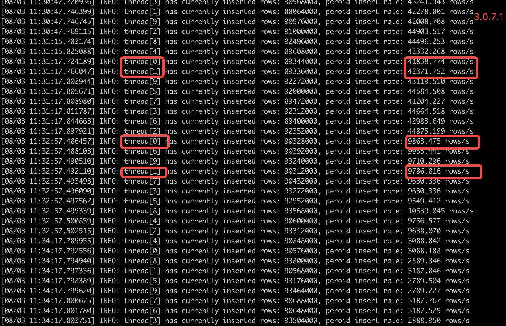
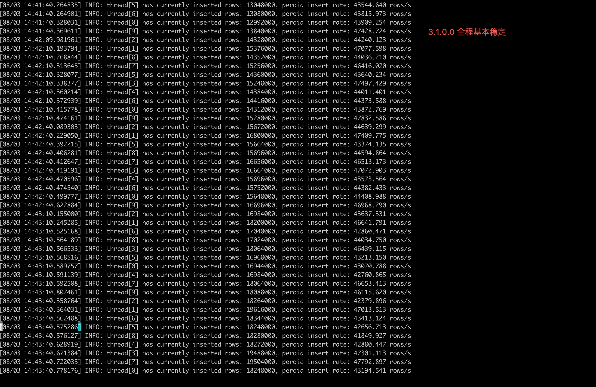

# 多表低频场景写入性能测试报告

## 一. 测试目的

在 3.0 分支上进行多表低频场景的写入性能验证。

## 二. 参考开发手册

[存储引擎优化](https://taosdata.feishu.cn/wiki/NTx0woeVmiFyt9k26KoctyOinod) 

## 三. 测试环境

| **硬件环境** | **IP** | 用途 | CPU | **内存** | **硬盘** |
| --- | --- | --- | --- | --- | --- |
| **服务端** | 192.168.1.55/56/57 | taosd | Intel(R) Xeon(R) CPU E5-2650 v3 @ 2.30GHz 40核 | 256G | (SSD)PERC H730 Mini 446G*2 |
| **客户端** | 192.168.1.60 | taosBenchmark | Intel(R) Xeon(R) CPU E5-2650 v3 @ 2.30GHz 40核 | 256G | (SSD)PERC H730 Mini 446G*2 |

CommitId：66042669a120dd9f7751d83f8d17bb3b74fee329

## 四. 测试方案

使用taosBenchmark，配置不同场景的json，进行写入，记录写入性能数据，包括系统资源占用。

## 五. 测试场景

### 5.1 database关键参数

1、vgroups：每个100万子表（1000万子表-10个，2000万子表-20个，4000万子表-40个）
2、buffer：4096MB
3、stt_trigger：16

### 5.2 schema验证2个不同数量

1、schema1： 2个int, 2个double；1个tag binary(8)
2、schema2:   10个int, 10个double, 10个binary(80)； 1个tag binary(8) 

### 5.3 子表数量：分别测试1000万、2000万、4000万

### 5.4 taosBenchmark关键参数

1、采用 **sql + interlace** 的模式写入
2、每条sql的batchsize：1000
3、每个子表写入rows：100
4、每个子表的rows的时间戳间隔：1天
5、并发写入线程：40
6、disorder_ratio ：10%
7、disorder_range ：10天
8、为了配合后续查询sql，对tag值和列的值做如下的配置：
    a、tag的值，从指定的 10个值中随机选择: 
{"type": "BINARY", "name": "xtag", "values": ["tag1", "tag2", "tag3", "tag4", "tag5", "tag6","tag7", "tag8", "tag9", "tag10"], "len": 8, "count": 1}
    b、INT/DOUBLE列的值，在指定的范围内随机生成：
{"type": "INT", "name": "xint1", "min": 1, "max": 100, "count": 1}
{"type": "INT", "name": "xint2", "min": -10000, "max": 10000, "count": 1}
{"type": "DOUBLE", "name": "xdouble1", "min": 1.0, "max": 9999.0, "count": 1}
{"type": "DOUBLE", "name": "xdouble2", "min": -99999.0, "max": 99999.0, "count": 1}

### 5.5 taosd的关键配置参数

落盘线程数：8个
**注：没有在以上提及的参数，都使用系统缺省值。**

### 5.6 场景组合

#### 5.6.1 单节点单副本

1、顺序写入
2、10%的乱序
3、在1000万子表下，分别测试20%、50%、100%乱序的情况
4、在1000万和2000W子表时，对比测试无乱序和10%乱序在3.0.7.1版本的性能
5、在1000万子表时，对比3.0.7.1版本的全程写入QPS变化

### 5.6.2 3节点3副本

1、顺序写入
2、10%的乱序

## 六. 测试结果

### 6.1.  单节点

#### 6.1.1 顺序写入

| **schema1 ** |
| --- |
| 子表数 | 写入速率(rows/s) | 延迟(ms) | cpu(%) | 内存(M) | cpu(%) | 内存(M) | 磁盘IO(%) | 网络(Kb/s) |
| 1000万 | 461065 | 150 | 3861 | 4564 | 272 | 28094 | 1.47 | 268143 |
| 2000万 | 455907 | 145 | 3875 | 8733 | 359 | 56121 | 1.71 | 270369 |
| 4000万 | 425335 | 126 | 3872 | 17170 | 542 | 112150 | 1.68 | 273782 |

| **schema2 ** |
| --- |
| 子表数 | 写入速率(rows/s) | 延迟(ms) | cpu(%) | 内存(M) | cpu(%) | 内存(M) | 磁盘IO(%) | 网络(Kb/s) |
| 1000万 | 248699 | 179 | 1769 | 4750 | 212 | 28549 | 9.95 | 618642 |
| 2000万 | 236378 | 185 | 1740 | 8958 | 267 | 56583 | 10.85 | 598052 |
| 4000万 | 208399 | 188 | 1765 | 17443 | 349 | 112642 | 8.85 | 575875 |

#### 6.1.2 10%的乱序

| **schema1 ** |
| --- |
| 子表数 | 写入速率(rows/s) | 延迟(ms) | cpu(%) | 内存(M) | cpu(%) | 内存(M) | 磁盘IO(%) | 网络(Kb/s) |
| 1000万 | 443327 | 139 | 3876 | 4568 | 265 | 28079 | 1.49 | 269036 |
| 2000万 | 437899 | 168 | 3880 | 8750 | 351 | 56159 | 1.57 | 273058 |
| 4000万 | 401019 | 170 | 3830 | 17672 | 540 | 98130 | 1.55 | 269461 |

| **schema2 ** |
| --- |
| 子表数 | 写入速率(rows/s) | 延迟(ms) | cpu(%) | 内存(M) | cpu(%) | 内存(M) | 磁盘IO(%) | 网络(Kb/s) |
| 1000万 | 242050 | 187 | 1967 | 4720 | 211 | 28406 | 13.42 | 625840 |
| 2000万 | 235561 | 189 | 2080 | 8999 | 264 | 56471 | 10.7 | 618373 |
| 4000万 | 192558 | 194 | 1944 | 17546 | 344 | 112491 | 9.2 | 569118 |

#### 6.1.3 1000万子表不同比例的乱序

| **schema1 ** 1000万子表 |
| --- |
| 乱序比例 | 写入速率(rows/s) | 延迟(ms) | cpu(%) | 内存(M) | cpu(%) | 内存(M) | 磁盘IO(%) | 网络(Kb/s) |
| 20% | 466190 | 140 | 3873 | 4557 | 282 | 28089 | 1.52 | 270071 |
| 50% | 460182 | 151 | 3864 | 4562 | 284 | 28111 | 1.44 | 268285 |
| 100% | 466749 | 185 | 3825 | 4562 | 275 | 28147 | 1.76 | 270794 |

### 6.1.4 在1000万和2000W子表时，对比测试无乱序和10%乱序在3.0.7.1版本的性能

无乱序：

| **schema1 ** |
| --- |
| 子表数 | 写入速率(rows/s) | 延迟(ms) | cpu(%) | 内存(M) | cpu(%) | 内存(M) | 磁盘IO(%) | 网络(Kb/s) |
| 1000万 | 469980 | 139 | 3890 | 4566 | 234 | 28054 | 1.36 | 271728 |
| 2000万 | 445238 | 162 | 3908 | 8744 | 297 | 56023 | 1.55 | 261926 |

10%乱序：

| **schema1 ** |
| --- |
| 子表数 | 写入速率(rows/s) | 延迟(ms) | cpu(%) | 内存(M) | cpu(%) | 内存(M) | 磁盘IO(%) | 网络(Kb/s) |
| 1000万 | 455842 | 156 | 3886 | 4562 | 232 | 28058 | 1.44 | 265483 |
| 2000万 | 450134 | 171 | 3899 | 8773 | 310 | 56025 | 1.66 | 264039 |

### 6.1.5 在1000万子表时，对比3.0.7.1版本的全程写入QPS变化

3.0.7.1

3.1.0.0

### 6.2 3节点3副本

#### 6.2.1 顺序写入

| **schema1 ** |
| --- |
| 子表数 | 写入速率(rows/s) | 延迟(ms) | cpu(%) | 内存(M) | cpu(%) | 内存(M) | 磁盘IO(%) | 网络(Kb/s) | cpu | 内存 | 磁盘IO | 网络(Kb/s) | cpu | 内存 | 磁盘IO | 网络(Kb/s) |
| 1000万 | 460050 | 188 | 3789 | 4568 | 324 | 28081 | 1.49 | 279967 | 357 | 28055 | 1.44 | 297736 | 322 | 28048 | 1.52 | 183938 |
| 2000万 | 460232 | 146 | 3828 | 8779 | 478 | 56154 | 1.63 | 299839 | 469 | 56131 | 1.68 | 312688 | 485 | 56129 | 1.69 | 316496 |
| 4000万 | 419342 | 151 | 3762 | 17155 | 699 | 112145 | 1.55 | 326816 | 696 | 112103 | 1.55 | 339432 | 740 | 88987 | 1.82 | 341102 |

| **schema2 ** |
| --- |
| 子表数 | 写入速率(rows/s) | 延迟(ms) | cpu(%) | 内存(M) | cpu(%) | 内存(M) | 磁盘IO(%) | 网络(Kb/s) | cpu | 内存 | 磁盘IO | 网络(Kb/s) | cpu | 内存 | 磁盘IO | 网络(Kb/s) |
| 1000万 | 220750 | 282 | 1401 | 4769 | 249 | 28433 | 7.17 | 561739 | 198 | 28419 | 6.75 | 569528 | 230 | 28437 | 5.49 | 576079 |
| 2000万 | 224540 | 352 | 1256 | 8923 | 306 | 56457 | 7.84 | 586245 | 297 | 56433 | 7.41 | 599551 | 331 | 56475 | 8.07 | 603889 |
| 4000万 | 193288 | 366 | 1197 | 17296 | 409 | 112489 | 7.09 | 590995 | 409 | 112476 | 6.56 | 597943 | 457 | 112480 | 7.41 | 605733 |

#### 6.2.2 10%的乱序

| **schema1 ** |
| --- |
| 子表数 | 写入速率(rows/s) | 延迟(ms) | cpu(%) | 内存(M) | cpu(%) | 内存(M) | 磁盘IO(%) | 网络(Kb/s) | cpu | 内存 | 磁盘IO | 网络(Kb/s) | cpu | 内存 | 磁盘IO | 网络(Kb/s) |
| 1000万 | 488020 | 164 | 3812 | 4584 | 366 | 28116 | 1.86 | 298060 | 341 | 28099 | 1.81 | 305924 | 377 | 28094 | 1.49 | 312965 |
| 2000万 | 456814 | 164 | 3849 | 8750 | 472 | 56190 | 1.52 | 295986 | 491 | 56183 | 1.59 | 312814 | 502 | 56142 | 1.63 | 314699 |
| 4000万 | 428001 | 157 | 3787 | 17102 | 690 | 112231 | 1.65 | 328259 | 760 | 112207 | 1.73 | 350773 | 725 | 112226 | 1.84 | 346153 |

| **schema2 ** |
| --- |
| 子表数 | 写入速率(rows/s) | 延迟(ms) | cpu(%) | 内存(M) | cpu(%) | 内存(M) | 磁盘IO(%) | 网络(Kb/s) | cpu | 内存 | 磁盘IO | 网络(Kb/s) | cpu | 内存 | 磁盘IO | 网络(Kb/s) |
| 1000万 | 231126 | 334 | 1357 | 4735 | 242 | 28486 | 7.79 | 589422 | 263 | 28414 | 7.39 | 604337 | 222 | 28484 | 8.05 | 603042 |
| 2000万 | 220861 | 351 | 1268 | 8933 | 322 | 56456 | 7.17 | 582584 | 285 | 56476 | 7.09 | 589354 | 304 | 56521 | 7.07 | 592903 |
| 4000万 | 190090 | 361 | 1141 | 17367 | 413 | 112516 | 9.36 | 573682 | 416 | 112466 | 8.64 | 584530 | 432 | 112533 | 8.88 | 587776 |

## 七. 测试结论

1. 以1000W为基准计算下降幅度，下表（↓表示下降，-表示相近），可以看出相对比1000W子表时的写入性能，2000W子表时大多相近，4000W子表时有一定下降，最多21%，schema越复杂下降的越多；

|  |
|  |
|  |
|  | 顺序 | 乱序10% | 顺序 | 乱序10% | 顺序 | 乱序10% | 顺序 | 乱序10% |
| 1000万 |  |
| 2000万 | - | - | - | - | - | - | - | ↓6% |
| 4000万 | ↓7% | ↓9% | ↓8% | ↓12% | ↓19% | ↓21% | ↓12% | ↓17% |

1. 单节点时1000W子表测试乱序情况，乱序比例分别为20%、50%、100%，写入性能相近；
2. 对比3.0.7.1和3.1.0.0写入全程QPS变化，3.0.7.1有部分线程不稳定和QPS大幅降低情况，3.1.0.0全程基本稳定；
