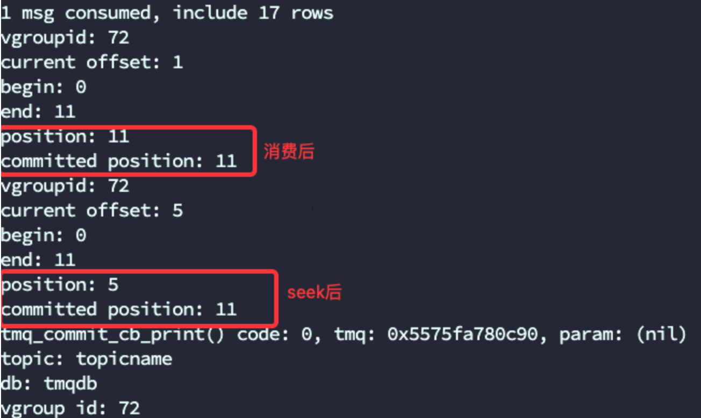
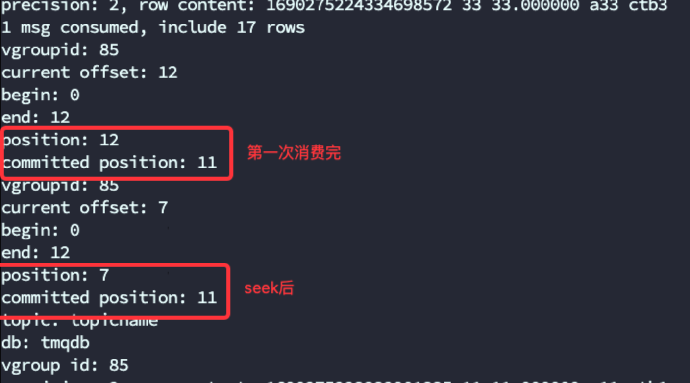
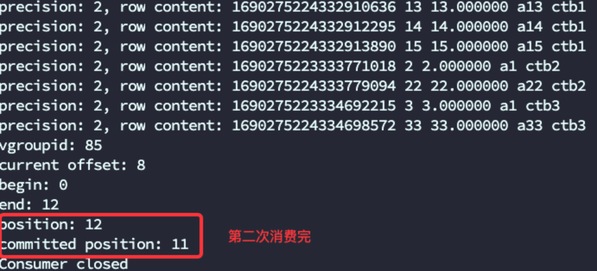
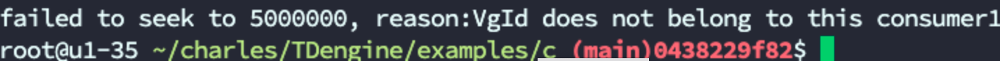
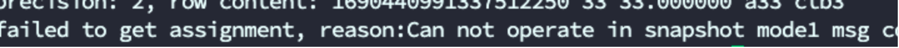
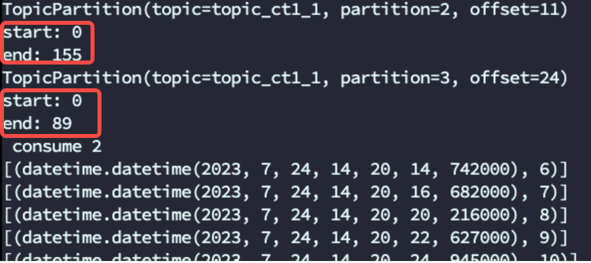

# 数据订阅 API 行为变化测试报告 

@冯超 

### 1. 概述：

本次数据订阅API的变化主要有以下几个方面：
1. seek()接口中去除commit信息，从行为上完全分离了两种操作，与kafka的seek()、commit()接口保持一致
2. assignment()接口返回block中的最小version
3. 增加相应的接口，使TDengine与Kafka接口保持一致；增加了position，committed， commit_offset_sync/commit_offset_async接口
4. 优化了TMQ seek()接口的错误分组
5. Python connector在assignment接口增加获取offset时的begin、end字段

### 2. 测试环境：

192.168.1.35：
CPU: Intel(R) Xeon(R) CPU E5-2630 v2 @ 2.60GHz （2）24核
Mem: DDR3  32 GB * 2
Disk: 2792GB

### 3. 测试用例：

 **seek()接口中去除commit信息**
测试准备：
                  - 创建数据库tmqdb, create database tmqdb;
                  - 创建超级表stb，create table tmqdb.stb (ts timestamp, c1 int, c2 float, c3 varchar(16)) tags(t1 int, t3 varchar(16))；
                  - 创建子表并写入数据
用例1：
1. 创建consumer并设置enable.auto.commit为true，创建consumer消费数据
2. seek到某个offset，查看position与committed的值，position为seek后的值，committed位置为消费后commit的值

      用例2：
1. 创建consumer并设置enable.auto.commit为false，创建consumer消费数据
2. 消费所有数据后，position为12， committed为11
3. seek到7，查看position为7，committed依然为11
4. 重新消费数据，从7开始消费，position为12，committed为11
  

  

**assignment()接口返回block中的最小version**
1. 创建数据库tmqdb, create database tmqdb vgroups 1;
   - 创建超级表stb，create table tmqdb.stb (ts timestamp, c1 int, c2 float, c3 varchar(16)) tags(t1 int, t3 varchar(16))；
2. 创建子表并写入数据（5000 rows）
3. 创建consumer并设置enable.auto.commit为true，创建consumer消费数据
4. 消费所有数据，结果显示有多个block数据被消费
5. seek offset至第一个块中的中间位置，重新消费数据
6. consumer依然消费所有数据

**增加相应的接口，使TDengine与Kafka接口保持一致；增加了position，committed， commit_offset_sync/commit_offset_async接口**
测试准备：
                  - 创建数据库tmqdb, create database tmqdb;
                  - 创建超级表stb，CREATE STABLE `st` (`ts` TIMESTAMP, `v_timestamp` TIMESTAMP, `v_int` INT, `v_float` INT, `v_double` INT│[07/28 16:23:35.953210] INFO: pthread_join 29 ...
UNSIGNED, `v_bigint` BIGINT, `v_binary1` VARCHAR(220), `v_binary2` VARCHAR(300), `v_binary3` VARCHAR(500), `v_nchar1│[07/28 16:23:35.964913] SUCC: Spent 253.179289 seconds to insert rows: 5000000 with 30 thread(s) into tmqdb 19748.85
` NCHAR(6), `v_nchar2` NCHAR(50), `v_nchar3` NCHAR(200)) TAGS (`groupid` INT, `location` VARCHAR(64));
                  - 创建子表并写入500W数据

用例1：
1. 创建topic topicname， create topic topicname as select * from st;
2. 创建consumer并持续消费数据，同时打印position和committed信息
3. client异常终止后，重新运行，消费会从committed位置继续
4. 500w数据消费完成，检查position与committed信息一致
用例2：
1. 创建consumer，同时指定enable.auto.commit为false
2. seek指定partition的数据位置(10000)并消费数据, 打印position和committed信息，position为10000，committed为最后提交的位置
3. 持续消费数据，并按指定位置提交，同时打印position和committed信息
4. 每次提交信息后的position与committed信息一致

**优化了TMQ seek()接口的错误分组**
1. 创建数据库，超级表， 子表并写入数据
2. 创建topic，通过接口创建consumer， 设置“enable.auto.commit”为false
3. 消费数据后，调用seek接口，参数vgId为不存在的值，验证错误码 TSDB_CODE_TMQ_INVALID_VGID

1. 使用错误的topicName参数调用接口seek，验证错误码 TSDB_CODE_TMQ_INVALID_TOPIC

1. 修改创建consumer参数experimental.snapshot.enable 为true
2. 消费数据后，调用seek接口，验证错误码 0SDB_CODE_TMQ_SNAPSHOT_ERROR

1. 使用tmq_t* 参数为NULL调用seek接口，验证错误码 TSDB_CODE_INVALID_PARA

**Python connector在assignment接口增加获取offset时的begin、end字段**
1. 创建数据库topic_db， create database topic_db;
2. 创建超级表st， create table st(ts timestamp, c0 int) tags(groupid int);
3. 写入部分数据，create table ct1_1 using st1 tags(1) values(now, 1) values(now+1s, 2);
4. 创建consumer消费数据并打印TopicPartition的begin及end

### 4. 结论：

1. 此次修改从行为上对seek与commit做了分离，保持与Kafka的一致
2. 同时增加了position、committed、commit_offset_sync、commit_offset_async接口，分别对应Kafka的position，committed以及commit接口
3. 对assignment接口做了变更，对返回的tmq_topic_assignment结构体增加了begin、end值，同时返回的block中的最小version
4. 完善了seek接口的错误分组处理，增加了TSDB_CODE_TMQ_INVALID_VGID、TSDB_CODE_TMQ_INVALID_TOPIC、0SDB_CODE_TMQ_SNAPSHOT_ERROR
5. Python connector中根据assignment接口的变更增加了begin、end字段
后续需要根据此次并更对不同connector做接口变更
