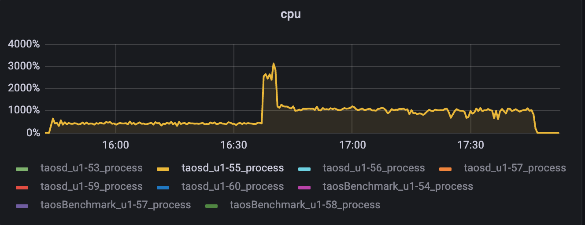
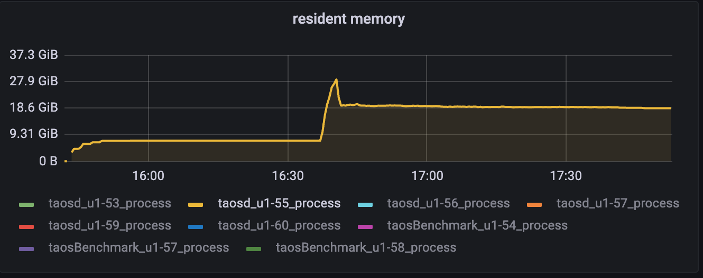
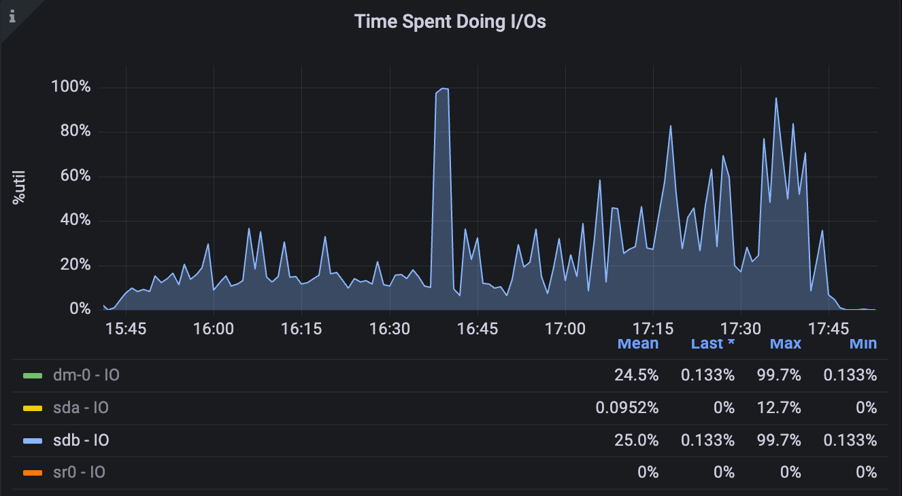
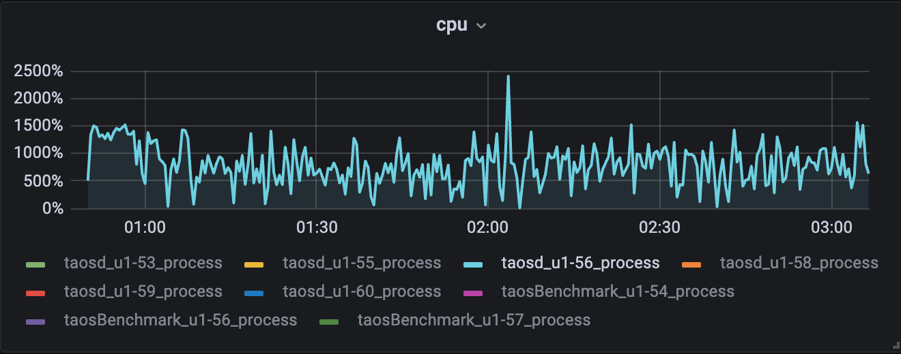
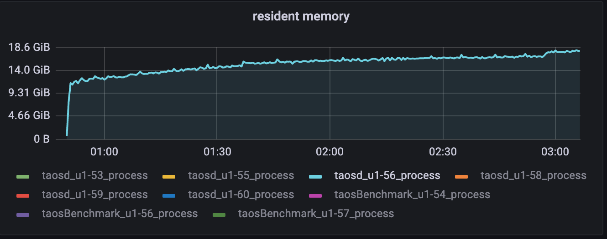
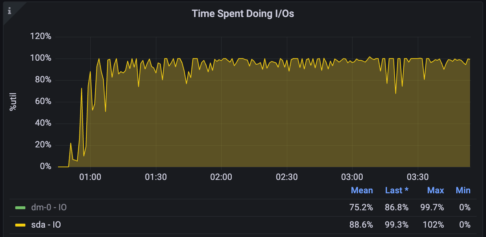
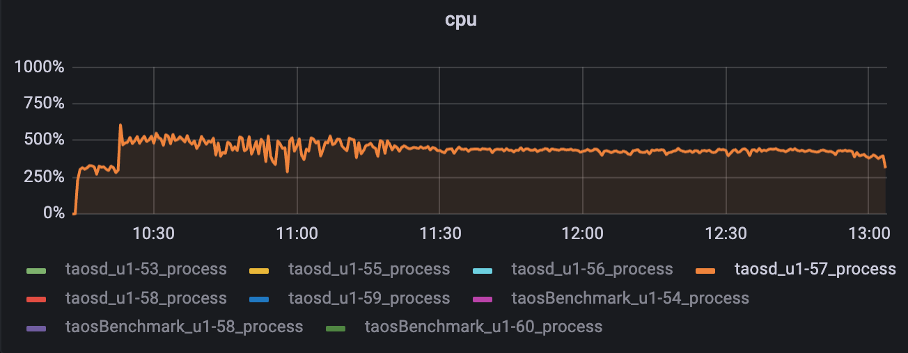
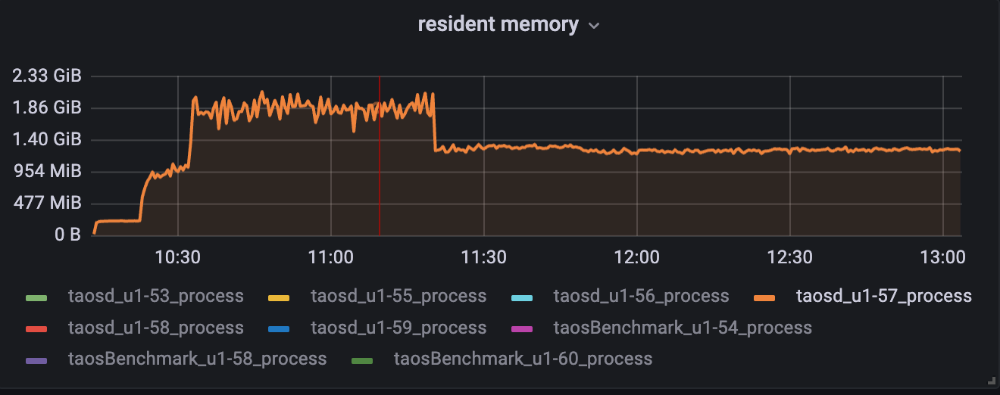
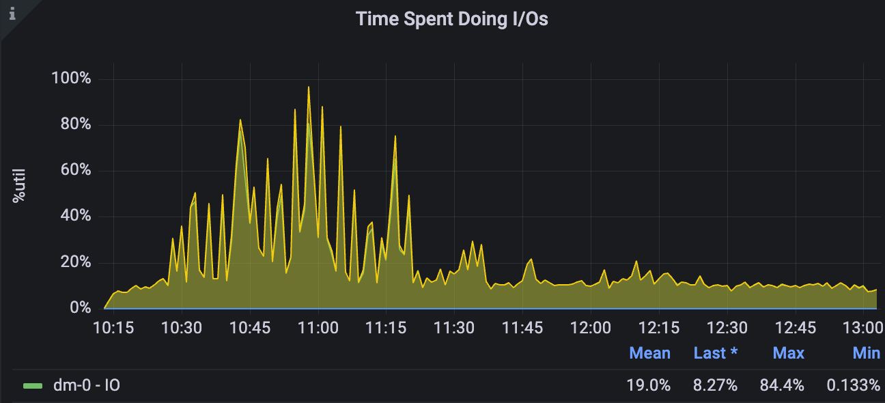

# 流计算Fill_history重构测试报告

## 一.测试背景

参考[流计算优化](https://taosdata.feishu.cn/wiki/L8vswscMxixzqwkjX3FcuauvnYf) ；

## 二、测试环境

### **2.1 硬件环境**

| **硬件环境** | **IP** | 用途 | **CPU** | **内存** | **硬盘** |
| --- | --- | --- | --- | --- | --- |
| **测试服务器** | 192.168.1.53 | taostest、taosBenchmark | PERC H730 Mini 446G*2 |
|  | 192.168.1.55 | taosd |
|  | 192.168.1.56 | taosd |
|  | 192.168.1.57 | taosd |
|  | 192.168.1.54 | taosBenchmark |
|  | 192.168.1.58 | taosBenchmark |
|  | 192.168.1.60 | taosBenchmark |

### **2.2 软件环境**

| **软件环境(3.0分支)** | **IP** | **运行目录** | **脚本及配置** | **commitID** |
| --- | --- | --- | --- | --- |
| **TDengine** | 192.168.1.53-60 | /root/TDengine | 默认 | c30c53c3d23fe1a9fc5f198ac227c9d3baa7c457 |

## 三.功能测试 

fill_history 覆盖下表中的各种功能模块的交叉组合，同时对过程及最终结果进行校验，确保重构不会影响到基础功能；

| at_once | pass |
| --- | --- |
| window_close | pass |
| max_delay | pass |
| watermark | 搭配 trigger_mode 测试 | pass |
| interval | pass |
| session_window | pass |
| state_window | pass |
| 标量 | pass |
| 聚合 | pass |
| 标量函数 | abs, acos, asin, atan, ceil等 | pass |
| partition by | tbname，column，tag，expression，constant | pass |
| ignore_expired | 0/1 | pass |
| ignore_update | 0/1 | pass |
| 已存在超级表 | 组合 | pass |
| 自定义子表 | 组合 | pass |
| 自定义tag | 组合 | pass |
| Fill | NULL，PREV，NEXT，LINEAR、VALUE | pass |
| pause/resume | 组合 | pass |

### 四.稳定性测试

### 4.1 **场景一：(无partition)**

Json:

> ⚠ 嵌入文件，需在飞书中查看 (token: HLkrbcNTqo5hbcxeqrVcCeLfnIc)

> ⚠ 嵌入文件，需在飞书中查看 (token: ZDN3bHpjBoz85LxTqIAcA3QLnAZ)

建流语句：
CREATE STREAM IF NOT EXISTS stream_stability TRIGGER at_once WATERMARK 30s IGNORE UPDATE 0 IGNORE EXPIRED 0 FILL_HISTORY 1 INTO stream_test.output_streamtb (ts,c1,c2,c3) TAGS(t1) SUBTABLE(concat("sub_tb1_", "suffix")) as select _wstart as wstart, min(c1),max(c2), count(c3)  from stream_test.stb interval(10s)
覆盖功能：

| fill_history | custom_tag | existed_stable |
| --- | --- | --- |
| interval | watermark | at_once |
| ignore_expired | ignore_update | subtable |

| schema |
| --- |
| type | int | float | timestamp | tinyint | varchar(16) |
| count | 1 | 2 | 2 | 1 | 1 |

fill_history 数据：

| table_count | rows_count | window_count | window_interval |
| --- | --- | --- | --- |
| 1000 | 10000000 | 1000000 | 10s |

CPU:

内存：

磁盘IO:

### 4.2 场景二：(partition by tbname)

Json:

> ⚠ 嵌入文件，需在飞书中查看 (token: DgSYbeFMRorE0ix79dScvhNBn9b)

> ⚠ 嵌入文件，需在飞书中查看 (token: FbLubb4v0oYMoTxjwUXcuBKjnfE)

建流语句：
CREATE STREAM IF NOT EXISTS stream_stability TRIGGER at_once WATERMARK 30s IGNORE UPDATE 0 IGNORE EXPIRED 0 FILL_HISTORY 1 INTO stream_test.output_streamtb (ts,c1,c2,c3) TAGS(t1) SUBTABLE(concat(tbname, "suffix")) as select _wstart as wstart, min(c1),max(c2), count(c3)  from stream_test.stb partition by cast(t1 as int) t1,tbname interval(10s);
覆盖功能：

| fill_history | custom_tag | existed_stable |
| --- | --- | --- |
| interval | watermark | at_once |
| ignore_expired | ignore_update | subtable |

| schema |
| --- |
| type | int | float | timestamp | tinyint | varchar(16) |
| count | 1 | 2 | 2 | 1 | 1 |

fill_history 数据：

| table_count | rows_count | window_count | window_interval |
| --- | --- | --- | --- |
| 50000 | 200 | 1000000 | 10s |

CPU:

MEM：

磁盘IO：

### 4.3 场景二：(nevados)

Json:

> ⚠ 嵌入文件，需在飞书中查看 (token: WvvTbOVxToXp4BxsT2WcvRIHnQg)

> ⚠ 嵌入文件，需在飞书中查看 (token: ZeL9bnSgRoVwucxGc3icVdK8nlc)

建流语句：
CREATE STREAM IF NOT EXISTS trackers_hourly_stream TRIGGER window_close IGNORE UPDATE 0 IGNORE EXPIRED 0 FILL_HISTORY 1 INTO dev.trackers_hourly as select _wstart as window_start, site, zone, tracker, max( case when abs(reg_pitch - reg_move_pitch) <= 2 then 1 when reg_temp_therm2 < -20 then 1 else 0 end ) as on_target, case when max(abs(reg_pitch - reg_move_pitch)) <= 2 then "on_target" when min(reg_temp_therm2) < -20 then "cold_limit" else "off_target" end as on_target_status, avg(reg_pitch) as avg_pitch, last(reg_pitch) as last_pitch, avg(reg_move_pitch) as avg_move_pitch, last(reg_move_pitch) as last_move_pitch from prod.trackers where _ts >= "2020-01-01" and _ts < now() + 1h partition by site, zone, tracker interval(1h) sliding(1h) fill(null);
覆盖功能：

| fill_history | interval | sliding |
| --- | --- | --- |
| fill | watermark | window_close |
| ignore_expired | ignore_update | partition |

schema较复杂，参考json
fill_history 数据：

| table_count | rows_count | window_count | window_interval |
| --- | --- | --- | --- |
| 1000 | 100000 | 30633108 | 1h |

CPU:

MEM：

磁盘IO：

## 五. 测试结论

1. 功能测试全部通过；
2. 稳定性场景中可以从资源占用曲线可以看出，fill_history 期间CPU、内存、磁盘IO均有一定程度的上涨，但结束后均可回落，且内存未出现无限上涨情况，各项资源占用符合预期；
