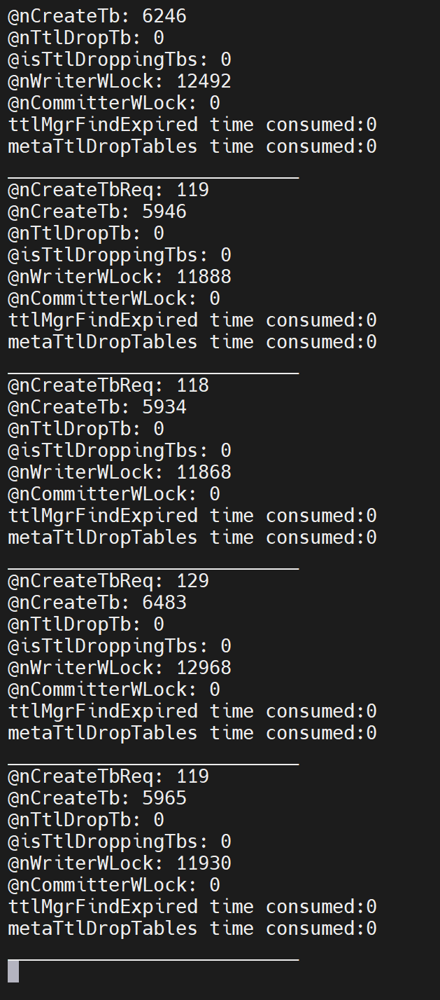
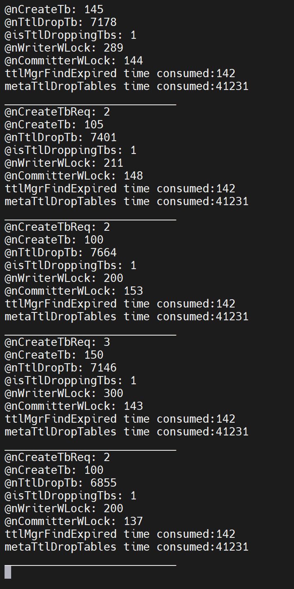
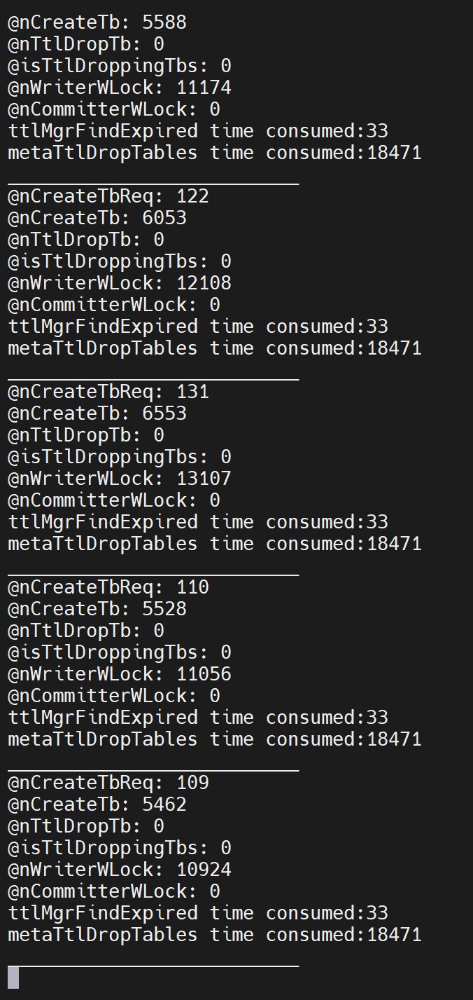
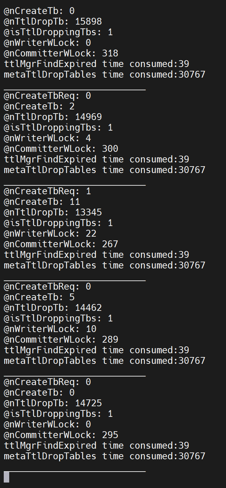

# ttlMgrFlush 阻塞写入

## 1. 现场问题

JIRA: https://jira.taosdata.com:18080/browse/TD-25445?filter=-1
美团反馈使用 ttl 3 参数建表后，业务每半小时卡顿一次。排查发现卡顿时间与** **`ttlMgrFlush` 处理时间基本一致。每次 `ttlMgrFlush` 会将 50w 个条目写入 tdb，耗时约 **10s**。操作由 writer 执行，期间无法响应用户写请求。

## 2. 当前 ttl 总体设计

TTL (Time to Live)是用户用来指定表的生命周期的参数。当一个表指定了这个参数后，超过TTL的时间，则TDengine系统会自动删除该表。
`vnodeProcessDropTtlTbReq` 由 mnode 定期触发，vnode 批量删除满足条件的 table。
若开启 `ttlChangeOnWrite`:
- 删除时间随用户最后一次写操作而改变，时间以 vnode 主节点为准
- 删除时间的修改会先写入内存缓存，由`ttlMgrFlush` 写入tdb

## 3. 问题点

总体分为两部分
`ttlMgrFlush` 相关（将 ttl 数据写入tdb）：
1. `ttlMgrFlush` 需在 `tdbCommit` 前调用
2. `tdbCommit` 由 writer 执行
3. `ttlMgrFlush`，大量表场景下总耗时过久
`vnodeProcessDropTtlTbReq` 相关（将过期数据从 tdb 删除）：
1. `vnodeProcessDropTtlTbReq`由 writer 执行
2. `vnodeProcessDropTtlTbReq`，大量表场景下总耗时过久

总体期望：可持续处理用户请求，不会因 ttl 造成**连续长时**阻塞

## 4. `ttlMgrFlush` 改进

条件触发`ttlMgrFlush`，以分摊至一般业务中。dirty table 超过 `ttlFlushThreshold`则由 writer 随写入过程进行 flush。

## 5. `~~vnodeProcessDropTtlTbReq~~`~~ 改进（方案1：异步线程）~~ {folded="true"}

将 `vnodeProcessDropTtlTbReq` 拆分，高耗时子任务交由 committer 异步处理。

### 5.1 必要性讨论

~~本地虚机测试，drop 1w tables 耗时约 1s。客户环境 30min 产生的 50w 数据需耗时 50s，即 mnode 每分钟发起一次 drop ttl，每次仍需耗时 1.7s，期间无法处理用户写入操作。~~

### 5.2 可行性讨论

- 各个节点间 ttl 删除表进度必定不一致，如何保证数据最终一致？
<callout emoji="pushpin" background-color="light-orange" border-color="light-orange">
保存`expireTime`，以`deleteTime` > `expireTime` 作为可以更新的依据。
</callout>

`expireTime` 由 mnode 产生，随消息同步至各个节点。writer 同步保存该值，保证各个节点中该值一致。
在更新表 `deleteTime` 时，若原始`deleteTime` > `expireTime`，认为该表已过期，拒绝更新该表 `deleteTime`。由此保证即使 ttl 删除表进度不一致，不同节点各表的 `deleteTime` 仍然一致。
- 异步后写入 tdb 仍需加锁，此时 writer 仍不可工作，与之前有何区别？
可减小**连续**无法响应用户请求的持续时间
原设计中，writer 在 drop 大量表期间被占用，无法处理用户请求。新设计中，committer 可以每 drop 一定条目持锁一次， 期间 writer 可竞争。

### 5.3 时序图

<add-ons component-id="" component-type-id="blk_631fefbbae02400430b8f9f4" record="{"data":"sequenceDiagram\n    autonumber\n\n    participant Mnode\n    box Dnode1\n    participant Writer1\n    participant Syncer1\n    end\n    box Dnode2\n    participant Syncer2\n    participant Writer2\n    end\n\n    Mnode -\u003e\u003e Writer1: drop ttl table req\n    Writer1 -\u003e\u003e Syncer1: sync req\n    Syncer1 -\u003e\u003e  Syncer2: replication req\n    Syncer2 -\u003e\u003e Writer2: apply\n    Writer2 -\u003e\u003e Writer2: flush cache to tdb\n    Writer2 -\u003e\u003e Writer2: find expired by timestamp\n    rect orange\n    Writer2 -\u003e\u003e Writer2: drop tables\n    end\n    Writer2 -\u003e\u003e Writer2: update tq\n    Writer2 -\u003e\u003e Writer2: do retention\n\n    Syncer1 --\u003e\u003e Writer1: apply\n    Writer1 -\u003e\u003e Writer1: flush cache to tdb\n    Writer1 -\u003e\u003e Writer1: find expired by timestamp\n    rect orange\n    Writer1 -\u003e\u003e Writer1: drop tables\n    end\n    Writer1 -\u003e\u003e Writer1: update tq\n    Writer1 -\u003e\u003e Writer1: do retention\n    Writer1 --\u003e\u003e Mnode: drop ttl table resp","theme":"default","view":"chart"}"/>

<add-ons component-id="" component-type-id="blk_631fefbbae02400430b8f9f4" record="{"data":"sequenceDiagram\n    autonumber\n\n    participant Mnode\n    box Dnode1\n    participant Writer1\n        participant Committer1\n\n    participant Syncer1\n    end\n    box Dnode2\n    participant Syncer2\n    participant Writer2\n    participant Committer2\n    end\n\n    Mnode -\u003e\u003e Writer1: drop ttl table req\n    Writer1 -\u003e\u003e Syncer1: sync req\n    Syncer1 -\u003e\u003e  Syncer2: replication req\n\n    Syncer2 -\u003e\u003e Writer2: apply\n    rect rgb(191, 223, 255)\n    Writer2 -\u003e\u003e Writer2: set expire time\n    end\n    Writer2 -) Committer2: async drop ttl table\n    Writer2 -\u003e\u003e Writer2: do retention\n\n    Syncer1 --\u003e\u003e Writer1: apply\n    rect rgb(191, 223, 255)\n    Writer1 -\u003e\u003e Writer1: set expire time\n    end\n    Writer1 -) Committer1: async drop ttl table\n    Writer1 -\u003e\u003e Writer1: do retention\n    Writer1 --\u003e\u003e Mnode: drop ttl table resp\n\n    Committer1 -\u003e\u003e Committer1: flush cache to tdb\n    Committer1 -\u003e\u003e Committer1: find expired by timestamp\n    loop Every tuid\n        rect orange\n        Committer1 -\u003e\u003e Committer1: fetch lock and drop table\n        end\n    end\n    Committer1 -\u003e\u003e Committer1: update tq","theme":"default","view":"chart"}"/>

### 5.4 实现

#### 5.4.1 互斥关系

Writer 在PreCommit 期间会重置 pMeta->txn，Committer 与 Writer 额外需要在操作 txn 时互斥。Commiter 每次写入 tdb/txn 时需先 `tsem_post(&pMeta->txnReady)` 然后 `metaWLock(pMeta)`
```c
// Writer
int  metaCommit(SMeta *pMeta, TXN *txn) {
  // ...
  tsem_wait(&pMeta->txnReady);
  // ...

  ttlMgrFlush(pMeta->pTtlMgr, pMeta->txn);
  return tdbCommit(pMeta->pEnv, txn);
}

int metaBegin(SMeta *pMeta, int8_t heap) {
  // ...

  if (tdbBegin(pMeta->pEnv, &pMeta->txn, xMalloc, xFree, xArg, TDB_TXN_WRITE | TDB_TXN_READ_UNCOMMITTED) < 0) {
    return -1;
  }

  tsem_post(&pMeta->txnReady);

  return 0;
}

```

#### 5.4.2 优先级

```c
// writer
void writerGetWLock()
{
  tsem_wait(&pMeta->writerWaiting);
  // resource lock
  ret = metaWLock(pMeta);
  tsem_post(&pMeta->writerWaiting);
}

// committer
void committerGetWLock()
{
  tsem_wait(&pMeta->writerWaiting);
  tsem_post(&pMeta->writerWaiting);
  // resource lock
  ret = metaWLock(pMeta);
}
```

<grid cols="2">
  <column width="48">
    

  </column>
  <column width="51">
    

  </column>
</grid>

committer 每 drop 个表 yield 一次
<grid cols="2">
  <column width="50">
    

  </column>
  <column width="49">
    

  </column>
</grid>

### 5.5 异步任务控制

ttlTaskProcessing 保障同一时间每个 vnode 最多一个 vnodeTtlTask
```c
// writer
int32_t vnodeProcessDropTtlTbReq() {
  int64_t ttlExpireTimeMs = (int64_t)ttlReq.timestampSec * 1000;
  atomic_store_64(&pVnode->state.ttlExpireTime, ttlExpireTimeMs);
  code = metaTtlSetExpireTime(pVnode->pMeta, ttlExpireTimeMs);

  if (!pVnode->ttlTaskProcessing) {
    pVnode->ttlTaskProcessing = true;
    code = vnodeAsyncTtlDropTable(pVnode);
    if (code) {
      pVnode->ttlTaskProcessing = false;
      goto end;
    }
  }

  code = vnodeDoRetention(pVnode, ttlReq.timestampSec);

end:
  return code;
}

// committer
int32_t vnodeTtlTask(void *arg) {
  int32_t code = 0;

  STtlInfo *pInfo = (STtlInfo *)arg;
  SVnode   *pVnode = pInfo->pVnode;
  SArray   *tbUids = taosArrayInit(8, sizeof(int64_t));

  code = metaTtlDropTables(pVnode->pMeta, tbUids, &pVnode->ttlTaskShallAbort);
  if (code) {
    vFatal("vgId:%d, meta failed to drop table by ttl since %s", TD_VID(pVnode), terrstr());
    goto _exit;
  }

  if (taosArrayGetSize(tbUids) > 0) {
    tqUpdateTbUidList(pVnode->pTq, tbUids, false);
  }

_exit:
  pVnode->ttlTaskProcessing = false;
  taosArrayDestroy(tbUids);
  taosMemoryFree(pInfo);
  return code;
}
```

abort 任务
```c
void vnodeClose(SVnode *pVnode) {
  if (pVnode) {
    pVnode->ttlTaskShallAbort = true;
    while (pVnode->ttlTaskProcessing) {
      taosMsleep(10);
    }

    tsem_wait(&pVnode->canCommit);
    vnodeSyncClose(pVnode);
    vnodeQueryClose(pVnode);
    tqClose(pVnode->pTq);
    walClose(pVnode->pWal);
    if (pVnode->pTsdb) tsdbClose(&pVnode->pTsdb);
    smaClose(pVnode->pSma);
    if (pVnode->pMeta) metaClose(&pVnode->pMeta);
    vnodeCloseBufPool(pVnode);
    tsem_post(&pVnode->canCommit);

    // ...
  }
}

```

### 5.6 引入的问题

- 各副本删除进度不一致带来的视图不一致问题
创建同名 table 在各个副本上响应不同
Vnode 切主后显示剩余的表不同

可能通过主动标记过期 table/建立过期 table 列表解决，但整体复杂度较高

### 5.7 TODO

- [ ] 可能的优化，给一个endureTime，表示一段时间内重复的update ctime不会写tdb （def：1h）
---

---

## 6. `vnodeProcessDropTtlTbReq` 改进（方案2：ttl 任务拆分）

目前采用本方案
- 缩短 mnode 触发 `vnodeProcessDropTtlTbReq` 间隔
- 每次仅删除一定数量表，vnode 主找出符合条件的 tuid，并同步至同组节点
- 仍由 writer 负责实际删除操作

## 7. 参数修改

| 参数名称 | 动态参数 | 范围 | 默认值 | 描述 |
| --- | --- | --- | --- | --- |
| trimVDbIntervalSec | 否 | [1, 100000] | 3600s | Mnode 发起trim db (retention) 的间隔 |
| ttlFlushThreshold | 否 | [-1, 1000000] | 100 | 最大缓存 ttl 脏表数量 |
| ttlPushInterval（固有） | 否->是 | [1, 100000] | 3600s->10s | Mnode 发起 ttl drop 的间隔 |
| ttlBatchDropNum | 是 | [0, 2147483647] | 10000 | 每批次删除表数 |

<callout emoji="pushpin" background-color="light-orange" border-color="light-orange">
ttlPushInterval 与 ttlBatchDropNum 一般需一同调整。
1. 对于每个 vgroup 保证清理速度 (ttlBatchDropNum/ttlPushInterval) > ttl 过期速度
2. ttlBatchDropNum 影响每次清理耗时。清理过程占用 写入线程，期间无法处理写入请求。
参考值(1w -> 200ms)
</callout>
