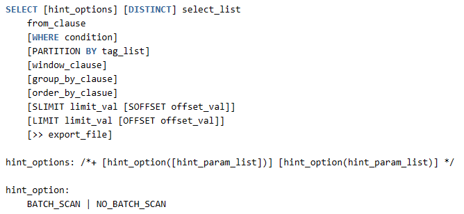

# 超级表Join性能优化

## 1. 优化范围

两个超级表JOIN运算且连接条件包含Tag相等条件和主键列相等条件，并且所有Tag连接条件和主键列条件之间是AND关系（基本等同2.x JOIN条件）；
注：不在优化范围的JOIN查询延续之前JOIN实现，性能不变；

## 2. 语法增强

增加两种JOIN实现方式，主要区别在于批量读表还是顺序读表，对应的在语法中通过新增Hint功能来便于用户根据实际情况选择最优的方式。

### 2.1 Hint语法

语法规则如下：

说明：
- Hints 语法从“/*+”开始，终于“*/”，前后可有空格；
- Hints 语法只能跟随在 SELECT 关键字后；
- 每个 Hints 可以包含多个 Hint，Hint 间以空格分开，当多个 Hint 冲突或相同时以先出现的为准；
- 当 Hints 中某个 Hint 出现错误时，错误出现之前的有效 Hint 仍然有效，当前及之后的 Hint 被忽略；
- hint_param_list 是每个 Hint 的参数，根据每个 Hint 的不同而不同；

### 2.2 JOIN两种读表方式

| Hint | 参数 | 功能说明 | 优缺点 | 适用场景 |
| --- | --- | --- | --- | --- |
| BATCH_SCAN | 无 | 批量读取所有符合条件的表数据的方式（默认方式） | 优点：读表速度快 缺点：磁盘占用高 | 符合连接条件的表数较多且磁盘空间IO能力足够 |
| NO_BATCH_SCAN | 无 | 顺序读取符合条件的表数据的方式 | 优点：磁盘占用低 缺点：读表速度慢 | 符合连接条件的表数较少 或 磁盘空间IO能力不足 |
