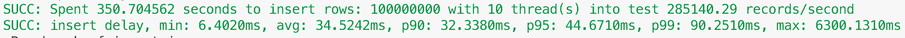

# ttlMgrFlush 阻塞写入测试报告

## 

## 1. 问题背景

[表过期TTL增强](https://taosdata.feishu.cn/wiki/wikcnuCilouVKIDYaEoFq0JT6Me) 
[ttlMgrFlush 阻塞写入](https://taosdata.feishu.cn/wiki/YSyPwd6fiiyhvvkgZm6cjt75n0b) 

TD-25445

## 2. 测试环境

192.168.1.116 CPU: 12C MEM: 64G
192.168.1.96 CPU: 16C  MEM: 64G 

## 3. 问题复现

1. TDengine main 分支使用最新的代码 （5445e836de）编译生成 taosd
2. Taos-tools main 分支使用最新代码 (9cdef4e) 编译生成 taosBenchmark
3. 使用 taosBenchmark 创建 1000000 子表，每个子表的 ttl 设置为 10 分钟
4. 10分钟后使用 taosBenchmark 在已经步骤3创建的数据库中写入数据，10000表，每张表10000条记录
5. 观察步骤4中 taosBenchmark 写入的数据的时间如下：

1. 清空数据库，直接使用 taosBenchmark 与步骤4相同的配置重写写入数据，发现耗时如下：

1. 测试发现有在有TTL 自动删表的情况下比没有TTL删表的情况下写入相同数据量数据慢 130 秒: 350秒 VS 220 秒

## 4. 测试结果

步骤：
- taos.cfg TTL 设置 ttlUnit 1, ttlPushInterval 30, ttlBatchDropNum 10000, ttlChangeOnWrite 1, ttlFlushThreshold 100, trimVDbIntervalSec 3600
- 使用 taosBenchmark 创建 1000 万子表，10个 vgroup, 不写入数据， ttl 到期时间为 300 秒 （TTL 到期之后没每 30 秒删除 100000 子表）
- 在 1000 万子表 ttl 开始到期后，再次使用 taosBenchmark 写入数据，创建 1 万表，每个子表写入 1 万条记录，测试的写入性能数据如下：

|  | No TTL | 优化前 有 TTL ttlChangeOnWrite=false | 优化后 有 TTL ttlChangeOnWrite=false | 优化前 有 TTL ttlChangeOnWrite=true | 优化后 有 TTL ttlChangeOnWrite=true |
| --- | --- | --- | --- | --- | --- |
| time | 194.15 |  | 200.9 |  | 218.51 |
| speed | 515042.52 |  | 497672.67 |  | 457624.81 |
| min | 5.76 |  | 5.10 |  | 5.4 |
| avg | 18.93 |  | 19.63 |  | 21.4 |
| max | 196.41 |  | 1111.5 |  | 1047.4 |

## 5. 测试结论

从优化后的测试数据可以看出，有 TTL 后写入速度变慢，但是慢得不是很明显；ttlChangeOnWrite=false 时的写入性能比 ttlChangeOnWrite=true 时的写入性能略好，符合预期；
优化前的测试数据已经没有办法得到了，因为写入时会出现 crash，连**问题复现**这个场景都无法重复了（也会 crash），不过从之前问题复现得到的测试数据可以看出，3.1 分支优化效果明显；

## 6. 发现的问题

TD-25954

TD-25996
