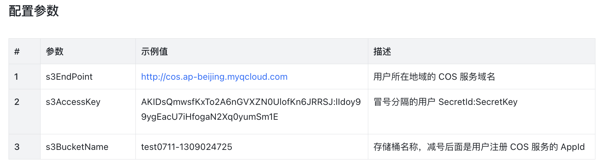
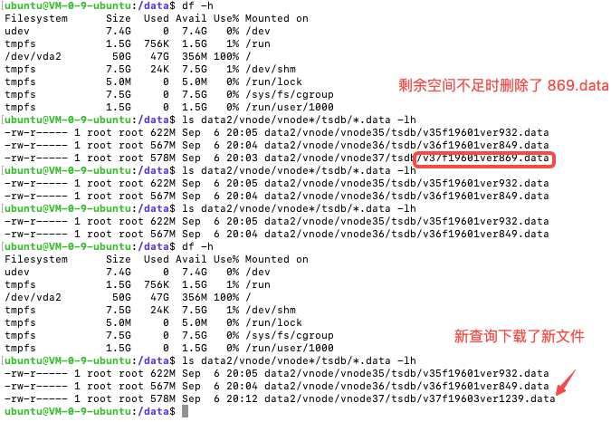

# 支持 S3 对象存储测试报告

## 一、背景描述

     S3 存储由于其价格低，所以对于历史数据存放到 S3 上将更加实惠 。
     功能用户手册：[COS对象存储用户手册](https://taosdata.feishu.cn/wiki/OjmwwCmqdiENPckuo4icjb5fnzc) 

## 二、功能支持

     TDengine 对 S3 存储的支持为限定部分支持，非全部支持，所以功能上有一些限制，下面进行列出

###      1、S3 必须在多级存储中方可使用

     TDengine 只对多级存储中第二、三级上支持对象存储，对象为 .data 文件， 其它扩展名的文件仍然存储在本地不做变化

###      2、存储在 S3 上数据为只读数据

     考虑到最后一级数据存储在 S3 上读写数据都不快，如果仍然支持在S3 上的数据更新，会是一个非常糟糕的过程，更新操作会非常的缓慢，几乎无法使用，同时考虑到放到最后一级上的数据已经是非常久远的历史数据了，更新的必要性并不大，所以产品设计成了不允许更新，即在 S3 上存储的数据都为只读。 

### 3、新增 S3 配置

     在 taos.cfg 中新增了 S3 配置，如果上了正确的 S3 地址，第二及三级存储中的 .data 文件即会存储在配置的 S3 上，此配置也是使用 S3 的开关， 参数配置如下：

###      4、本地磁盘仅是 S3 的一个临时缓存

     系统的工作原理是如果用户访问到了 S3 系统中的 .data 文件，那么 S3 管理系统负责从 S3 上下载相应的文件并阻塞查询，直到文件下载到本地正确的位置后再允许查询继续像在本地查询一样完成查询。
      如果本地磁盘空间不足，那么 S3 管理系统会删除本地不再使用的 .data 文件，腾出空间给新的从 S3 要下载的.data 文件使用。
      预留 1 G 空间

###       5、数据过期

      数据过期后从本地及S3 系统中都应删除相应的.data 数据文件

###       6、vgroup 的限制

      禁止 redistribute vgroup , split vgroup 的操作， 其它都应能支持到

## 三、测试方案

测试主要针对上节中列出的四个功能变化点进行重点测试

### 1、配置信息

| # | 参数 | 配置值 |  |
| --- | --- | --- | --- |
| 1 | s3EndPoint | http://cos.ap-beijing.myqcloud.com |  |
| 2 | s3AccessKey | AKIDEEzTAblJn33nOBzNjSw85mfIzPN6Jkgm:16vA9sLXMqKYjeJhoLcuvtaW1FZdiWGw |  |
| 3 | s3BucketName | tdbucket1-1302209758 |  |

taos.cfg 配置文件内容：
s3EndPoint http://cos.ap-beijing.myqcloud.com
s3AccessKey AKIDEEzTAblJn33nOBzNjSw85mfIzPN6Jkgm:16vA9sLXMqKYjeJhoLcuvtaW1FZdiWGw
s3BucketName tdbucket1-1302209758

### 2、设计业务流程

     配置三级存储， keep 分别为 2d,1d,1d
     数据库 duration 配置为 1h, 一天 24个 data 文件，方便后面观察 .data 文件的下载
    写入操作从两天前开始写，顺序写入，保证都写入到一级存储上
    持续写入 24 小时后，在二级存储上会有一天的数据迁移过来，此时二级存储上有数据，三级存储上仍然为空
    持续写入 48 小时后，二级存储上的文件会迁移至三级存储，同时二级存储上又会迁移来从一级存储中迁移过来的新的文件，可保证各级存储上都存有数据。
    
### 3、异常情况

  1）网络异常下载失败
  2）下载到文件损坏
  3） 本地磁盘空间不足
  4） 无法连接到 S3 服务器
  
## 四、测试内容

### 1、功能测试

####   1）配置项

          s3Endpoint
    s3AccessKey
    s3bucketName

####   2）写入

| 序号 | 内容 | 预期 | 验证 |
| --- | --- | --- | --- |
| 1 | 写入一级存储数据 | 成功 | 通过 |
| 2 | 写入二级存储数据 | 成功 | 通过 |
| 3 | 写入三级存储数据 | 失败，报时间过期 | 通过 |
| 4 | 更新一级存储中数据 | 成功 | 通过 |
| 5 | 更新二级存储中数据 | 成功 | 通过 |
| 6 | 更新三级存储中数据 | 失败，报时间过期 | 通过 |
| 7 | 删除一级存储中数据 | 成功 | 通过 |
| 8 | 删除二级存储中数据 | 成功 | 通过 |
| 9 | 删除三级存储中数据 | 成功 | 通过 |
| 10 | 两个及多个数据库同时写入，验证S3 上对多个库的DATA文件的处理 | 每个库都能正常写入 | 通过 |

####    3）查询

| 序号 | 内容 | 预期 | 验证 |
| --- | --- | --- | --- |
| 1 | 一级存储中的 count(*) 及 select * 查询 | 能正常执行 | 通过 |
| 2 | 二级存储中的 count(*) 及 select * 查询 | 能正常执行 | 通过 |
| 3 | 三级存储中的 count(*) 及 select * 查询 | 能正常执行 | 通过 |
| 4 | 跨一至三级中的 count(*) 及 select * 查询 | 能正常执行 | 通过 |

####     4）迁移

| 序号 | 内容 | 预期 | 验证 |
| --- | --- | --- | --- |
| 1 | 最后一级中的DATA文件本地与服务器比较 | data文件数量及大小都一致 | 通过 |
| 2 | 如果S3 服务器上部分 DATA 数据丢失了，那客户端怎么办？ | 客户端将无法启动，和本地丢失 DATA 文件行为一致 | 通过 |
| 3 | 无数据写入是否也会自动迁移至S3 | 预期会迁移 | 通过 |
| 4 | 文件迁移后本地空间是否被释放 | 会 | 通过 |
| 5 | s3 服务器上过期的文件 | 预期按keep 配置的参数自动删除 | 通过 |

####     5）其它功能

| 序号 | 内容 | 预期 | 验证 |
| --- | --- | --- | --- |
| 1 | 本地磁盘有限下的循环清除旧 .DATA 文件的能力，KEEP 配置为 1h,2h,365d, 让数据都放到第三级上，持续写入占满本地磁盘后，让其自动清理本地磁盘文件 | 能正确查询到最老的数据 | 通过 |
| 2 | 验证文件在从第二级迁移至第三级时网络有问题，没有上传到S3 ,本地大量DATA 没有上传S3的情况 | 网络恢复连接后自动把未上传的DATA文件再上传到S3上 | 通过 |
| 3 | 查询所有历史数据时，如S3 上有 20G 数据，而本地磁盘剩余空间 5G, 查询需要下载8G DATA文件，是否可以查询成功？ | 预期不可以 | 这种情况报了如下错： DB error: Out of disk space |
| 4 | 多个查询并发进行，前面的还没结束，后面的查询又要下载，没有空间，需要释放，把前面查询的文件删除 | 预期删除文件释放空间 | 通过 |
| 5 | 多个查询并发在一个VNODE上，会出现多个查询同时下载一个 Data 文件的情况，在这些查询都下载 DATA 完成后，怎么办，都一起修改原来的 Data 文件吗？ | 当前程序设计的是没有做同步，所以可能会出现概率性的一起修改，导致DATA 文件不可预期 | 已测试 |
| 6 | 删除最后一级中的一段时间数据，DATA 文件是否会被删除？ | 预期是不会被删除，因为一个DATA 文件中可能包括几个超级表的数据，所以没办法认为 DATA 文件中的内容都是被删除了的 | 通过 |
| 7 | 长时间稳定运行不出错 | 在腾讯云主机上已经连续运行10天左右了，未发生服务崩溃，文件不上传，过期文件不删除等现象，功能都能正常运行，长时间运行测试通过。 | 通过 |

####         6）空间不足挪出无用 data 腾出空间专项验证

               使用腾讯云虚拟主机进行了测试，共 50G 硬盘，剩余空间不足2G，S3上有 6G 左右文件。
         这个状态下进行查询，对超级表进行所有时间线的投影查询，会拉所有文件，返回了DB error: Out of disk space 错误，这个是预期内的，因为本地没有 6G 剩余空间把本次查询所需文件都拉下来。
          使用单个子表投影查询 select * from d0 order by ts desc; 这样只会拉 d0 所属的 vnode 文件，预期是可以下载并能查询到结果的，验证结果也是符合预期的。
          这个过程看本地 二级存储中的缓存文件变化，也是符合预期的，无用的 data 文件会被删除清理腾出空间。如下：

        功能测试发现的BUG 汇总见：
            https://jira.taosdata.com:18080/browse/TD-25010?filter=14125  

### 2、性能测试

       性能测试做了两次专项测试，见报告：
        1）[S3 性能测试报告（本地）](https://taosdata.feishu.cn/wiki/XsMrweGXAiAic6k7sH8c58utnfg) 
        2） [S3 性能测试报告(腾讯云)](https://taosdata.feishu.cn/wiki/NBY1wRKq3iHZjDkZI5lcFMNMn31) 
       
## 四、测试结论

        经测试，功能符合预期，测试出的问题也已基本修复，测试通过。
