# 流计算多副本测试报告

## 一.测试背景

3.1.1.0版本流计算开始支持多副本，对其功能、稳定性

## 二、测试环境

### **2.1 硬件环境**

| **硬件环境** | **IP** | 用途 | **CPU** | **内存** | **硬盘** |
| --- | --- | --- | --- | --- | --- |
| **测试服务器** | 192.168.1.53 | taostest、taosBenchmark | PERC H730 Mini 446G*2 |
|  | 192.168.1.55 | taosd |
|  | 192.168.1.56 | taosd |
|  | 192.168.1.57 | taosd |

### **2.2 软件环境**

| **软件环境(enh/triggerCheckPoint2分支)** | **IP** | **运行目录** | **脚本及配置** | **commitID** |
| --- | --- | --- | --- | --- |
| **TDengine** | 192.168.1.53-60 | /root/TDengine | 默认 | 38bb123701e15b36392ea44878c242a9f832b81e |

## 三.功能测试 

| at_once | pass |
| --- | --- |
| window_close | pass |
| max_delay | pass |
| watermark | 搭配 trigger_mode 测试 | pass |
| interval | pass |
| session_window | pass |
| state_window | pass |
| 标量 | pass |
| 聚合 | pass |
| 标量函数 | abs, acos, asin, atan, ceil等 | pass |
| partition by | tbname，column，tag，expression，constant | pass |
| ignore_expired | 0/1 | pass |
| ignore_update | 0/1 | pass |
| 已存在超级表 | 组合 | pass |
| 自定义子表 | 组合 | pass |
| 自定义tag | 组合 | pass |
| Fill | NULL，PREV，NEXT，LINEAR、VALUE | pass |
| pause/resume | 组合 | pass |
| fill_history | 组合 | pass |

### 四.稳定性测试

### 4.1 **场景一：(无partition)**

Json:

> ⚠ 嵌入文件，需在飞书中查看 (token: Wxf2bIrqJoBlLbxT8Luc88Lan5g)

> ⚠ 嵌入文件，需在飞书中查看 (token: LYH9bMadiol81tx4WC5cjvW2nAh)

建流语句：
CREATE STREAM IF NOT EXISTS stream_stability TRIGGER at_once WATERMARK 30s IGNORE UPDATE 0 IGNORE EXPIRED 0 FILL_HISTORY 1 INTO stream_test.output_streamtb (ts,c1,c2,c3) TAGS(t1) SUBTABLE(concat("sub_tb1_", "suffix")) as select _wstart as wstart, min(c1),max(c2), count(c3)  from stream_test.stb interval(10s)
覆盖功能：

| fill_history | custom_tag | existed_stable |
| --- | --- | --- |
| interval | watermark | at_once |
| ignore_expired | ignore_update | subtable |

| schema |
| --- |
| type | int | float | timestamp | tinyint | varchar(16) |
| count | 1 | 2 | 2 | 1 | 1 |

总数据量：

| table_count | rows_count | stream_rows | window_interval |
| --- | --- | --- | --- |
| 1000 | 10500000000 | 1050000 | 10s |

CPU:
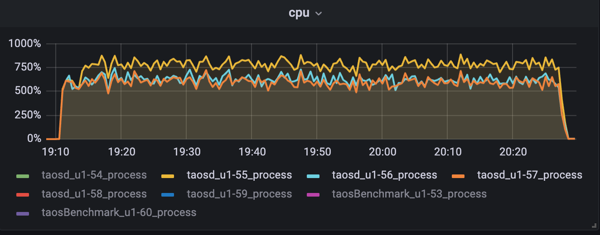

内存：
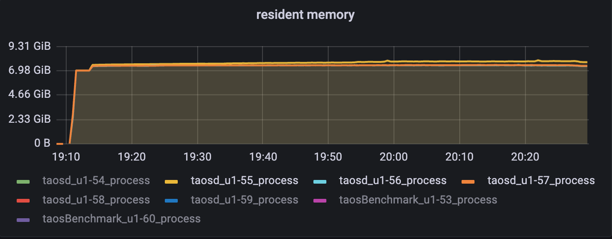

磁盘IO:
u1-55
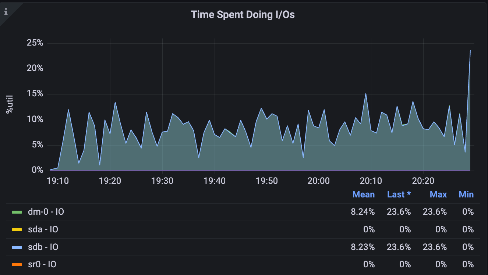

u1-56
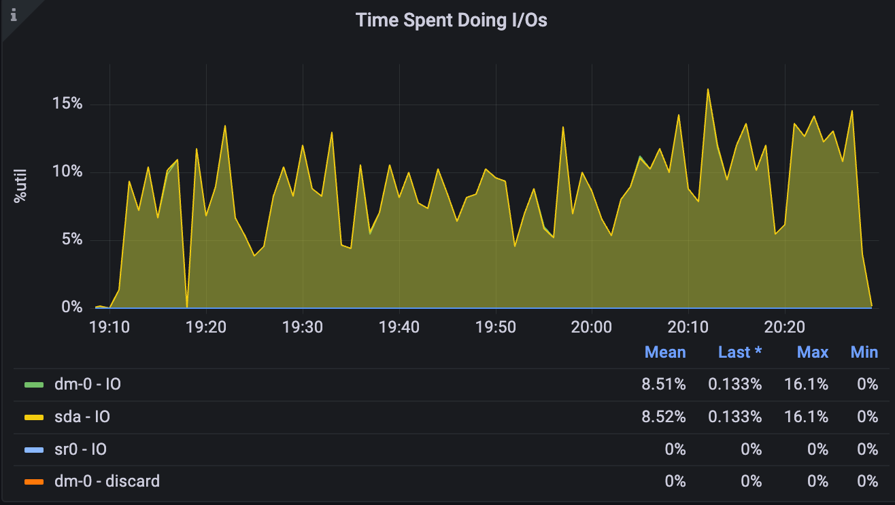

u1-57
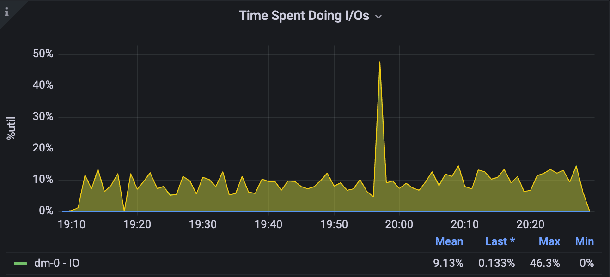

### 4.2 场景二：(partition by tbname)

Json:

> ⚠ 嵌入文件，需在飞书中查看 (token: C2F4bgpBtoSRTvxx3PTcwXcFnHg)

> ⚠ 嵌入文件，需在飞书中查看 (token: MNKkbyL4OojKSTxV89XcgS6rn8c)

建流语句：
CREATE STREAM IF NOT EXISTS stream_stability TRIGGER at_once WATERMARK 30s IGNORE UPDATE 0 IGNORE EXPIRED 0 FILL_HISTORY 1 INTO stream_test.output_streamtb (ts,c1,c2,c3) TAGS(t1) SUBTABLE(concat(tbname, "suffix")) as select _wstart as wstart, min(c1),max(c2), count(c3)  from stream_test.stb partition by cast(t1 as int) t1,tbname interval(10s);
覆盖功能：

| fill_history | custom_tag | existed_stable |
| --- | --- | --- |
| interval | watermark | at_once |
| ignore_expired | ignore_update | subtable |

| schema |
| --- |
| type | int | float | timestamp | tinyint | varchar(16) |
| count | 1 | 2 | 2 | 1 | 1 |

总数据量：

| table_count | rows_count | stream_rows | window_interval |
| --- | --- | --- | --- |
| 50000 | 5010000000 | 500200000 | 10s |

CPU:
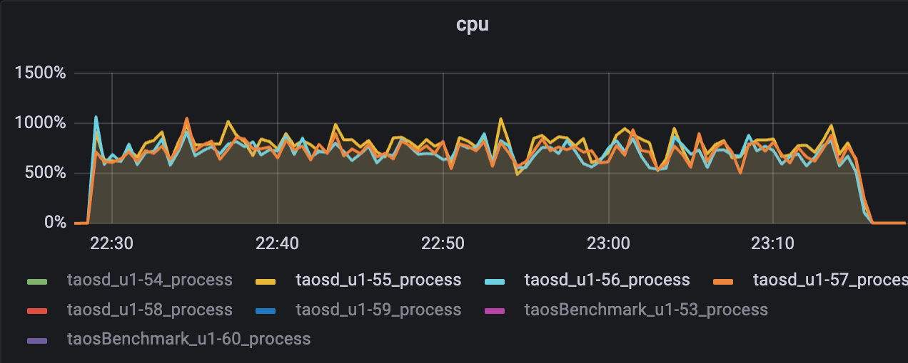

MEM：
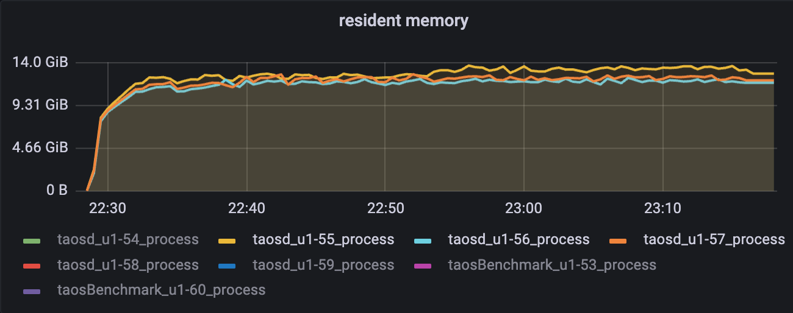

磁盘IO：
u1-55
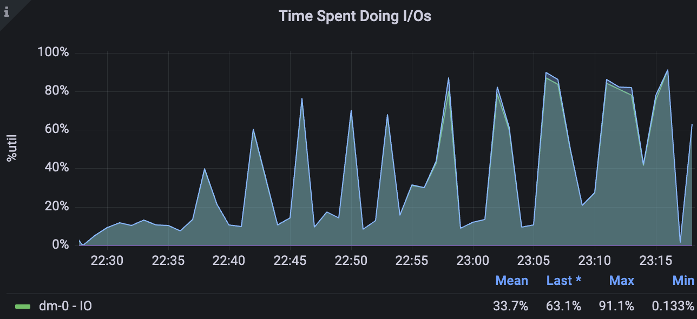

u1-56
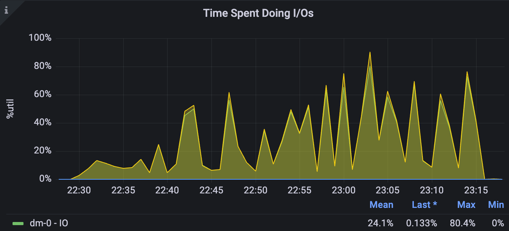

u1-57
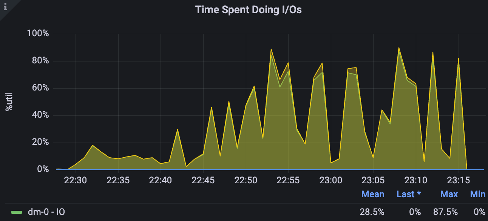

### 4.3 场景三：(nevados)

Json:

> ⚠ 嵌入文件，需在飞书中查看 (token: NMEdb0JhYojJaGxUjtwcWXoXnag)

> ⚠ 嵌入文件，需在飞书中查看 (token: TZSLb7oHdo6AZqxCZTrcbI8WnOf)

建流语句：
CREATE STREAM IF NOT EXISTS trackers_hourly_stream TRIGGER window_close IGNORE UPDATE 0 IGNORE EXPIRED 0 FILL_HISTORY 1 INTO dev.trackers_hourly as select _wstart as window_start, site, zone, tracker, max( case when abs(reg_pitch - reg_move_pitch) <= 2 then 1 when reg_temp_therm2 < -20 then 1 else 0 end ) as on_target, case when max(abs(reg_pitch - reg_move_pitch)) <= 2 then "on_target" when min(reg_temp_therm2) < -20 then "cold_limit" else "off_target" end as on_target_status, avg(reg_pitch) as avg_pitch, last(reg_pitch) as last_pitch, avg(reg_move_pitch) as avg_move_pitch, last(reg_move_pitch) as last_move_pitch from prod.trackers where _ts >= "2020-01-01" and _ts < now() + 1h partition by site, zone, tracker interval(1h) sliding(1h) fill(null);
覆盖功能：

| fill_history | interval | sliding |
| --- | --- | --- |
| fill | watermark | window_close |
| ignore_expired | ignore_update | partition |

schema较复杂，参考json
总数据量：

| table_count | rows_count | stream_rows | window_interval |
| --- | --- | --- | --- |
| 1893 | 976790000 | 5663374 | 1h |

CPU:
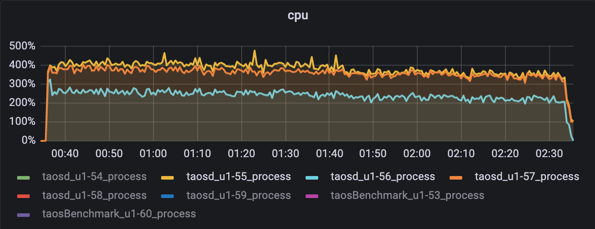

MEM：
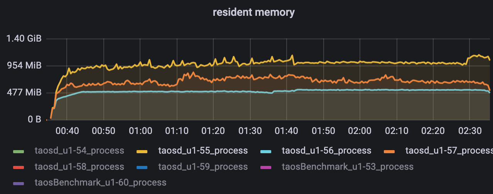

磁盘IO：
u1-55
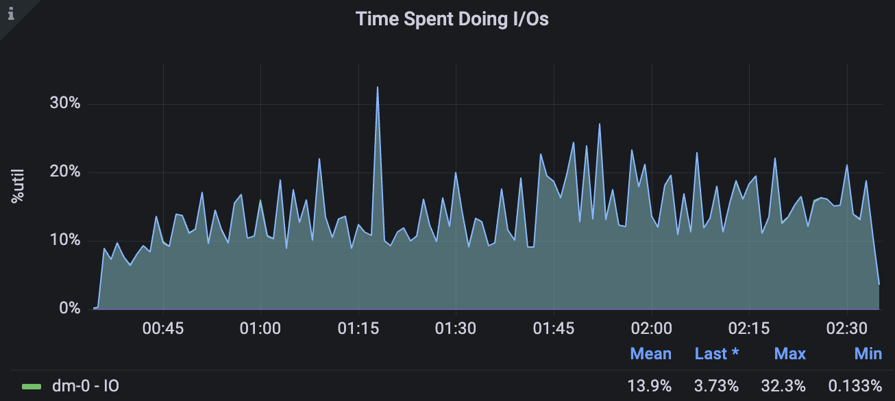

u1-56
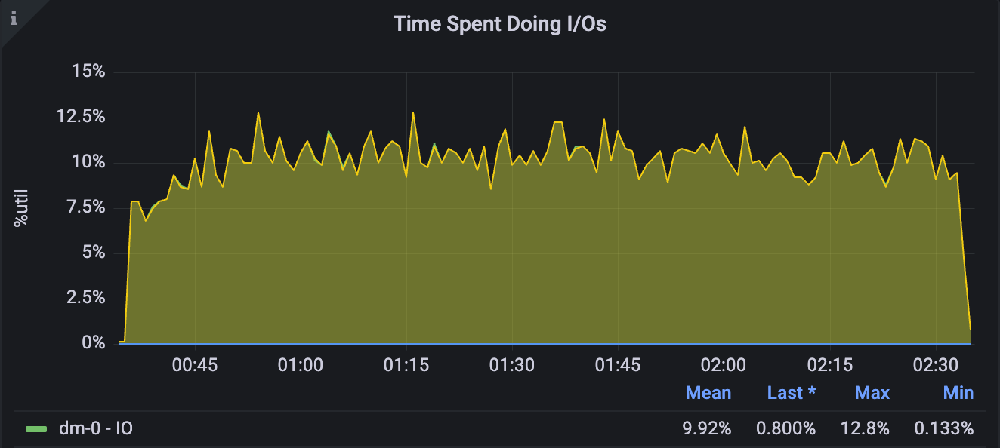

u1-57
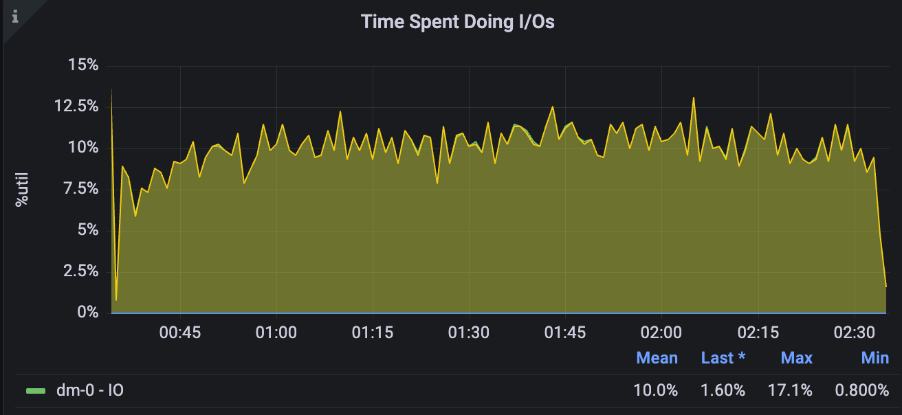

## 五.测试问题单

| JIRA编号 | JIRA描述 | 当前状态 |
| --- | --- | --- |
| [TD-25910](https://jira.taosdata.com:18080/browse/TD-25910) | [三节点3副本多个流多个db，流结果不对](https://jira.taosdata.com:18080/browse/TD-25910) | Done |
| [TD-25932](https://jira.taosdata.com:18080/browse/TD-25932) | [三节点3副本频繁pause/resume，drop db卡死](https://jira.taosdata.com:18080/browse/TD-25932) | Done |
| [TD-25984](https://jira.taosdata.com:18080/browse/TD-25984) | [流计算多副本稳定性测试，pause stream并在写入停止后很长一段时间agg节点cpu依然占用很高](https://jira.taosdata.com:18080/browse/TD-25984) | Done |
| [TD-25987](https://jira.taosdata.com:18080/browse/TD-25987) | [三节点3副本频繁pause/resume，概率性crash](https://jira.taosdata.com:18080/browse/TD-25987) | Done |
| [TD-26035](https://jira.taosdata.com:18080/browse/TD-26035) | [alter stream_db replica 3->1 crash](https://jira.taosdata.com:18080/browse/TD-26035) | Done |
| [TD-26053](https://jira.taosdata.com:18080/browse/TD-26053) | [流计算多副本大数据量测试pause/resume，resume失效](https://jira.taosdata.com:18080/browse/TD-26053) | Done |
| [TD-26069](https://jira.taosdata.com:18080/browse/TD-26069) | [流计算大数据量alter database replica 1->3 crash](https://jira.taosdata.com:18080/browse/TD-26069) | PROCESSING |
| [TD-26081](https://jira.taosdata.com:18080/browse/TD-26081) | [百亿数据量(含流)alter database replica 3->1长时间未完成](https://jira.taosdata.com:18080/browse/TD-26081) | Pending，周五晚上应该是已经在开发分支修复了，还未合入main |
| [TD-26105](https://jira.taosdata.com:18080/browse/TD-26105) | [main分支回归流计算3副本稳定性，写入过程中crash](https://jira.taosdata.com:18080/browse/TD-26105) | Done |

## 六. 测试结论

1. 功能测试全部通过；
2. 稳定性场景中可以从资源占用曲线可以看出，3种场景CPU、内存、磁盘IO等各项资源占用符合预期；
3. 目前副本数切换不稳定，还有遗留问题需解决；
