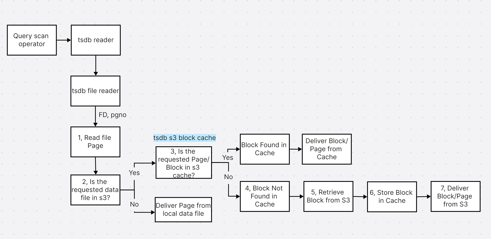

# s3 block cache 流程简述

查询引擎通过 tsdb reader 模块访问 tsdb 的 header, data, stt 等文件中的索引和数据，tsdb file reader 根据请求的页编码（pgno)，访问相关的文件页（File Page)；下面是从 s3 拉取数据的主要步骤：
1，Read file page，根据文件的 FD，pgno，读取被请求的文件页数据，通过后面的步骤拿到这个页的数据之后，对这个文件页做 checksum 校验，如果校验不通过，说明本页数据有损坏，返回数据损坏错误。
2，判断被访问的数据是否在 S3 上面，如果是本地文件，按照原有逻辑从本地读取目标页。
3，如果数据在 S3 上面，先把 pgno 转化为这个页所在块的块编号 blkno：
`blkno = (pgno + tsS3BlockSize - 1) / tsS3BlockSize`
tsdb s3 block cache 根据 fid, cid, blkno 确定目标块是否已被缓存，如果可以在缓存中找到，则计算目标页在这个块中的位置，并根据页在块中的位置和页大小返回目标页的数据。
4，如果目标块不在缓存中，则从 s3 下载这个块，存入缓存，并在这个块中找到目标页并返回，这个与第3步中过程相同，不再赘述。
