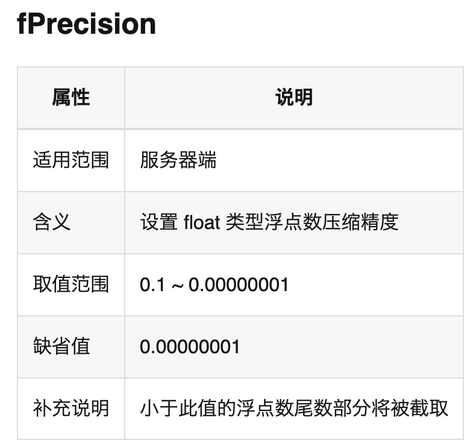
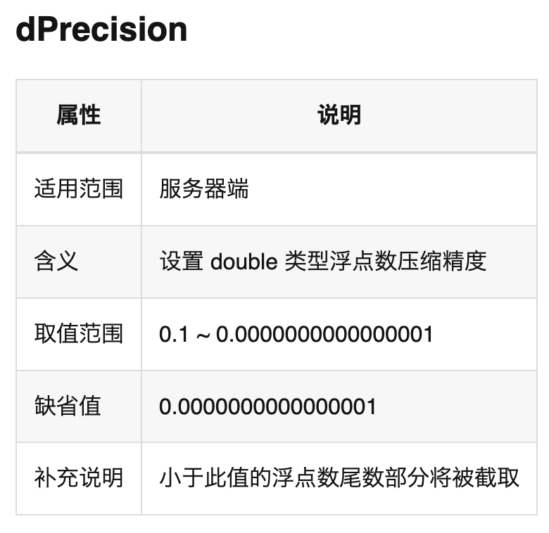
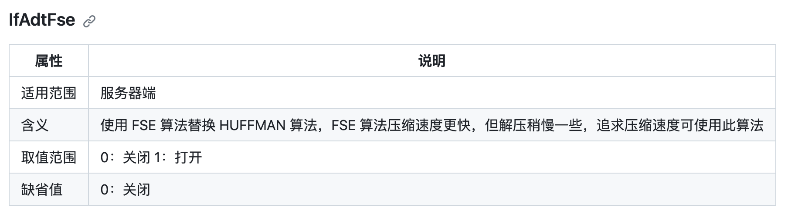

# 可配置浮点数有损压缩

## 1. TSZ 压缩算法

TSZ 压缩算法是 TDengine 为浮点数据类型提供的可选压缩算法，可以实现浮点数有损至无损全状态压缩，相比默认压缩算法， TSZ 压缩算法压缩率更高，即使切至无损状态，压缩率也会比默认压缩高一倍。

### 1.1 适合场景

TSZ 压缩算法是通过数据预测技术完成的压缩，所以更适合有规律变化的数据。
同时 TSZ 压缩时间会更长一些，如果您的服务器 CPU 空闲，存储空间紧张的情况下适合选用。

### 1.2 使用步骤

- TDengine 支持版本为 3.2.0.0 或以上
- 开启选项
     在  taos.cfg 配置中增加以下内容，即可开启 TSZ 压缩算法，功能打开后，会替换默认算法。以下表示字段类型是 float 及 double 类型都使用此压缩算法，也可以单独只配置一个。
```plaintext
lossyColumns     float|double
```

- 配置需要重启服务生效。
- Taosd 日志输出以下内容，表明功能已生效：
```plaintext
02/22 10:49:27.607990 00002933 UTL  lossyColumns     float|double
```

### 1.3 配置参数：

   FLOAT 类型精度控制：


 DOUBLE 类型精度控制：


TSZ 压缩中可选择的算法 FSE，默认为 HUFFMAN：


### 1.4 注意事项

- 打开 TSZ 后生成的存储数据格式，回退至 3.2.0.0 之前的版本，数据将不能被识别
