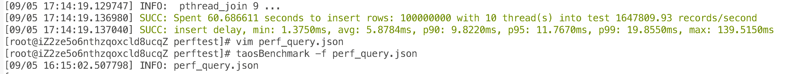
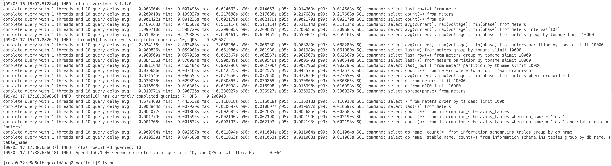
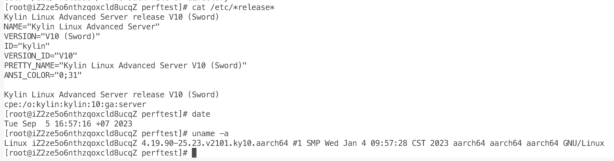

# TS-3890: [中船]阿里云arm+麒麟v10运行性能测试用例 

## 1. 测试环境

硬件环境：59.110.168.200 
软件环境：TDengine 企业版 3.1.1.0

## 2. 写入性能

taosBenchmark 创建 10000 子表，每个子表写入 10000 条记录
| time (s) | speed (r/s) | avg delay (ms) |
| --- | --- | --- |
| 60.68 | 1647809.93 | 5.878 |

## 3. 查询性能

| sql | query time (s) |
| --- | --- |
| select last_row(*) from meters | 0.008904 |
| select count(*) from meters | 0.209018 |
| select count(*) from d0 | 0.001422 |
| select avg(current), max(voltage), min(phase) from meters | 0.469163 |
| select avg(current), max(voltage), min(phase) from meters interval(10s) | 1.99971 |
| select avg(current), max(voltage), min(phase) from meters group by tbname limit 10000 | 0.612885 |
| select avg(current), max(voltage), min(phase) from meters partition by tbname limit 10000 | 2.934155 |
| select last(*) from meters group by tbname slimit 10000 | 0.060836 |
| select last_row(*) from meters group by tbname slimit 10000 | 0.06056 |
| select last(*) from meters partition by tbname slimit 10000 | 0.884136 |
| select last_row(*) from meters partition by tbname slimit 10000 | 0.881104 |
| select count(*) from meters where location = 'San Francisco' | 0.039686 |
| select avg(current), max(voltage), min(phase) from meters where groupid = 1 | 0.071545 |
| select * from meters limit 10000 | 0.030035 |
| select * from d100 limit 10000 | 0.016596 |
| select spread(phase) from meters | 0.319971 |
| select * from meters order by ts desc limit 1000 | 4.67246 |
| select last(*) from meters | 0.008844 |
| select count(*) from information_schema.ins_tables | 0.002072 |
| select count(*) from information_schema.ins_tables where db_name = 'test' | 0.001779 |
| select count(*) from information_schema.ins_tables where db_name = 'test' and stable_name = 'meters' | 0.001765 |
| select db_name, count(*) from information_schema.ins_tables group by db_name | 0.009994 |
| select db_name, stable_name, count(*) from information_schema.ins_tables group by db_name, stable_name | 0.01055 |

