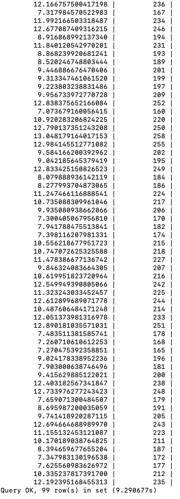
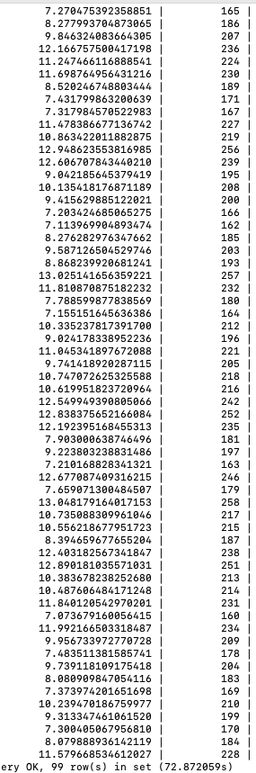

# [TD-26639] Partition by 使用 Group by 替换

**测试服务器：**192.168.1.176
**对比版本：**    V3.1.1.8  与 当前版本 V3.2.1.0
**测试步骤：**
  1、安装 V3.1.1.8 
  2、taosBenchmark -d db1 -t 10 -n 1000000 方式生成三个不同规模数据库
  3、taos-CLI 查询记录用时
  4、升级至 V3.2.1.0 
  5、taos-CLI 查询记录用时，对比结果

|  |  |  |
| --- | --- | --- |
| **场景** | **分类** |  | **用时(秒)** | **结论** | **用时（秒）** | **结论** |
| Partition by | 1.84s | 5.34s |
| Group by | 5.24 | 5.11s |
| Partition by | 0.25s | 0.19s |
| Group by | 0.14s | 0.14s |
| Partition by | 11.43s | 31.58s |
| Group by | 31.95s | 30.35s |
| Partition by | 1.95s | 0.16s |
| Group by | 0.93s | 0.17s |
| Partition by | 9.29s | 26.68s |
| Group by | 26.55s | 26.57s |
| Partition by | 1.41s | 0.14s |
| Group by | 0.64s | 0.14s |

结论：
   1）优化前 Partiton by 明显比 group by 在普通列上快，优化后这个优势没有了
          回答：分组较少的情况下， paritoin by 有明显优势，上面的分组是 100个，所以数据比较好，在分组多的情况下， group by 要快很多，在 V3.1.1.8 上验证 分组放大到 10W， group by 只需要 5 秒返回， Partition by 需要 200 多秒返回。
   2）优化前 Partiton by 比 group by 在 TAG 列上慢很多，优化后此处得到了提升
   3）V3.2.0.0 比 V3.1.1.8 的 group by 普通列分组慢了 3 倍，需要找出原因
           回答：原因已经找到，是使用了 sanitizer 编译选项导致的，去了此编译选项后再验证没有问题了

两个版本计算结果基本一致，但时间相差甚远

                        3.1.1.8  版本                                                                       3.2.1.0 版本
<grid cols="2">
  <column width="52">
    

  </column>
  <column width="47">
    

  </column>
</grid>

SQL :

| 分类 | SQL |
| --- | --- |
| 普通列分组 | select avg(current),voltage from meters group by voltage; |
|  | select avg(current),voltage from meters partition by voltage; |
| TAG 列分组 | select avg(current),tbname from meters group by tbname; |
|  | select avg(current),tbname from meters partition by tbname; |

## 1. 测试结果：

       在不同数据规模下验证最新版本的 group by 和 partition by 的用时是基本一样的，所以替换是成功有效的，在 分组较多的情况下， group by 的性能远高于 parition by,  分组较少的情况下， partition by 更有优势。
       测试数据符合预期，验证通过！
