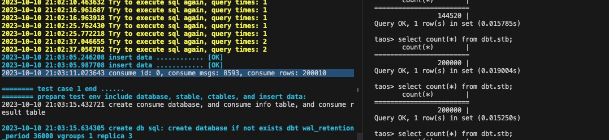

# [Test Report ]TD-26052: 数据订阅支持vnode redistribute&split

## 1. 测试功能描述

开发文档:[数据订阅支持vnode magrite&split](https://taosdata.feishu.cn/wiki/TFsUwRoVniTPspkYCTOcRxvTn2f) 
重新沟通了下，跟明明确认，这个功能的含义是，如果在消费过程中插入 split和 redistribute 的事务，得需要异步的事务完成后才可以继续消费。 @张玮绚 @段宽军 之前我理解的都是过程中还能消费，同步下情况～

## 2. 功能测试内容 

### 2.1 订阅内容

包含所有的三种订阅类型：列订阅、超级表订阅、数据库订阅
tpoic_db: create topic topic_db as database dbt;
tpoic_stb_select : create topic topic_stb_select  as  select * from dbt.stb;
tpoic_stb : create topic topic_stb as stable stb ;

### 2.2 split 功能下的数据订阅

单副本和多副本（replica3）两种情况：
1. split 1 个 vgroups 变成 2 个。
2. Spilit 2 个 vgroups 变成 4 个。

### 2.3 redistribute 功能下的数据订阅

单副本：
1. redistribute 1 个 vgroups 到另外一个 dnode 上。
2. redistribute 2 个 vgroups 到另外2个 dnode 上。
多副本：（replica3）
1. redistribute 3 个 vgroups 到另外 3 个dnode 上。
```typescript
python3 test.py -f 7-tmq/tmqVnodeTransform-stb.py -N 2 -n 1
python3 test.py -f 7-tmq/tmqVnodeTransform-stb.py -N 6 -n 3
python3 test.py -f 7-tmq/tmqVnodeSplit.py -N 2 -n 1
python3 test.py -f 7-tmq/tmqVnodeSplit.py -N 3 -n 3
python3 test.py -f 7-tmq/tmqVnodeSplit-column.py -N 3 -n 3
python3 test.py -f 7-tmq/tmqVnodeSplit-db.py -N 3 -n 3
python3 test.py -f 7-tmq/tmqVnodeSplit-stb-select-duplicatedata.py -N 3 -n 3
python3 test.py -f 7-tmq/tmqVnodeSplit-stb-select.py -N 3 -n 3
python3 test.py -f 7-tmq/tmqVnodeSplit-stb.py -N 3 -n 3
```

## 3. 性能测试

讨论是否需要增加压力和性能测试。暂未测试

## 4. 测试结果

### 4.1 问题一：

split 多副本的时候有问题，消费数据可能会多于 20w。


研发确认是消费的数据未commit，再次消费，这些数据会记录在 consumer 的 rows 里面，不属于 bug。
同时也出现了消费数据少于 100001的问题，因为可能split 没有完成，且超过了配置消费的超时时间60s，所以消费数据少。

### 

### 4.2 问题二：

split 多副本的时候，数据库订阅和stable 订阅有 core。
已解决

### 4.3 问题三：

在 split 过程中，创建表可能会报错：table already exists，原因是创建表的过程中，vnode 正好是关闭的，有部分表创建成功了，再次执行建表 sql 时已经存在的表这个时候就会报错：table already exists。这时候需要先创建表，后面再写数据，这个时候才不会报错。
属于测试用例 bug，已经修改完成。

### 4.4 问题四：
   
TD-26664

看起来是 split 过程中，vnode 写入数据是没有返回响应，导致taosd的 hang 
已解决
