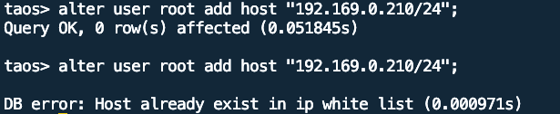

# [Test Report] - TD-25305 TDengine 白名单机制 （企业版功能）

### 1. 概述：

IP白名单功能是允许用户通过特定IP访问TDengine，用户权限与IP白名单不相关，两者分开管理。IP白名单功能通过每个dnode节点的taos.cfg中打开此功能配置项 enableWhiteList = true，所有dnode节点必须保证强一致性，不支持动态修改；且只有root用户能够对IP白名单进行增删，无修改命令（修改只能通过删除旧的IP值，增加新的IP值完成）。
从版本来看，IP白名单功能只针对企业版可用，配置对开源版不做限制，但无法生效。
从连接类型来看，IP白名单需要支持taosc直连，REST连接及Websocket连接三种连接方式。
IP白名单增删SQL语句如下：
```sql
CREATE USER user_name PASS password [SYSINFO value] [HOST host_name1[,host_name2]]  
ALTER USER user_name ADD HOST host_name1
ALTER USER user_name DROP HOST host_name1 
```

IP白名单查询SQL如下：
```sql
select user_name, allowed_host from ins_user_privileges;
show users;
```

### 2. 测试环境：

192.168.1.61：
CPU: Intel(R) Xeon(R) CPU E5-2650 v3 @ 2.30GHz （2）40核
Mem：DDR4 16GB * 16
Disk:  893GB
192.168.1.35：
CPU: Intel(R) Xeon(R) CPU E5-2630 v2 @ 2.60GHz （2）24核
Mem: DDR3  32 GB * 2
Disk: 2792GB
192.168.1.63：
CPU: Intel(R) Xeon(R) CPU E5-2650 v3 @ 2.30GHz（2）40核
Mem: DDR4 16GB* 16
Disk: 895GB
客户端及taosadapter节点：
192.168.0.209（taosadapter）
192.168.1.54（客户端）

### 3. 测试用例：

文档修改：[TD-26516](https://jira.taosdata.com:18080/browse/TD-26516)

| 版本 | 用例名称 | 用例描述 | 期望结果 | 测试结果 |
| --- | --- | --- | --- | --- |
| 未开启IP白名单 | 1. 安装部署3节点集群（物理节点） 1. 3个节点均关闭IP白名单，enableWhiteList = false 1. 启动3节点，在任一节点通过taosc、restapi、websocket三种方式连接TDengine 1. 在3节点之外部署taosadapter，通过taosc、restapi、websocket三种方式连接TDengine 1. 打开部分dnode节点的IP白名单并重启所有dnode节点，启动集群 | 1. 安装部署正常 1. 配置完成 1. 节点启动正常，连接访问正常 1. 链接访问正常 1. 集群启动失败 | 1. 安装部署正常 1. 配置完成 1. 连接访问正常 1. 连接访问正常（[TD-26475](https://jira.taosdata.com:18080/browse/TD-26475)） 1. 集群启动失败，配置 enableWhiteList = true的节点显示配置不一致错误 |
| 开启IP白名单 | 1. 安装部署3节点集群（物理节点） 1. 3个节点均打开IP白名单，enableWhiteList = true 1. 启动3节点，在任一节点通过taosc、restapi、websocket三种方式连接TDengine 1. 添加第四个节点的IP到IP白名单，通过taosc、restapi、websocket三种方式连接TDengine 1. 从IP白名单中删除第四个节点的IP，在3节点之外的节点部署taosadapter，通过taosc、restapi、websocket三种方式连接TDengine | 1. 安装部署正常 1. 配置完成 1. 节点启动正常，连接访问正常 1. 连接访问正常 1. 连接访问正常 | 1. 安装部署正常 1. 配置完成 1. 连接访问正常 1. 连接访问正常 1. 连接访问正常 |
| 未开启IP白名单 | 1. 安装部署3节点集群（物理节点） 1. 3个节点均关闭IP白名单，enableWhiteList = false 1. 启动3节点，在任一节点通过taosc、restapi、websocket三种方式连接TDengine 1. 在3节点之外安装taosadapter及taosc在同一节点，通过taosc、restapi、websocket三种方式连接TDengine 1. 在3节点之外安装taosadapter及taosc在不同节点，通过taosc、restapi、websocket三种方式连接TDengine 1. 打开部分dnode节点的IP白名单并重启所有dnode节点，启动集群 | 1. 安装部署正常 1. 配置完成 1. 节点启动正常，连接访问正常 1. 连接访问正常 1. 连接访问正常 1. 集群启动失败 | 1. 安装部署正常 1. 配置完成 1. 连接访问正常 1. 连接访问正常 1. 连接访问正常 1. 集群启动失败，打开IP白名单的节点处于offline状态，taosd日志显示cluster cfg inconsistent错误 |
| 开启IP白名单 | 1. 安装部署3节点集群（物理节点） 1. 3个节点均打开IP白名单，enableWhiteList = true 1. 启动3节点，在任一节点通过taosc、restapi、websocket三种方式连接TDengine 1. 在3节点之外安装taosadapter及taosc在同一节点，并增加IP节点到IP白名单，在此节点通过taosc、restapi、websocket三种方式连接TDengine 1. 在IP白名单删除taosadapter及taosc所在节点IP，在此节点通过taosc、restapi、websocket三种方式连接TDengine 1. 在3节点之外安装taosadapter及taosc在不同节点，并增加taosadapter节点ip，taosc节点ip到IP白名单，在taosc所在节点通过taosc、restapi、websocket三种方式连接TDengine 1. 从IP白名单中删除客户端节点的IP，在taosc所在节点，通过taosc、restapi、websocket三种方式连接TDengine 1. 在IP白名单添加客户端IP，并删除taosadapter节点IP，在taosc所在节点通过taosc、restapi、websocket三种方式连接TDengine | 1. 安装部署正常 1. 配置完成 1. 节点启动正常，连接访问正常 1. 连接访问正常 1. 连接访问失败 1. 连接访问正常 1. 连接访问失败 1. taosc连接正常，restapi及socket方式失败 | 1. 安装部署正常 1. 配置完成 1. 节点启动正常，连接访问正常 1. 连接访问正常([TD-26502](https://jira.taosdata.com:18080/browse/TD-26502)) 1. 连接访问失败 1. 连接访问正常 1. 连接访问失败 1. taosc连接正常，restapi及socket方式失败 |
| 3节点集群mnode切主 | 1. 在用例1、用例2的配置下，断掉其中leader mnode的taosd 1. 重复用例中的测试步骤，测试结果保持一致 | 参考用例1、用例2的期望结果 | 测试结果与用例1、用例2一致 |
| 添加重复的IP到IP白名单 | 1. 安装部署3节点集群（物理节点） 1. 3个节点均打开IP白名单，enableWhiteList = true 1. 添加指定IP到IP白名单两次 | 1. 安装部署正常 1. 配置完成 1. 第一次添加正常，第二次添加失败 | 1. 安装部署正常 1. 配置正常 1. 添加ip正常，再次添加失败  |
| 添加最大个数的IP白名单_2048 | 1. 安装部署3节点集群（物理节点） 1. 3个节点均打开IP白名单，enableWhiteList = true 1. 添加2048个不同IP到I指定用户IP白名单 1. 添加2049个IP到指定用户的IP白名单 | 1. 安装部署正常 1. 配置完成 1. 所有IP被添加到IP白名单正常，显示正常 1. IP白名单添加失败 | 1. 安装部署正常 1. 配置完成 1. 2048个IP被添加到IP白名单正常，显示正常 1. 2049个IP白名单添加失败 |
| 用户权限 | 1. 安装部署3节点集群（物理节点） 1. 3个节点均打开IP白名单，enableWhiteList = true 1. 使用root用户添加新用户 1. 使用新用户查看ip白名单 1. 使用新用户添加、删除ip到白名单 | 1. 安装部署正常 1. 配置完成 1. 添加新用户完成 1. 新用户能够查看ip白名单 1. 新用户无法添加、删除ip到白名单 | 1. 安装部署正常 1. 配置完成 1. 添加新用户完成 1. 新用户能够查看ip白名单（[TD-26520](https://jira.taosdata.com:18080/browse/TD-26520)） 1. 新用户无法添加、删除ip到白名单 |
| 升级兼容性 | 1. 安装部署3.1.0.0版本 1. 写入部分数据，通过taosc、restapi、websocket三种方式连接TDengine 1. 升级TDengine到最新代码版本 1. 重启taosd 1. 对开源版、企业版检查默认ip白名单功能关闭 1. 通过taosc、restapi、websocket三种方式连接TDengine 1. 打开开源版、企业版ip白名单功能并重启taosd 1. 通过taosc、restapi、websocket三种方式连接TDengine | 1. 安装部署3.1.0.0正常 1. 连接访问正常 1. 升级完成 1. 重启taosd正常 1. 开源版、企业版默认ip白名单功能关闭，taos.cfg无enableWhiteList = true 1. 所有连接正常 1. ip白名单功能打开正常 1. 所有连接正常 | 1. 安装部署3.1.0.0正常 1. 连接访问正常 1. 升级完成 1. 重启taosd正常 1. 开源版、企业版默认ip白名单功能关闭，taos.cfg无enableWhiteList = true 1. 所有连接正常 1. ip白名单功能打开正常 1. 所有连接正常 |

### 4. 总结：

经过测试，IP白名单功能在开源版无效；在企业版IP白名单功能在正常场景、异常场景、新用户集群权限、边界及兼容性场景与需求一致。
