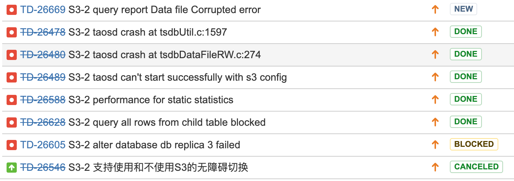

# [Test Report] TD-18808 多级存储使用S3 (二期)

## 一、测试背景

     一期的 S3 是基于放置到 S3 上的整个文件下载的实现方案，二期 S3 修改为通过文件中数据块的按需下载方案，相比一期，二期按需下载方案更省流量，速度更快

## 二、测试内容

|  | 分类 | 测试内容 | 预期 | 结果 | 报告问题 |
| --- | --- | --- | --- | --- | --- |
|  | 功能测试 |  |  |  |  |
|  |  | 1 配置项测试 s3EndPoint s3AccessKey s3BucketName | 正确配置后可以按配置的 S3 服 务器上存放多级存储中最后两级数据到指定的 Bucket 中 | 功能正常，符合预期 |  |
|  |  | 2 数据写入及迁移 | 数据写入后随多级存储的迁移规则自动最后两级中的 DATA 数据文件到 S3 指定的 BUCKET NAME 中 | 功能正常，符合预期 |  |
|  |  | 3 数据查询 | 查询最后两级中的数据，从 S3 服务器下载数据块并能显示查询结果，本地最后两级存储中无 DATA 文件出现 | 功能正常，符合预期 |  |
|  |  | 4 删除指定范围数据 | 删除已经在 S3 上的一段时间内的所有数据，查询此段时间内应该数据为0 | 功能正常，符合预期 |  |
|  |  | 5 删除数据库 | S3 上对应此数据库的文件都被删除 | 功能正常，符合预期 |  |
|  |  | 6 缓存功能测试 | 相同查询，第一次运行会从S3 下载，第二次有缓存会比第一次快很多 | 符合预期，做了一个带普通列WHERE 过滤的查询，第一次查询 398秒，第二次及三次查询15 秒，说明缓存功能生效 |  |
|  |  | 7 数据库维护指令的支持 | Flush database Compact database Alter database 都能支持 |  |  |
|  |  | 8 数据库副本变更 | 能够1变3 ， 3 变 1 | 1 变 3 过程中发生问题 | TD-26605 |
|  |  | 9 把S3 配置文件中的参数配置错 | 无法使用 S3 模式，仍然还是原来的本地工作模式 |  |  |
|  | 正确性测试 | 1 写入指定数量的数据 | 数据被迁移到S3 一部分后，验证写入数据条数没有丢失 | 符合预期 |  |
|  |  |  |  |  |  |
|  | 性能测试 | 1 对超级表进行全表 max min count 统计 | 不需要访问S3 服务器，能够在秒级内返回 | 不符合预期，都在 30 多秒才返回 | TD-26588 |
|  |  |  |  |  |  |
|  |  |  |  |  |  |
|  | 并发压力测试 | 相同一个查询多个并发 | 验证多个查询获取相同数据块财并不冲突，可以正常返回结果 |  | TD-26478 TD-26480 |
|  |  | 多个写入+ 多个查询迸发 | 验证写入及迁移都能正常工作 查询也能返回正确结果 | 符合预期 |  |
|  | 正常场景组全测试 | 1写入及迁移过程增加操作 flush database compact database | 这些操作可以正常执行，对写入及数据迁移至 S3 无影响 | 符合预期 |  |
|  |  | 2 修改表的 SCHEMA 信息 | 能够正常按要求修改 | 符合预期 |  |
|  |  |  |  |  |  |
|  | 异常场景测试 | 1 taos.cfg 中使用 S3 被多次打开一段时间又关闭一段时间，或有意或无意 | 预期是这种情况目前程序是无法处理的, 程序会执行不正常。 原来使用文件下载的方式这种方式是可以支持的，使用BLOCK 方式无法支持，后续可以考虑使用文件结合 BLOCK 的方式，即可支持，如最常见的用户一开始没有使用S3, 后来要使用S3了，使用一段时间又不想使用了，是一种常见的使用场景。 | 不支持，需要后续优化 |  |
|  |  | 2 磁盘写满后 | 预期是TAOSD 报磁盘满错误，等待清出空间或主动报错退出 | 符合预期 报磁盘满错误等待清出空间，清理出空间后又能正常工作 |  |
|  |  | 3 写入过程中 TAOSD 异常退出 | 重新启动后可以正常工作，数据不丢失 | 符合预期 |  |
|  | 集群测试 | 1 单节点单副本测试 | 1 台机器单副本测试 S3 基本功能正常 | 符合预期 |  |
|  |  | 2 三节点集群配置只配置一个在 S3 上，其它两个在本地 | 在 S3 及本地存储工作都正常 | 符合预期 |  |
|  |  | 3 建立多副本数据库，写入数据 | 各副本中 data 文件都可以正确下传至S3 服务器保存，查询数据正常。 | 符合预期 |  |
|  |  | 4 单副本状态切换成多副本 | 尝试性测试，无预期 | 结果报错，无法正常从单副本切换成多副本 |  |

性能测试报告见：
    [S3-2 性能测试报告(腾讯云) ](https://taosdata.feishu.cn/wiki/XoE4wRAEWicJKJkIzFRciGWsnOf) 

## 三、测试结果

      功能测试完成，发现的问题除了一个 DATA 文件损坏（TD-26669）无法再复现的问题及暂不能支持修改副本数(TD-26605)的问题外，其它发现的问题都已修复，整体测试结果为通过，功能设计符合预期。

