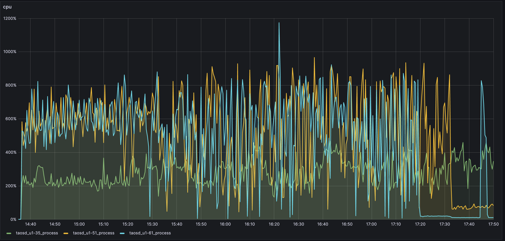
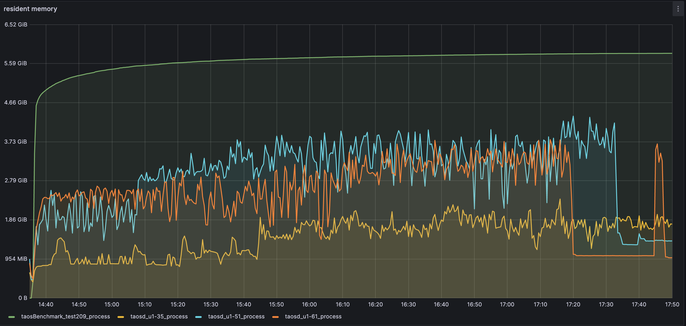
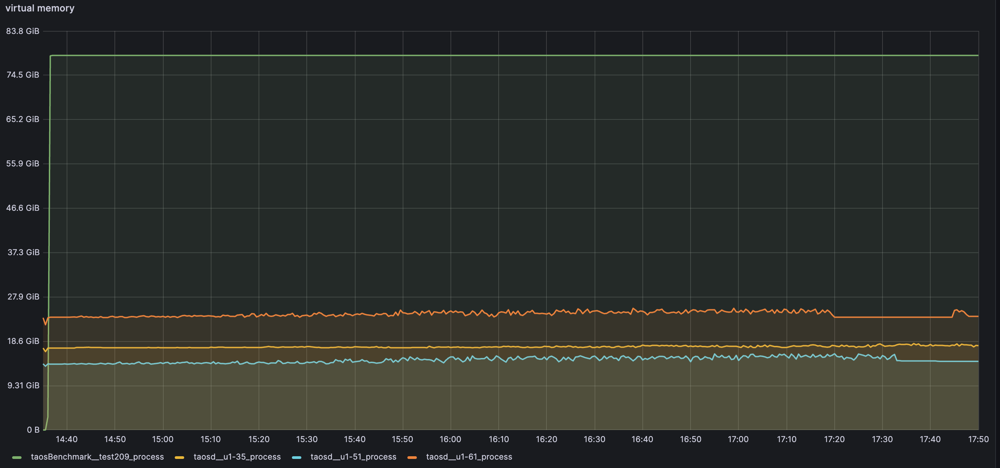
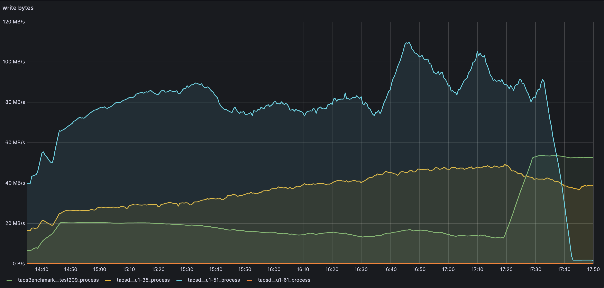

# [Test Report] TD-26156 宽表性能测试

### 1. 概述： {folded="true"}

在车联网的主机厂场景中，原始数据具有如下共性：
- 数据列的数目通常超过 1000 ，最大可达到 8000 
- 数据列的采集频率通常不同
- 数据列的数目不断变化（主要是新增列）
目前的方案是按照数据写入的不同频率创建超极表，不同子表之间采用 JOIN 查询。方案复杂度高和运行效率低。为了验证column family特性研发的必要性，找出产品在不同数据采集频率以及不同数据建模方式的情况下，产品性能表现，以决策是否进行column family的研发。

### 2. 测试环境：

按照单车2万数据，1万台车计算
估算原始数据的产生速度，单位为点每秒
- 每辆车每个列组的产生速度 = 1+1+1+1+1+0.1+0.1+0.01+0.01+0.01 = 5.23 点/秒
- 每辆车每条记录的产生速度 = 5.23 * 100 * (1 + 1/30 + 1/900 + 1/7200) = 541.087 点/秒
- 1 万辆车产生速度=  541.087  * 1 0000 =  5,410,870  点/秒（ 541 万点/秒)
在不统计 timestamp 列情况下，对所需磁盘空间进行估算
- 每辆车每个列组占用磁盘 = 8+8+4+8+8+0.4+0.2+0.04+0.01+0.04 = 36.69 bytes
- 每辆车每条记录占用磁盘 = 36.69 * 100 * (1 + 1/30 + 1/900 + 1/7200) = 3795.88625 bytes
- 每辆车占用磁盘 = 3795.88625 * 2万 = 75917725 bytes
- 1 万辆车占用磁盘 =  75917725 bytes * 1 万 =  759177250000 bytes （0.69 TB), 按照10%压缩比估算，约69GB 磁盘空间
测试环境磁盘空间不低于100GB（考虑日志大小）
192.168.1.61：
CPU: Intel(R) Xeon(R) CPU E5-2650 v3 @ 2.30GHz （2）40核
Mem：DDR4 16GB * 16
Disk:  893GB
192.168.1.35：
CPU: Intel(R) Xeon(R) CPU E5-2630 v2 @ 2.60GHz （2）24核
Mem: DDR3  32 GB * 2
Disk: 2792GB
192.168.1.51:
    CPU: Intel(R) Xeon(R) CPU E5-2650 v3 @ 2.30GHz （2）10核
    Mem: DDR4  16 GB * 16
    Disk: 893GB
      192.168.0.209(客户端):
      CPU: Intel(R) Xeon(R) Gold 6230R CPU @ 2.10GHz  （2）26核
       Mem: 503 GB
       Disk: 16TB(可用7.4TB)

### 3. 测试方案：

第一方案： 根据需求描述，此次测试主要分为如下六个场景： {folded="true"}

| 场景序号 | 超级表数目 | 超级表列数 | 备注 |
| --- | --- | --- | --- |
| 场景一 | 1 个 | 4000 列 | 大宽表模型 |
| 场景二 | 4 个 | 1000 列 | 不同间隔的数据列，各创建一个数据表 |
| 场景三 | 16 个 | 250 列 | 为了测试性能 |
| 场景四 | 80 个 | 50 列 | 为了测试性能 |
| 场景五 | 400 个 | 10 列 | 为每个列组创建一个超级表 |
| 场景六 | 4000 个 | 1 列 | 单列模型 (测试时也可按数据类型建超级表，每辆车总计4000子表) |

需要对以上6个场景的写入性能（写入点/秒）、查询性能（查询时间维度）以及CPU， 内存，磁盘，网络的实时消耗进行监测，给出详细数据。
数据写入：
1. 数据写入以Interlace 模式， native连接方式，指定列写入方式
2. 不涉及数据更新和数据乱序写入
3. 数据写入过程中需要打开数据缓存（Last）
4. 数据写入需要以频率划分写入不同超级表下的子表或子表的某些列
5. 不同列数据的随机程度不同，一共三种：每条记录随机变化；在一定的值范围内，每 10 条记录变化一次或每 10 条记录有一个非空值；在一定的值范围内，每 100 条记录一个非空值
目前，taosBenchmark的“insert_interval”可以实现按频率写入数据到不同子表，但还有如下需求需要实现：
- 目前taosBenchmark对多超级表并行写入不支持
- 建表及数据按指定列写入不支持
- 按写入频率写入指定列不支持
- 写入数据列的值需要支持规则定制，不仅是范围内的随机值
综合以上写入需求，考虑通过脚本生成写入数据到csv文件，taosBenchmark通过csv文件的方式写入，同时需要根据写入要求调整taosBenchmark进程数，线程数、子表范围以及拆分数据文件
数据查询：
需求中的四类查询，可通过python脚本通过线程实现，记录每一次查询的时间，最终输出平均查询时间及查询时间的曲线图
资源监控：
通过性能监控脚本对taosd占用的CPU， 内存，磁盘及网络消耗进行实时监控并输出实时曲线图
数据统计：
需要对不同测试场景下的数据写入速度，vnode文件夹的磁盘消耗进行记录
写入速度= 写入总点数（去除第一个时间戳列，去除空值）/ 写入总时长（单位：秒）
第二方案： {folded="true"}
与guan讨论后，采用通过explorer创建kafka数据源，通过程序模拟随时间频率变化的数据，将数据写入kafka，由taosX消费数据将数据写入TDengine的方式。

### 4. 测试计划及用例：

|  | 测试配置项 | 写入速度 | vnode磁盘消耗 | CPU均值 | Mem均值 | Network均值 | 备注 |
| --- | --- | --- | --- | --- | --- | --- | --- |
| 场景一 | 超级表：1 超级表列数：4000 （测试开始时间：2023-9-20 14:35 - 17:50） 写入行数：1779942（磁盘满） 每辆车每条记录： 320000 bytes（320K） | 608527p/s | 51: 296GB 61: 303GB 35: 127GB |  | 物理内存：  虚拟内存：  |  | 大宽表模型 通过taosBenchmark创建1个超级表，包含4000列；1000子表，每个子表写入2W数据；4000列数据均采用随机值，interlace模式写入 启动3个taosBenchmark进程，第一个进程负责建库建表，同时向1000个子表写入10000数据；第二个进程向1-500子表写入10000数据；第三个进程向501-1000写入10000数据 |
| 场景二 | 超级表：4 超级表列数：1000 |  |  |  |  |  | 不同间隔的数据列，各创建一个超级表 启动4个taosBenchmark进程，每个taosBenchmark创建1个超级表，包含1000列；1000子表，每个子表写入2W数据；4000列数据均采用随机值，interlace模式写入，taosBenchmark中的时间间隔参数需根据需求进行调整 |
| 场景三 | 超级表：16 超级表列数：250 |  |  |  |  |  | 为了测试性能, 优先级低 |
| 场景四 | 超级表：80 超级表列数：50 |  |  |  |  |  | 为了测试性能，优先级低 |
| 场景五 | 超级表：400 超级表列数：10 |  |  |  |  |  | 为每个列组创建一个超级表 |
| 场景六 | 超级表：4000 超级表列数：1 |  |  |  |  |  | 单列模型 (测试时也可按数据类型建超级表，每辆车总计4000子表) |

### 5. 总结：

通过第二种方案测试发现，1个4000列的超级表，10个子表，每个子表写2000行数据([TD-26849](https://jira.taosdata.com:18080/browse/TD-26849) 待jira解决后，继续测试)
1. kafka数据源一个partition，程序耗时5分钟写数据到kafka，单行数据大小约为146KB（包含时间戳及标签值），总数据大小为2.78GB
2. 去除时间戳及标签，总点数为4000 * 20000 = 80000000；根据数据采集间隔（[[测试需求] 大宽表性能](https://taosdata.feishu.cn/wiki/PwVKwri0ri3Snxkvb0ycRf5un0g) ），有效点数为：2 * 3000 + 66 * 2000  +（2000 - 66 - 2）* 1000 = 2070000
3. 3.5小时，超级表中数据行数为751，数据写入速度约为3.58 行/分
