# Arbitrator 性能消耗测试报告

## 1. Arbitrator 逻辑

在 syncNode 逻辑中，Arbitrator Vnode 接收 leader 推送但不写入 wal 及 tsdb

## 2. 测试目标

测试 Arbitrator 节点 cpu 性能消耗，期望对比 Follower 节点下降一个数量级

## 3. 测试方式

在该节点上启动3个Dnode，将 Dnode 3设置为 Arbitrator 身份。
创建 2 replica witharbitrator 的 db。
使用 taosBenchMark 创建 500 张表，并保持20线程持续 insert 数据

使用以下命令分别收集 Follower 所在 dnode 及 Arbitrator 所在 dnode 的 cpu info：
```bash
 nohup perf record -e cpu-clock --call-graph dwarf -g ${TAOSD} -c /etc/taos/dnode2/ > /dev/null 2>&1 &
```

使用以下命令产生火焰图：
```bash
 perf script -i /root/test/arbitrator/perf.data | ./FlameGraph/stackcollapse-perf.pl | ./FlameGraph/flamegraph.pl > process.svg
```

## 4. 本地虚机测试 {folded="true"}

在本地开发环境上进行 单 vgroup 测试

| 名称 | 参数 |
| --- | --- |
| 操作系统 | Debian 10.2.1-6 |
| cpu | 13th Gen Intel(R) Core(TM) i5-13500H，8 core |
| 内存 | 8G |
| 硬盘 | 100G |

### 4.1 结果分析

cpu 整体使用率约为 70%
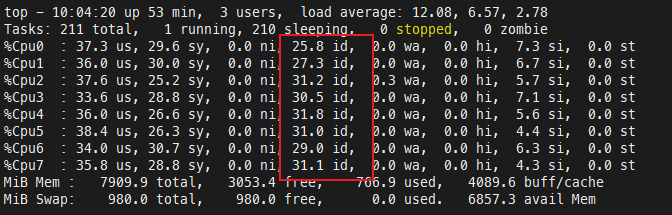

#### 4.1.1 cpu整体占比

Arbitrator (Dnode3) cpu 占用率 约为 一般 Follower(Dnode2) 的 **80%**
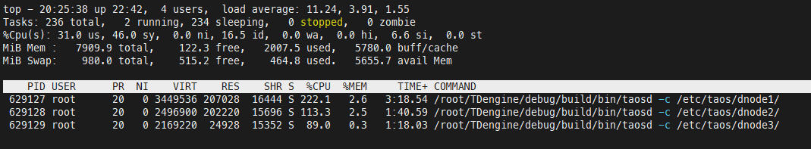

#### 4.1.2 火焰图分析

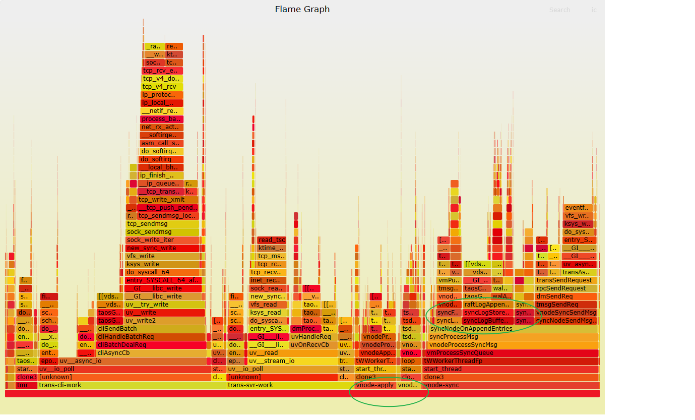

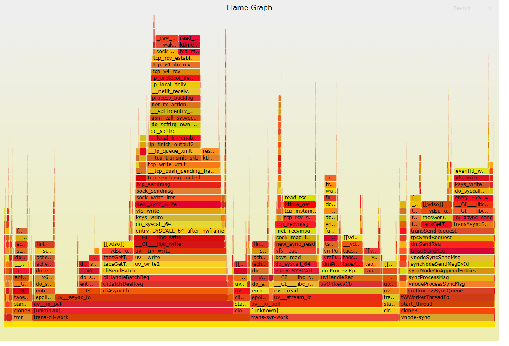

1. Follower 中以下两种线程 cpu 消耗占比之和已经超过 50%，trans-cli-work: 31.75%，trans-srv-work：21.53%。**即网络收发过程占比超过50%，仅调整 sync 流程无法将 cpu 消耗降低至 10%**
2. Arbitrator 不执行的流程 由 “Follower” 图中两个绿圈标注，二者 cpu 占比之和约为 20%，与 cpu 整体占比数据吻合

### 4.2 测试数据

<view type="1">

  > ⚠ 嵌入文件，需在飞书中查看 (token: RpIob5XI9o3DjlxM4UOcC6upnlb)

</view>

<view type="1">

  > ⚠ 嵌入文件，需在飞书中查看 (token: LybQbQDTNoQLcAxSAibcCY80nJf)

</view>

## 5. 服务器测试1

在服务器上进行 多 vgroup 测试

| 名称 | 参数 |
| --- | --- |
| 操作系统 | Ubuntu 9.3.0-17ubuntu1~20.04 |
| cpu | Intel(R) Xeon(R) CPU E5-2620 v3 @ 2.40GHz，24core |
| 内存 | 64G |
| 硬盘 | 400G |


| vgroup 数 | Arbitrator 相对一般节点cpu占比 |
| --- | --- |
| 1 | 33% |
| 2 | 28% |
| 4 | 30% |
| 8 | 36.8% |
| 16 | 41.5% |

### 5.1 结果分析

随 vgroup 数量增长，Arbitrator cpu 消耗相对一般节点占比逐渐增长

### 5.2 测试数据 {folded="true"}

#### 1 vgroup

Arbitrator 相较 Follower cpu 占用约 1/3 至 1/2
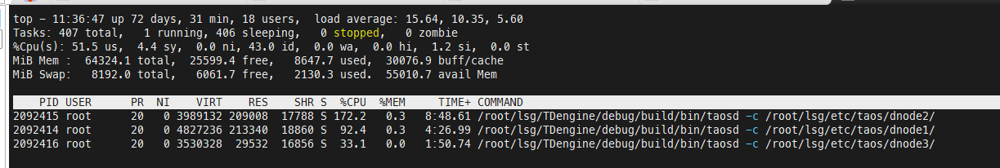

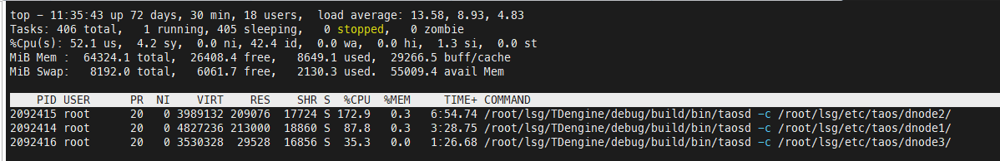

#### 2 vgroup

Dnode 1 与 Dnode 2 上都拥有 1个 Leader 与 Follower
Arbitrator 相较 一般Dnode 占比约 28%
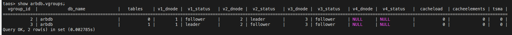

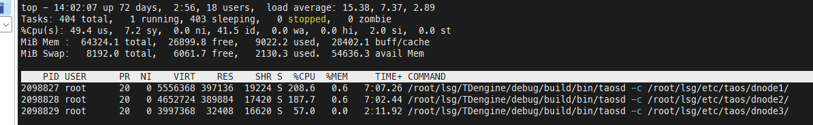

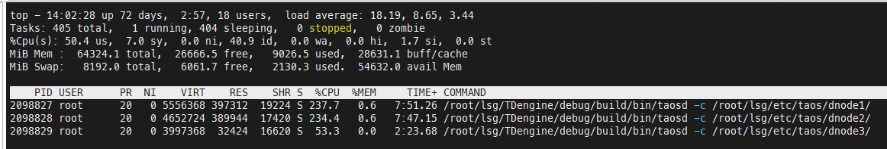

#### 4 vgroup

Dnode 1 与 Dnode 2 上都拥有 2个 Leader 与 Follower
Arbitrator 相较 一般Dnode 占比约 30%
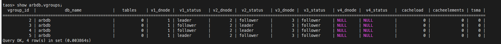

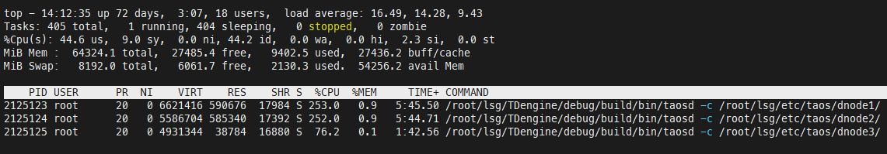

#### 8 vgroup

Dnode 1 与 Dnode 2 上都拥有 4个 Leader 与 Follower
Arbitrator 相较 一般Dnode 占比约 36.8%
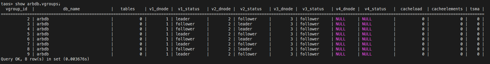

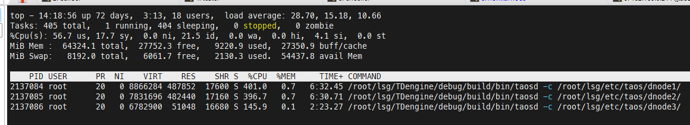

#### 16 vgroup

Dnode 1 与 Dnode 2 上都拥有 8个 Leader 与 Follower
Arbitrator 相较 一般Dnode 占比约 41.5%
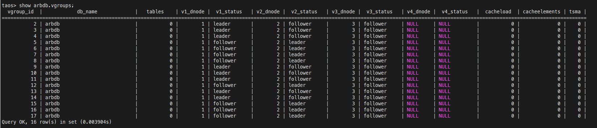

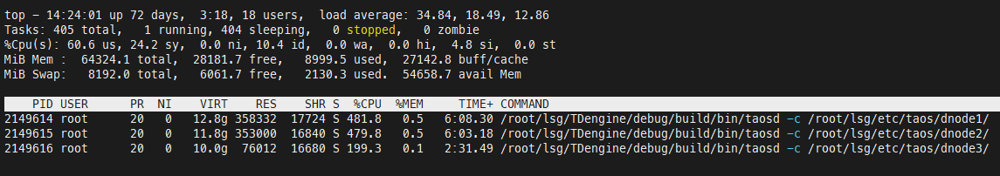

## 6. 优化测试

减少 leader 节点向 arbitrator 节点发送数据量，不再发送 logEntry 内容，再次测试。
整体占比基本不变。

### 6.1 测试数据 

<view type="1">

  > ⚠ 嵌入文件，需在飞书中查看 (token: Gq8dbWFC2oPUAfxoC6xc8yWunwg)

</view>

## 7. 服务器测试2

| 名称 | 参数 |
| --- | --- |
| 操作系统 | Ubuntu 9.4.0-1ubuntu1~20.04.2 |
| cpu | Intel(R) Xeon(R) CPU E5-2650 v3 @ 2.30GHz，40cores |
| 内存 | 250G |
| 硬盘 | 400G |

### 7.1 Insert only

三台同配置节点组成 cluster，vgroup 1，childtable_count 500，insert_rows 1000000，num_of_records_per_req 100
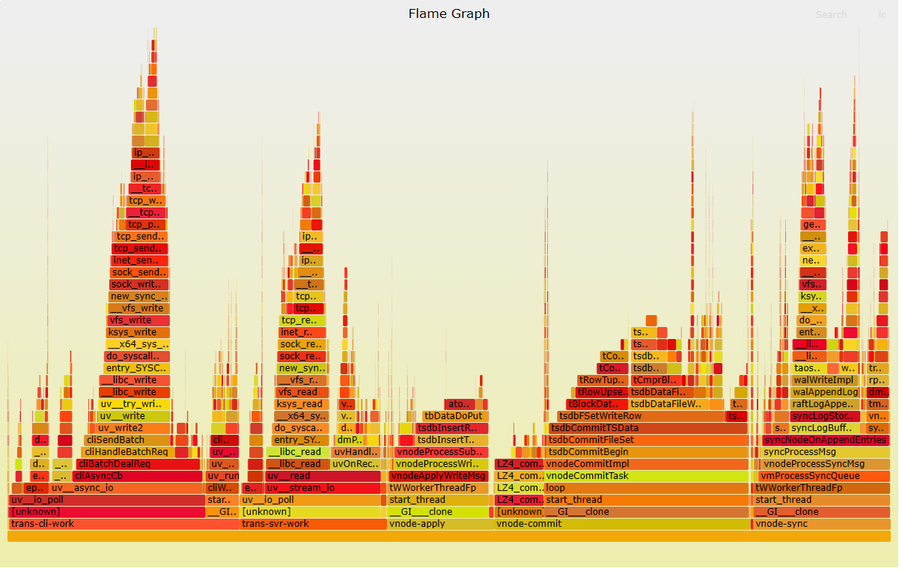

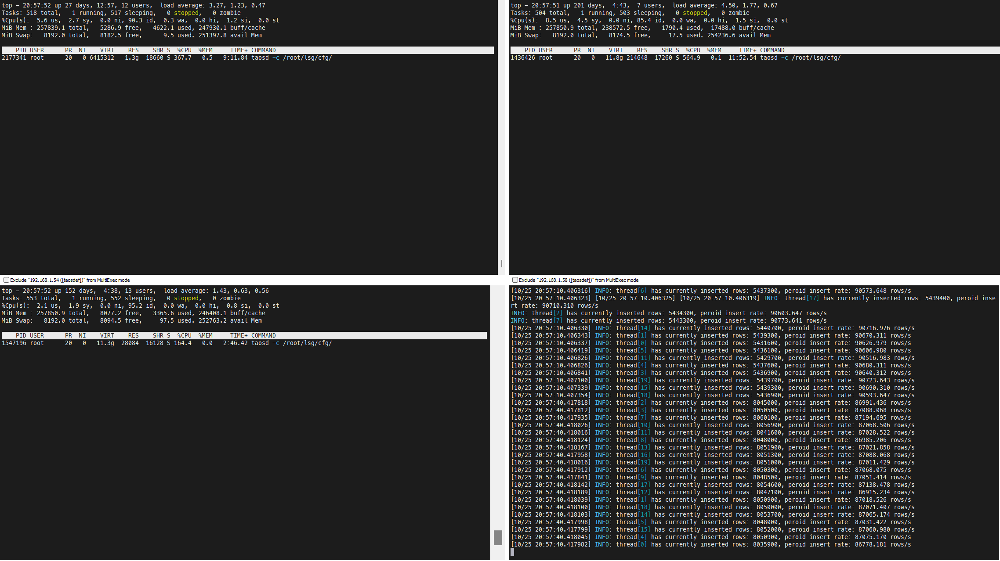

**cpu使用占比：arbitrator 占 follower 约 44.7%****，占 leader 的比例约为 29%。即纯写入场景下如果 leader 的负载是 1，则 follower 约为 0.7，而 arbitrator 约为 0.3**

### 7.2 Query only

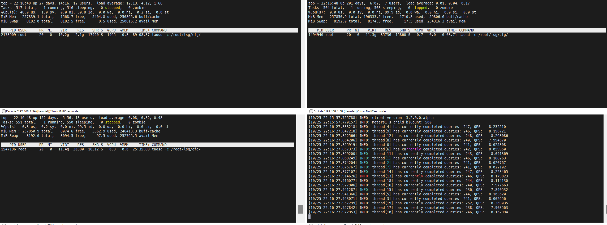

**arbitrator 与 follower 基本无负载****。Query 场景下假定 Leader 负载为1，则 follower 和 arbitrator 的负载为0 。**

### 7.3 测试数据 {folded="true"}

```json
{
    "filetype": "insert",
    "cfgdir": "/etc/taos/dnode1/cfg",
    "host": "localhost",
    "port": 6030,
    "user": "root",
    "password": "taosdata",
    "connection_pool_size": 8,
    "thread_count": 20,
    "create_table_thread_count": 7,
    "result_file": "./insert_res.txt",
    "confirm_parameter_prompt": "no",
    "insert_interval": 0,
    "interlace_rows": 100,
    "num_of_records_per_req": 100,
    "prepared_rand": 10000,
    "chinese": "no",
    "databases": [
        {
            "dbinfo": {
                "name": "arbdb",
                "drop": "no",
                "replica": 1,
                "precision": "ms",
                "duration": "1h",
                "keep": "1d,2d,10d",
                "minRows": 100,
                "maxRows": 4096,
                "vgroups": 1,
                "comp": 2
            },
            "super_tables": [
                {
                    "name": "meters1",
                    "child_table_exists": "no",
                    "childtable_count": 500,
                    "childtable_prefix": "dins",
                    "escape_character": "yes",
                    "auto_create_table": "no",
                    "batch_create_tbl_num": 100,
                    "data_source": "rand",
                    "insert_mode": "taosc",
                    "non_stop_mode": "no",
                    "line_protocol": "line",
                    "insert_rows": 100000,
                    "childtable_limit": 1000,
                    "childtable_offset": 0,
                    "interlace_rows": 0,
                    "insert_interval": 0,
                    "partial_col_num": 0,
                    "disorder_ratio": 0,
                    "disorder_range": 0,
                    "timestamp_step": 1000,
                    "start_timestamp": "now",
                    "sample_format": "csv",
                    "sample_file": "./sample.csv",
                    "use_sample_ts": "no",
                    "tags_file": "",
                    "columns": [
                        {
                            "type": "FLOAT",
                            "name": "current",
                            "count": 1,
                            "max": 12,
                            "min": 8
                        },
                        { "type": "INT", "name": "voltage", "max": 225, "min": 215 },
                        { "type": "FLOAT", "name": "phase", "max": 1, "min": 0 }
                    ],
                    "tags": [
                        {
                            "type": "TINYINT",
                            "name": "groupid",
                            "max": 10,
                            "min": 1
                        },
                        {
                            "name": "location",
                            "type": "BINARY",
                            "len": 16,
                            "values": ["San Francisco", "Los Angles", "San Diego",
                                "San Jose", "Palo Alto", "Campbell", "Mountain View",
                                "Sunnyvale", "Santa Clara", "Cupertino"]
                        }
                    ]
                }
            ]
        }
    ]
}

```

<view type="1">

  > ⚠ 嵌入文件，需在飞书中查看 (token: L7cMbnOFkofbWZx6BYDcZx2unto)

</view>

## 8. 结论

以最后一组测试的结果为基础来进行估算。假定有 2N 个 vgroup，在 dnode1 和 dnode2 上各 N 个 leader 和 N 个 follower，在 dnode 3 上有 2N 个 arbitrator。
**纯写入场景：**
dnode1: N*1+N*0.7 = 1.7N
dnode2: 同 dnode1
dnode3: 2N*0.3 = 0.6N （约为 dnode1 的 35%)
**纯查询场景****：**
dnode1: N*1+N*0 = N
dnode2: 同 dnode1
dnode3: 0 （为 dnode1 的 0%）
**写入和查询各半****：**
dnode1: (1.7N+N)/2=1.35N
dnode2: 同 dnode1
dnode3: (0.6N+0)/2=0.3N （为 dnode1 的 22%）

从上面的两种极端负载和一种均衡负载来看：arbitrator dnode 的负载占另外两个正常 dnode 的负载占比在 0% 到 35% 之间，一般情况下约 20% 到 25%，查询负载占比越高这个比例越低。

在现实的部署环境中，假定生产环境中允许的 CPU  上限是 60%，在纯写入场景下 arbitrator 的 CPU 占用是正常节点的 60%*35%=21%。
