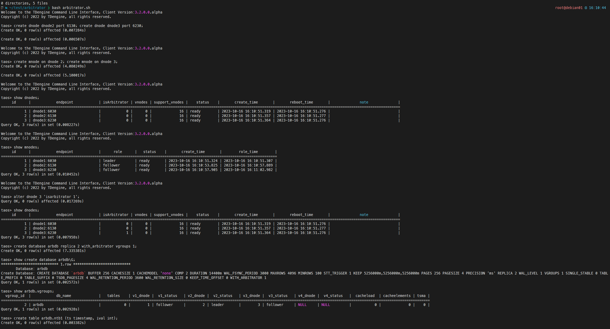
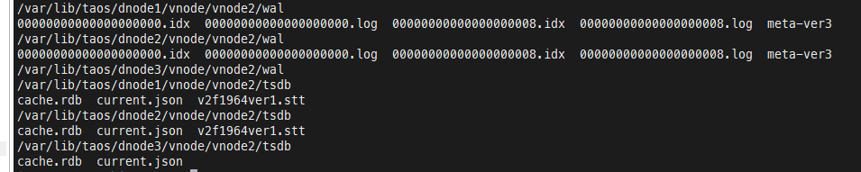

# [deprecated]Arbitrator 管理命令

## 1. 任务链接

TD-26409

[Arbitrator 双副本用户手册 - 飞书云文档 (](https://taosdata.feishu.cn/wiki/KDUsw1VyuiqALxkFJyqcg2D5nkf)[feishu.cn](https://taosdata.feishu.cn/wiki/KDUsw1VyuiqALxkFJyqcg2D5nkf)[)](https://taosdata.feishu.cn/wiki/KDUsw1VyuiqALxkFJyqcg2D5nkf)
[⁢⁢⁤⁢⁣⁡⁢⁤⁡⁣⁣⁤⁡⁣⁤⁡基于 Arbitrator 的双副本方案 - 飞书云文档 (](https://taosdata.feishu.cn/wiki/wikcnP61NoQJMbmpJlWIowcDIye)[feishu.cn](https://taosdata.feishu.cn/wiki/wikcnP61NoQJMbmpJlWIowcDIye)[)](https://taosdata.feishu.cn/wiki/wikcnP61NoQJMbmpJlWIowcDIye)

## 2. 语法

```c
//设置 Dnode 2 身份为 Arbitrator
ALTER DNODE 2 "isArbitrator 1";

//创建2副本的数据库，从 isArbitrator Dnodes 中选出 Arbitrator 
CREATE DATABASE power REPLICA 2 WITH_ARBITRATOR;

//将数据库改为2副本，从 isArbitrator Dnodes 中选出 Arbitrator 
ALTER DATABASE power REPLICA 2 ARBITRATOR 1;
```

## 3. 实现

1. isArbitrator 是 Dnode 的属性
   - 该属性理论上**可变更**，变更不对已有对象（Database、Arbitrator Vnode）产生影响
该属性不应作为当前 Dnode 是否拥有 Arbitrator Vnode 的依据
   - 带有 isArbitrator 的 Dnode 节点，**仅可以创建 Arbitrator Vnode**
1. WITH_ARBITRATOR 是 Db 的属性
   - 创建~~/变更~~ 数据库操作，当 WITH_ARBITRATOR 时，从 isArbitrator Dnodes 中选出 1个 Dnode 节点承载 Arbitrator Vnode
   - REPLICA 2 与 WITH_ARBITRATOR **必须同时出现**，作为需求 isArbitrator Dnode 的提示
2. hasArbitrator 是 Vgroup 的属性
   - 标识该 Vgroup 中 有一个 Arbitrator Vnode
3. 在一阶段，Arbitrator Vnode 在 raft 中仍为 **follower **身份

## 4. 示例





## 5. 一阶段

### 5.1 实现目标

- ~~提供可配置的选举时间~~：已存在

| 名称 | 单位 | 默认值 |
| --- | --- | --- |
| syncElectInterval | ms | 25*1000 |

- 可将 arbitrator 设置至 db/dnode/vnode/raft 中，并写入相关配置文件
- 无故障场景可正常读写，arbitrator 副本不写入数据
- 可最多故障 1 副本，故障后仍可正常读写。
- 连续故障不保证数据完整性，可预期的数据丢失

### 5.2 测试计划

1. 选举时间测试
2. 正常读写测试
   - alter dnode 3 isarbitrator 1
   - create db replica 2 arbitrator 1
      - 检查 vnode.json、raft_config.json 中是否正确写入
   - 使用 taosBenchmark 进行常规读写操作
      - 检查 dnode3 vnode 中不应写入 wal/tsdb
3. 随机 kill dnode 测试
   - kill leader
      - alter dnode 3 isarbitrator 1
      - create db replica 2 arbitrator 1
         - kill leader
            - 检查是否可以正确切换
            - 是否仍可读写数据
   - kill follower
      - alter dnode 3 isarbitrator 1
      - create db replica 2 arbitrator 1
         - kill follower
            - 检查是否可以正确切换
            - 是否仍可读写数据
   - kill arbitrator
      - alter dnode 3 isarbitrator 1
      - create db replica 2 arbitrator 1
         - kill arbitrator
            - 是否仍可读写数据
4. 观测数据丢失
   - alter dnode 3 isarbitrator 1
   - create db replica 2 arbitrator 1
      - kill follower 并写入新数据
      - kill leader & start old follower，并写入新数据
      - 观测 old leader rollback
5. 性能消耗测试：[Raft-Arbitrator 性能消耗测试](https://taosdata.feishu.cn/wiki/XfP8wkbEfiQsxSkF2TmcNTEqn7d) 
   - 对比测试 arbitrator 节点性能消耗

## 6. 兼容性考量

消息及数据结构上应兼容之前版本，可滚动升级
升级后可降级

## 7. 附注

代码在独立分支，未合入主线
