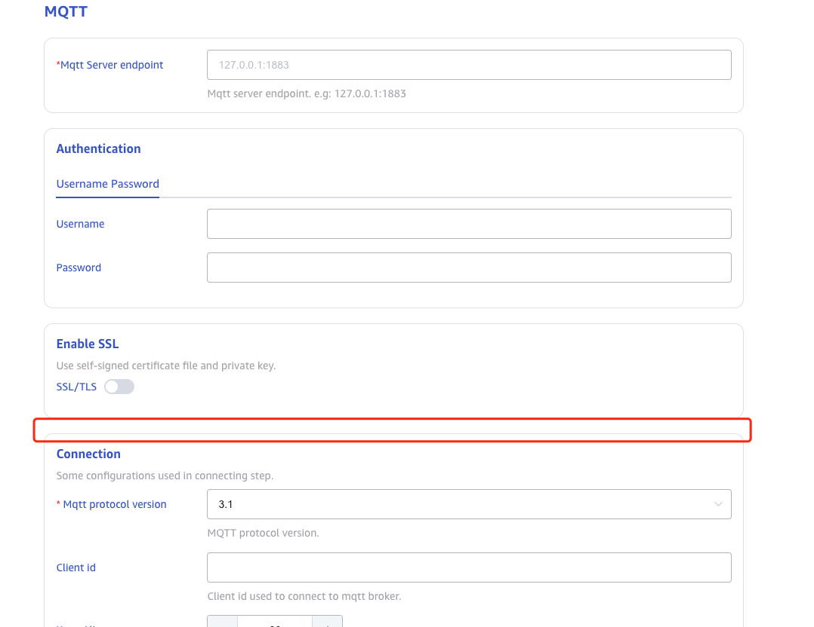
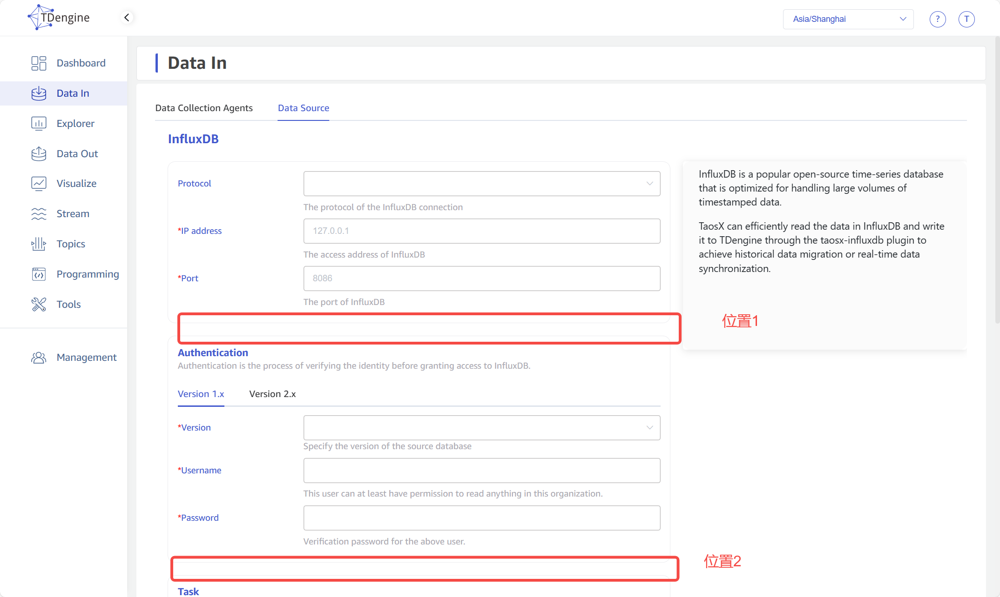

# 数据源连通性及版本检查

## 1. 范围

用户在 taos-Exploer 的“创建数据源”页面，填写数据源的连接信息和任务配置等，点击 submit 后，taosx 检查数据源的连通性和版本信息。
1. 配置参数可以连通数据源且版本符合要求，继续执行“创建数据源”操作；
2. 配置参数可以连通数据源但版本不符合要求，返回异常信息，在页面通知用户。
3. 配置参数无法连通数据源，返回异常信息，在页面通知用户；

## 2. UI及用户操作

数据源的配置页面分为多个部分，包括：连接信息，collector任务配置，parser配置等。用户在填完连接信息后，可以提交连通性和版本信息检查。


请@顾香设计“添加数据源”的页面布局，连通性检查按钮 设计“添加数据源”的页面布局，连通性检查按钮
用户操作：
1. 用户填写数据源参数，点击`连通性检查`按钮；
2. 后台调用数据源的接口，检查连通性；
3. 如果接口返回“连通成功”，继续执行“创建data source”的逻辑；
```shell {wrap}
数据源可用，您可以迁移您的数据到 TDengine 数据库。

Your data source is availabe, you can proceed to transfer your data to TDengine.
```

1. 如果接口返回“连通成功，有版本信息，且支持当前版本”，继续执行“创建data source”的逻辑；
```shell {wrap}
数据源可用，版本是 xxxx，当前系统支持此版本，您可以迁移您的数据到 TDengine 数据库。

Your data source is availabe, its version is xxxx, which is supported, you can proceed to transfer your data to TDengine.
```

1. 如果接口返回“连通成功，有版本信息，但不支持当前版本”，则“创建data source”失败，提示以下信息：
```bash {wrap}
数据源可用，版本是 xxxx，当前系统不支持此版本，对于给您带来的不便，我们深表歉意，请联系 TDengine 团队，我们将在未来为您的数据源版本添加支持。

Your data source is available, its version is yyyy, which is not supported for now. We are sorry for your inconvenience, please contact TDengine team, we will add the support for your data source version in future.
```

1. 如果接口返回“连通性失败”，则“创建 data source”失败，提示以下信息：
```plaintext
数据源不可用，请检查您的配置，确保所有内容都正确输入，并且您的网络正常。错误原因：XXX

Your data source is not reachable, please check your configuration, make sure every
thing is correctly input and your network is fine. Error message: XXX

```


## 3. 接口

### 3.1 taosX -> dataSource: 调用`is_valid`方法

对于taosx-core中使用Rust开发的数据源，taosX可以通过调用`is_valid`方法检查数据源的连通性和版本信息。接口如下：
```rust
/// 检查数据源的连通性，如果可以，同时返回version
/// dsn: 数据源的dsn
pub fn is_valid(dsn: &Dsn) -> DataSourceValidation;
```

DataSourceValidation结构如下：
```rust
#[derive(Debug, Serialize, Deserialize)]
pub struct DataSourceValidation {
    pub valid: bool,    // 数据源的可用性
    pub support: bool,    // taosX是否支持该数据源版本
    pub data_source: String,    // 数据源的名称
    #[serde(skip_serializing_if = "Option::is_none")]
    pub version: Option<String>,    // 数据源版本
    #[serde(skip_serializing_if = "Option::is_none")]
    pub message: Option<String>,    // 错误信息
}
```


### 3.2 taosX -> dataSource: 调用dataSource的命令

对于不在taosx-core中的数据源，taosX通过调用connector提供的命令，检查数据源连通性和版本信息。例如：
```json
taosx-mqtt --check -c /tmp/.tmp1iLN0O
```

connector命令在stdout输出JSON格式的消息。

### 3.3 各dataSource的接口形式

| **序号** | **数据源** | **支持连通性检查** | **返回版本信息** | **接口或命令** |
| --- | --- | --- | --- | --- |
| 1 | CSV | 否 | 否 |  |
| 2 | Clickhouse | 是 | 是 | 调用`is_vailable`接口 |
| 3 | Historian | 是 | 否 | 调用`is_vailable`接口 |
| 4 | Influxdb | 是 | 是 | if &influx_version == 1.x `java -jar $PLUGIN_HOME/influxdb/taosx-influxdb.jar -check &influx_version &influx_url &influx_username &influx_password` if &influx_version == 2.x `java -jar $PLUGIN_HOME/influxdb/taosx-influxdb.jar -check &influx_version &influx_url &influx_token` |
| 5 | Kafka | 是 | 否 | 调用`is_vailable`接口 |
| 6 | Mqtt | 是 | 否 | `taosx-mqtt -c $CONFIG_FILE --check ` |
| 7 | OPC DA | 是 | 否 | `taosx-opc check --conf=$CONFIG_FILE` |
| 8 | OPC UA | 是 | 否 | `taosx-opc check --conf=$CONFIG_FILE` |
| 9 | OpenTSDB | 是 | 是 | `java -jar $PLUGIN_HOME/opentsdb/taosx-opentsdb.jar -check &opents_url` |
| 10 | PI | 是 | 是 | `taosx-pi -check $CONFIG_FILE` |
| 11 | PI backfill | 是 | 是 | `taosx-backfill -check $CONFIG_FILE` |
| 12 | Taos (TDengine2.0) | 是 | 是 | 调用`is_vailable`接口 |
| 13 | tmq（TDengine3.0） | 是 | 是 | 调用`is_vailable`接口 |


### 3.4 Explorer -> taosX: serve API

- Url: http://ip:port/ds/in/validate
- Method: POST
- Parameter:
```json
{
    "dsn": "tmq+ws://root:taosdata",
    "via": agent_id,
    "timeout": 5
}
```

- dsn：数据源的dsn
- via: agent ID
- timeout：调用ds/in/validate接口的超时时间，如果不传使用默认值5sec
- Example: 
```http
GET http://ip:port/ds/in/validate?dsn=kafka://192.168.1.92:9092&via=45&timeout=30
```

### 3.5 JSON格式的DataSourceValidation消息

taosX -> Explorer，或者，使用命令行检查连通性的 dataSource 的输出，都是JSON格式的消息，结构如下：
```json {wrap}
{
    "valid": false,        // 数据源是否可用
    "support": true/false,    // 数据源的版本是否被taosX支持
    "data_source": "clickhouse",    // 数据源的名称
    "version": "23.7.3.14",        // 数据源的版本
    "message": "connection timeout..."    // 数据源的valid为false时，message为错误信息；valid为true时，message不返回
}
```

response覆盖以下场景：
1. 连通成功，不包括版本信息：
```json
{
    "valid": true,
    "support": true,
    "data_source": "historian"
}
```

1. 连通成功，有版本信息，版本满足：
```json
{
    "valid": true,
    "support": true,
    "data_source": "clickhouse",
    "version": "23.7.3.14"
}
```

1. 连通成功，有版本信息，但版本不满足：
```json
{
    "valid": true,
    "support": false,
    "data_source": "clickhouse",
    "version": "23.7.3.14",
}
```

1. 连通失败
```json
{
    "valid": false,
    "support": false,
    "data_source": "clickhouse",
    "version": "23.7.3.14",
    "message": "connection timeout..."
}
```


## 4. 配置

和连通性检查相关的配置

| Data Source | 配置 | 是否确认 |
| --- | --- | --- |
| ~~csv~~ | ~~不做连通性检查~~ | ~~是~~ |
| clickhouse |  |  |
| historian | Options + Authentication | 是 |
| influxdb | Protocol + Options + Authentication | 是 |
| kafka source | Options + Authentication | 是 |
| Kafka sink | Options + Authentication，kafka-sink还没有写单独的yaml配置，考虑和kafka source共用一个配置文件 | 是 |
| mqtt | Options + Authentication + groups.SSL证书+groups.连接[version, client_id], groups.连接[version, client_id]需要调整到options | 是 |
| ~~opc~~ | ~~数据源已经选择了Protocol，~~~~DA~~~~/~~~~UA~~ | 是 |
| opc da | Options | 是 |
| opc ua | Options + Authentication | 是 |
| opentsdb | Protocol + Options | 是 |
| pi | Options + groups.PI系统设置.PISystemName，groups.PI系统设置.PISystemName应该调整到Options中 | 是 |
| Pi - bachfill | Options+ groups.PI系统设置.PISystemName，groups.PI系统设置.PISystemName应该调整到Options中 | 是 |
| taos | Protocol + Options + Authentication |  |
| tmq | Protocol + Options + Authentication |  |


## 5. ~~**Deprecated**~~

### 5.1 集成接口 {folded="true"}

### 5.2 explorer API

- Url: http://ip:port/x/api/ds/in/validate
- Method: post
- Request Param: 
```json
{
  "from": "influxdb:///"
}
```

-  Response Body:
```json
{
  "valid": bool, // 数据源是否可用
  "version": ?string, // 返回数据源版本，不能获得版本则不返回该字段。
  "since": ?string    // 如数据源不可用，则返回不可用的原因，否则，不返回该字段。
}
```

### 

taosX 调用内部方法
- 方法签名：`fn validate_source(dsn: Dsn) -> **ValidatedSource**`
- 参数参数：Dsn 格式
- 返回体与 JSON 格式定义一致。
该方法对不同 dsn 分别调用其 `validate_source_{driver}` 方法，检查数据源及输入参数的验证结果。如对于 kafka 数据源，提供 `validate_source_kafka` 方法。下面是各个连接器所对应的验证方法说明。
对于 opentsdb/opc/mqtt/influxdb/pi ，需要各个连接器开发者提供验证命令，如 `taosx-mqtt validate --config <file>`，由 taosx 开发对应的验证函数完成验证。

### 5.3 连接器方法/参数

#### 5.3.1 InfluxDB 连接器

InfluxDB 验证函数为 Rust 实现，无需调用 influxdb 连接器。
- 文件：taosx-core/src/plugins/runners/influxdb.rs
- 方法：validate_source_influxdb
- 传入参数：**Dsn**
  - addresses.host
  - addresses.port
  - Protocol
- 处理逻辑：根据传入参数拼接 influxdb 的请求地址并发送 http 请求，如果有正确响应则数据源可用，否则不可用，有正确响应时在响应的 header 中包含版本信息
- 返回结果：**ValidatedSource**
  - available: bool
  - version: Option<String>
  - since: Option<String> 
以下连接器输入参数和返回结果可不做说明，返回的结构体是一致的。

#### 5.3.2 OpenTSDB 连接器

- 文件：taosx-core/src/plugins/runners/opentsdb.rs
- 方法：validate_source_opentsdb
- 传入参数：**Dsn**
  - addresses.host
  - addresses.port
  - Protocol
- 处理逻辑：根据传入参数拼接 opentsdb 的请求地址并发送 http 请求，如果有正确响应则数据源可用，否则不可用，有正确响应时在响应的 body 中包含版本信息
- 返回结果：**ValidatedSource**
  - available: bool
  - version: Option<String>
  - since: Option<String> 

#### 5.3.3 OPC 连接器

- 方法：validate_source_opc
- 处理：请 @Peng 补充连接器验证数据源可用性命令，由 Rust 实现对应方法调用该命令，并返回正确的响应。

#### 5.3.4 Pi 连接器

- 方法：validate_source_pi
- 处理：请 @任新胜补充连接器验证数据源可用性命令，由 补充连接器验证数据源可用性命令，由 Rust 实现对应方法调用该命令，并返回正确的响应。

#### 5.3.5 Kafka Source连接器

- 方法：validate_source_kafka
- 处理：验证 Kafka consumer 可用性并返回验证结果。

#### 5.3.6 Kafka Sink 连接器

- 方法：validate_sink_kafka
- 处理：验证 Kafka producer 可用性并返回验证结果。

#### 5.3.7 MQTT 连接器

- 方法：validate_source_mqtt
- 处理：请 @谭雪峰补充连接器验证数据源可用性命令，由 补充连接器验证数据源可用性命令，由 Rust 实现对应方法调用该命令，并返回正确的响应。

#### 5.3.8 TDengine 3.0

- 方法：tmq_validate
- 参数：Dsn
- 处理：根据输入参数进行 TMQ 数据源参数及可用性检查

#### 5.3.9 TDengine 2.x

- 方法：legacy_validate
- 处理：根据输入参数验证旧版本 TDengine 数据源参数及可用性检查结果。
其他语言实现的连接器提供对应的检查命令后，请 @杨志宇进行统一处理并验证。 进行统一处理并验证。

### 5.4 ~~UI~~~~ 及用户操作~~

~~以 InfluxDB 数据源为例，添加数据源页面如下所示：~~


<quote-container>
由@顾香选择合适位置（位置1、位置2或其他）放置检查按钮，并替换此截图。 选择合适位置（位置1、位置2或其他）放置检查按钮，并替换此截图。
</quote-container>

1. ~~用户填写数据源参数后，点击~~`~~检查~~`~~按钮；~~
2. ~~经过短暂的等待时间，页面上显示数据源的可用性及版本，内容如下：~~
```plaintext {wrap}
数据源可用，版本是 xxxx，当前系统支持此版本，您可以迁移您的数据到 TDengine 数据库。
（Your data source is availabe, its version is xxxx, which is supported, you can proceed to transfer your data to TDengine.）

数据源可用，版本是 xxxx，当前系统不支持此版本，对于给您带来的不便，我们深表歉意，请联系 TDengine 团队，我们将在未来为您的数据源版本添加支持。（Your data source is available, its version is yyyy, which is not supported for now. We are sorry for your inconvenience, please contact TDengine team, we will add the support for your data source version in future.）

数据源不可用，请检查您的配置，确保所有内容都正确输入，并且您的网络正常。（Your data source is not reachable, please check your configuration, make sure every
thing is correctly input and your network is fine.）
```

<quote-container>
以上结果由@顾香选择合适的显示方式进行提示，并添加截图。 选择合适的显示方式进行提示，并添加截图。
</quote-container>

1. ~~如果数据源可用，检查按钮应更改为带有特殊标记的样式，如果不可用或未检测，应阻止后续表单填写及提交等操作。~~
<quote-container>
以上状态变换及限制由@顾香自行设计，并完善此处描述。 自行设计，并完善此处描述。
</quote-container>

- ~~数据源可用，提交按钮取消禁用~~
- ~~数据源不可用、初始化，提交按钮禁用~~
