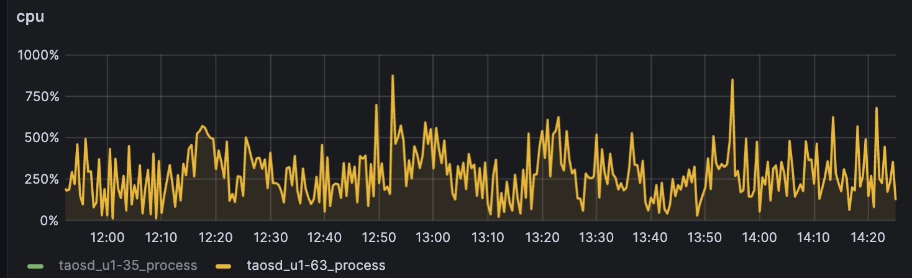
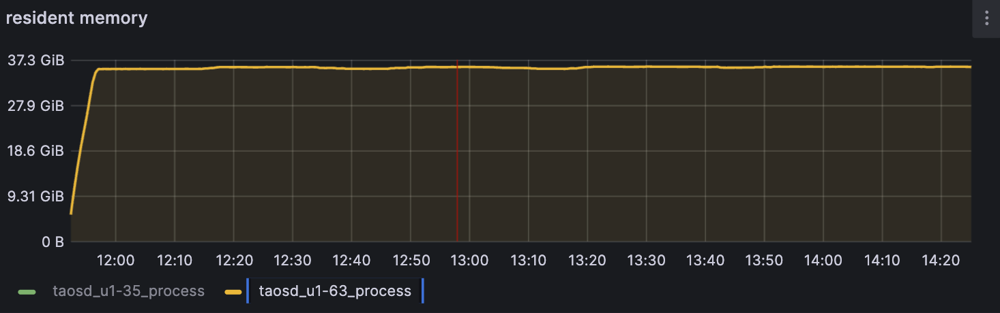
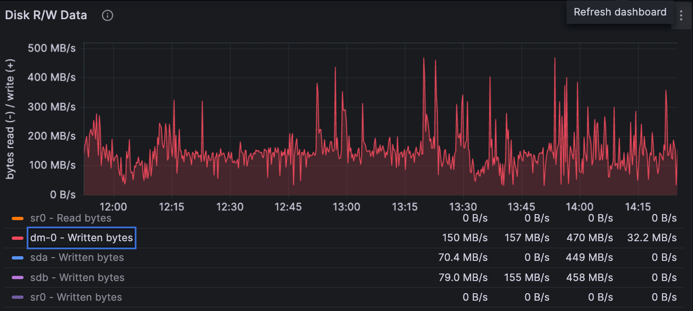
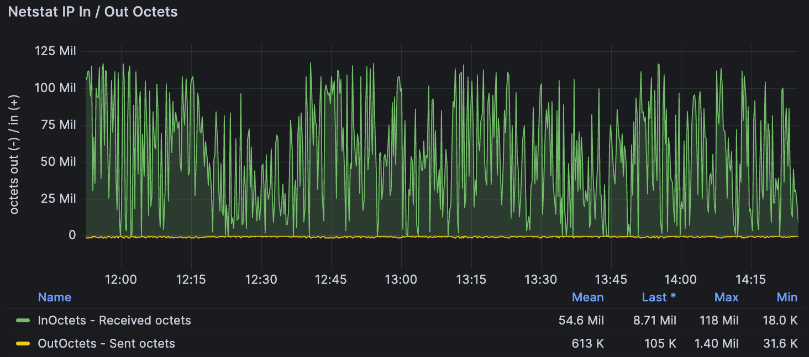
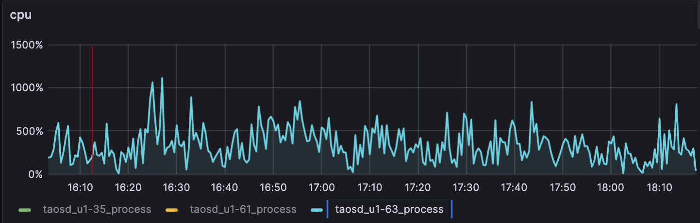
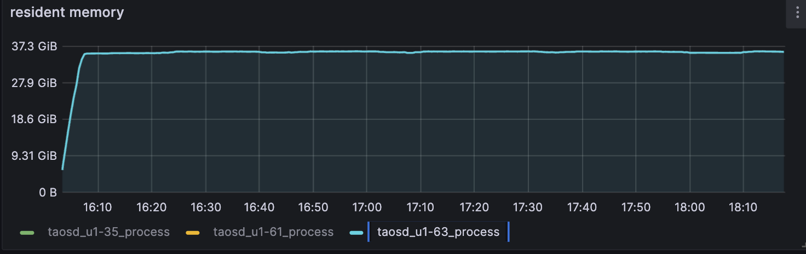
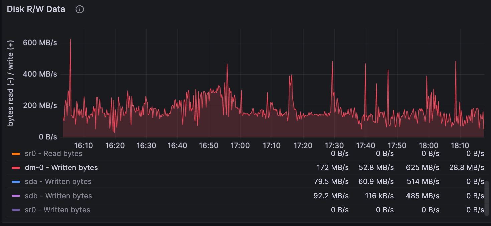
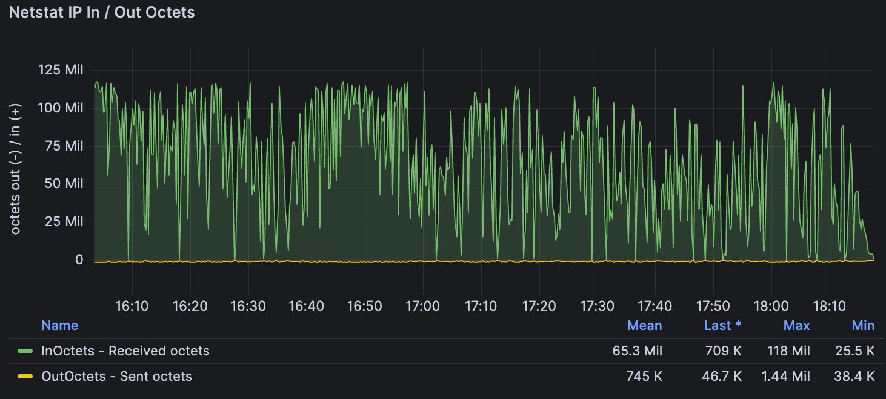
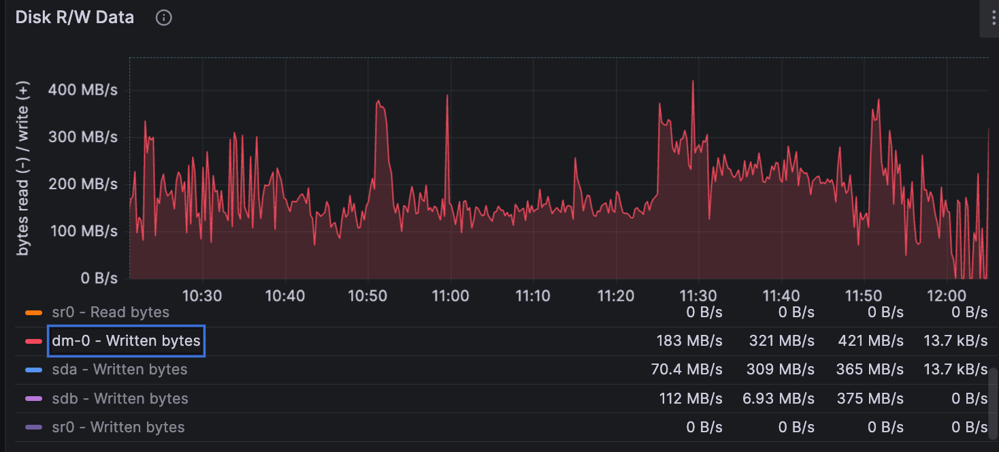
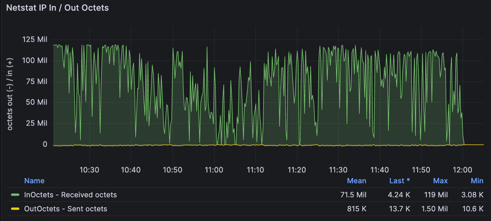

# [Test Report] TS-4055 [测试需求] 指定列写入性能 

### 1. 概述：

测试需求：[[测试需求] 指定列写入性能](https://taosdata.feishu.cn/wiki/Otyyw9t6ViF750kQCaAcMldyn3f) 
测试目的主要验证指定列写入与全部列写入的性能。

### 2. 测试环境：

192.168.1.63：
CPU: Intel(R) Xeon(R) CPU E5-2650 v3 @ 2.30GHz（2）40核
Mem: DDR4 16GB* 16
Disk: 895GB
192.168.0.209（taosBenchmark）

### 3. 测试用例：

测试过程中，记录如下参数，其中写入速度和 CPU 是核心指标
- 写入速度，计算单位为点/秒，去除第一个时间戳列，去除空值列
- CPU 曲线或者均值，包括客户端和服务端的 CPU 曲线
- 内存曲线或者均值
- 磁盘 IO 曲线或者均值
- 网络流量曲线或者均值

| 场景序号 | 描述 | 样例 SQL |
| --- | --- | --- |
| 场景一 | 不指定数据列 | insert into table values(16810002345, 1, NULL, 2, NULL) |
| 场景二 | 指定所有数据列 | insert into table (ts, c1, c2, c3, c4, ...) values(16810002345, 1,...150, NULL, NULL,) |
| 场景三 | 指定有值的数据列 | insert into table (ts, c1, c3, ...) values(16810002345, 1, 2, ...) |

| 场景序号 | 耗时 | 写入速度 | 压缩比 | CPU | Mem | 磁盘IO | 网络 | Json | 备注 |
| --- | --- | --- | --- | --- | --- | --- | --- | --- | --- |
| 场景一 | start：2023-11-10 11:52:18 end：2023-11-10 14:25:00 2小时32分42秒（9162秒） | 32744条/秒 | 理论值：337.5GB 实际值：335GB 压缩比：0.74% |  |  |  |  | > ⚠ 嵌入文件，需在飞书中查看 (token: IL67bELdZo7pX2x7QO0c4dPRnwc) |  |
| 场景二 | start：2023-11-13 16:03:23 end：2023-11-13 18:17:44 2小时14分21秒（8061秒） | 37216条/秒 | 理论值：337.5GB 实际值：336GB 压缩比：0.44% |  |  |  |  | > ⚠ 嵌入文件，需在飞书中查看 (token: S3v1bcaoDoawwXxwP7tcpXhCnyb) |  |
| 场景三 | start：2023-11-13 10:21:09 end：2023-11-13 12:05:00 1小时43分51秒（6231秒） | 48146条/秒 | 理论值：337.5GB 实际值：337GB 压缩比：0.15% |  |  |  |  | > ⚠ 嵌入文件，需在飞书中查看 (token: GzyRbb6Lmo3w4DxpgcJcu3O3n3e) | CPU, Mem因process_exporter遇到问题未获取到 |

Note：磁盘空间有限，减少每个子表数据量到30000, 总计写入3亿数据进行对比

### 4. 总结：

 压缩比=（理论值 - 实际值）/ 理论值
1. 三种场景下，资源占用，磁盘占用相差不大，网络占用增加，与写入速度保持一致
2. 写入速度上，场景三 > 场景二 > 场景一
