# [Test Report] compact测试报告

<callout emoji="small_blue_diamond" background-color="light-orange" border-color="light-orange">

## 测试结论

1. 报告所覆盖测试项均已完成测试；
2. 流计算目前可以搭配 compact 使用，但大量乱序场景时 checkpoint 会卡事务，需优化；（[TD-27541](https://jira.taosdata.com:18080/browse/TD-27541)）
3. 参考第 5.3 测试结果，以 3.1 分支为对标，feat/TD-27461 为优化分支，具体到性能的下降幅度上，测试采取了两种指标的对比，以 numOfCommitThreads=8 和 stt_trigger=8 这组结果为例，compact 过程中相对比 compact 前，taosBenchmark 的写入 CPU 降低了 54%（1012.9->463.8）,抓取 taosBenchmark 日志计算 compact 过程中和 compact 前的 QPS，降低了38%（85374.4->52709.3），测试过程中发现 taosBenchmark 日志输出 QPS 是有一定延迟性的，且如果写入被阻塞，阻塞期间是不会输出日志的，所以通过 taosBenchmark 日志计算出的性能有一定的失真，但两者结合，**该场景下 compact 期间写入性能降幅大概在 40%-55% 之间**，而 3.1 分支从结果上看是降低了80%以上的，且从 grafana 监控曲线可以看到明显的对比，3.1 分支 taosBenchmark cpu 长期降到个位数，而 feat/TD-27461 不会，因此本次优化已生效，且效果显著；
4. 参考第 5.3 测试结果，stt_trigger=1 时，该优化不生效。
</callout>


## 一.概述

[TD-26841](https://jira.taosdata.com:18080/browse/TD-26841) 包括并不限于 jira 需求，对 compact 进行专项测试。

## 二. 软硬件环境

### **1.1 硬件环境**

| **硬件环境** | **IP** | 用途 | **CPU** | **内存** | **硬盘** |
| --- | --- | --- | --- | --- | --- |
| 192.168.1.58 | taosBenchmark |
| 192.168.1.55 | taosd |
| 192.168.1.56 | taosd |
| 192.168.1.57 | taosd |
| 192.168.1.228 | taosd | Intel(R) Xeon(R) CPU E5-2650 v3 @ 2.30GHz 32核虚拟机 | 64G | PERC H730 Mini 200 |

### **1.2 软件环境**

| **软件环境(main分支)** | **IP** | **运行目录** | **脚本及配置** | **commitID** |
| --- | --- | --- | --- | --- |
| **TDengine** | 192.168.1.55～58 192.168.1.228 | /root/TDengine | taostest --setup=cluster/compact_test.yaml --case=cluster/compact_test.py --keep taostest --setup=cluster/compact_test_rep3.yaml --case=cluster/compact_test.py --keep | TDinternal(5ef4ea2c1a62f8cb7d5765304fb2807b2a92bc56) community(7d745cdb9a17f83e0112245c6e4e98b156a0d723) |
| **QEMU 6.0.0** | 192.168.1.55 | /home/kvm/images |  |  |

###  **1.3 拓扑图**


## 三. 测试场景

|  | 测试点 | 描述 |
| --- | --- | --- |
| 功能 | 基础功能验证 | compact命令可以在单副本和三副本正常使用 |
|  | compact内存资源消耗 | 不会产生大幅增长OOM |
|  | compact磁盘资源验证 | compact后会一定程度上降低磁盘使用量 |
|  | compact查询性能验证 | compact后会一定程度上提升查询性能 |
|  | compact阻塞写入验证 | 写入过程中进行compact，写入不会被阻塞 |
|  | compact阻塞查询验证 | compact过程中进行查询，查询不应被阻塞 |
|  | compact 支持 stream | compact时有stream在运行 |
|  | compact 支持 tmq | compact时有tmq在运行 |
|  | Keep 删除过期数据后进行 compact | compact前已通过db的keep删除了部分过期数据 |
| 稳定性测试 | 长时间大数据量测试 | 将功能测试项尽可能叠加，数据量调大进行长时间压测 |

## 四.测试用例：

| keep | duration | col_count | col_type | tag_count | tag_type | disorder_ratio | update_ratio | delete_ratio |
| --- | --- | --- | --- | --- | --- | --- | --- | --- |
| 11d | 1d | 2 | int | 1 | int | 30 | 30 | 10 |

### 4.1 功能测试（以下测试均覆盖单副本/三副本）

| **序号** | **测试点** | **测试步骤** | **测试结果** |
| --- | --- | --- | --- |
| 1 | 基础功能验证 | 1. 写入 20 亿数据（含乱序更新删除）； 1. 查询结果； 1. compact database； 1. 查询结果； | 通过 第2步和第4步结果相同 |
| 2 | compact内存资源消耗 | 1. 写入 20 亿数据（含乱序更新删除）； 1. compact database； 1. 观察compact过程中的内存增长； | 通过 compact过程中内存不会大幅增长 |
| 3 | compact磁盘资源验证 | 1. 写入 20 亿数据（含乱序更新删除）； 1. 记录磁盘占用； 1. compact database； 1. 记录磁盘占用； | 通过 compact后磁盘占用空间降低 |
| 4 | compact查询性能验证 | 1. 写入 20 亿数据（含乱序更新删除）； 1. count(*)查询； 1. compact database； 1. count(*)查询； | 通过 compact后查询性能大幅提升 |
| 5 | compact阻塞写入验证 | 1. duration设置为1d，写入前10天的数据进行compact； 1. 继续写入后10天的数据，compact的数据为前10天的文件组； 1. 观察taosBenchmark写入速度和cpu资源变化； | 一定程度上还是会阻塞写入 |
| 6 | compact阻塞查询验证 | 1. 写入 20 亿数据（含乱序更新删除）后进行compact； 1. compact过程中进行查询； | 通过 查询可以正常执行 |
| 7 | compact 支持 stream | 1. 建流，含fill_history，然后进行写入； 1. 写入一定量数据后进行compact； | 需优化 |
| 8 | compact 支持 tmq | 1. 建tmq，然后进行写入并启动消费； 1. 写入一定量数据后进行compact； | 通过 compact可以支持tmq |
| 9 | Keep 删除过期数据后进行 compact | 1. duration设置为1d，keep设置为11d，写入前10天的数据，然后将keep改为5d； 1. 修改keep参数后进行compact，继续写入后10天的数据，compact的数据为前10天的文件组； | 通过 compact可以正常结束 |

### 4.2 稳定性测试

| 测试点 | 测试步骤 | 结果 |
| --- | --- | --- |
| 覆盖所有功能点，长时间大数据量压测 | 写入过程中组合compact、更新、乱序、删除、tmq、stream等一系列操作，且往复进行，不会出现 Crash 和OOM等现象； | 持续压测中 |

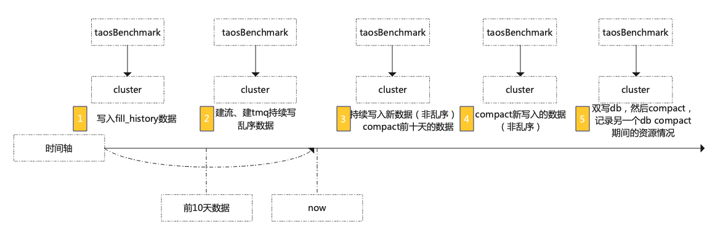

## 五. 测试结果

### 5.1 **单副本**

|  | **总数据量（rows）** | **磁盘占用（M）** | **内存占用（M）** | **查询耗时（s)** |
| --- | --- | --- | --- | --- |
| **compact前** | 2820949107 | 200827 | 4782 | 38.57 |
| **compact后** | 2820949107 | 126976 | 4915.2 | 0.13 |

```cpp
taos> use stream_test;
Database changed.

taos> select count(*) from stb;
       count(*)        |
========================
           12820939216 |
Query OK, 1 row(s) in set (0.620791s)

taos> use compact_disk_usage_test;
Database changed.

taos> select count(*) from stb;
       count(*)        |
========================
            2820949107 |
Query OK, 1 row(s) in set (0.139291s)
```

**整体：**
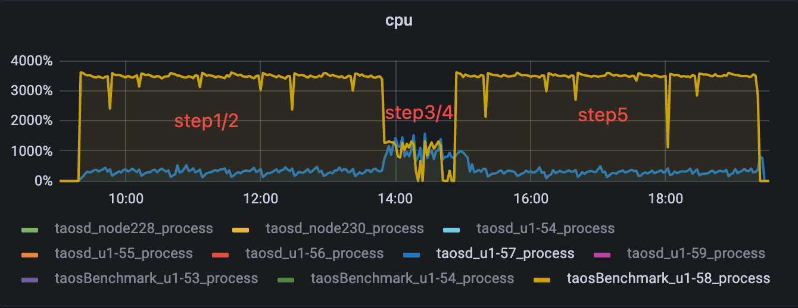

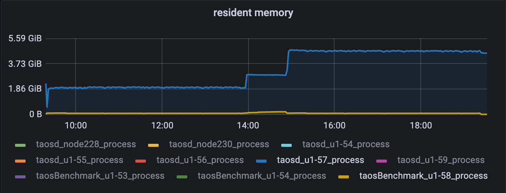

**compact期间：**
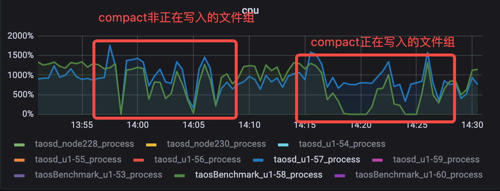

### 5.2 **三副本**

|  | **总数据量（rows）** | **磁盘占用（M）** | **内存占用（M）** | **查询耗时（s)** |
| --- | --- | --- | --- | --- |
| **compact前** | 2821063118 | 162673 | 3788.8 | 38.2 |
| **compact后** | 2821063118 | 140178 | 3778.5 | 0.14 |


```cpp
taos> use stream_test;
Database changed.

taos> select count(*) from stb;
       count(*)        |
========================
           12820992718 |
Query OK, 1 row(s) in set (0.539246s)

taos> use compact_disk_usage_test;
Database changed.

taos> select count(*) from stb;
       count(*)        |
========================
            2821063118 |
Query OK, 1 row(s) in set (0.122343s)
```


**整体:**
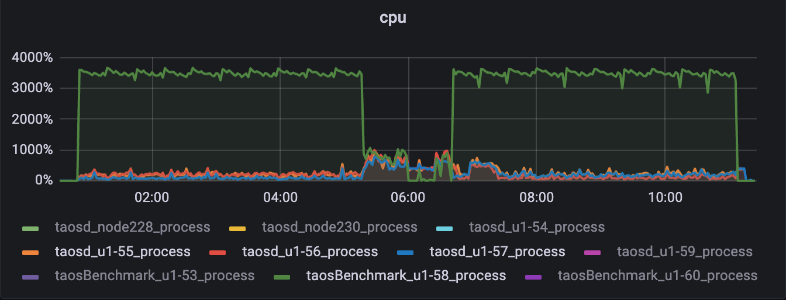


**compact期间：**


### 5.3 阻塞写入

<callout emoji="small_blue_diamond" background-color="light-orange" border-color="light-orange">
如何判断compact开始和结束:
grep -ri "start to compact\| compact .*rows" /var/log/taos/taosdlog.0
目前只有开始时有日志记录，没有明显的结束日志，因此每隔3分钟进行一次日志扫描，当最后一条 compact * rows 不再更新时，说明本次 compact 结束，通过程序分别获取这段时间的 taosd/taosBenchmark 资源占用，并过滤 taosBenchmark 日志获取这段时间的 QPS，同时使用 grafana 直观监控资源变化情况；

期望：compact 没有正在写入的文件组，不会阻塞写入，可以适当降低写入速度，不希望完全阻塞。

测试策略：因基础数据含很多乱序更新，写入量小达不到测试效果，写入量大又比较耗时，无法反复测试，于是采取 kvm 虚拟机 snapshot 方法，在物理机上划分 32 核 cpu、64G 内存、200G 硬盘给虚拟机，然后写入基础数据，备份快照，每次 compact 后恢复快照来快速测试；
</callout>


这里分别调整 commitThreads 进行验证：
```cpp
taos> select count(*) from stb;
       count(*)        |
========================
            4668235376 |
Query OK, 1 row(s) in set (54.901406s)
```


| **grafana监控** |
| --- |
| **taosd** | **taosBenchmark** | **avg** | **min** | **taosd** | **taosBenchmark** | **avg** | **min** | **CPU** | **QPS** | **绿线 taosd 紫线 taosBenchmark** |
| **3.1** | 1 | 439.8 | 974.2 | 87517.0 | 73825.9 | 335.5 | 64.0 | 18478.9 | 15.2 | 93% | 79% | 20:11:10～20:29:42 |  |
| **feat/TD-27461** | 1 | 444.3 | 977.6 | 86844.8 | 72882.9 | 391.3 | 74.1 | 8626.2 | 71.8 | 92% | 90% | 17:04:40～17:22:34 | 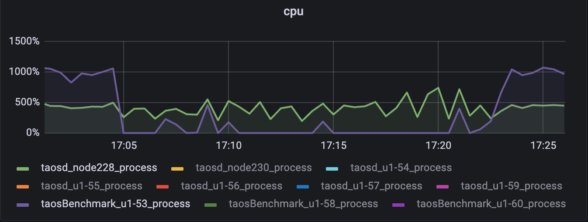 |
| **3.1** | 8 | 526.7 | 925.2 | 81920.6 | 58554.9 | 458.2 | 122.3 | 42900.7 | 381.9 | 86% | 47% > ⚠ 嵌入文件，需在飞书中查看 (token: I0sEb4XvBoqkfyxjASHcfk1rnHe) | 19:26:25-19:41:09 |  |
| **feat/TD-27461** | 8 | 585.0 | 1012.9 | 85374.4 | 70673.7 | 517.2 | 463.8 | 52709.3 | 838.9 | 54% | 38% | 18:17:45~18:49:40 | 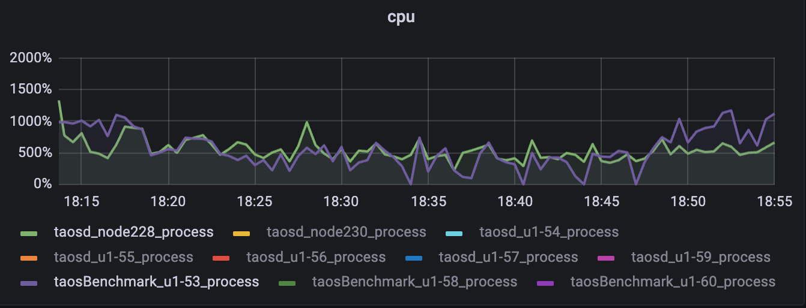 |
| **4** | **feat/TD-27461** | 8 | 564.1 | 966.5 | 86452.3 | 71564.2 | 448.2 | 412.4 | 50914.6 | 540.2 | 57% | 41% | 20:59:33~21:34:44 |  |

## 六. 测试结论

1. 报告所覆盖测试项均已完成测试；
2. 流计算目前可以搭配 compact 使用，但大量乱序场景时 checkpoint 会卡事务，需优化；（[TD-27541](https://jira.taosdata.com:18080/browse/TD-27541)）
3. 参考第 5.3 测试结果，以 3.1 分支为对标，feat/TD-27461 为优化分支，具体到性能的下降幅度上，测试采取了两种指标的对比，以 numOfCommitThreads=8 和 stt_trigger=8 这组结果为例，compact 过程中相对比 compact 前，taosBenchmark 的写入 CPU 降低了 54%（1012.9->463.8）,抓取 taosBenchmark 日志计算 compact 过程中和 compact 前的 QPS，降低了38%（85374.4->52709.3），测试过程中发现 taosBenchmark 日志输出 QPS 是有一定延迟性的，且如果写入被阻塞，阻塞期间是不会输出日志的，所以通过 taosBenchmark 日志计算出的性能有一定的失真，但两者结合，**该场景下 compact 期间写入性能降幅大概在 40%-55% 之间**，而 3.1 分支从结果上看是降低了80%以上的，且从 grafana 监控曲线可以看到明显的对比，3.1 分支 taosBenchmark cpu 长期降到个位数，而 feat/TD-27461 不会，因此本次优化已生效，且效果显著;
4. 参考第 5.3 测试结果，stt_trigger=1 时，该优化不生效。

## 七.merge主分支后回归测试

| **grafana监控** |
| --- |
| **taosd** | **taosBenchmark** | **avg** | **min** | **taosd** | **taosBenchmark** | **avg** | **min** | **CPU** | **QPS** | **绿线 taosd 紫线 taosBenchmark** |
| **3.0** TDinternal(e8c8baca534bc194ceef1a32185f5bc0008b52a6) community(7854a06724f50272f195343f8dc6c4c6cac1c60a) | 892 | 1042 | 96914 | 75192 | 883 | 765 | 72052 | 43518 | 26% | 25% | 22:44:00～22:50:00 | **3.0** 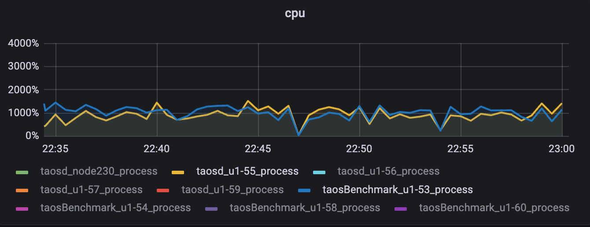 |
| **3.1** TDinternal(bc2347043864cc5ef4ec2e86e32fdd3fd2047928) community(4466d35875cdf5e2b56008e44646dc0b723c5fff) | 993 | 1261 | 110260 | 100405 | 1136 | 956 | 89715 | 45761 | 24% | 18% | 13:26:42~13:31:45 | **3.1** 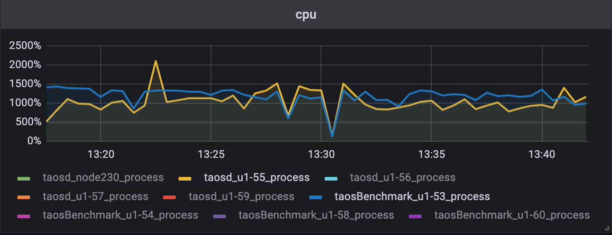 |
| **main** TDinternal(8a2a85c983b1c592065be73a026142718d08d47e) community(8e1970be492ead8bb005c7d6a803d7ff7413d909) | 914 | 1087 | 101180 | 86167 | 832 | 577 | 90471 | 3488 | 47% | 10% | 20:10:08~20:13:14 | **main（未合代码 符合预期）** 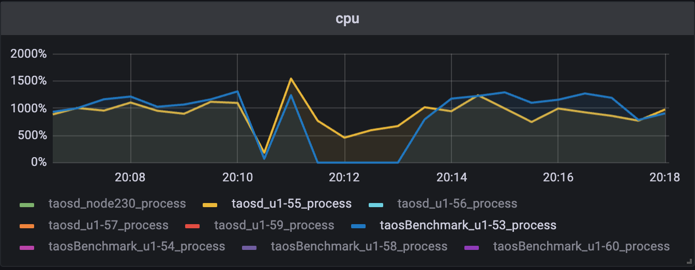 |

### 3.0分支

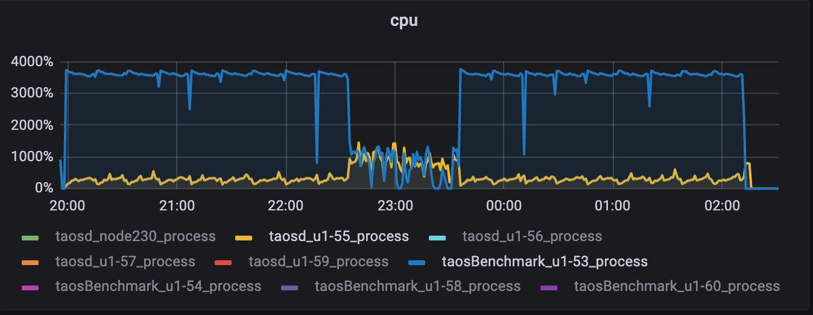

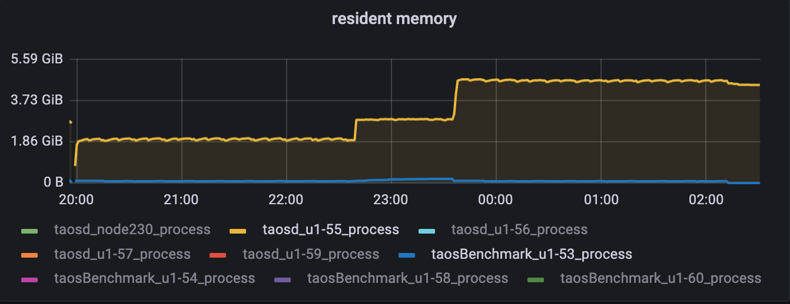

### 3.1分支

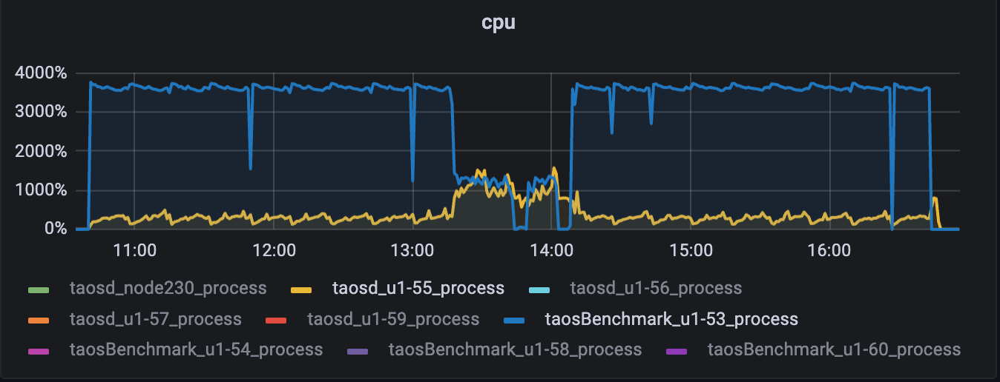

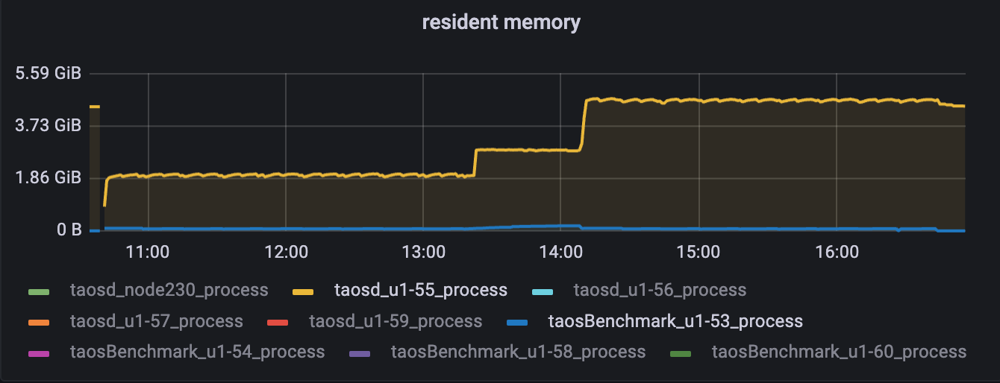

**main分支**
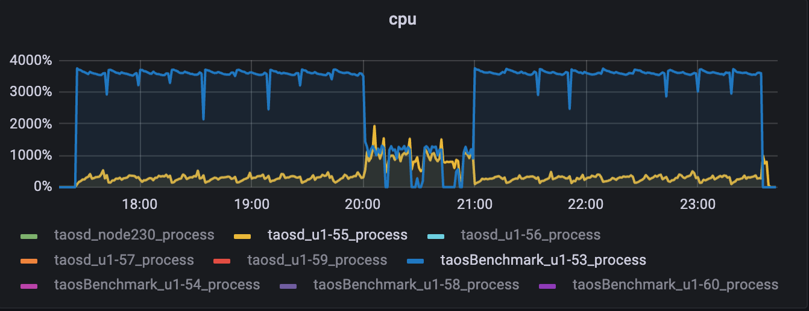

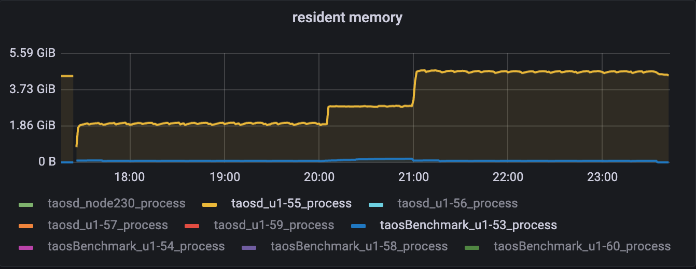
