# [Test Report] [old] compact测试报告

<callout emoji="small_blue_diamond" background-color="light-orange" border-color="light-orange">

## 测试结论

1. 报告所覆盖测试项均已完成测试；
2. 流计算目前可以搭配 compact 使用，但大量乱序场景时 checkpoint 会卡事务，需优化；（[TD-27541](https://jira.taosdata.com:18080/browse/TD-27541)）
3. 从**第 5.3 **测试结果看出，compact 过程中，即使不是正在写入的文件组，也会产生阻塞，随着 numOfCommitThreads 参数的调高，会有一定缓解，但 taosBenchmark 依然有一段时间 cpu 资源占用降为个位数的情况，该行为还需优化。（[TS-4294](https://jira.taosdata.com:18080/browse/TS-4294)）
</callout>


## 一.概述

[TD-26841](https://jira.taosdata.com:18080/browse/TD-26841) 包括并不限于 jira 需求，对 compact 进行专项测试。

## 二. 软硬件环境

### **1.1 硬件环境**

| **硬件环境** | **IP** | 用途 | **CPU** | **内存** | **硬盘** |
| --- | --- | --- | --- | --- | --- |
| 192.168.1.58 | taosBenchmark |
| 192.168.1.55 | taosd |
| 192.168.1.56 | taosd |
| 192.168.1.57 | taosd |
| 192.168.1.228 | taosd | Intel(R) Xeon(R) CPU E5-2650 v3 @ 2.30GHz 32核虚拟机 | 64G | PERC H730 Mini 200 |

### **1.2 软件环境**

| **软件环境(main分支)** | **IP** | **运行目录** | **脚本及配置** | **commitID** |
| --- | --- | --- | --- | --- |
| **TDengine** | 192.168.1.55～58 192.168.1.228 | /root/TDengine | taostest --setup=cluster/compact_test.yaml --case=cluster/compact_test.py --keep taostest --setup=cluster/compact_test_rep3.yaml --case=cluster/compact_test.py --keep | TDinternal(45362cd452880f7aff3077ddd140be2678f8c9c4) community(1b4f187dedfc99f6dfd633b9d00a7c565321a8fb) |
| **QEMU 6.0.0** | 192.168.1.55 | /home/kvm/images |  |  |

###  **1.3 拓扑图**


## 三. 测试场景

|  | 测试点 | 描述 |
| --- | --- | --- |
| 功能 | 基础功能验证 | compact命令可以在单副本和三副本正常使用 |
|  | compact内存资源消耗 | 不会产生大幅增长OOM |
|  | compact磁盘资源验证 | compact后会一定程度上降低磁盘使用量 |
|  | compact查询性能验证 | compact后会一定程度上提升查询性能 |
|  | compact阻塞写入验证 | 写入过程中进行compact，写入不会被阻塞 |
|  | compact阻塞查询验证 | compact过程中进行查询，查询不应被阻塞 |
|  | compact 支持 stream | compact时有stream在运行 |
|  | compact 支持 tmq | compact时有tmq在运行 |
|  | Keep 删除过期数据后进行 compact | compact前已通过db的keep删除了部分过期数据 |
| 稳定性测试 | 长时间大数据量测试 | 将功能测试项尽可能叠加，数据量调大进行长时间压测 |

## 四.测试用例：

| keep | duration | col_count | col_type | tag_count | tag_type | disorder_ratio | update_ratio | delete_ratio |
| --- | --- | --- | --- | --- | --- | --- | --- | --- |
| 11d | 1d | 2 | int | 1 | int | 30 | 30 | 10 |

### 4.1 功能测试（以下测试均覆盖单副本/三副本）

| **序号** | **测试点** | **测试步骤** | **测试结果** |
| --- | --- | --- | --- |
| 1 | 基础功能验证 | 1. 写入 20 亿数据（含乱序更新删除）； 1. 查询结果； 1. compact database； 1. 查询结果； | 通过 第2步和第4步结果相同 |
| 2 | compact内存资源消耗 | 1. 写入 20 亿数据（含乱序更新删除）； 1. compact database； 1. 观察compact过程中的内存增长； | 通过 compact过程中内存不会大幅增长 |
| 3 | compact磁盘资源验证 | 1. 写入 20 亿数据（含乱序更新删除）； 1. 记录磁盘占用； 1. compact database； 1. 记录磁盘占用； | 通过 compact后磁盘占用空间降低 |
| 4 | compact查询性能验证 | 1. 写入 20 亿数据（含乱序更新删除）； 1. count(*)查询； 1. compact database； 1. count(*)查询； | 通过 compact后查询性能大幅提升 |
| 5 | compact阻塞写入验证 | 1. duration设置为1d，写入前10天的数据进行compact； 1. 继续写入后10天的数据，compact的数据为前10天的文件组； 1. 观察taosBenchmark写入速度和cpu资源变化； | 一定程度上还是会阻塞写入 |
| 6 | compact阻塞查询验证 | 1. 写入 20 亿数据（含乱序更新删除）后进行compact； 1. compact过程中进行查询； | 通过 查询可以正常执行 |
| 7 | compact 支持 stream | 1. 建流，含fill_history，然后进行写入； 1. 写入一定量数据后进行compact； | 需优化 |
| 8 | compact 支持 tmq | 1. 建tmq，然后进行写入并启动消费； 1. 写入一定量数据后进行compact； | 通过 compact可以支持tmq |
| 9 | Keep 删除过期数据后进行 compact | 1. duration设置为1d，keep设置为11d，写入前10天的数据，然后将keep改为5d； 1. 修改keep参数后进行compact，继续写入后10天的数据，compact的数据为前10天的文件组； | 通过 compact可以正常结束 |

### 4.2 稳定性测试

| 测试点 | 测试步骤 | 结果 |
| --- | --- | --- |
| 覆盖所有功能点，长时间大数据量压测 | 写入过程中组合compact、更新、乱序、删除、tmq、stream等一系列操作，且往复进行，不会出现 Crash 和OOM等现象； | 持续压测中 |


## 五. 测试结果

### 5.1 **单副本**

|  | **总数据量（rows）** | **磁盘占用（M）** | **内存占用（M）** | **查询耗时（s)** |
| --- | --- | --- | --- | --- |
| **compact前** | 2538963561 | 193394 | 1870 | 33.89 |
| **compact后** | 2538963561 | 153681 | 1844 | 0.11 |

```cpp
taos> use stream_test;
Database changed.

taos> select count(*) from stb;
       count(*)        |
========================
           12538939158 |
Query OK, 1 row(s) in set (0.520692s)

taos> use compact_disk_usage_test;
Database changed.

taos> select count(*) from stb;
       count(*)        |
========================
            2538963561 |
Query OK, 1 row(s) in set (0.139833s)
```

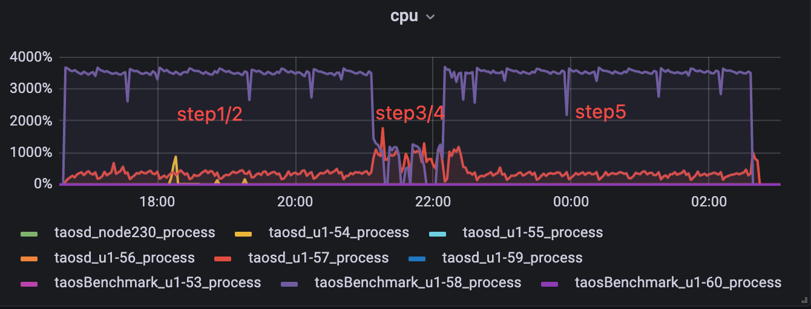

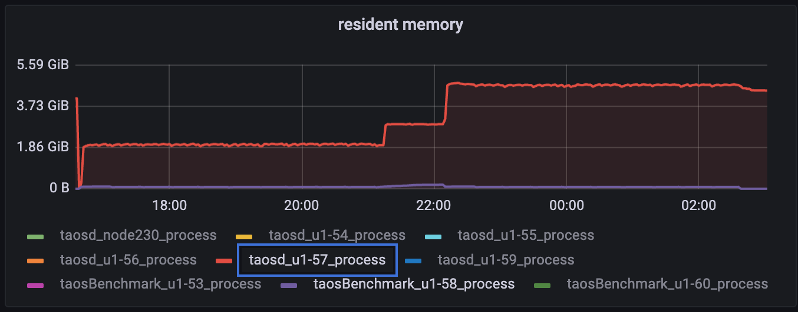

### 5.2 **三副本**

|  | **总数据量（rows）** | **磁盘占用（M）** | **内存占用（M）** | **查询耗时（s)** |
| --- | --- | --- | --- | --- |
| **compact前** | 2820924196 | 152825 | 1766 | 35.21 |
| **compact后** | 2820924196 | 132281 | 1738 | 0.14 |


```cpp
taos> use stream_test;
Database changed.

taos> select count(*) from stb;
       count(*)        |
========================
           11974823092 |
Query OK, 1 row(s) in set (1.106309s)

taos> use compact_disk_usage_test;
Database changed.

taos> select count(*) from stb;
       count(*)        |
========================
            1974559190 |
Query OK, 1 row(s) in set (0.092646s)
```

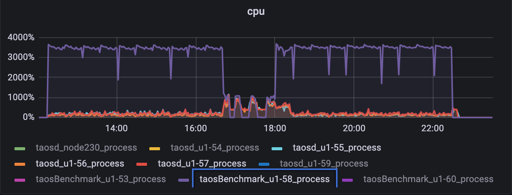


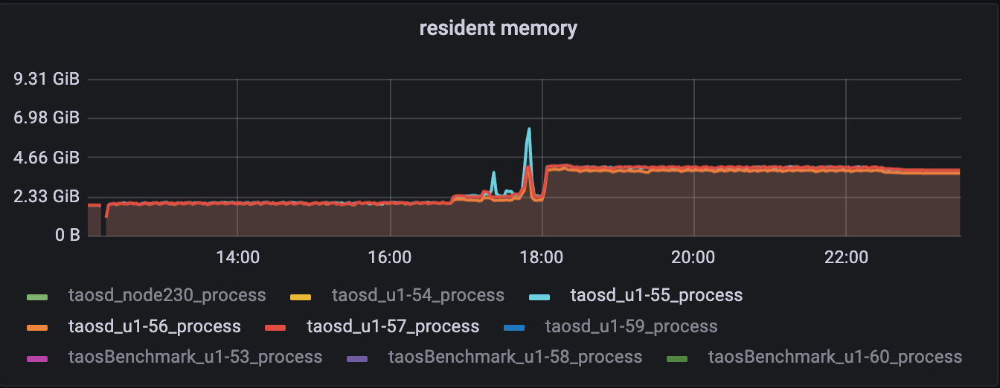


### 5.3 阻塞写入

<callout emoji="small_blue_diamond" background-color="light-orange" border-color="light-orange">
如何判断compact开始和结束:
grep -ri "start to compact\| compact .*rows" /var/log/taos/taosdlog.0
目前只有开始时有日志记录，没有明显的结束日志，因此每隔3分钟进行一次日志扫描，当最后一条 compact * rows 不再更新时，说明本次 compact 结束，通过程序分别获取这段时间的 taosd/taosBenchmark 资源占用，同时使用 grafana 直观监控资源变化情况；

期望：compact 没有正在写入的文件组，不会阻塞写入，可以适当降低写入速度，不希望完全阻塞。

但如果产生 vnode-merge 线程争抢，还是会阻塞；

测试策略：因基础数据含很多乱序更新，写入量小达不到测试效果，写入量大又比较耗时，无法反复测试，于是采取 kvm 虚拟机 snapshot 方法，在物理机上划分 32 核 cpu、64G 内存、200G 硬盘给虚拟机，然后写入基础数据，备份快照，每次 compact 后恢复快照来快速测试；
</callout>


这里分别调整 commitThreads 进行验证：

```cpp
taos> select count(*) from stb;
       count(*)        |
========================
            4668202738 |
Query OK, 1 row(s) in set (54.834037s)
root@node228 ~ $ du -sh /var/lib/taos
44G        /var/lib/taos
```


| **numOfCommitThreads** | **grafana监控** |
| --- | --- |
|  | **taosd** | **taosBenchmark** | **taosd** | **taosBenchmark** | **compact开始/结束时间段** | **绿线 taosd 紫线 taosBenchmark** |
| **8** | 376.71 | 555.75 | 433.84 | 95.77 | 19:37:04 - 19:56:02 |  |
| **16** | 572.09 | 876.6 | 614.19 | 197.44 | 20:38:35-20:53:20 | 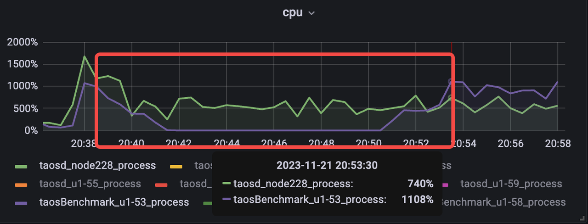 |
| **24** | 568.87 | 939.43 | 614.22 | 221.33 | 23:30:54-23:46:59 |  |

## 六. 测试结论

1. 报告所覆盖测试项均已完成测试；
2. 流计算目前可以搭配 compact 使用，但大量乱序场景时 checkpoint 会卡事务，需优化；（[TD-27541](https://jira.taosdata.com:18080/browse/TD-27541)）
3. 从**第 5.3 **测试结果看出，compact 过程中，即使不是正在写入的文件组，也会产生阻塞，随着 numOfCommitThreads 参数的调高，会有一定缓解，但 taosBenchmark 依然有一段时间 cpu 资源占用降为个位数的情况，该行为还需优化。（[TS-4294](https://jira.taosdata.com:18080/browse/TS-4294)）


## **以下为测试记录，暂时保留**

## 20231204更新：

| feat/TD-27461 | commitID |
| --- | --- |
| TDinternal | 5ef4ea2c1a62f8cb7d5765304fb2807b2a92bc56 |
| community | 7d745cdb9a17f83e0112245c6e4e98b156a0d723 |


| **grafana监控** |
| --- |
| **taosd** | **taosBenchmark** | **avg** | **min** | **taosd** | **taosBenchmark** | **avg** | **min** | **CPU** | **QPS** | **绿线 taosd 紫线 taosBenchmark** |
| **3.1** | 1 | 439.8 | 974.2 | 87517.0 | 73825.9 | 335.5 | 64.0 | 20:11:10～20:29:42 | 18478.9 | 15.2 | 93% | 79% | 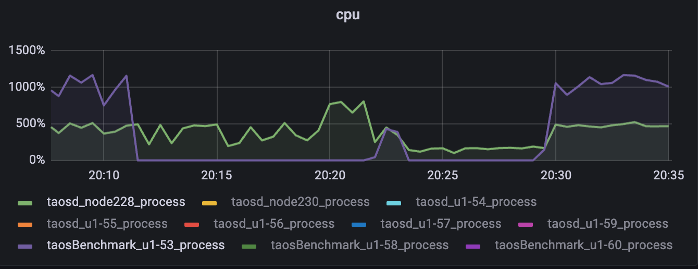 |
| **feat/TD-27461** | 1 | 444.3 | 977.6 | 86844.8 | 72882.9 | 391.3 | 74.1 | 17:04:40～17:22:34 | 8626.2 | 71.8 | 92% | 90% |  |
| **3.1** | 8 | 526.7 | 925.2 | 81920.6 | 58554.9 | 458.2 | 122.3 | 19:26:25-19:41:09 | 42900.7 | 381.9 | 86% | 47% > ⚠ 嵌入文件，需在飞书中查看 (token: YuYfbwVeZoh9JAxqjahcEzlpnib) | 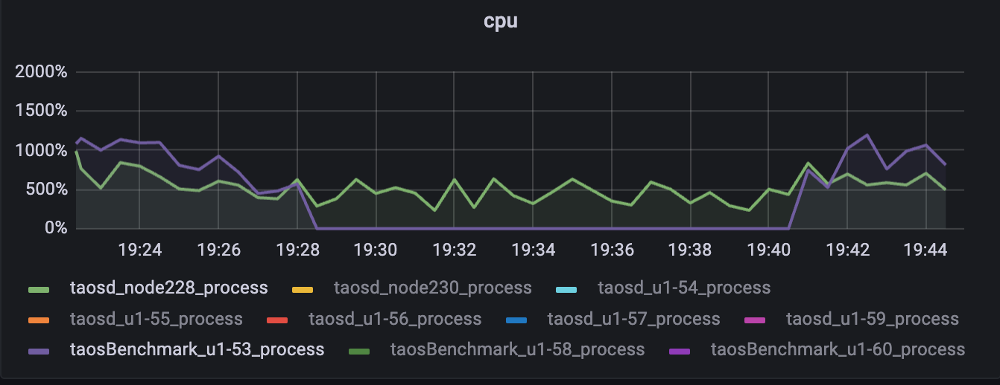 |
| **feat/TD-27461** | 8 | 585.0 | 1012.9 | 85374.4 | 70673.7 | 517.2 | 463.8 | 18:17:45~18:49:40 | 52709.3 | 838.9 | 54% | 38% |  |
| **4** | **feat/TD-27461** | 8 | 564.1 | 966.5 | 86452.3 | 71564.2 | 448.2 | 412.4 | 20:59:33~21:34:44 | 50914.6 | 540.2 | 57% | 41% | 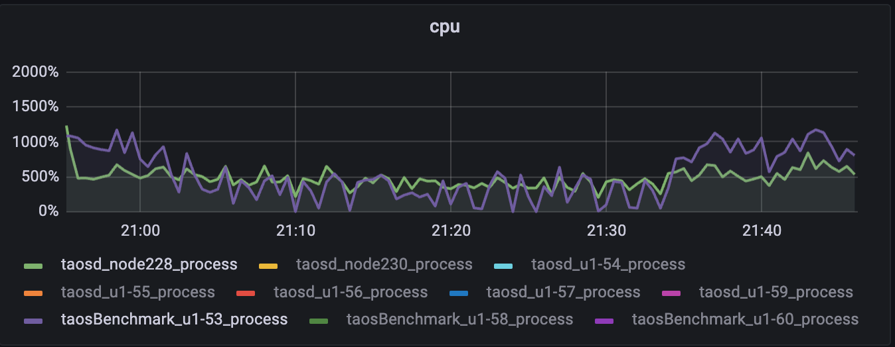 |

numOfCommitThreads=8
```plaintext
taos> select count(*) from stb;
       count(*)        |
========================
            4668235376 |
Query OK, 1 row(s) in set (54.901406s)
```

2023-12-01 16:50:36 INFO: ------------ standard taosd avg cpu: 594.38 between 2023-12-01 16:47:35.988001 and 2023-12-01 16:50:36.087978 ------------
2023-12-01 16:50:36 INFO: ------------ standard taosBenchmark avg cpu: 948.33 between 2023-12-01 16:47:35.988001 and 2023-12-01 16:50:36.087978 ------------
2023-12-01 17:21:02 INFO: ------------ range-compact taosd avg cpu: 566.24 between 2023-12-01 16:50:36.154780 and 2023-12-01 17:15:27.065002 ------------
2023-12-01 17:21:02 INFO: ------------ range-compact taosBenchmark avg cpu: 469.28 between 2023-12-01 16:50:36.154780 and 2023-12-01 17:15:27.065002 ------------
```sql
root@node228 ~ $ grep -ri "start to compact\| compact .*rows" /var/log/taos/taosdlog.0
12/01 16:50:36.333807 00090728 MND db:1.stream_test, start to compact
12/01 16:51:42.183823 00091313 TSD vgId:4 fid:19687 compact 48167866 rows
12/01 16:51:42.839987 00091314 TSD vgId:4 fid:19684 compact 48149800 rows
12/01 16:51:42.857319 00091312 TSD vgId:4 fid:19686 compact 48151259 rows
12/01 16:51:44.153704 00091310 TSD vgId:4 fid:19688 compact 48190622 rows
12/01 16:51:45.308381 00091317 TSD vgId:4 fid:19683 compact 48141667 rows
12/01 16:51:46.779208 00091311 TSD vgId:4 fid:19685 compact 48157562 rows
12/01 16:51:47.439267 00091316 TSD vgId:4 fid:19682 compact 48136881 rows
12/01 16:53:02.261437 00091313 TSD vgId:3 fid:19683 compact 45481977 rows
12/01 16:53:09.792852 00091317 TSD vgId:3 fid:19684 compact 45456211 rows
12/01 16:53:20.753744 00091315 TSD vgId:4 fid:19681 compact 48133314 rows
12/01 16:53:29.974749 00091312 TSD vgId:3 fid:19685 compact 45455422 rows
12/01 16:53:46.446415 00091316 TSD vgId:3 fid:19682 compact 45556159 rows
12/01 16:53:49.411051 00091314 TSD vgId:3 fid:19686 compact 45444313 rows
12/01 16:54:11.813645 00091313 TSD vgId:3 fid:19687 compact 45477942 rows
12/01 16:54:28.940427 00091317 TSD vgId:3 fid:19688 compact 45487418 rows
12/01 16:54:30.982697 00091310 TSD vgId:3 fid:19681 compact 45445339 rows
12/01 16:54:34.420397 00091312 TSD vgId:4 fid:19689 compact 48162501 rows
12/01 16:54:51.318158 00091315 TSD vgId:3 fid:19689 compact 45480057 rows
12/01 16:55:46.428427 00091311 TSD vgId:6 fid:19684 compact 48172397 rows
12/01 16:55:57.084246 00091315 TSD vgId:6 fid:19685 compact 48166982 rows
12/01 16:56:08.707310 00091317 TSD vgId:6 fid:19686 compact 48174483 rows
12/01 16:56:15.804889 00091310 TSD vgId:6 fid:19687 compact 48166250 rows
12/01 16:56:53.283116 00091311 TSD vgId:6 fid:19688 compact 48185731 rows
12/01 16:57:03.272643 00091314 TSD vgId:6 fid:19681 compact 48153423 rows
12/01 16:57:07.684822 00091316 TSD vgId:6 fid:19683 compact 48152775 rows
12/01 16:57:13.511219 00091315 TSD vgId:6 fid:19689 compact 48157056 rows
12/01 16:57:19.746101 00091313 TSD vgId:6 fid:19682 compact 48167685 rows
12/01 16:58:12.930222 00091311 TSD vgId:7 fid:19685 compact 46406795 rows
12/01 16:58:17.105783 00091313 TSD vgId:7 fid:19686 compact 46405851 rows
12/01 16:58:32.337300 00091316 TSD vgId:7 fid:19687 compact 46416844 rows
12/01 16:58:49.025559 00091315 TSD vgId:7 fid:19688 compact 46389067 rows
12/01 16:59:07.068997 00091312 TSD vgId:7 fid:19681 compact 46399127 rows
12/01 16:59:16.955334 00091317 TSD vgId:7 fid:19682 compact 46415127 rows
12/01 16:59:20.976724 00091314 TSD vgId:7 fid:19684 compact 46422217 rows
12/01 16:59:22.268686 00091316 TSD vgId:7 fid:19689 compact 46448964 rows
12/01 16:59:30.280638 00091310 TSD vgId:7 fid:19683 compact 46399295 rows
12/01 17:00:41.092179 00091314 TSD vgId:2 fid:19686 compact 45920323 rows
12/01 17:00:52.488744 00091313 TSD vgId:2 fid:19687 compact 45961739 rows
12/01 17:01:03.746642 00091316 TSD vgId:2 fid:19685 compact 45941357 rows
12/01 17:01:17.242867 00091310 TSD vgId:2 fid:19688 compact 45952952 rows
12/01 17:01:21.224581 00091311 TSD vgId:2 fid:19681 compact 45941984 rows
12/01 17:01:29.061121 00091315 TSD vgId:2 fid:19682 compact 45903326 rows
12/01 17:01:49.957926 00091312 TSD vgId:2 fid:19683 compact 45921030 rows
12/01 17:01:50.851495 00091313 TSD vgId:2 fid:19689 compact 45952855 rows
12/01 17:01:58.097035 00091317 TSD vgId:2 fid:19684 compact 45935435 rows
12/01 17:02:59.328112 00091312 TSD vgId:11 fid:19686 compact 45096889 rows
12/01 17:03:19.109505 00091317 TSD vgId:11 fid:19687 compact 45207125 rows
12/01 17:03:37.325137 00091313 TSD vgId:11 fid:19688 compact 45173121 rows
12/01 17:03:50.992136 00091314 TSD vgId:11 fid:19681 compact 45193353 rows
12/01 17:04:00.031182 00091310 TSD vgId:11 fid:19682 compact 45186102 rows
12/01 17:04:05.652601 00091316 TSD vgId:11 fid:19683 compact 45098845 rows
12/01 17:04:08.123891 00091317 TSD vgId:11 fid:19689 compact 45104524 rows
12/01 17:04:18.182524 00091315 TSD vgId:11 fid:19684 compact 45202505 rows
12/01 17:04:27.144276 00091311 TSD vgId:11 fid:19685 compact 45095006 rows
12/01 17:05:41.037170 00091311 TSD vgId:8 fid:19687 compact 46462114 rows
12/01 17:06:02.800732 00091315 TSD vgId:8 fid:19688 compact 46460748 rows
12/01 17:06:19.349456 00091313 TSD vgId:8 fid:19681 compact 46434887 rows
12/01 17:06:41.824796 00091312 TSD vgId:8 fid:19682 compact 46472786 rows
12/01 17:06:47.339957 00091310 TSD vgId:8 fid:19683 compact 46459978 rows
12/01 17:06:47.847527 00091316 TSD vgId:8 fid:19686 compact 46464222 rows
12/01 17:06:48.078693 00091315 TSD vgId:8 fid:19689 compact 46439927 rows
12/01 17:06:51.054019 00091314 TSD vgId:8 fid:19684 compact 46453870 rows
12/01 17:06:56.933656 00091317 TSD vgId:8 fid:19685 compact 46462888 rows
12/01 17:08:44.317625 00091317 TSD vgId:5 fid:19687 compact 45846517 rows
12/01 17:08:46.253950 00091310 TSD vgId:5 fid:19688 compact 45841291 rows
12/01 17:09:00.528819 00091311 TSD vgId:5 fid:19681 compact 45841527 rows
12/01 17:09:10.762489 00091313 TSD vgId:5 fid:19682 compact 45832907 rows
12/01 17:09:18.577793 00091315 TSD vgId:5 fid:19683 compact 45836999 rows
12/01 17:09:32.908554 00091312 TSD vgId:5 fid:19684 compact 45858789 rows
12/01 17:09:45.366841 00091317 TSD vgId:5 fid:19689 compact 45834562 rows
12/01 17:09:46.411612 00091316 TSD vgId:5 fid:19685 compact 45835915 rows
12/01 17:09:51.283175 00091314 TSD vgId:5 fid:19686 compact 45852447 rows
12/01 17:11:22.019133 00091314 TSD vgId:10 fid:19688 compact 47311705 rows
12/01 17:11:44.749424 00091313 TSD vgId:10 fid:19681 compact 47307279 rows
12/01 17:11:51.203806 00091315 TSD vgId:10 fid:19682 compact 47332236 rows
12/01 17:12:04.333143 00091312 TSD vgId:10 fid:19683 compact 47311413 rows
12/01 17:12:07.487479 00091317 TSD vgId:10 fid:19684 compact 47278645 rows
12/01 17:12:13.194892 00091310 TSD vgId:10 fid:19685 compact 47309304 rows
12/01 17:12:24.968976 00091311 TSD vgId:10 fid:19687 compact 47291579 rows
12/01 17:12:27.613198 00091316 TSD vgId:10 fid:19686 compact 47299948 rows
12/01 17:12:36.937776 00091313 TSD vgId:10 fid:19689 compact 47334603 rows
12/01 17:14:16.407834 00091316 TSD vgId:9 fid:19688 compact 48094569 rows
12/01 17:14:47.162711 00091312 TSD vgId:9 fid:19681 compact 48096975 rows
12/01 17:14:52.986786 00091315 TSD vgId:9 fid:19682 compact 48130001 rows
12/01 17:14:53.237495 00091317 TSD vgId:9 fid:19683 compact 48101043 rows
12/01 17:14:57.938883 00091311 TSD vgId:9 fid:19684 compact 48101326 rows
12/01 17:15:01.836814 00091314 TSD vgId:9 fid:19685 compact 48134279 rows
12/01 17:15:06.423347 00091313 TSD vgId:9 fid:19686 compact 48112709 rows
12/01 17:15:10.379192 00091310 TSD vgId:9 fid:19687 compact 48117665 rows
12/01 17:15:27.065002 00091316 TSD vgId:9 fid:19689 compact 48104260 rows
```

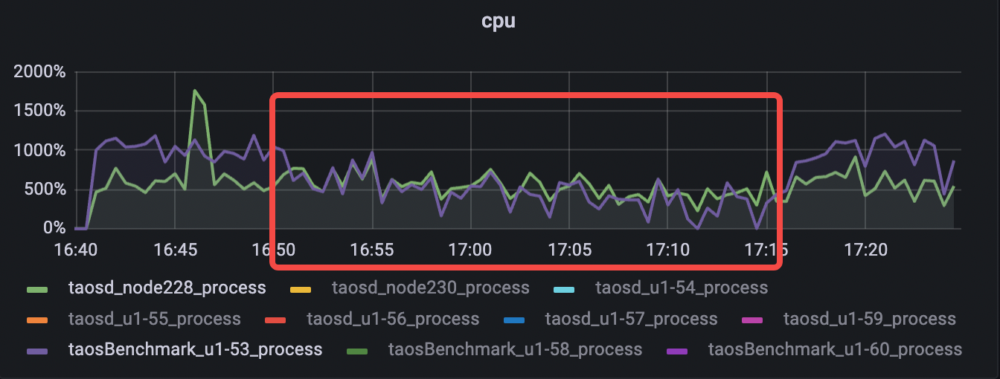

taosBenchmark log：

> ⚠ 嵌入文件，需在飞书中查看 (token: M2JhbDgYUois1Fx7NO8cD3UunPc)

因taosBenchmark目前不具备持续写入的阶段性获取QPS功能，从以上log中挑两个线程，计算QPS的降低幅度
        
> ⚠ 嵌入文件，需在飞书中查看 (token: UKuCb0PgzontHZxo5xwcLOpPnwe)

> ⚠ 嵌入文件，需在飞书中查看 (token: Oo8LbDmw8oxnOFxkm28cDqEhndd)

Thread 12:
cat *.txt | awk '{print $13}' | awk '{ sum += $1 } END { if (NR > 0) print sum / NR }'
compact前：89446.1
compact中：52761.7
qps降低41%
taosBenchmark cpu 948->469
cpu降低50%
Thread 15:
compact前：86563.9
compact中：49466.6
qps降低43%

## 三副本：

### 5.2 **三副本**

|  | **总数据量（rows）** | **磁盘占用（M）** | **内存占用（M）** | **查询耗时（s)** |
| --- | --- | --- | --- | --- |
| **compact前** | 2821063118 | 162673 | 2396 | 38.2 |
| **compact后** | 2821063118 | 140178 | 2365 | 0.14 |


```cpp
taos> use stream_test;
Database changed.

taos> select count(*) from stb;
       count(*)        |
========================
           12820992718 |
Query OK, 1 row(s) in set (0.539246s)

taos> use compact_disk_usage_test;
Database changed.

taos> select count(*) from stb;
       count(*)        |
========================
            2821063118 |
Query OK, 1 row(s) in set (0.122343s)
```


整体


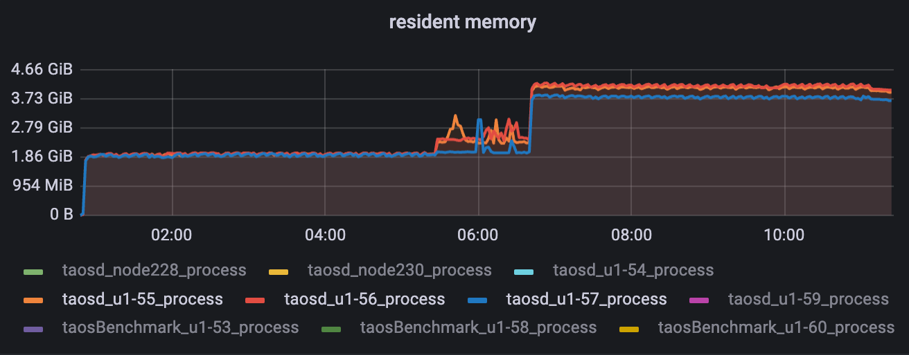

compact期间：
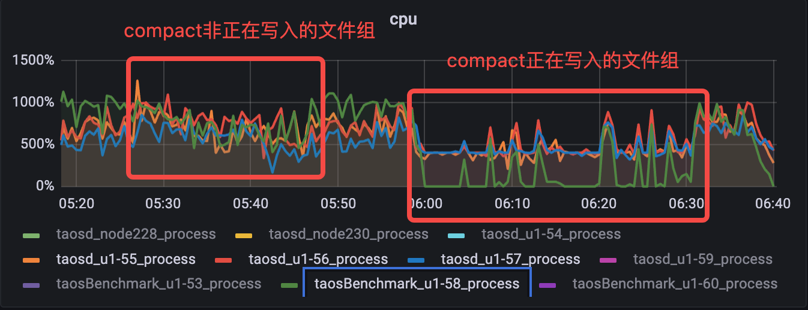

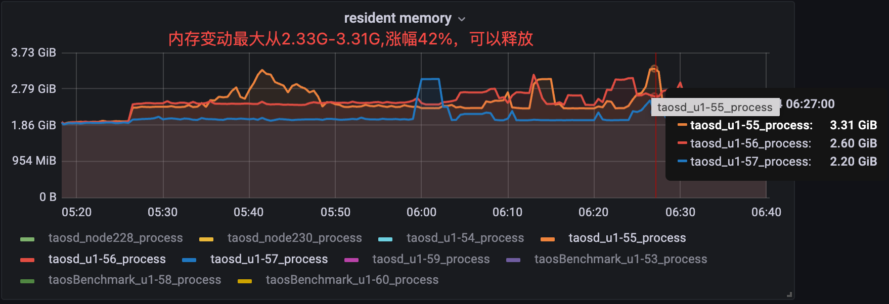


numOfCommitThreads=8
```cpp
taos> select count(*) from stb;
       count(*)        |
========================
            4668202738 |
Query OK, 1 row(s) in set (54.834037s)
root@node228 ~ $ du -sh /var/lib/taos
44G        /var/lib/taos
root@node228 ~ $ du -sh /var/lib/taos/vnode/*
4.5G        /var/lib/taos/vnode/vnode10
4.3G        /var/lib/taos/vnode/vnode11
4.4G        /var/lib/taos/vnode/vnode2
4.3G        /var/lib/taos/vnode/vnode3
4.6G        /var/lib/taos/vnode/vnode4
4.4G        /var/lib/taos/vnode/vnode5
4.6G        /var/lib/taos/vnode/vnode6
4.4G        /var/lib/taos/vnode/vnode7
4.4G        /var/lib/taos/vnode/vnode8
4.6G        /var/lib/taos/vnode/vnode9
4.0K        /var/lib/taos/vnode/vnodes.json
```

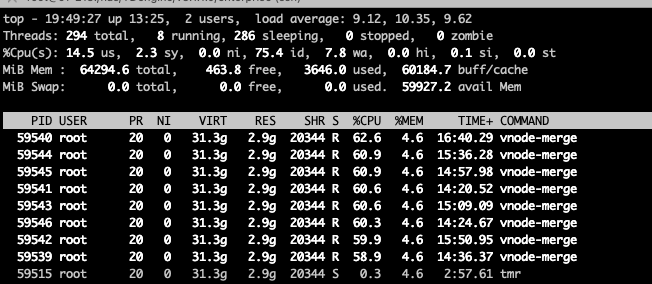

2023-11-21 19:35:52 INFO: ------------ standard taosd avg cpu: 376.71 between 2023-11-21 19:32:52.567308 and 2023-11-21 19:35:52.664016 ------------
2023-11-21 19:35:52 INFO: ------------ standard taosBenchmark avg cpu: 555.75 between 2023-11-21 19:32:52.567308 and 2023-11-21 19:35:52.664016 ------------
2023-11-21 20:01:36 INFO: ------------ range-compact taosd avg cpu: 433.84 between 2023-11-21 19:37:04.500673 and 2023-11-21 19:56:02.932792 ------------
2023-11-21 20:01:36 INFO: ------------ range-compact taosBenchmark avg cpu: 95.77 between 2023-11-21 19:37:04.500673 and 2023-11-21 19:56:02.932792 ------------
```cpp
root@node228 ~ $ grep -ri "start to compact \| compact .*rows" /var/log/taos/taosdlog.0
11/21 19:38:26.588803 00059542 TSD vgId:10 fid:19672 compact 47293333 rows
11/21 19:38:29.010973 00059540 TSD vgId:10 fid:19675 compact 47283364 rows
11/21 19:38:30.877310 00059539 TSD vgId:10 fid:19674 compact 47320694 rows
11/21 19:38:32.467320 00059546 TSD vgId:10 fid:19673 compact 47304613 rows
11/21 19:38:36.154153 00059543 TSD vgId:10 fid:19676 compact 47301899 rows
11/21 19:38:37.680333 00059544 TSD vgId:10 fid:19677 compact 47306064 rows
11/21 19:38:39.636327 00059545 TSD vgId:10 fid:19678 compact 47312258 rows
11/21 19:39:59.722116 00059542 TSD vgId:10 fid:19679 compact 47317493 rows
11/21 19:40:02.788713 00059540 TSD vgId:10 fid:19680 compact 47307983 rows
11/21 19:40:10.372860 00059543 TSD vgId:4 fid:19673 compact 48133333 rows
11/21 19:40:12.035948 00059544 TSD vgId:4 fid:19674 compact 48125150 rows
11/21 19:40:13.107959 00059545 TSD vgId:4 fid:19675 compact 48178522 rows
11/21 19:40:39.667278 00059541 TSD vgId:10 fid:19671 compact 47282475 rows
11/21 19:40:42.178900 00059542 TSD vgId:4 fid:19676 compact 48139788 rows
11/21 19:40:43.076134 00059540 TSD vgId:4 fid:19677 compact 48153339 rows
11/21 19:40:46.903634 00059543 TSD vgId:4 fid:19678 compact 48164088 rows
11/21 19:40:47.211943 00059544 TSD vgId:4 fid:19679 compact 48166517 rows
11/21 19:40:47.554915 00059545 TSD vgId:4 fid:19680 compact 48115674 rows
11/21 19:41:18.598260 00059539 TSD vgId:4 fid:19671 compact 48155498 rows
11/21 19:41:20.041260 00059546 TSD vgId:4 fid:19672 compact 48154687 rows
11/21 19:41:35.063562 00059544 TSD vgId:5 fid:19676 compact 45843581 rows
11/21 19:41:35.602481 00059545 TSD vgId:5 fid:19675 compact 45853823 rows
11/21 19:41:50.423830 00059539 TSD vgId:5 fid:19677 compact 45841479 rows
11/21 19:41:50.890015 00059546 TSD vgId:5 fid:19678 compact 45837349 rows
11/21 19:42:17.062770 00059545 TSD vgId:5 fid:19680 compact 45835233 rows
11/21 19:42:17.647970 00059544 TSD vgId:5 fid:19679 compact 45849943 rows
11/21 19:42:20.681745 00059541 TSD vgId:5 fid:19671 compact 45843815 rows
11/21 19:42:30.268663 00059542 TSD vgId:5 fid:19672 compact 45849064 rows
11/21 19:42:34.955778 00059540 TSD vgId:5 fid:19673 compact 45828083 rows
11/21 19:42:39.822478 00059543 TSD vgId:5 fid:19674 compact 45848489 rows
11/21 19:43:03.329607 00059542 TSD vgId:3 fid:19676 compact 45464949 rows
11/21 19:43:07.611150 00059540 TSD vgId:3 fid:19677 compact 45471759 rows
11/21 19:43:09.461937 00059543 TSD vgId:3 fid:19678 compact 45447377 rows
11/21 19:43:34.949993 00059539 TSD vgId:3 fid:19671 compact 45548578 rows
11/21 19:43:35.495730 00059546 TSD vgId:3 fid:19672 compact 45562430 rows
11/21 19:43:47.225378 00059542 TSD vgId:3 fid:19679 compact 45468278 rows
11/21 19:43:47.504653 00059541 TSD vgId:3 fid:19673 compact 45450069 rows
11/21 19:43:50.023185 00059545 TSD vgId:3 fid:19674 compact 45465853 rows
11/21 19:43:50.293554 00059544 TSD vgId:3 fid:19675 compact 45458510 rows
11/21 19:43:54.131937 00059540 TSD vgId:3 fid:19680 compact 45478432 rows
11/21 19:44:33.752661 00059540 TSD vgId:8 fid:19678 compact 46454415 rows
11/21 19:44:55.523171 00059543 TSD vgId:8 fid:19671 compact 46437426 rows
11/21 19:45:01.698841 00059539 TSD vgId:8 fid:19672 compact 46457028 rows
11/21 19:45:03.067426 00059546 TSD vgId:8 fid:19673 compact 46449395 rows
11/21 19:45:15.564108 00059540 TSD vgId:8 fid:19679 compact 46457309 rows
11/21 19:45:16.419901 00059541 TSD vgId:8 fid:19674 compact 46454224 rows
11/21 19:45:16.757840 00059542 TSD vgId:8 fid:19677 compact 46481399 rows
11/21 19:45:18.874490 00059544 TSD vgId:8 fid:19675 compact 46449328 rows
11/21 19:45:21.696465 00059545 TSD vgId:8 fid:19676 compact 46448770 rows
11/21 19:45:28.180222 00059543 TSD vgId:8 fid:19680 compact 46459576 rows
11/21 19:46:32.834898 00059539 TSD vgId:6 fid:19671 compact 48135478 rows
11/21 19:46:35.644288 00059546 TSD vgId:6 fid:19672 compact 48164847 rows
11/21 19:46:58.310215 00059541 TSD vgId:6 fid:19673 compact 48139158 rows
11/21 19:47:01.214457 00059542 TSD vgId:6 fid:19674 compact 48173868 rows
11/21 19:47:01.373844 00059545 TSD vgId:6 fid:19677 compact 48156022 rows
11/21 19:47:01.764895 00059540 TSD vgId:6 fid:19675 compact 48173064 rows
11/21 19:47:01.880019 00059544 TSD vgId:6 fid:19676 compact 48179685 rows
11/21 19:47:07.845718 00059543 TSD vgId:6 fid:19678 compact 48135489 rows
11/21 19:47:26.436996 00059546 TSD vgId:6 fid:19680 compact 48133464 rows
11/21 19:48:12.455329 00059539 TSD vgId:6 fid:19679 compact 48148206 rows
11/21 19:48:32.250051 00059541 TSD vgId:2 fid:19671 compact 45939172 rows
11/21 19:48:35.397453 00059542 TSD vgId:2 fid:19672 compact 45943326 rows
11/21 19:48:36.209474 00059545 TSD vgId:2 fid:19673 compact 45939280 rows
11/21 19:48:36.234103 00059540 TSD vgId:2 fid:19674 compact 45957964 rows
11/21 19:48:37.530997 00059544 TSD vgId:2 fid:19675 compact 45948979 rows
11/21 19:48:46.188752 00059543 TSD vgId:2 fid:19676 compact 45934932 rows
11/21 19:48:59.380032 00059546 TSD vgId:2 fid:19677 compact 45945500 rows
11/21 19:49:40.848773 00059539 TSD vgId:2 fid:19678 compact 45941852 rows
11/21 19:50:00.551995 00059541 TSD vgId:2 fid:19679 compact 45958822 rows
11/21 19:50:02.016634 00059542 TSD vgId:2 fid:19680 compact 45947161 rows
11/21 19:50:07.055571 00059545 TSD vgId:9 fid:19671 compact 48103299 rows
11/21 19:50:07.344896 00059540 TSD vgId:9 fid:19672 compact 48131958 rows
11/21 19:50:09.780261 00059544 TSD vgId:9 fid:19673 compact 48105221 rows
11/21 19:50:16.252355 00059543 TSD vgId:9 fid:19674 compact 48116826 rows
11/21 19:50:30.147232 00059546 TSD vgId:9 fid:19675 compact 48095120 rows
11/21 19:51:12.706237 00059539 TSD vgId:9 fid:19676 compact 48115331 rows
11/21 19:51:16.332947 00059544 TSD vgId:7 fid:19671 compact 46403820 rows
11/21 19:51:31.863053 00059541 TSD vgId:9 fid:19677 compact 48098143 rows
11/21 19:51:33.733411 00059542 TSD vgId:9 fid:19678 compact 48115668 rows
11/21 19:51:37.796510 00059540 TSD vgId:9 fid:19680 compact 48093398 rows
11/21 19:51:39.122654 00059545 TSD vgId:9 fid:19679 compact 48117581 rows
11/21 19:51:43.696075 00059543 TSD vgId:7 fid:19672 compact 46406888 rows
11/21 19:52:03.155443 00059546 TSD vgId:7 fid:19673 compact 46417862 rows
11/21 19:52:42.788453 00059539 TSD vgId:7 fid:19674 compact 46417362 rows
11/21 19:52:51.771504 00059544 TSD vgId:7 fid:19675 compact 46408094 rows
11/21 19:52:53.659222 00059546 TSD vgId:11 fid:19671 compact 45163569 rows
11/21 19:53:03.786155 00059541 TSD vgId:7 fid:19676 compact 46434298 rows
11/21 19:53:05.624726 00059542 TSD vgId:7 fid:19677 compact 46406680 rows
11/21 19:53:08.857960 00059540 TSD vgId:7 fid:19678 compact 46403898 rows
11/21 19:53:09.470811 00059545 TSD vgId:7 fid:19679 compact 46409515 rows
11/21 19:53:12.553204 00059543 TSD vgId:7 fid:19680 compact 46404892 rows
11/21 19:53:32.591796 00059539 TSD vgId:11 fid:19672 compact 45210834 rows
11/21 19:54:14.986231 00059544 TSD vgId:11 fid:19673 compact 45095626 rows
11/21 19:54:24.352816 00059546 TSD vgId:11 fid:19674 compact 45178381 rows
11/21 19:54:37.752112 00059541 TSD vgId:11 fid:19675 compact 45096859 rows
11/21 19:54:43.063576 00059542 TSD vgId:11 fid:19676 compact 45174439 rows
11/21 19:54:48.240962 00059540 TSD vgId:11 fid:19677 compact 45089885 rows
11/21 19:54:52.306782 00059545 TSD vgId:11 fid:19678 compact 45168705 rows
11/21 19:54:54.032846 00059543 TSD vgId:11 fid:19679 compact 45082580 rows
11/21 19:56:02.932792 00059539 TSD vgId:11 fid:19680 compact 45179775 rows
```

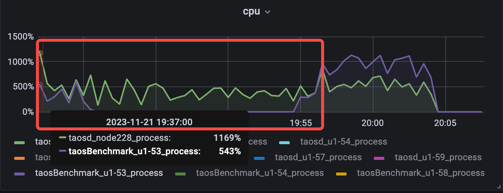


numOfCommitThreads=16

2023-11-21 20:33:40 INFO: ------------ standard taosd avg cpu: 572.09 between 2023-11-21 20:30:39.836949 and 2023-11-21 20:33:39.839285 ------------
2023-11-21 20:33:40 INFO: ------------ standard taosBenchmark avg cpu: 876.6 between 2023-11-21 20:30:39.836949 and 2023-11-21 20:33:39.839285 ------------

2023-11-21 20:57:07 INFO: ------------ range-compact taosd avg cpu: 614.19 between 2023-11-21 20:38:35.393303 and 2023-11-21 20:53:20.446977 ------------
2023-11-21 20:57:07 INFO: ------------ range-compact taosBenchmark avg cpu: 197.44 between 2023-11-21 20:38:35.393303 and 2023-11-21 20:53:20.446977 ------------
```cpp
root@node228 ~ $ grep -ri "start to compact\| compact .*rows" /var/log/taos/taosdlog.0
11/21 20:38:35.644868 00062264 MND db:1.stream_test, start to compact
11/21 20:39:47.004928 00062288 TSD vgId:5 fid:19674 compact 45848489 rows
11/21 20:39:47.491596 00062292 TSD vgId:5 fid:19675 compact 45853823 rows
11/21 20:39:49.910172 00062290 TSD vgId:5 fid:19680 compact 45835233 rows
11/21 20:39:51.055082 00062296 TSD vgId:5 fid:19677 compact 45841479 rows
11/21 20:39:52.220489 00062293 TSD vgId:5 fid:19679 compact 45849943 rows
11/21 20:39:52.261666 00062286 TSD vgId:5 fid:19678 compact 45837349 rows
11/21 20:39:55.084117 00062297 TSD vgId:5 fid:19676 compact 45843581 rows
11/21 20:40:07.660169 00062284 TSD vgId:7 fid:19674 compact 46417362 rows
11/21 20:40:08.298644 00062287 TSD vgId:7 fid:19676 compact 46434298 rows
11/21 20:40:16.401467 00062283 TSD vgId:7 fid:19675 compact 46408094 rows
11/21 20:41:17.431498 00062288 TSD vgId:7 fid:19677 compact 46406680 rows
11/21 20:41:22.105418 00062292 TSD vgId:7 fid:19679 compact 46409515 rows
11/21 20:41:22.290693 00062296 TSD vgId:7 fid:19678 compact 46403898 rows
11/21 20:41:23.171846 00062290 TSD vgId:7 fid:19680 compact 46404892 rows
11/21 20:41:27.374849 00062287 TSD vgId:2 fid:19675 compact 45948979 rows
11/21 20:41:35.530335 00062283 TSD vgId:2 fid:19676 compact 45934932 rows
11/21 20:41:36.980289 00062298 TSD vgId:5 fid:19673 compact 45828083 rows
11/21 20:42:03.128921 00062288 TSD vgId:2 fid:19677 compact 45945500 rows
11/21 20:42:07.154871 00062296 TSD vgId:2 fid:19679 compact 45958822 rows
11/21 20:42:07.625673 00062292 TSD vgId:2 fid:19678 compact 45941852 rows
11/21 20:42:07.987852 00062290 TSD vgId:2 fid:19680 compact 45947161 rows
11/21 20:42:15.460571 00062291 TSD vgId:7 fid:19673 compact 46417862 rows
11/21 20:42:39.184934 00062284 TSD vgId:2 fid:19674 compact 45957964 rows
11/21 20:42:39.751476 00062295 TSD vgId:5 fid:19671 compact 45843815 rows
11/21 20:42:41.006967 00062294 TSD vgId:7 fid:19671 compact 46403820 rows
11/21 20:42:43.511497 00062290 TSD vgId:6 fid:19677 compact 48156022 rows
11/21 20:42:43.598316 00062292 TSD vgId:6 fid:19675 compact 48173064 rows
11/21 20:42:44.340154 00062296 TSD vgId:6 fid:19676 compact 48179685 rows
11/21 20:42:49.515877 00062291 TSD vgId:6 fid:19678 compact 48135489 rows
11/21 20:43:02.993067 00062285 TSD vgId:5 fid:19672 compact 45849064 rows
11/21 20:43:07.328059 00062289 TSD vgId:7 fid:19672 compact 46406888 rows
11/21 20:43:13.963053 00062295 TSD vgId:6 fid:19680 compact 48133464 rows
11/21 20:43:14.076610 00062284 TSD vgId:6 fid:19679 compact 48148206 rows
11/21 20:43:21.844004 00062286 TSD vgId:2 fid:19671 compact 45939172 rows
11/21 20:43:37.750452 00062285 TSD vgId:9 fid:19676 compact 48115331 rows
11/21 20:43:41.729905 00062289 TSD vgId:9 fid:19677 compact 48098143 rows
11/21 20:43:42.444416 00062297 TSD vgId:2 fid:19672 compact 45943326 rows
11/21 20:44:00.825074 00062286 TSD vgId:9 fid:19678 compact 48115668 rows
11/21 20:44:02.666222 00062295 TSD vgId:9 fid:19679 compact 48117581 rows
11/21 20:44:03.540224 00062284 TSD vgId:9 fid:19680 compact 48093398 rows
11/21 20:44:03.985815 00062293 TSD vgId:2 fid:19673 compact 45939280 rows
11/21 20:44:21.079828 00062287 TSD vgId:6 fid:19671 compact 48135478 rows
11/21 20:44:41.640498 00062298 TSD vgId:6 fid:19672 compact 48164847 rows
11/21 20:44:52.855820 00062295 TSD vgId:10 fid:19677 compact 47306064 rows
11/21 20:44:54.887898 00062283 TSD vgId:6 fid:19673 compact 48139158 rows
11/21 20:44:55.478190 00062287 TSD vgId:10 fid:19678 compact 47312258 rows
11/21 20:45:05.785646 00062294 TSD vgId:9 fid:19671 compact 48103299 rows
11/21 20:45:14.964155 00062298 TSD vgId:10 fid:19679 compact 47317493 rows
11/21 20:45:16.158531 00062288 TSD vgId:6 fid:19674 compact 48173868 rows
11/21 20:45:30.498931 00062283 TSD vgId:10 fid:19680 compact 47307983 rows
11/21 20:45:40.771298 00062290 TSD vgId:9 fid:19672 compact 48131958 rows
11/21 20:45:59.920082 00062292 TSD vgId:9 fid:19673 compact 48105221 rows
11/21 20:46:01.414538 00062291 TSD vgId:9 fid:19675 compact 48095120 rows
11/21 20:46:01.885829 00062296 TSD vgId:9 fid:19674 compact 48116826 rows
11/21 20:46:06.273789 00062297 TSD vgId:10 fid:19671 compact 47282475 rows
11/21 20:46:16.375049 00062283 TSD vgId:11 fid:19677 compact 45089885 rows
11/21 20:46:31.826480 00062291 TSD vgId:11 fid:19679 compact 45082580 rows
11/21 20:46:32.298234 00062292 TSD vgId:11 fid:19678 compact 45168705 rows
11/21 20:46:32.718507 00062296 TSD vgId:11 fid:19680 compact 45179775 rows
11/21 20:46:34.203205 00062285 TSD vgId:10 fid:19672 compact 47293333 rows
11/21 20:47:02.737099 00062284 TSD vgId:10 fid:19676 compact 47301899 rows
11/21 20:47:02.840004 00062289 TSD vgId:10 fid:19673 compact 47304613 rows
11/21 20:47:06.936364 00062293 TSD vgId:10 fid:19674 compact 47320694 rows
11/21 20:47:14.601931 00062286 TSD vgId:10 fid:19675 compact 47283364 rows
11/21 20:47:28.289825 00062295 TSD vgId:11 fid:19671 compact 45163569 rows
11/21 20:47:36.592660 00062284 TSD vgId:8 fid:19678 compact 46454415 rows
11/21 20:47:38.653907 00062293 TSD vgId:8 fid:19679 compact 46457309 rows
11/21 20:47:41.383801 00062287 TSD vgId:11 fid:19672 compact 45210834 rows
11/21 20:47:45.740062 00062286 TSD vgId:8 fid:19680 compact 46459576 rows
11/21 20:48:01.063561 00062294 TSD vgId:11 fid:19673 compact 45095626 rows
11/21 20:48:09.918288 00062288 TSD vgId:11 fid:19674 compact 45178381 rows
11/21 20:48:18.900354 00062298 TSD vgId:11 fid:19675 compact 45096859 rows
11/21 20:48:28.441546 00062297 TSD vgId:8 fid:19671 compact 46437426 rows
11/21 20:48:32.823888 00062290 TSD vgId:11 fid:19676 compact 45174439 rows
11/21 20:48:48.770849 00062298 TSD vgId:3 fid:19678 compact 45447377 rows
11/21 20:48:59.283772 00062297 TSD vgId:3 fid:19679 compact 45468278 rows
11/21 20:49:00.104357 00062283 TSD vgId:8 fid:19672 compact 46457028 rows
11/21 20:49:04.954672 00062290 TSD vgId:3 fid:19680 compact 45478432 rows
11/21 20:49:29.857523 00062285 TSD vgId:8 fid:19673 compact 46449395 rows
11/21 20:49:43.769115 00062291 TSD vgId:8 fid:19674 compact 46454224 rows
11/21 20:49:44.522928 00062296 TSD vgId:8 fid:19676 compact 46448770 rows
11/21 20:49:45.120877 00062289 TSD vgId:8 fid:19677 compact 46481399 rows
11/21 20:49:45.261795 00062292 TSD vgId:8 fid:19675 compact 46449328 rows
11/21 20:50:00.209386 00062295 TSD vgId:3 fid:19671 compact 45548578 rows
11/21 20:50:18.523845 00062292 TSD vgId:4 fid:19679 compact 48166517 rows
11/21 20:50:23.021733 00062287 TSD vgId:3 fid:19672 compact 45562430 rows
11/21 20:50:33.647779 00062295 TSD vgId:4 fid:19680 compact 48115674 rows
11/21 20:50:37.967881 00062284 TSD vgId:3 fid:19673 compact 45450069 rows
11/21 20:50:42.364939 00062293 TSD vgId:3 fid:19674 compact 45465853 rows
11/21 20:50:46.303801 00062286 TSD vgId:3 fid:19675 compact 45458510 rows
11/21 20:50:48.222016 00062294 TSD vgId:3 fid:19676 compact 45464949 rows
11/21 20:51:03.357381 00062288 TSD vgId:3 fid:19677 compact 45471759 rows
11/21 20:52:11.689671 00062298 TSD vgId:4 fid:19671 compact 48155498 rows
11/21 20:52:17.899489 00062283 TSD vgId:4 fid:19672 compact 48154687 rows
11/21 20:52:55.960815 00062297 TSD vgId:4 fid:19673 compact 48133333 rows
11/21 20:53:02.493303 00062290 TSD vgId:4 fid:19674 compact 48125150 rows
11/21 20:53:03.203763 00062289 TSD vgId:4 fid:19678 compact 48164088 rows
11/21 20:53:10.116512 00062285 TSD vgId:4 fid:19675 compact 48178522 rows
11/21 20:53:18.813385 00062291 TSD vgId:4 fid:19676 compact 48139788 rows
11/21 20:53:20.446977 00062296 TSD vgId:4 fid:19677 compact 48153339 rows
```


numOfCommitThreads=24
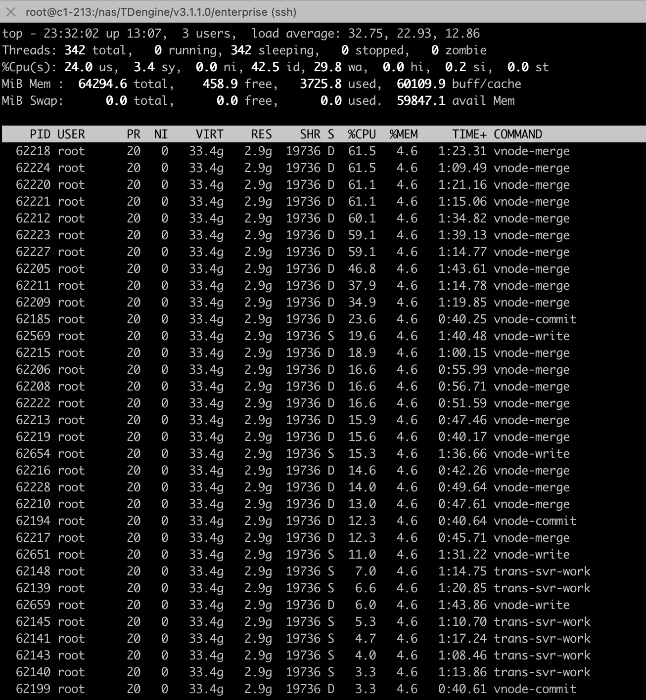

2023-11-21 23:26:04 INFO: ------------ standard taosd avg cpu: 568.87 between 2023-11-21 23:23:04.345958 and 2023-11-21 23:26:04.446116 ------------
2023-11-21 23:26:04 INFO: ------------ standard taosBenchmark avg cpu: 939.43 between 2023-11-21 23:23:04.345958 and 2023-11-21 23:26:04.446116 ------------
2023-11-21 23:52:29 INFO: ------------ range-compact taosd avg cpu: 614.22 between 2023-11-21 23:30:54.059421 and 2023-11-21 23:46:59.893309 ------------
2023-11-21 23:52:29 INFO: ------------ range-compact taosBenchmark avg cpu: 221.33 between 2023-11-21 23:30:54.059421 and 2023-11-21 23:46:59.893309 ------------
```cpp
root@node228 ~ $ grep -ri "start to compact\| compact .*rows" /var/log/taos/taosdlog.0
11/21 23:30:54.222231 00062178 MND db:1.stream_test, start to compact
11/21 23:31:53.692889 00062207 TSD vgId:3 fid:19676 compact 45464949 rows
11/21 23:31:54.187884 00062225 TSD vgId:7 fid:19676 compact 46434298 rows
11/21 23:31:54.963249 00062214 TSD vgId:3 fid:19675 compact 45458510 rows
11/21 23:31:56.741155 00062226 TSD vgId:3 fid:19677 compact 45471759 rows
11/21 23:32:00.778802 00062209 TSD vgId:7 fid:19675 compact 46408094 rows
11/21 23:32:00.856594 00062211 TSD vgId:3 fid:19679 compact 45468278 rows
11/21 23:32:01.535987 00062205 TSD vgId:3 fid:19678 compact 45447377 rows
11/21 23:32:02.390448 00062227 TSD vgId:7 fid:19679 compact 46409515 rows
11/21 23:32:02.955656 00062223 TSD vgId:7 fid:19674 compact 46417362 rows
11/21 23:32:03.385401 00062224 TSD vgId:3 fid:19674 compact 45465853 rows
11/21 23:32:03.388243 00062221 TSD vgId:3 fid:19680 compact 45478432 rows
11/21 23:32:03.702653 00062218 TSD vgId:7 fid:19677 compact 46406680 rows
11/21 23:32:04.192093 00062212 TSD vgId:7 fid:19678 compact 46403898 rows
11/21 23:32:10.915201 00062220 TSD vgId:7 fid:19680 compact 46404892 rows
11/21 23:33:19.771300 00062225 TSD vgId:5 fid:19675 compact 45853823 rows
11/21 23:33:22.556135 00062214 TSD vgId:5 fid:19676 compact 45843581 rows
11/21 23:33:23.921322 00062226 TSD vgId:5 fid:19677 compact 45841479 rows
11/21 23:33:32.233928 00062209 TSD vgId:5 fid:19679 compact 45849943 rows
11/21 23:33:36.913650 00062221 TSD vgId:5 fid:19680 compact 45835233 rows
11/21 23:33:43.474518 00062205 TSD vgId:5 fid:19678 compact 45837349 rows
11/21 23:34:42.432091 00062225 TSD vgId:6 fid:19675 compact 48173064 rows
11/21 23:34:44.221862 00062214 TSD vgId:6 fid:19676 compact 48179685 rows
11/21 23:34:49.876576 00062205 TSD vgId:6 fid:19678 compact 48135489 rows
11/21 23:34:50.693647 00062209 TSD vgId:6 fid:19677 compact 48156022 rows
11/21 23:35:32.201592 00062221 TSD vgId:8 fid:19675 compact 46449328 rows
11/21 23:35:41.766948 00062225 TSD vgId:8 fid:19676 compact 46448770 rows
11/21 23:35:44.446497 00062214 TSD vgId:6 fid:19679 compact 48148206 rows
11/21 23:35:49.496319 00062209 TSD vgId:8 fid:19677 compact 46481399 rows
11/21 23:35:51.390528 00062205 TSD vgId:6 fid:19680 compact 48133464 rows
11/21 23:35:56.705438 00062206 TSD vgId:3 fid:19671 compact 45548578 rows
11/21 23:35:59.217666 00062208 TSD vgId:7 fid:19671 compact 46403820 rows
11/21 23:36:03.225307 00062219 TSD vgId:5 fid:19671 compact 45843815 rows
11/21 23:36:09.384102 00062216 TSD vgId:4 fid:19671 compact 48155498 rows
11/21 23:36:14.885850 00062228 TSD vgId:3 fid:19673 compact 45450069 rows
11/21 23:36:20.678315 00062222 TSD vgId:3 fid:19672 compact 45562430 rows
11/21 23:36:23.926606 00062213 TSD vgId:7 fid:19672 compact 46406888 rows
11/21 23:36:27.922904 00062221 TSD vgId:8 fid:19678 compact 46454415 rows
11/21 23:36:29.246042 00062215 TSD vgId:5 fid:19672 compact 45849064 rows
11/21 23:36:32.458336 00062210 TSD vgId:7 fid:19673 compact 46417862 rows
11/21 23:36:48.058614 00062217 TSD vgId:5 fid:19673 compact 45828083 rows
11/21 23:36:49.221336 00062206 TSD vgId:8 fid:19679 compact 46457309 rows
11/21 23:36:50.700081 00062208 TSD vgId:8 fid:19680 compact 46459576 rows
11/21 23:36:53.673198 00062224 TSD vgId:8 fid:19671 compact 46437426 rows
11/21 23:37:02.718226 00062222 TSD vgId:11 fid:19677 compact 45089885 rows
11/21 23:37:03.618138 00062212 TSD vgId:6 fid:19671 compact 48135478 rows
11/21 23:37:04.063093 00062205 TSD vgId:11 fid:19679 compact 45082580 rows
11/21 23:37:04.077420 00062213 TSD vgId:11 fid:19678 compact 45168705 rows
11/21 23:37:09.229656 00062215 TSD vgId:11 fid:19680 compact 45179775 rows
11/21 23:37:28.007373 00062227 TSD vgId:6 fid:19672 compact 48164847 rows
11/21 23:37:29.948414 00062207 TSD vgId:5 fid:19674 compact 45848489 rows
11/21 23:37:36.914189 00062211 TSD vgId:8 fid:19672 compact 46457028 rows
11/21 23:38:00.001698 00062218 TSD vgId:8 fid:19673 compact 46449395 rows
11/21 23:38:08.896061 00062223 TSD vgId:6 fid:19673 compact 48139158 rows
11/21 23:38:09.031409 00062208 TSD vgId:2 fid:19677 compact 45945500 rows
11/21 23:38:13.010260 00062220 TSD vgId:6 fid:19674 compact 48173868 rows
11/21 23:38:16.374597 00062227 TSD vgId:2 fid:19678 compact 45941852 rows
11/21 23:38:17.635636 00062207 TSD vgId:2 fid:19679 compact 45958822 rows
11/21 23:38:25.860458 00062222 TSD vgId:2 fid:19680 compact 45947161 rows
11/21 23:38:41.292787 00062226 TSD vgId:8 fid:19674 compact 46454224 rows
11/21 23:38:59.671988 00062220 TSD vgId:4 fid:19678 compact 48164088 rows
11/21 23:39:19.039398 00062208 TSD vgId:4 fid:19679 compact 48166517 rows
11/21 23:39:24.809323 00062226 TSD vgId:4 fid:19680 compact 48115674 rows
11/21 23:39:46.237699 00062219 TSD vgId:11 fid:19671 compact 45163569 rows
11/21 23:40:10.583409 00062210 TSD vgId:2 fid:19671 compact 45939172 rows
11/21 23:40:16.035388 00062216 TSD vgId:11 fid:19672 compact 45210834 rows
11/21 23:40:39.969697 00062221 TSD vgId:2 fid:19672 compact 45943326 rows
11/21 23:40:44.361597 00062228 TSD vgId:11 fid:19673 compact 45095626 rows
11/21 23:40:44.828304 00062214 TSD vgId:11 fid:19675 compact 45096859 rows
11/21 23:40:49.303505 00062225 TSD vgId:11 fid:19674 compact 45178381 rows
11/21 23:40:51.056880 00062209 TSD vgId:11 fid:19676 compact 45174439 rows
11/21 23:40:59.764107 00062210 TSD vgId:9 fid:19678 compact 48115668 rows
11/21 23:41:03.308413 00062216 TSD vgId:9 fid:19679 compact 48117581 rows
11/21 23:41:15.920061 00062217 TSD vgId:2 fid:19673 compact 45939280 rows
11/21 23:41:25.434904 00062221 TSD vgId:9 fid:19680 compact 48093398 rows
11/21 23:41:30.071055 00062224 TSD vgId:2 fid:19674 compact 45957964 rows
11/21 23:41:47.658877 00062205 TSD vgId:4 fid:19672 compact 48154687 rows
11/21 23:41:48.699052 00062212 TSD vgId:2 fid:19675 compact 45948979 rows
11/21 23:41:59.042205 00062206 TSD vgId:2 fid:19676 compact 45934932 rows
11/21 23:42:29.761165 00062221 TSD vgId:10 fid:19679 compact 47317493 rows
11/21 23:42:32.122130 00062211 TSD vgId:4 fid:19675 compact 48178522 rows
11/21 23:42:35.049348 00062215 TSD vgId:4 fid:19674 compact 48125150 rows
11/21 23:42:38.798194 00062213 TSD vgId:4 fid:19673 compact 48133333 rows
11/21 23:42:41.568763 00062212 TSD vgId:10 fid:19680 compact 47307983 rows
11/21 23:42:45.081359 00062223 TSD vgId:4 fid:19677 compact 48153339 rows
11/21 23:42:50.998172 00062218 TSD vgId:4 fid:19676 compact 48139788 rows
11/21 23:42:56.373210 00062227 TSD vgId:9 fid:19671 compact 48103299 rows
11/21 23:43:07.654581 00062207 TSD vgId:9 fid:19672 compact 48131958 rows
11/21 23:44:17.334531 00062222 TSD vgId:9 fid:19673 compact 48105221 rows
11/21 23:44:54.916893 00062220 TSD vgId:9 fid:19674 compact 48116826 rows
11/21 23:45:24.417430 00062208 TSD vgId:9 fid:19675 compact 48095120 rows
11/21 23:45:33.868473 00062226 TSD vgId:9 fid:19676 compact 48115331 rows
11/21 23:45:35.187857 00062219 TSD vgId:9 fid:19677 compact 48098143 rows
11/21 23:45:56.934675 00062214 TSD vgId:10 fid:19672 compact 47293333 rows
11/21 23:46:11.362769 00062228 TSD vgId:10 fid:19671 compact 47282475 rows
11/21 23:46:33.115659 00062209 TSD vgId:10 fid:19674 compact 47320694 rows
11/21 23:46:35.032519 00062225 TSD vgId:10 fid:19673 compact 47304613 rows
11/21 23:46:53.687560 00062210 TSD vgId:10 fid:19675 compact 47283364 rows
11/21 23:46:55.870222 00062217 TSD vgId:10 fid:19676 compact 47301899 rows
11/21 23:46:57.855279 00062216 TSD vgId:10 fid:19677 compact 47306064 rows
11/21 23:46:59.893309 00062224 TSD vgId:10 fid:19678 compact 47312258 rows
```

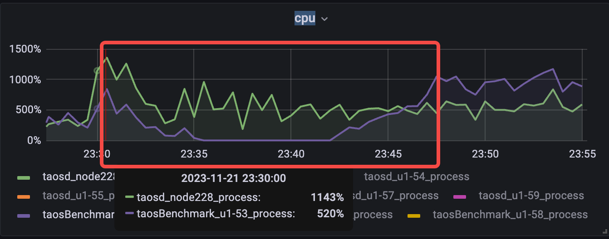
