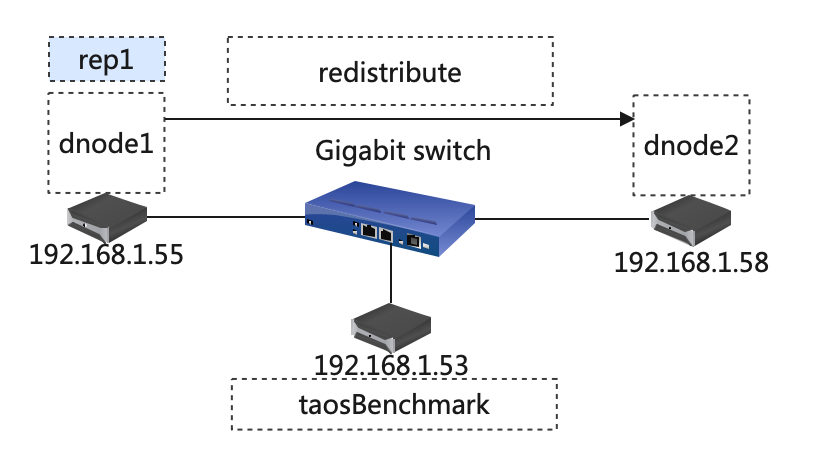
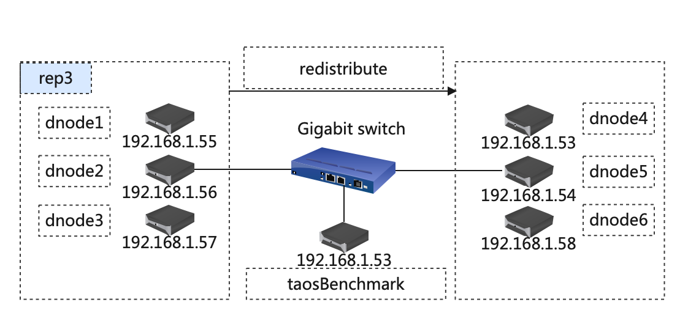
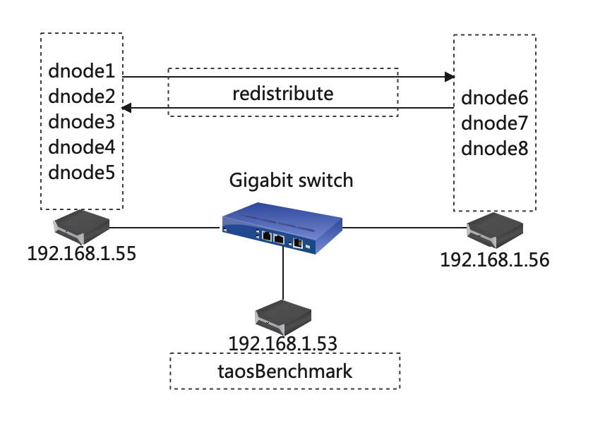
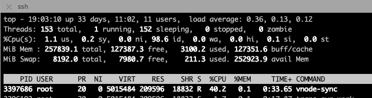
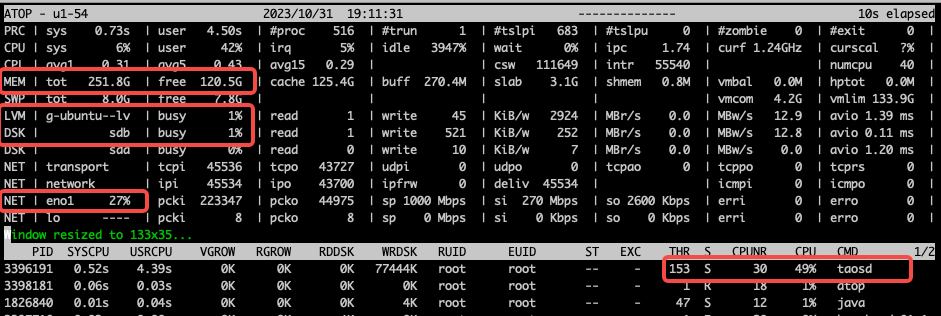
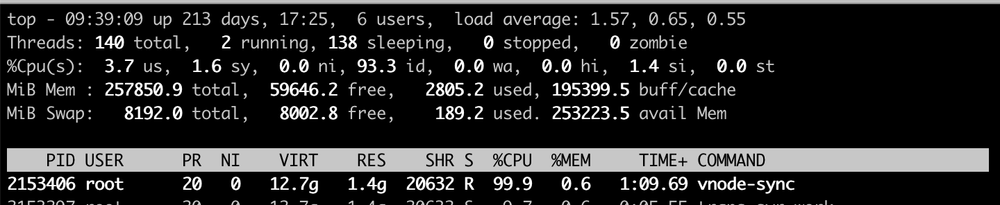
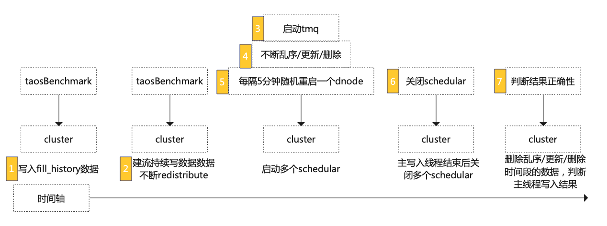

# [Test Report] redistribute测试报告

## 一.概述

[TD-26543](https://jira.taosdata.com:18080/browse/TD-26543) 基于 redistribute 功能、性能及大数据量稳定性进行测试

## 二. 软硬件环境

### **1.1 硬件环境**

| **硬件环境** | **IP** | 用途 | **CPU** | **内存** | **硬盘** |
| --- | --- | --- | --- | --- | --- |
| 192.168.1.53 | taosd/taosBenchmark |
| 192.168.1.54 | taosd |
| 192.168.1.55 | taosd |
| 192.168.1.56 | taosd |
| 192.168.1.57 | taosd |
| 192.168.1.58 | taosd |

### **1.2 软件环境**

| **软件环境(main分支)** | **IP** | **运行目录** | **脚本及配置** | **commitID** |
| --- | --- | --- | --- | --- |
| **TDengine** | 192.168.1.53～58 | /root/TDengine | taostest --setup=cluster/redistribute_split_test.yaml --case=cluster/redistribute_test.py --keep taostest --setup=Performance/cluster/redistribute_split_perf_test.yaml --case=Performance/cluster/redistribute_perf_test.py --keep | TDinternal(b578204909ea2a253a13140dd468a97a8b3b77ae) community(1409f3eeb129d6cd9ede50fd5e7a98dbef2e0dc0) |

###  **1.3 拓扑图**

#### 1.3.1 功能测试

#### 1.3.2 性能测试

#### 1.3.3 稳定性测试(同功能测试)

## 三. 测试场景

|  | 测试点 | 描述 |
| --- | --- | --- |
| 功能 | 存在数据的节点间 redistribute | 单机环境建 5 节点集群，数据写入过程中进行 redistribute |
|  | 存在数据的节点间进行 redistribute 还原 | Redistribute vgroup 后再次 redistribute 进行还原 |
|  | 向新增的节点 redistribute | 新增3个节点后，数据写入过程中进行 redistribute，目标是3个节点的1个或多个 |
|  | 从新增的节点进行 redistribute 还原 | Redistribute vgroup后再次redistribute进行还原 |
|  | 以上场景叠加 steam | Redistribute vgroup 含 stream |
|  | 以上场景叠加 tmq | Redistribute vgroup 含 tmq |
|  | 以上场景叠加乱序、更新、删除 | Redistribute覆盖乱序、更新、删除 |
|  | 以上场景叠加间歇性重启 dnode 操作 | Redistribute vgroup 时有 restart dnode 操作 |
|  | rebalance 测试 | 全部手动 redistribute 后进行 rebalance 测试 |
| 性能 | 计算单个 vgroup 15G 30G 时迁移速度 | 单副本、三副本分别验证 |
| 稳定性测试 | 长时间大数据量测试 | 将功能测试项尽可能叠加，数据量调大进行长时间压测 |

## 四.测试用例：

### 4.1 功能测试（以下测试均覆盖单副本/三副本）

| **序号** | **测试点** | **测试步骤** | **测试结果** |
| --- | --- | --- | --- |
| 1 | 存在数据的节点间 redistribute | 1. 单机环境 A 建5节点集群； 1. 数据写入过程中进行 redistribute； 1. 写入完成后确认最终结果； | 通过 |
| 2 | 存在数据的节点间进行 redistribute 还原 | 1. 继续序号1的测试； 1. Redistribute vgroup 后再次 redistribute 进行还原； 1. 写入完成后确认最终结果； | 通过 |
| 3 | 向新增的节点 redistribute | 1. 在单机环境 B 新增 3 个节点； 1. 数据写入过程中进行 redistribute，目标是3个节点的1个或多个； 1. 写入完成后确认最终结果； | 通过 |
| 4 | 从新增的节点进行 redistribute 还原 | 1. 继续序号 3 的测试； 1. Redistribute vgroup 后再次 redistribute 进行还原； 1. 写入完成后确认最终结果； | 通过 |
| 5 | 以上场景叠加 steam | 1. taosBenchmark json 配置 stream 信息不断写入数据； 1. 数据写入过程中进行 redistribute； 1. 写入完成后确认最终结果； | 通过 |
| 6 | 以上场景叠加 tmq | 1. 组合以上场景，数据写入过程中新增 TMQ； 1. 消费过程中进行 redistribute； 1. 写入完成后确认最终结果； | 通过 |
| 7 | 以上场景叠加乱序、更新、删除 | 1. 组合以上场景，额外起一个 taosBenchmark 不断进行乱序、更新、删除操作； 1. 在主线程任务完成后，kill 掉这个 taosBenchmark 并将写入时间段的数据删除，以免影响最终结果； 1. 写入完成后确认最终结果； | 通过 |
| 8 | 以上场景叠加间歇性重启dnode操作 | 1. 组合以上场景，额外起一个 thread 不断进行随机 dnode restart 操作； 1. 过程中进行随机 dnode restart； 1. 写入完成后确认最终结果； | 通过 |
| 9 | rebalance测试 | 1. 以上场景全部手动 redistribute 后进行 rebalance 测试； 1. 写入完成后确认最终结果； | 通过 |

### 4.2 性能测试

<callout emoji="small_blue_diamond" background-color="light-orange" border-color="light-orange">
Redistribute 日志关键信息：
start（start to redistribute vgroup to dnode）
finish（vgId:*.*msgType:alter-confirm）
单副本结束标志可以按以上方法确认，三副本也可以在 show vnodes 时迁移 vg_id 的 restored 均为 true 即可）
</callout>

| **序号** | **测试点** | **测试步骤** | **测试结果** |
| --- | --- | --- | --- |
| 1 | 单副本单个 vnode 迁移，vnode 大小15G | 1.启动 taosBenchmark 写入100亿数据； 2.写入完成后新增一个 dnode 进行迁移; 3.记录日志时间区间； | root@u1-56 /var/lib/taos/vnode $ du -sh * 15G vnode2 耗时近30分钟(11:34:53~12:04:32)，迁移速度约为 8.5M/s |
| 2 | 单副本单个 vnode 迁移，vnode 大小30G | 1.继续序号 1 的测试，再次写入 100 亿 数据； 2.写入完成后再次新增一个 dnode 进行迁移; 3.记录日志时间区间； | root@u1-55 /var/lib/taos/vnode $ du -sh * 30G vnode2 耗时近60分钟（13:56:11~14:55:37），迁移速度约为 8.5M/s |
| 3 | 三副本vnode迁移，每个 dnode 上的vnode 大小均为 15G | 1.启动 taosBenchmark 写入100亿数据； 2.写入完成后新增三个 dnode 进行迁移; 3.记录日志时间区间； | 耗时35分钟 (17:40:41~18:15:12)，迁移速度约为 7.3 M/s |

迁移过程中的资源占用：
1.vnode-sync：目前看是单线程 sync，且仅占用了 30%-40% 的 CPU，是有很大提升空间的；

2.系统 CPU/内存/磁盘IO/网络IO：很低

**2023.11.6性能更新（branch 3.0）**
TDinternal：dbde20056c9fd9f004ae318e597c008aba8d9d64
community：0c4040b48eba6ca618f6a396f8e237a2733da350

| **序号** | **测试点** | **测试步骤** | **测试结果** |
| --- | --- | --- | --- |
| 1 | 单副本单个 vnode 迁移，vnode 大小15G | 1.启动 taosBenchmark 写入 100 亿数据； 2.写入完成后新增一个 dnode 进行迁移; 3.记录日志时间区间； | root@u1-55 /var/lib/taos/vnode $ du -sh * 15G vnode2 耗时 580s，迁移速度约为 25.9 M/s |
| 2 | 三副本vnode迁移，每个 dnode 上的vnode 大小均为 15G | 1.启动 taosBenchmark 写入 100 亿数据； 2.写入完成后新增三个 dnode 进行迁移; 3.记录日志时间区间； | 耗时 2849s，迁移速度约为 15.9 M/s |

迁移期间 taosd 资源占用：

| rep1 | CPU（%） | MEM（M） | DISK_IO(%) | NET(Kb/s) |
| --- | --- | --- | --- | --- |
| u1-55 | 92 | 2245 | 1.5 | 837037 |
| u1-58 | 139 | 1685 | 1.41 | 870992 |

| rep3 | CPU（%） | MEM（M） | DISK_IO(%) | NET(Kb/s) |
| --- | --- | --- | --- | --- |
| u1-55 | 1.5 | 949 | 0.14 | 172 |
| u1-56 | 36 | 2478 | 0.11 | 344554 |
| u1-57 | 39 | 2419 | 0.11 | 356285 |
| u1-53 | 113 | 2884 | 0.63 | 508903 |
| u1-54 | 52 | 865 | 0.08 | 184086 |
| u1-58 | 65 | 1694 | 0.32 | 189964 |

### 4.3 稳定性测试

| 测试点 | 测试步骤 | 结果 |
| --- | --- | --- |
| 覆盖所有功能点，长时间大数据量压测 | 写入过程中组合更新、乱序、删除、stream、tmq、restart dnode等一系列操作，且往复进行，确保最终数据结果正确，且不会出现 Crash 和OOM等现象； | 持续压测中 |

## 五. 测试结论

1. 报告所覆盖测试项均已通过，部分 bug 待修复；
2. 目前 redistribute 性能依然在优化，仅测试了写入停止情况下的性能，待 [TS-4092](https://jira.taosdata.com:18080/browse/TS-4092) 修复后进一步测试；

## 六. 问题单

| **JiraID** | **Describe** | **Status** |
| --- | --- | --- |
| [~~TD-26988~~](https://jira.taosdata.com:18080/browse/TD-26988)~~ ~~ | redistribute+stream+tmq+restart_dnode 一个节点crash | **DONE** |
| [~~TD-26860~~](https://jira.taosdata.com:18080/browse/TD-26860) | redistribute+stream+restart_dnode事务卡住 | **DONE** |
| [~~TD-26781~~](https://jira.taosdata.com:18080/browse/TD-26781) | stream redistribute detected memory leaks | **DONE** |
| [~~TD-26771~~](https://jira.taosdata.com:18080/browse/TD-26771) | 三副本redistribute时一个节点crash | **DONE** |
| [~~TD-26760~~](https://jira.taosdata.com:18080/browse/TD-26760) | 配置流，三副本写入过程中redistribute卡住 | **DONE** |
| [~~TD-27070~~](https://jira.taosdata.com:18080/browse/TD-27070) | redistribute+restart dnode 卡 stream-task-up | **DONE** |
| [TD-26952](https://jira.taosdata.com:18080/browse/TD-26952) | stream redistribute memory leaks | **NEW** |
| [TD-27171](https://jira.taosdata.com:18080/browse/TD-27171) | [2节点单副本redistribute时报错'Invalid vgroup replica'](https://jira.taosdata.com:18080/browse/TD-27171) | **NEW** |
