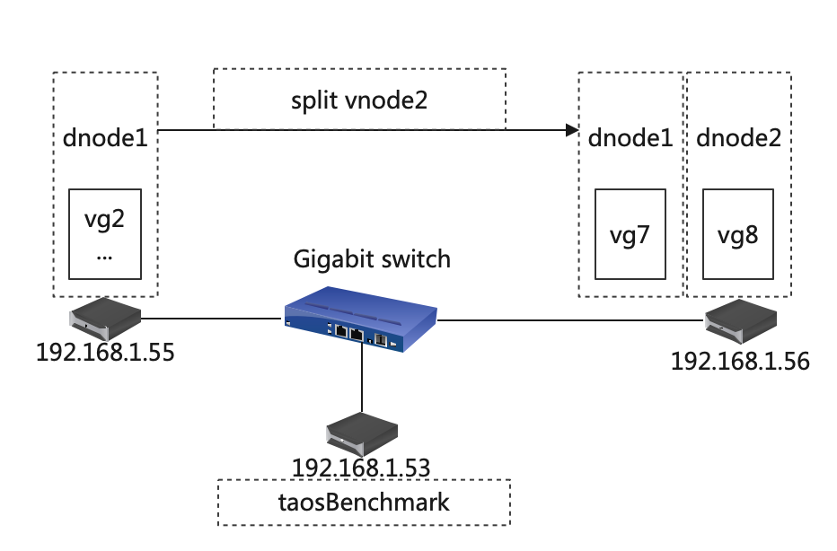
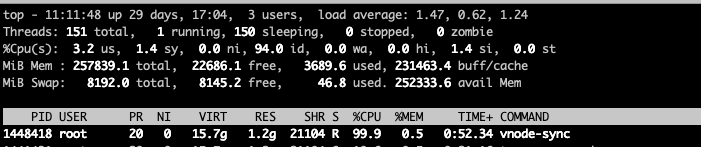
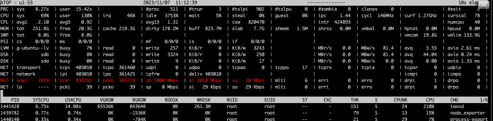
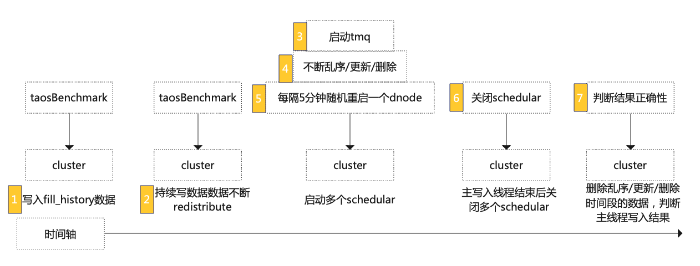

# [Test Report] split测试报告

## 一.概述

[TD-26543](https://jira.taosdata.com:18080/browse/TD-26543) 基于 split 功能、性能及大数据量稳定性进行测试

## 二. 软硬件环境

### **1.1 硬件环境**

| **硬件环境** | **IP** | 用途 | **CPU** | **内存** | **硬盘** |
| --- | --- | --- | --- | --- | --- |
| 192.168.1.53 | taosd/taosBenchmark |
| 192.168.1.54 | taosd |
| 192.168.1.55 | taosd |
| 192.168.1.56 | taosd |
| 192.168.1.57 | taosd |
| 192.168.1.58 | taosd |

### **1.2 软件环境**

| **软件环境(main分支)** | **IP** | **运行目录** | **脚本及配置** | **commitID** |
| --- | --- | --- | --- | --- |
| **TDengine** | 192.168.1.53～58 | /root/TDengine | taostest --setup=cluster/redistribute_split_test.yaml --case=cluster/vnode_split_test.py --keep taostest --setup=Performance/cluster/redistribute_split_perf_test_rep3.yaml --case=Performance/cluster/redistribute_perf_test.py --keep | TDinternal(b578204909ea2a253a13140dd468a97a8b3b77ae) community(1409f3eeb129d6cd9ede50fd5e7a98dbef2e0dc0) |

###  **1.3 拓扑图**

## 三. 测试场景

|  | 测试点 | 描述 |
| --- | --- | --- |
| 功能 | 存在数据的节点间 split | 单机环境建 5 节点集群，数据写入过程中进行 split |
|  | 向新增的节点 split | 新增3个节点后，数据写入过程中进行 split |
|  | 以上场景叠加 steam | Split vgroup 含 stream |
|  | 以上场景叠加 tmq | Split vgroup 含 tmq |
|  | 以上场景叠加乱序、更新、删除 | Split覆盖乱序、更新、删除 |
|  | 以上场景叠加间歇性重启 dnode 操作 | Split vgroup 时有 restart dnode 操作 |
| 性能 | 计算单个 vgroup 15G 时 split 速度 |  |
| 稳定性测试 | 长时间大数据量测试 | 将功能测试项尽可能叠加，数据量调大进行长时间压测 |

## 四.测试用例：

### 4.1 功能测试（以下测试均覆盖单副本/三副本）

| **序号** | **测试点** | **测试步骤** | **测试结果** |
| --- | --- | --- | --- |
| 1 | 存在数据的节点间 split | 1. 单机环境 A 建5节点集群； 1. 数据写入过程中进行 split； 1. 写入完成后确认最终结果； | 通过 |
| 3 | 向新增的节点 split | 1. 在单机环境 B 新增 3 个节点； 1. 数据写入过程中进行 split，目标是3个节点的1个或多个； 1. 写入完成后确认最终结果； | 通过 |
| 5 | 以上场景叠加 steam | 1. taosBenchmark json 配置 stream 信息不断写入数据； 1. 数据写入过程中进行 split； 1. 写入完成后确认最终结果； | Stream 不支持 split |
| 6 | 以上场景叠加 tmq | 1. 组合以上场景，数据写入过程中新增 TMQ； 1. 消费过程中进行 split； 1. 写入完成后确认最终结果； | 通过 |
| 7 | 以上场景叠加乱序、更新、删除 | 1. 组合以上场景，额外起一个 taosBenchmark 不断进行乱序、更新、删除操作； 1. 在主线程任务完成后，kill 掉这个 taosBenchmark 并将写入时间段的数据删除，以免影响最终结果； 1. 写入完成后确认最终结果； | 通过 |
| 8 | 以上场景叠加间歇性重启dnode操作 | 1. 组合以上场景，额外起一个 thread 不断进行随机 dnode restart 操作； 1. 过程中进行随机 dnode restart； 1. 写入完成后确认最终结果； | 通过 |

### 4.2 性能测试（3.0）

TDinternal：dbde20056c9fd9f004ae318e597c008aba8d9d64
community：0c4040b48eba6ca618f6a396f8e237a2733da350
<callout emoji="small_blue_diamond" background-color="light-orange" border-color="light-orange">
split 日志关键信息：
start（vgId:.*, start to split）
finish（vgId:*.*msgType:alter-confirm）
</callout>

| 序号 | 测试点 | 测试步骤 | 测试结果 |
| --- | --- | --- | --- |
| 1 | 单副本单个 vnode split，vnode 大小15G | 1.启动 taosBenchmark 写入 100 亿数据； 2.写入完成后新增一个 dnode 进行 split; 3.记录日志时间区间； | root@u1-55 /var/lib/taos/vnode $ du -sh * 15G vnode2 耗时 573s，迁移速度约为 26.2 M/s |
| 2 | 三副本vnode split，每个 dnode 上的vnode 大小均为 15G | 1.启动 taosBenchmark 写入 100 亿数据； 2.写入完成后新增三个 dnode 进行 split; 3.记录日志时间区间； | 耗时 996s，迁移速度约为 30.8 M/s |

迁移期间 taosd 资源占用（avg）：

| rep1 | CPU（%） | MEM（M） | DISK_IO(%) | NET(Kb/s) |
| --- | --- | --- | --- | --- |
| u1-55 | 98 | 2235 | 3.11 | 850635 |
| u1-58 | 144 | 1458 | 1.69 | 890480 |

| rep3 | CPU（%） | MEM（M） | DISK_IO(%) | NET(Kb/s) |
| --- | --- | --- | --- | --- |
| u1-55 | 1.46 | 1015 | 0.13 | 167 |
| u1-56 | 50 | 1831 | 0.13 | 512268 |
| u1-57 | 26 | 1407 | 0.1 | 258854 |
| u1-53 | 71 | 1293 | 0.14 | 261487 |
| u1-54 | 86 | 1180 | 0.10 | 514799 |
| u1-58 | 45 | 740 | 0.39 | 256124 |

### 4.3 稳定性测试

| 测试点 | 测试步骤 | 结果 |
| --- | --- | --- |
| 覆盖所有功能点，长时间大数据量压测 | 写入过程中组合更新、乱序、删除、tmq、restart dnode等一系列操作，且往复进行，确保最终数据结果正确，且不会出现 Crash 和OOM等现象； | 持续压测中 |

## 五. 测试结论

1. 报告所覆盖测试项均已通过，稳定性测试持续进行中；
2. 目前 split 性能依然在优化，待完成后进一步测试；
