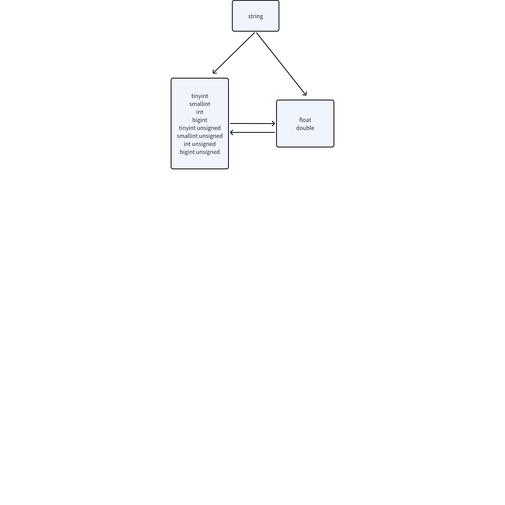

# [Test Report] - 整数类型写入浮点数优化

## 1. 背景：

TS-4278

## 2. 测试场景：

1. 整形写入浮点数
2. 浮点数写入整形
3. 可以转换为整形的字符串写入浮点数
4. 可以转换为浮点数的字符串写入整形

## 3. 测试数据：

1. 合法数据
- -10、+10、"-10"、"+10"
- -0042、+0042、"-0042"、"+0042"
- -4.3、 +4.3、"-4.3"、 "+4.3"
- -12.、+12.、"-12."、"+12."
- -2.324e2、+2.324e2、"-2.324e2"、"+2.324e2"
- -2.e1、+2.e1、"-2.e1"、"+2.e1"
- -0x40、+0x40、"-0x40"、"+0x40"
- -0b10010、+0b10010、"-0b10010"、"+0b10010"
1. 非法数据
- 越界数字
- 无法转换成数字的字符串

## 4. 数据类型：



## 5. Meta data

Stable name: stb
Columns: c1 tinyint, c2 tinyint unsigned, c3 smallint, c4 smallint unsigned, c5 int, c6 int unsigned, c7 bigint, c8 bigint unsigned, c9 float, c10 double
```sql
create table stb (ts timestamp, c1 tinyint, c2 tinyint unsigned, c3 smallint, c4 smallint unsigned, c5 int, c6 int unsigned, c7 bigint, c8 bigint unsigned, c9 float, c10 double) tags(t1 tinyint, t2 tinyint unsigned, t3 smallint, t4 smallint unsi
gned, t5 int, t6 int unsigned, t7 bigint, t8 bigint unsigned, t9 float, t10 double);
```

Tags: t1 tinyint, t2 tinyint unsigned, t3 smallint, t4 smallint unsigned, t5 int, t6 int unsigned, t7 bigint, t8 bigint unsigned, t9 float, t10 double
Table name: t1

## 6. 测试用例

### 6.1 Interconversion between Tinyint, tinyint unsigned and float, double 

| Type | Case | Expected Result | Actual Result |
| --- | --- | --- | --- |
| Insert into t1(ts, c9) values(now, 1) Insert into t1(ts, c9) values(now, -1) | **Pass** | **Pass** |
| Create table t2 using stb(t9) tags(1) Create table t3 using stb(t9) tags(-1) | **Pass** | **Pass** |
| Insert into t2(ts, c1) values(now, 1.2) Insert into t2(ts, c1) values(now, -1.2) Insert into t2(ts, c1) values(now, 1.6) Insert into t2(ts, c1) values(now, -1.6) | **Pass** | **Pass** |
| Create table t4 using stb(t1) tags(1.1) Create table t5 using stb(t1) tags(-1.1) Create table t6 using stb(t1) tags(1.8) Create table t7 using stb(t1) tags(-1.8) | **Pass** | **Fail** |
| Insert into t4(ts, c9) values(now, "2") Insert into t4(ts, c9) values(now, "-2") | **Pass** | **Pass** |
| Create table t8 using stb(t9) tags("2") Create table t9 using stb(t9) tags("-2") | **Pass** | **Pass** |
| Insert into t8(ts, c1) values(now, "1.2") Insert into t8(ts, c1) values(now, "-1.2") Insert into t9(ts, c1) values(now, "1.7") Insert into t9(ts, c1) values(now, "-1.7") | **Pass** | **Pass** |
| Create table t10 using stb(t1) tags("1.1") Create table t11 using stb(t1) tags("-1.1") Create table t12 using stb(t1) tags("1.8") Create table t13 using stb(t1) tags("-1.8") | **Pass** | **Fail** |
| Insert into d1(ts, c9) values(now, 1) Insert into d1(ts, c9) values(now, -1) | **Pass** | **Pass** |
| Create table d2 using stb(t9) tags(1) Create table d3 using stb(t9) tags(-1) | **Pass** | **Pass** |
| Insert into d2(ts, c1) values(now, 1.2) Insert into d2(ts, c1) values(now, -1.2) Insert into d2(ts, c1) values(now, 1.6) Insert into d2(ts, c1) values(now, -1.6) | **Pass** | **Pass** |
| Create table d4 using stb(t1) tags(1.1) Create table d5 using stb(t1) tags(-1.1) Create table d6 using stb(t1) tags(1.8) Create table d7 using stb(t1) tags(-1.8) | **Pass** | **Fail** |
| Insert into d4(ts, c9) values(now, "2") Insert into d4(ts, c9) values(now, "-2") | **Pass** | **Pass** |
| Create table d8 using stb(t9) tags("2") Create table d9 using stb(t9) tags("-2") | **Pass** | **Pass** |
| Insert into d8(ts, c1) values(now, "1.2") Insert into d8(ts, c1) values(now, "-1.2") Insert into d9(ts, c1) values(now, "1.7") Insert into d9(ts, c1) values(now, "-1.7") | **Pass** | **Pass** |
| Create table d10 using stb(t1) tags("1.1") Create table d11 using stb(t1) tags("-1.1") Create table d12 using stb(t1) tags("1.8") Create table d13 using stb(t1) tags("-1.8") | **Pass** | **Fail** |
| Insert into t1(ts, c9) values(now, 1) | **Pass** | **Pass** |
| Create table t2 using stb(t9) tags(1) | **Pass** | **Pass** |
| Insert into t2(ts, c2) values(now, 1.2) | **Pass** | **Pass** |
| create table t4 using stb(t2) tags(1.1) | **Pass** | **Fail** |
| Insert into t4(ts, c9) values(now, "2") | **Pass** | **Pass** |
| Create table t8 using stb(t9) tags("2") | **Pass** | **Pass** |
| Insert into t8(ts, c2) values(now, "1.2") Insert into t8(ts, c2) values(now, "1.7") | **Pass** | **Pass** |
|  |
|  |
| Insert into t8(ts, c2) values(now, "1.2") Insert into t8(ts, c2) values(now, "1.7") Create table t11 using stb(t1) tags("-1.1") Create table t13 using stb(t1) tags("-1.8") | **Fail** | **Fail** |
| Insert into t10(ts, c10) values(now, 1) | **Pass** | **Pass** |
| create table t11 using stb(t2) tags(1) | **Pass** | **Pass** |
| Insert into t8(ts, c2) values(now, 1.2) Insert into t8(ts, c2) values(now, 1.6) | **Pass** | **Pass** |
| Create table t14 using stb(t2) tags(1.1) Create table t15 using stb(t2) tags(1.8) | **Pass** | **Fail** |
| Insert into t9(ts, c2) values(now, -1.2) Insert into t9(ts, c2) values(now, -1.6) Create table d4 using stb(t2) tags(-1.1) Create table d6 using stb(t2) tags(-1.8) | **Fail** | **Fail** |
| Insert into t8(ts, c9) values(now, "2") | **Pass** | **Pass** |
| Create table t14 using stb(t9) tags("2") | **Pass** | **Pass** |
| Insert into t8(ts, c2) values(now, "1.2") Insert into t8(ts, c2) values(now, "1.7") | **Pass** | **Pass** |
|  |
|  |
| Create table d10 using stb(t1) tags("1.1") Create table d12 using stb(t1) tags("1.8") | **Pass** | **Fail** |

### 6.2 Interconversion between smallint, smallint unsigned and float, double

| Type | Case | Expected Result | Actual Result |
| --- | --- | --- | --- |
| Insert into t1(ts, c9) values(now, 1) Insert into t1(ts, c9) values(now, -1) | **Pass** | **Pass** |
| Create table t2 using stb(t9) tags(1) Create table t3 using stb(t9) tags(-1) | **Pass** | **Pass** |
| Insert into t2(ts, c1) values(now, 1.2) Insert into t2(ts, c1) values(now, -1.2) Insert into t2(ts, c1) values(now, 1.6) Insert into t2(ts, c1) values(now, -1.6) | **Pass** | **Pass** |
| Create table t4 using stb(t1) tags(1.1) Create table t5 using stb(t1) tags(-1.1) Create table t6 using stb(t1) tags(1.8) Create table t7 using stb(t1) tags(-1.8) | **Pass** | **Fail** |
| Insert into t4(ts, c9) values(now, "2") Insert into t4(ts, c9) values(now, "-2") | **Pass** | **Pass** |
| Create table t8 using stb(t9) tags("2") Create table t9 using stb(t9) tags("-2") | **Pass** | **Pass** |
| Insert into t8(ts, c1) values(now, "1.2") Insert into t8(ts, c1) values(now, "-1.2") Insert into t9(ts, c1) values(now, "1.7") Insert into t9(ts, c1) values(now, "-1.7") | **Pass** | **Pass** |
| Create table t10 using stb(t1) tags("1.1") Create table t11 using stb(t1) tags("-1.1") Create table t12 using stb(t1) tags("1.8") Create table t13 using stb(t1) tags("-1.8") | **Pass** | **Fail** |
| Insert into d1(ts, c9) values(now, 1) Insert into d1(ts, c9) values(now, -1) | **Pass** | **Pass** |
| Create table d2 using stb(t9) tags(1) Create table d3 using stb(t9) tags(-1) | **Pass** | **Pass** |
| Insert into d2(ts, c1) values(now, 1.2) Insert into d2(ts, c1) values(now, -1.2) Insert into d2(ts, c1) values(now, 1.6) Insert into d2(ts, c1) values(now, -1.6) | **Pass** | **Pass** |
| Create table d4 using stb(t1) tags(1.1) Create table d5 using stb(t1) tags(-1.1) Create table d6 using stb(t1) tags(1.8) Create table d7 using stb(t1) tags(-1.8) | **Pass** | **Fail** |
| Insert into d4(ts, c9) values(now, "2") Insert into d4(ts, c9) values(now, "-2") | **Pass** | **Pass** |
| Create table d8 using stb(t9) tags("2") Create table d9 using stb(t9) tags("-2") | **Pass** | **Pass** |
| Insert into d8(ts, c1) values(now, "1.2") Insert into d8(ts, c1) values(now, "-1.2") Insert into d9(ts, c1) values(now, "1.7") Insert into d9(ts, c1) values(now, "-1.7") | **Pass** | **Pass** |
| Create table d10 using stb(t1) tags("1.1") Create table d11 using stb(t1) tags("-1.1") Create table d12 using stb(t1) tags("1.8") Create table d13 using stb(t1) tags("-1.8") | **Pass** | **Fail** |
| Insert into t1(ts, c9) values(now, 1) | **Pass** | **Pass** |
| Create table t2 using stb(t9) tags(1) | **Pass** | **Pass** |
| Insert into t2(ts, c2) values(now, 1.2) | **Pass** | **Pass** |
| create table t4 using stb(t2) tags(1.1) | **Pass** | **Fail** |
| Insert into t4(ts, c9) values(now, "2") | **Pass** | **Pass** |
| Create table t8 using stb(t9) tags("2") | **Pass** | **Pass** |
| Insert into t8(ts, c2) values(now, "1.2") Insert into t8(ts, c2) values(now, "1.7") | **Pass** | **Pass** |
|  |
|  |
| Insert into t8(ts, c2) values(now, "1.2") Insert into t8(ts, c2) values(now, "1.7") Create table t11 using stb(t1) tags("-1.1") Create table t13 using stb(t1) tags("-1.8") | **Fail** | **Fail** |
| Insert into t10(ts, c10) values(now, 1) | **Pass** | **Pass** |
| create table t11 using stb(t2) tags(1) | **Pass** | **Pass** |
| Insert into t8(ts, c2) values(now, 1.2) Insert into t8(ts, c2) values(now, 1.6) | **Pass** | **Pass** |
| Create table t14 using stb(t2) tags(1.1) Create table t15 using stb(t2) tags(1.8) | **Pass** | **Fail** |
| Insert into t9(ts, c2) values(now, -1.2) Insert into t9(ts, c2) values(now, -1.6) Create table d4 using stb(t2) tags(-1.1) Create table d6 using stb(t2) tags(-1.8) | **Fail** | **Fail** |
| Insert into t8(ts, c9) values(now, "2") | **Pass** | **Pass** |
| Create table t14 using stb(t9) tags("2") | **Pass** | **Pass** |
| Insert into t8(ts, c2) values(now, "1.2") Insert into t8(ts, c2) values(now, "1.7") | **Pass** | **Pass** |
|  |
|  |
| Create table d10 using stb(t1) tags("1.1") Create table d12 using stb(t1) tags("1.8") | **Pass** | **Fail** |

### 6.3 Interconversion between int, int unsigned and float, double 

| Type | Case | Expected Result | Actual Result |
| --- | --- | --- | --- |
| Insert into t1(ts, c9) values(now, 1) Insert into t1(ts, c9) values(now, -1) | **Pass** | **Pass** |
| Create table t2 using stb(t9) tags(1) Create table t3 using stb(t9) tags(-1) | **Pass** | **Pass** |
| Insert into t2(ts, c1) values(now, 1.2) Insert into t2(ts, c1) values(now, -1.2) Insert into t2(ts, c1) values(now, 1.6) Insert into t2(ts, c1) values(now, -1.6) | **Pass** | **Pass** |
| Create table t4 using stb(t1) tags(1.1) Create table t5 using stb(t1) tags(-1.1) Create table t6 using stb(t1) tags(1.8) Create table t7 using stb(t1) tags(-1.8) | **Pass** | **Fail** |
| Insert into t4(ts, c9) values(now, "2") Insert into t4(ts, c9) values(now, "-2") | **Pass** | **Pass** |
| Create table t8 using stb(t9) tags("2") Create table t9 using stb(t9) tags("-2") | **Pass** | **Pass** |
| Insert into t8(ts, c1) values(now, "1.2") Insert into t8(ts, c1) values(now, "-1.2") Insert into t9(ts, c1) values(now, "1.7") Insert into t9(ts, c1) values(now, "-1.7") | **Pass** | **Pass** |
| Create table t10 using stb(t1) tags("1.1") Create table t11 using stb(t1) tags("-1.1") Create table t12 using stb(t1) tags("1.8") Create table t13 using stb(t1) tags("-1.8") | **Pass** | **Fail** |
| Insert into d1(ts, c9) values(now, 1) Insert into d1(ts, c9) values(now, -1) | **Pass** | **Pass** |
| Create table d2 using stb(t9) tags(1) Create table d3 using stb(t9) tags(-1) | **Pass** | **Pass** |
| Insert into d2(ts, c1) values(now, 1.2) Insert into d2(ts, c1) values(now, -1.2) Insert into d2(ts, c1) values(now, 1.6) Insert into d2(ts, c1) values(now, -1.6) | **Pass** | **Pass** |
| Create table d4 using stb(t1) tags(1.1) Create table d5 using stb(t1) tags(-1.1) Create table d6 using stb(t1) tags(1.8) Create table d7 using stb(t1) tags(-1.8) | **Pass** | **Fail** |
| Insert into d4(ts, c9) values(now, "2") Insert into d4(ts, c9) values(now, "-2") | **Pass** | **Pass** |
| Create table d8 using stb(t9) tags("2") Create table d9 using stb(t9) tags("-2") | **Pass** | **Pass** |
| Insert into d8(ts, c1) values(now, "1.2") Insert into d8(ts, c1) values(now, "-1.2") Insert into d9(ts, c1) values(now, "1.7") Insert into d9(ts, c1) values(now, "-1.7") | **Pass** | **Pass** |
| Create table d10 using stb(t1) tags("1.1") Create table d11 using stb(t1) tags("-1.1") Create table d12 using stb(t1) tags("1.8") Create table d13 using stb(t1) tags("-1.8") | **Pass** | **Fail** |
| Insert into t1(ts, c9) values(now, 1) | **Pass** | **Pass** |
| Create table t2 using stb(t9) tags(1) | **Pass** | **Pass** |
| Insert into t2(ts, c2) values(now, 1.2) | **Pass** | **Pass** |
| create table t4 using stb(t2) tags(1.1) | **Pass** | **Fail** |
| Insert into t4(ts, c9) values(now, "2") | **Pass** | **Pass** |
| Create table t8 using stb(t9) tags("2") | **Pass** | **Pass** |
| Insert into t8(ts, c2) values(now, 1.2) Insert into t8(ts, c2) values(now, 1.6) | **Pass** | **Pass** |
| Create table t14 using stb(t2) tags(1.1) Create table t15 using stb(t2) tags(1.8) | **Pass** | **Fail** |
| Insert into t9(ts, c2) values(now, -1.2) Insert into t9(ts, c2) values(now, -1.6) Create table d4 using stb(t2) tags(-1.1) Create table d6 using stb(t2) tags(-1.8) | **Fail** | **Fail** |
|  |
|  |
| create table t11 using stb(t2) tags(1) | **Pass** | **Pass** |
| Insert into t8(ts, c2) values(now, 1.2) Insert into t8(ts, c2) values(now, 1.6) | **Pass** | **Pass** |
| Create table t14 using stb(t2) tags(1.1) Create table t15 using stb(t2) tags(1.8) | **Pass** | **Fail** |
| Insert into t9(ts, c2) values(now, -1.2) Insert into t9(ts, c2) values(now, -1.6) Create table d4 using stb(t2) tags(-1.1) Create table d6 using stb(t2) tags(-1.8) | **Fail** | **Fail** |
| Insert into t8(ts, c9) values(now, "2") | **Pass** | **Pass** |
| Create table t14 using stb(t9) tags("2") | **Pass** | **Pass** |
| Insert into t8(ts, c2) values(now, "1.2") Insert into t8(ts, c2) values(now, "1.7") | **Pass** | **Pass** |
|  |
|  |
| Create table d10 using stb(t1) tags("1.1") Create table d12 using stb(t1) tags("1.8") | **Pass** | **Fail** |

### 6.4 Interconversion between bigint, bigint unsigned and float, double 

| Type | Case | Expected Result | Actual Result |
| --- | --- | --- | --- |
| Insert into t1(ts, c9) values(now, 1) Insert into t1(ts, c9) values(now, -1) | **Pass** | **Pass** |
| Create table t2 using stb(t9) tags(1) Create table t3 using stb(t9) tags(-1) | **Pass** | **Pass** |
| Insert into t2(ts, c1) values(now, 1.2) Insert into t2(ts, c1) values(now, -1.2) Insert into t2(ts, c1) values(now, 1.6) Insert into t2(ts, c1) values(now, -1.6) | **Pass** | **Pass** |
| Create table t4 using stb(t1) tags(1.1) Create table t5 using stb(t1) tags(-1.1) Create table t6 using stb(t1) tags(1.8) Create table t7 using stb(t1) tags(-1.8) | **Pass** | **Fail** |
| Insert into t4(ts, c9) values(now, "2") Insert into t4(ts, c9) values(now, "-2") | **Pass** | **Pass** |
| Create table t8 using stb(t9) tags("2") Create table t9 using stb(t9) tags("-2") | **Pass** | **Pass** |
| Insert into t8(ts, c1) values(now, "1.2") Insert into t8(ts, c1) values(now, "-1.2") Insert into t9(ts, c1) values(now, "1.7") Insert into t9(ts, c1) values(now, "-1.7") | **Pass** | **Pass** |
| Create table t10 using stb(t1) tags("1.1") Create table t11 using stb(t1) tags("-1.1") Create table t12 using stb(t1) tags("1.8") Create table t13 using stb(t1) tags("-1.8") | **Pass** | **Fail** |
| Insert into d1(ts, c9) values(now, 1) Insert into d1(ts, c9) values(now, -1) | **Pass** | **Pass** |
| Create table d2 using stb(t9) tags(1) Create table d3 using stb(t9) tags(-1) | **Pass** | **Pass** |
| Insert into d2(ts, c1) values(now, 1.2) Insert into d2(ts, c1) values(now, -1.2) Insert into d2(ts, c1) values(now, 1.6) Insert into d2(ts, c1) values(now, -1.6) | **Pass** | **Pass** |
| Create table d4 using stb(t1) tags(1.1) Create table d5 using stb(t1) tags(-1.1) Create table d6 using stb(t1) tags(1.8) Create table d7 using stb(t1) tags(-1.8) | **Pass** | **Fail** |
| Insert into d4(ts, c9) values(now, "2") Insert into d4(ts, c9) values(now, "-2") | **Pass** | **Pass** |
| Create table d8 using stb(t9) tags("2") Create table d9 using stb(t9) tags("-2") | **Pass** | **Pass** |
| Insert into d8(ts, c1) values(now, "1.2") Insert into d8(ts, c1) values(now, "-1.2") Insert into d9(ts, c1) values(now, "1.7") Insert into d9(ts, c1) values(now, "-1.7") | **Pass** | **Pass** |
| Create table d10 using stb(t1) tags("1.1") Create table d11 using stb(t1) tags("-1.1") Create table d12 using stb(t1) tags("1.8") Create table d13 using stb(t1) tags("-1.8") | **Pass** | **Fail** |
| Insert into t1(ts, c9) values(now, 1) | **Pass** | **Pass** |
| Create table t2 using stb(t9) tags(1) | **Pass** | **Pass** |
| Insert into t2(ts, c2) values(now, 1.2) | **Pass** | **Pass** |
| create table t4 using stb(t2) tags(1.1) | **Pass** | **Fail** |
| Insert into t4(ts, c9) values(now, "2") | **Pass** | **Pass** |
| Create table t8 using stb(t9) tags("2") | **Pass** | **Pass** |
| Insert into t8(ts, c2) values(now, 1.2) Insert into t8(ts, c2) values(now, 1.6) | **Pass** | **Pass** |
| Create table t14 using stb(t2) tags(1.1) Create table t15 using stb(t2) tags(1.8) | **Pass** | **Fail** |
| Insert into t9(ts, c2) values(now, -1.2) Insert into t9(ts, c2) values(now, -1.6) Create table d4 using stb(t2) tags(-1.1) Create table d6 using stb(t2) tags(-1.8) | **Fail** | **Fail** |
|  |
|  |
| create table t11 using stb(t2) tags(1) | **Pass** | **Pass** |
| Insert into t8(ts, c2) values(now, 1.2) Insert into t8(ts, c2) values(now, 1.6) | **Pass** | **Pass** |
| Create table t14 using stb(t2) tags(1.1) Create table t15 using stb(t2) tags(1.8) | **Pass** | **Fail** |
| Insert into t9(ts, c2) values(now, -1.2) Insert into t9(ts, c2) values(now, -1.6) Create table d4 using stb(t2) tags(-1.1) Create table d6 using stb(t2) tags(-1.8) | **Fail** | **Fail** |
| Insert into t8(ts, c9) values(now, "2") | **Pass** | **Pass** |
| Create table t14 using stb(t9) tags("2") | **Pass** | **Pass** |
| Insert into t8(ts, c2) values(now, "1.2") Insert into t8(ts, c2) values(now, "1.7") | **Pass** | **Pass** |
|  |
|  |
| Create table d10 using stb(t1) tags("1.1") Create table d12 using stb(t1) tags("1.8") | **Pass** | **Fail** |

## 7. 报告的问题

TD-28579
