# [Test Report] compact可观测/可维护特性测试

<callout emoji="small_blue_diamond" background-color="light-orange" border-color="light-orange">

## 测试结论

1. 报告所覆盖测试项均已完成测试；
2. Kill compact 存在少量内存泄漏，修复中；([TD-27926](https://jira.taosdata.com:18080/browse/TD-27926))
</callout>

## 一.概述

该报告在[[Test Report] compact测试报告](https://taosdata.feishu.cn/wiki/Q48SwbgqWiCya2kYbbZcoQrxnFd) 基础上进行测试，测试范围[COMPACT 观测和维护功能](https://taosdata.feishu.cn/wiki/EunLwROsmi1y5ak8jQBc91GQngd)，因时间较赶，测试方法半自动，脚本中持续打印相关信息，不判断具体返回，通过人工观测的方法进行测试，后续再补充测试脚本。

## 二. 软硬件环境

### **1.1 硬件环境**

| **硬件环境** | **IP** | 用途 | **CPU** | **内存** | **硬盘** |
| --- | --- | --- | --- | --- | --- |
| 192.168.1.58 | taosBenchmark |
| 192.168.1.55 | taosd |
| 192.168.1.56 | taosd |
| 192.168.1.57 | taosd |
| 192.168.1.228 | taosd | Intel(R) Xeon(R) CPU E5-2650 v3 @ 2.30GHz 32核虚拟机 | 64G | PERC H730 Mini 200 |

### **1.2 软件环境**

| **软件环境(3.0)** | **IP** | **运行目录** | **脚本及配置** | **commitID** |
| --- | --- | --- | --- | --- |
| **TDengine** | 192.168.1.55～58 192.168.1.228 | /root/TDengine | taostest --setup=cluster/compact_test.yaml --case=cluster/compact_test.py --keep taostest --setup=cluster/compact_test_rep3.yaml --case=cluster/compact_test.py --keep | TDinternal(a96102e3a41a065134d2d1445e5ea8b2153e20e6) community(c14508158c444347ddeea5f5f587b7e004c6573e) |
| **QEMU 6.0.0** | 192.168.1.55 | /home/kvm/images |  |  |

###  **1.3 拓扑图**

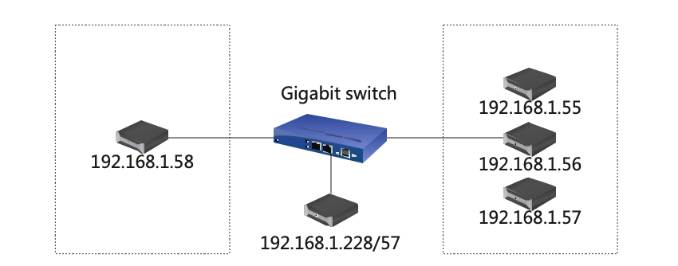

## 三. 测试场景

|  | 测试点 | 描述 |
| --- | --- | --- |
| 功能 | 基础功能验证 | Show compact 相关命令可以在单副本和三副本正常使用 |
|  | compact database 后返回success信息验证 | compact database 成功后会返回 accepted+compact_id+success信息 |
|  | compact database 后返回rejected信息验证 | 在上一次 compact 未完成时进行compact 会返回 rejected+NULL+compaction is ongoing信息 |
|  | compact database + range time 后返回信息验证 | compact database + range time 成功后会返回 accepted+compact_id+success信息 |
|  | compact database + range time 后返回rejected信息验证 | 在上一次 range-compact 未完成时进行compact 会返回 rejected+NULL+compaction is ongoing信息 |
|  | show compacts 返回信息验证 | 在上一次 compact 未完成时 show compacts 会返回 compact_id + dbname + start_time 信息 |
|  | show compact id 返回信息验证 | 在上一次 compact 未完成时 show compact id 会返回 compact_id + vgroup_id + dnode_id + number_fileset + finished + start_time 信息 |
|  | 多个 db compact | show compacts/show compact id/kill compact id 可以成功 |
|  | Kill compact id 验证 | 在上一次 compact 未完成时 kill compact id，然后show compact id 依然能看到 compact 信息，top -Hp `pidof taosd` 可以看到部分 vnode-merge 线程持续满载工作，待线程任务结束后才可看到 show compact id 信息消失 |
|  | show/kill compact + 不存在的 id | 应返回错误信息 |
| 稳定性测试 | 长时间大数据量测试 | 将功能测试项尽可能叠加，数据量调大进行长时间压测 |

## 四.测试用例及测试结果：

| keep | duration | col_count | col_type | tag_count | tag_type | disorder_ratio | update_ratio | delete_ratio |
| --- | --- | --- | --- | --- | --- | --- | --- | --- |
| 11d | 1d | 2 | int | 1 | int | 30 | 30 | 10 |

### 4.1 功能测试（以下测试均覆盖单副本/三副本）

| **序号** | **测试点** | **测试步骤** | **测试结果** |
| --- | --- | --- | --- |
| 1 | 基础功能验证 | 1. 写入一定量数据（含乱序更新删除）； 1. 查询结果； 1. compact database； 1. 查询结果； | 通过 第2步和第4步结果相同 |
| 2 | compact database 后返回success信息验证 | 1. 写入一定量数据（含乱序更新删除）； 1. compact database； | 通过 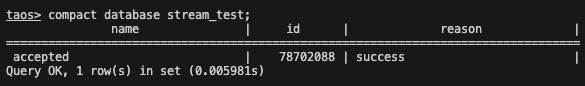 |
| 3 | compact database 后返回rejected信息验证 | 1. 写入一定量数据（含乱序更新删除）； 1. 连续 compact 一个db； | 通过 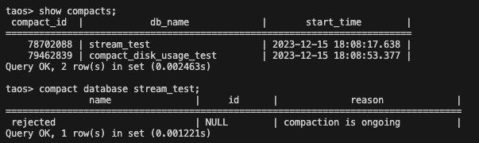 |
| 4 | compact database + range time 后返回信息验证 | 1. 写入一定量数据（含乱序更新删除）； 1. count(*) 查询； 1. compact database *** start *** end ***； | 通过 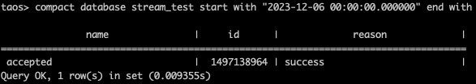 |
| 5 | compact database + range time 后返回rejected信息验证 | 1. 写入一定量数据（含乱序更新删除）； 1. 连续 compact range time 一个 db； | 通过 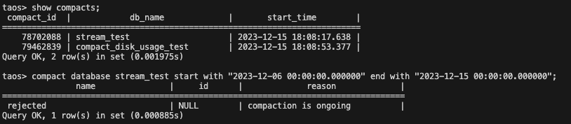 |
| 6 | show compacts 返回信息验证 | 1. 写入一定量数据（含乱序更新删除）； 1. compact database； 1. 执行 show compacts； | 通过 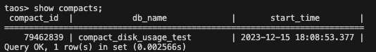 |
| 7 | show compact id 返回信息验证 | 1. 写入一定量数据（含乱序更新删除）； 1. compact database； 1. 执行 show compact id； | 通过 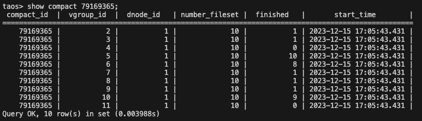 |
| 8 | 多个 db compact | 1. 两个 db 均写入一定量数据（含乱序更新删除）； 1. 对两个 db 进行compact； 1. show compacts； 1. show compact ids； 1. 再次对两个 db 进行compact，中途kill掉； | 2.通过 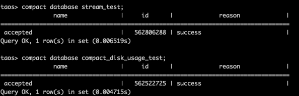 3.通过 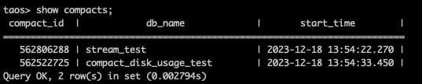 4.通过 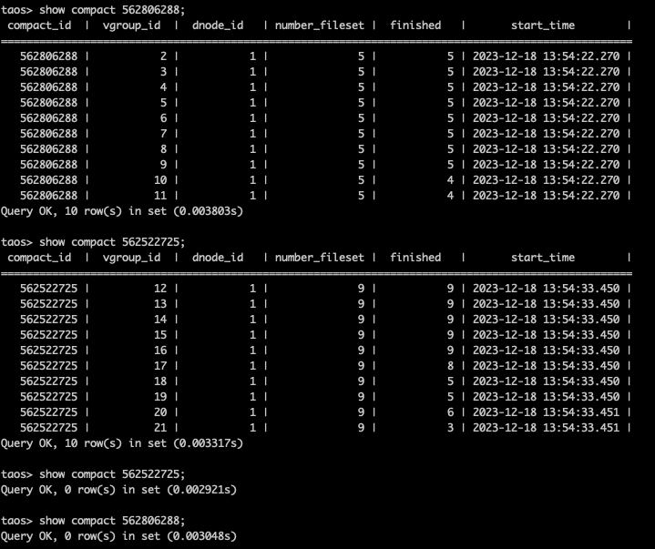 5.通过 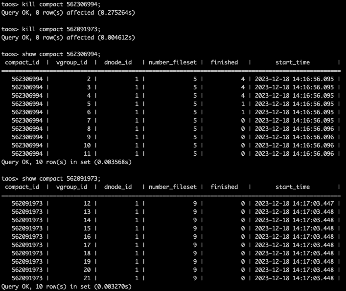 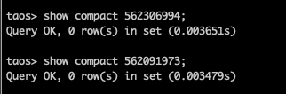 |
| 9 | kill compact id 验证 | 1. 写入一定量数据（含乱序更新删除）； 1. compact database； 1. 执行 kill compact id； | 通过 kill之后show compact id 返回消息不会立即消失 需要等线程任务结束 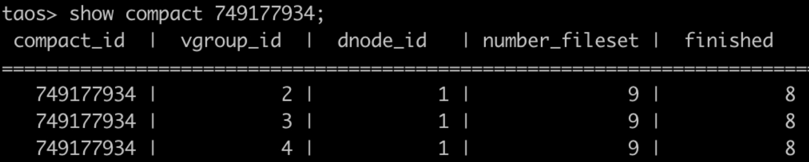 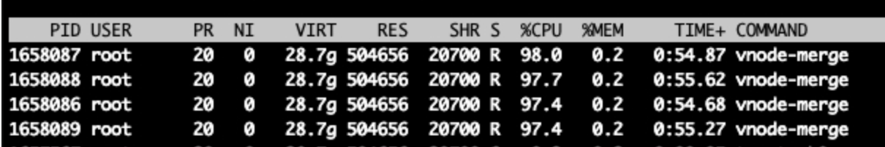 |
| 10 | show/kill compact + 不存在的 id**（优化项）** | show/kill compact + 不存在的id，期待返回不存在的提示信息 | 通过 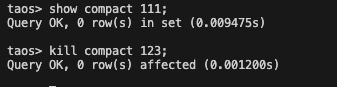 |

### 4.2 稳定性测试

| 测试点 | 测试步骤 | 结果 |
| --- | --- | --- |
| 覆盖所有功能点，长时间大数据量压测 | 写入过程中组合compact、更新、乱序、删除、tmq等一系列操作，且往复进行，不会出现 Crash 和OOM等现象； | 通过 |

### 4.2.1 **单副本**

> ⚠ 嵌入文件，需在飞书中查看 (token: O2yybg2vHoOxfyxEm1HcwuManSg)

```cpp
taos> use stream_test;
Database changed.

taos> select count(*) from stb;
       count(*)        |
========================
           10390402078 |
Query OK, 1 row(s) in set (0.683849s)

taos> use compact_disk_usage_test;
Database changed.

taos> select count(*) from stb;
       count(*)        |
========================
            878511528 |
Query OK, 1 row(s) in set (0.092938s)
```

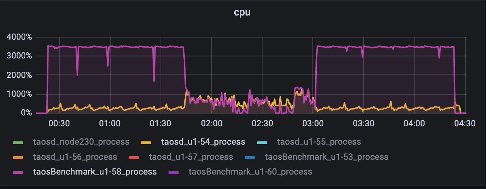

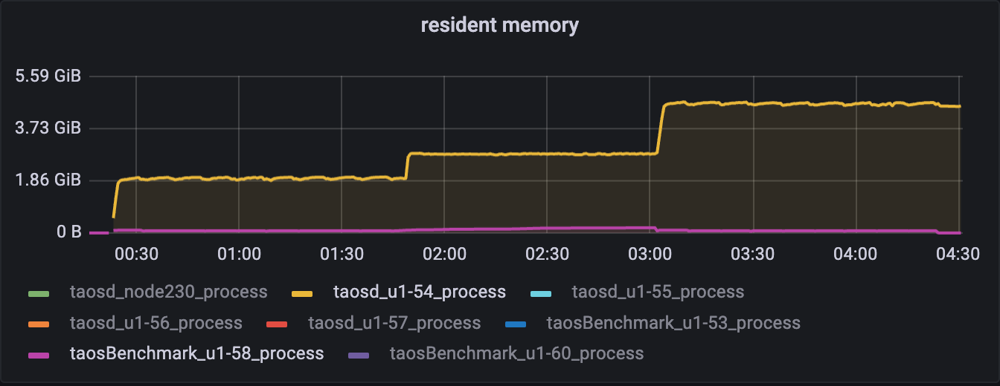

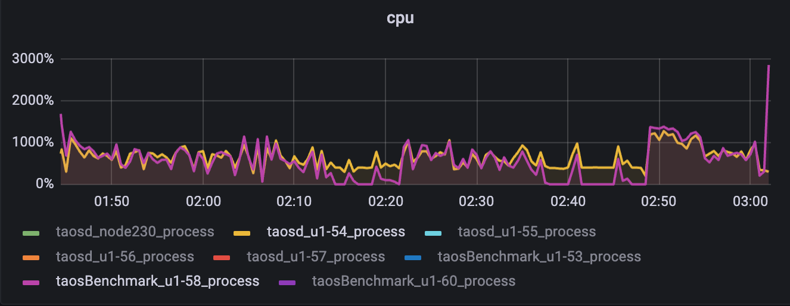

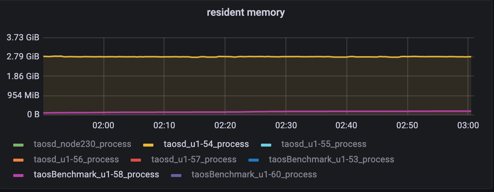

### 4.2.2 **三副本**

> ⚠ 嵌入文件，需在飞书中查看 (token: NDyTbXtQdoLCBRxZPefcEOEVnic)

```cpp
taos> use stream_test;
Database changed.

taos> select count(*) from stb;
       count(*)        |
========================
           10390439240 |
Query OK, 1 row(s) in set (0.382803)

taos> use compact_disk_usage_test;
Database changed.

taos> select count(*) from stb;
       count(*)        |
========================
            878367496 |
Query OK, 1 row(s) in set (0.064337s)
```

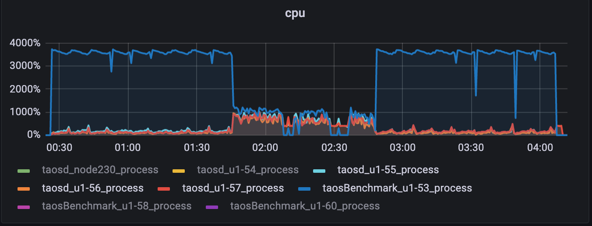

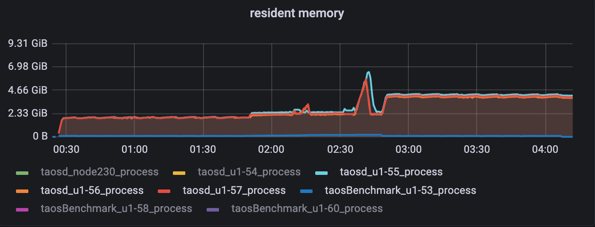

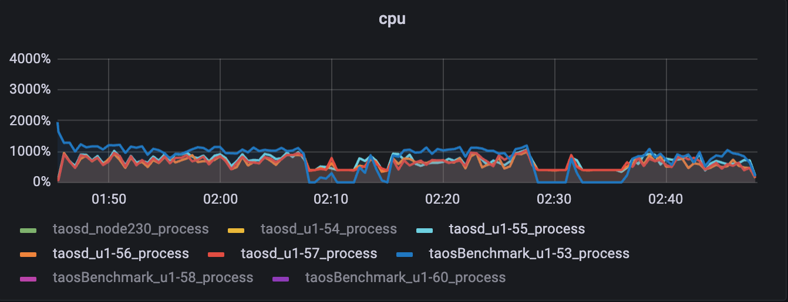

### 下图一共进行了 3 次 compact，最后一次后半段内存涨的有些多，2.43G-6.41G，暂不确定原因，初步推测不是 compact 的原因，因为后面写入停止后又多次手动进行 compact，未再发现内存大幅上涨情况，但具体这次上涨什么原因，还需要开 jemalloc多跑跑看。

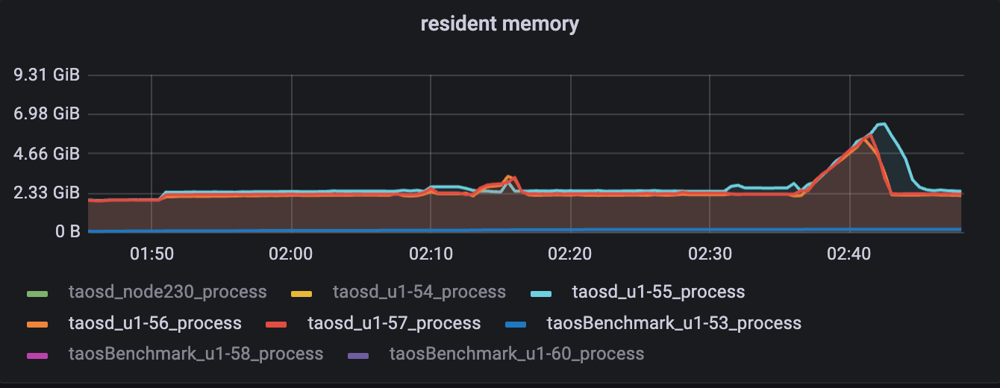

**内存分析图：**
<view type="2">

  > ⚠ 嵌入文件，需在飞书中查看 (token: Fetdbzv74oLqptxhCtuc0mWVn0b)

</view>

<view type="2">

  > ⚠ 嵌入文件，需在飞书中查看 (token: SvoXbQ5q7o0buxxTxDocFbpznsd)

</view>

## 五. 测试问题点

| **JiraID** | **Jira描述** | **状态** |
| --- | --- | --- |
| [TD-27855](https://jira.taosdata.com:18080/browse/TD-27855) | [compact卡事务时间较长，且show compacts信息为空](https://jira.taosdata.com:18080/browse/TD-27855) | Fixed |
| [TD-27882](https://jira.taosdata.com:18080/browse/TD-27882) | [show compact id的vgroup_id信息显示不全](https://jira.taosdata.com:18080/browse/TD-27882) | Fixed |
| [TD-27885](https://jira.taosdata.com:18080/browse/TD-27885) | [compact过程中连续compact未reject](https://jira.taosdata.com:18080/browse/TD-27885) | Fixed |
| [TD-27886](https://jira.taosdata.com:18080/browse/TD-27886) | [kill compact卡死](https://jira.taosdata.com:18080/browse/TD-27886) | Fixed |
| [TD-27902](https://jira.taosdata.com:18080/browse/TD-27902) | [两个db进行compact 第二个show compact id返回空](https://jira.taosdata.com:18080/browse/TD-27902) | Fixed |
| [TD-27906](https://jira.taosdata.com:18080/browse/TD-27906) | [两个db进行compact 第二个db kill compact失败](https://jira.taosdata.com:18080/browse/TD-27906) | Fixed |
| [TD-27926](https://jira.taosdata.com:18080/browse/TD-27926) | [taosd mem-leak when kill compact (vnodeProcessKillCompactReq vnodeCompact.c:36)](https://jira.taosdata.com:18080/browse/TD-27926) | processing |

## 六. 测试结论

1. 报告所覆盖测试项均已完成测试；
2. Kill compact 存在少量内存泄漏，修复中；([TD-27926](https://jira.taosdata.com:18080/browse/TD-27926))
