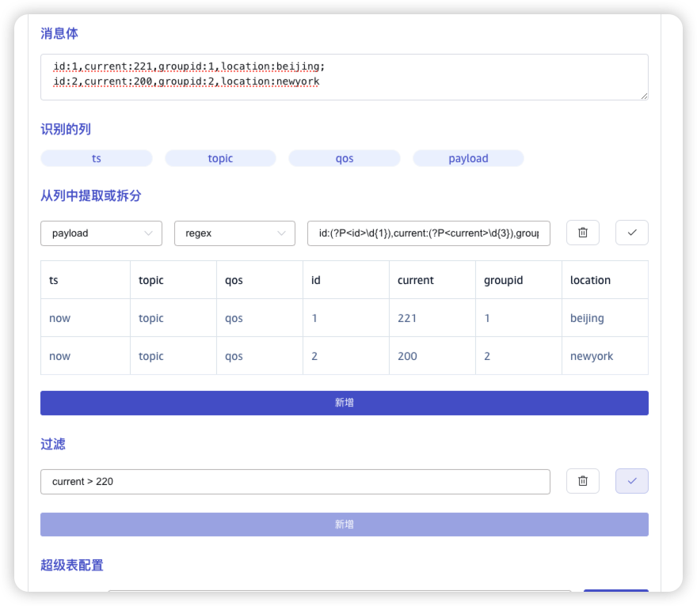
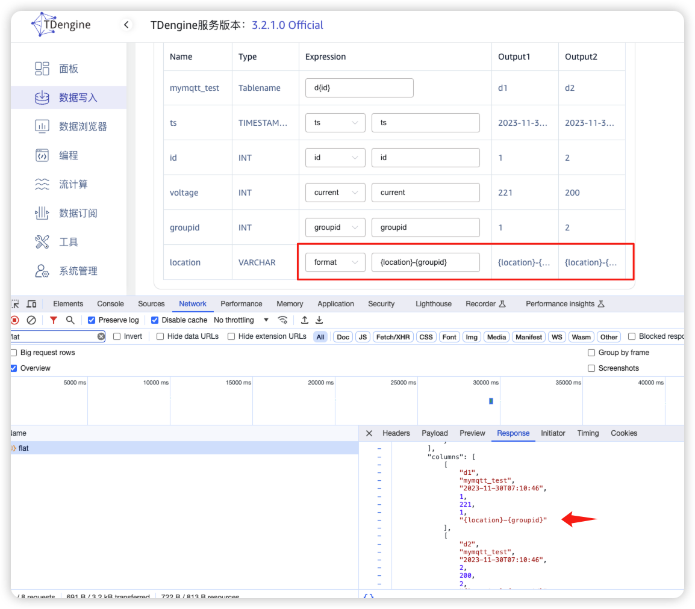
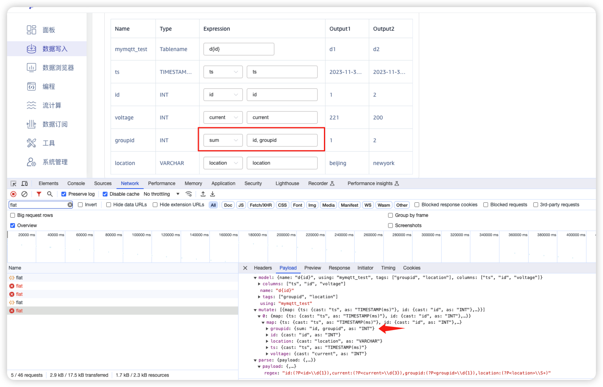
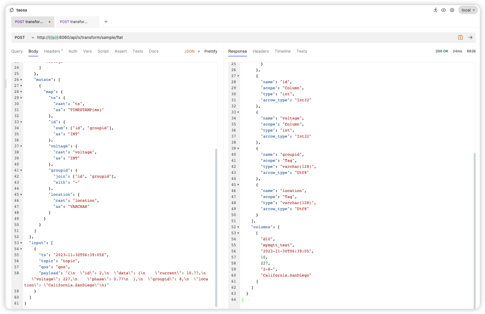
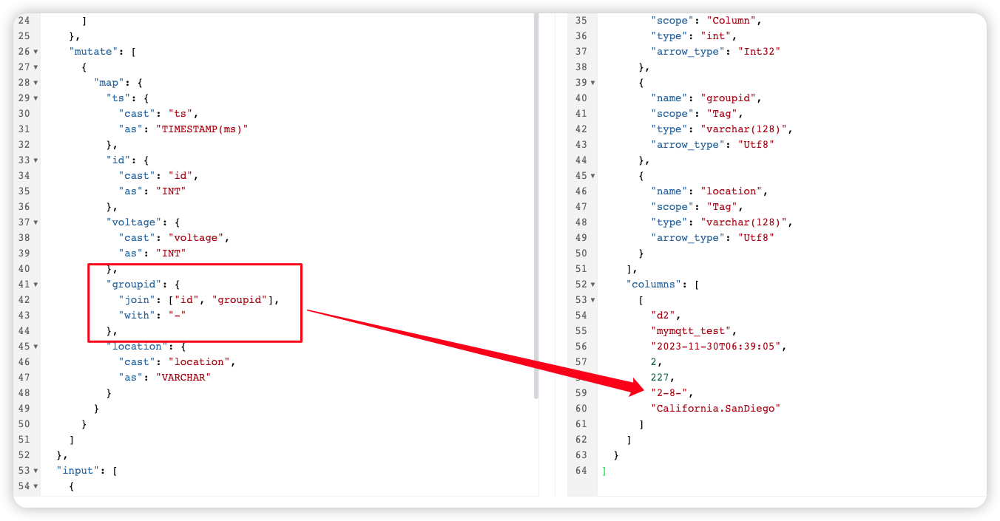
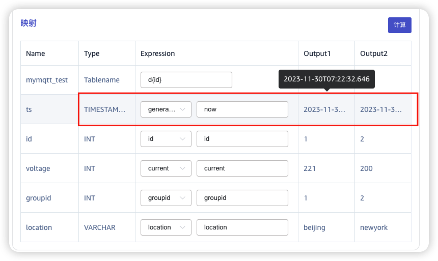

# Transformer相关问题

## 1. split操作的问题

remove和inplace参数的具体用法，需要说明

## 2. 通过split/regex提取时，得到的都是字符串类型，filter时，如何做类型转换？

如下图所示，current是字符串类型，所以filter未生效

## 3. 通过regex过滤，不工作

## 4. 映射-format, 不工作

## 5. 映射-sum: 前端传参错误

TD-27614

前端错误的传参：

正确的传参：

## 6. 映射-join的相关问题

TD-27615

- 前端无法输入分隔符
- 接口返回结果有问题
  

## 7. 映射-generator 

generator只有now的方式工作
其它的方式，如何在Explorer中使用，在测试时没有跑通

