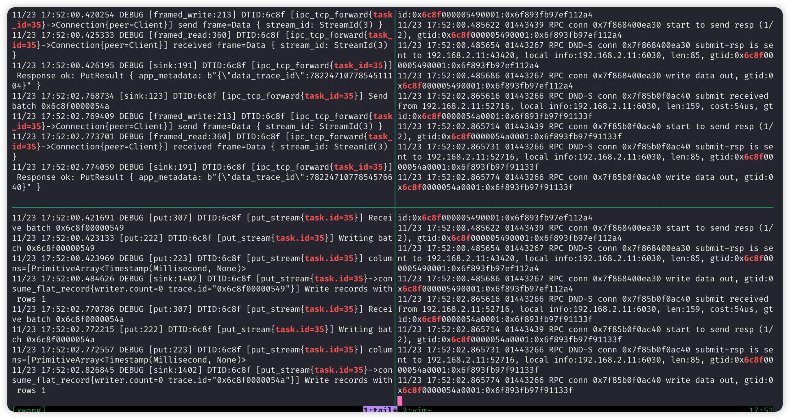

# 事件追踪测试报告

## 1. Jira

TD-26000

## 2. Concept

- TID: Trace ID
- DTID: Data Trace ID, DTID = Stream ID + Batch Number
- QID: Query ID (taos/taosd)

## 3. Scope

除连接器日志以外的其它日志，包括：
- agent.log
- taosx.log
- taoslog*
- taosdlog*

## 4. Case

| Type | Description | Expected Results | Result | Memo |
| --- | --- | --- | --- | --- |
| TID | 调用taosX的REST API时，可以通过HTTP header可以传入trace id | 日志中使用传入的trace id | Pass | curl --request GET \
  --url [http://192.168.2.11:6060/api/x/tasks](http://192.168.2.11:6060/api/x/tasks) \
  --header 'Content-Type: application/json' \
  --header 'Trace-Id: 1a2b3c4d' |
|  | 调用taosX的REST API时，HTTP header中不包含trace id | 每次调用，均使用随机生成的trace id | Pass |  |
|  | 调用taosX的REST API, 查看日志的span字段([...]部分) | 日志的span字段应包含函数调用链信息 | Pass | https://jira.taosdata.com:18080/browse/TD-27368 |
| PI | 在agent.log, taosx.log, taoslog*, taosdlog*搜索Stream ID | 均可搜索到Stream ID |  | 1. 先通过task id搜索到Stream ID
1. tail -f agent.log \| grep 'DTID:c851' |
| OPC-UA |  |  | Pass | https://jira.taosdata.com:18080/browse/TD-27490 |
| OPC-DA |  |  |  |  |
| MQTT |  |  | Pass | https://jira.taosdata.com:18080/browse/TD-27448 |
| Kafka |  |  | Pass |  |
| InfluxDB |  |  | Pass |  |
| OpenTSDB |  |  |  |  |

## 5. Reference

[taosX 事件追踪](https://taosdata.feishu.cn/wiki/OumDwGN62i7yORkmTRhcN0fgnnf) 
[TaosX 事件追踪技术方案](https://taosdata.feishu.cn/wiki/DnyjwqEW5iDdkrkXrsTcKM1UnVd) 

## 6. Screenshot

各部分日志的示意图如下：
```bash
agent.log | taosclog
--------- | --------
taosx.log | taosdlog
```


