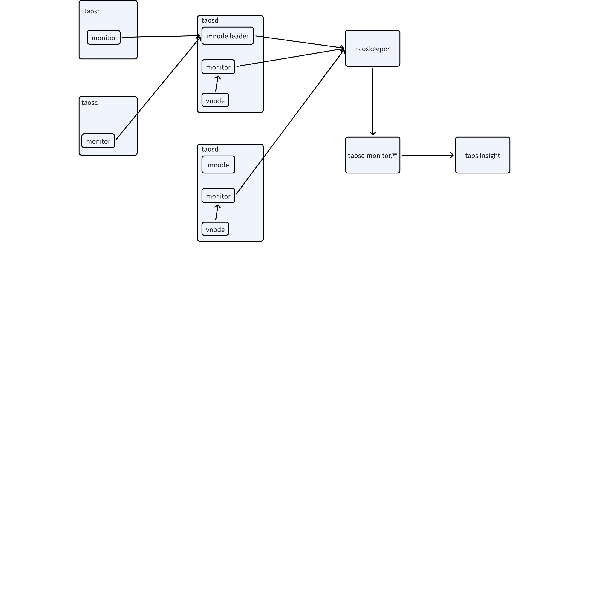
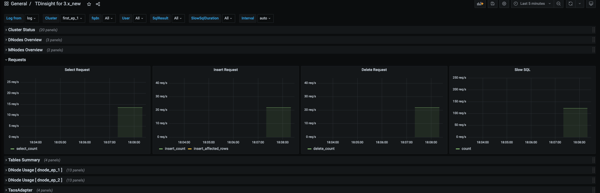

# TDengine 监测

## 1. 背景

1. 根据 Jeff 对表结构的建议，对监控用到的相关表结构重构
2. 支持 taosc 上报数据，避免 taosc 和 taosd 构建相同的监控组件，支持 select 数据的上报
3. taoc 和 taosd 都有监控上报，并且以后 2 个模块还会上报更多指标数据，故建立一个监控框架，供后续增加新的监控指标时使用，通过公共的监控框架计算和上报指标
4. 重新实现 insert sql，新增 select sql，slow query 几个指标

## 2. 定义

monitorInterval指标（metrics） ：具体要监控的某个数据，比如节点的启动时间
Counter：指标的一种类型，该类型的数据，具有只增加不减少的特性，一般用来记录请求数量 
Gauge：指标的一种类型，该类型的数据可增可减，随意变化，比如集群的节点数量

两种类型使用场景有差异参见第 5.3和5.6 节

## 3. 变更历史


| 日期 | 版本 | 撰写人 | 备注 |
| --- | --- | --- | --- |
| 2023-12-21 | 0.1 | 陈东明 |  |
| 2024/1/15 | 0.2 | 陈东明 |  |
| 2024/1/29 | 1.0 | 陈东明 |  |
| 2024/9/18 | 1.1 | 佘彦杰 | 更新子表名规则 |
| 2025/9/15 | 1.2 | 陈东明 | 添加mem_cache_buffer |

## 4. 监控指标

### 4.1 监控指标表结构整体设计原则

1. rate 类型的指标由 dashboard，通过 sql 语句完成
2. counter 发送的是上一监控周期内的增量，有别于 prometheus 的 counter，prometheus 的 counter 是个单调递增的总数
3. 除时间戳外，其他字段类型全部为double
4. 缺省单位为个
5. tag的长度为固定300，为了避免在每次传送监控数据时，都添加tag长度，故将tag设置为固定300长度。
6. 旧版监控中字符串类型的数据，比如status 字段，由原来的字符串类型改为数字，数字类型是能够更方便在 dashboard 上展示，并且基于这些数据做报警处理

### 4.2 集群基本信息

#### 4.2.1 STable Name

 taosd_cluster_basic

#### 4.2.2 Tags

| cluster_id | VARCHAR(40) |
| --- | --- |

#### 4.2.3 Columns

| 字段 | 数据类型 | 含义 |
| --- | --- | --- |
| ts |  |  |
| first_ep | VARCHAR(135) | 集群 first ep |
| first_ep_dnode_id | INT | 集群 first ep 的 dnodeid |
| cluster_version | VARCHAR(20) | 集群部署的 binary 的版本号 |

#### 4.2.4 对旧版监控的变更

- 删除原有字段：monitor_interval
- 原表明：cluster_info

### 4.3 集群监控信息

#### 4.3.1 STable Name

taosd_cluster_info

#### 4.3.2 Tags

| cluster_id | VARCHAR(40) |
| --- | --- |
| Sub table name | cluster_{"cluster_id"} |

#### 4.3.3 Columns

| 字段 | 类型 | 含义 |
| --- | --- | --- |
| ts |  |  |
| cluster_uptime | gauge | 集群启动时间(秒) |
| dbs_total | gauge | 集群中 db 的数量 |
| tbs_total | gauge | 集群中表的数量 |
| stbs_total | gauge | 集群中超级表的数量 |
| dnodes_total | gauge | 集群中 dnode 的数量 |
| dnodes_alive | gauge | 处于启动活跃状态的 dnode 的数量 |
| mnodes_total | gauge | 集群中 mnode 的数量 |
| mnodes_alive | gauge | 处于启动活跃状态的 mnode 的数量 |
| vgroups_total | gauge | 集群中 vgroup 的数量 |
| vgroups_alive | gauge | 处于启动活跃状态的 vgroup 的数量 |
| vnodes_total | gauge | 集群中 vnode 的数量 |
| vnodes_alive | gauge | 处于启动活跃状态的 vgroup 的数量 |
| connections_total | gauge | 链接数量 |
| topics_total | gauge | 集群中 topics 的数量 |
| streams_total | gauge | 集群中 treams 的数量 |
| grants_expire_time | gauge | 集群授权过期剩余时间（秒） |
| grants_timeseries_used | gauge | 集群已拥有的 time series 的数量 |
| grants_timeseries_total | gauge | 集群授权允许使用 time series 的总数量 |

#### 4.3.4 对旧版监控的变更

- 删除的字段：req_insert_success， req_insert_batch, req_insert_batch_success，req_select，这些原表字段中记录的信息并未删除，会在新表 taos_sql_req 中记录，并且在原表中保存的是总数，在新表里存的增量 
- 删除的字段：req_select_rate，req_insert_rate，req_insert_batch_rate，原表记录的这些信息并未在新表中记录保存，会由 dashboard 计算出来
- 字段改名：master_uptime 改为 cluster_uptime
- 合并原有表： grants_info
- 表名变更：原表名 cluster_info

### 4.4 vgroup 监控信息

#### 4.4.1 STable Name

taosd_vgroups_info

#### 4.4.2 Tags

| cluster_id | VARCHAR(40) |
| --- | --- |
| vgroup_id | VARCHAR(12) |
| database_name | VARCHAR(66) |
| Sub table name | vginfo_{"database_name"}_vgroup_{"vgroup_id"}_cluster_{"cluster_id"} |

#### 4.4.3 Columns

| 字段 | 类型 | 含义 |
| --- | --- | --- |
| ts |  |  |
| tables_num | Gauge | 该 vgroup 中表的数量 |
| status | Gauge | 该 vgroup 的状态，status 的取值范围： unsynced = 0, //没有leader选出的情况下 ready = 1 |

#### 4.4.4 对旧版监控的变更

- 变更表名：原表名 vgroups_info
- 删除原有字段：dnode_id, dnode_ep
- 修改原有字段类型：vgroup_id, database_name 原来为 columns，改为 tag

### 4.5 节点监控信息

#### 4.5.1 STable Name

taosd_dnodes_info

#### 4.5.2 Tags

| 字段 | 类型 |
| --- | --- |
| cluster_id | VARCHAR(40) |
| dnode_id | VARCHAR(12) |
| dnode_ep | VARCHAR(135) |
| Sub table name | dinfo_{"dnode_id"}_cluster_{"cluster_id"} |

#### 4.5.3 Columns

| 字段 | 类型 | 含义 |
| --- | --- | --- |
| ts |  |  |
| uptime | gauge | 该 dnode 的启动时间(秒) |
| cpu_engine | gauge | 该 dnode 的进程所使用的 cpu（%，乘过100的） 计算逻辑： /proc/pid/stat 中的engine_cpu = utime+stime+cutime+cstime /proc/stat 中的system_cpu = user + nice + system + idle engine_cpu / system_cpu * 100% |
| cpu_system | gauge | 该 dnode 所在节点的系统使用的 cpu（%，乘过100的） 计算逻辑： used_cpu = user + nice + system total_cpu = user + nice + system + idle used_cpu / total_cpu * 100% |
| cpu_cores | gauge | 该 dnode 所在节点的 cpu 核数 |
| mem_engine | gauge | 该 dnode 的进程所使用的内存（*KB*) 计算逻辑： /proc/pid/status 中VmRSS |
| mem_free | gauge | 该 dnode 所在节点的系统剩余的物理内存（*KB*) 计算逻辑： Use MemFree Unused memory (MemFree and SwapFree in /proc/meminfo) |
| mem_total | gauge | 该 dnode 所在节点的总内存（*KB*) 计算逻辑： sysconf(_SC_PHYS_PAGES) * tsPageSizeKB 其中tsPageSizeKB = sysconf(_SC_PAGESIZE) / 1024; |
| mem_cache_buffer | gauge | 该 dnode 所在节点的cache/buffer内存（*KB*) 计算逻辑： buffers Memory used by kernel buffers (Buffers in /proc/meminfo) cache Memory used by the page cache and slabs (Cached and SReclaimable in /proc/meminfo) |
| disk_used | gauge | 该 dnode 所在节点的磁盘已使用的容量（*Byte*) 计算逻辑： 调用statvfs函数，参数是数据目录 total = info.f_blocks * info.f_frsize; avail = info.f_bavail * info.f_frsize; used =total - avail; |
| disk_total | gauge | 该 dnode 所在节点的磁盘总容量（*Byte*) 计算逻辑： 调用statvfs函数，参数是数据目录 total = info.f_blocks * info.f_frsize; avail = info.f_bavail * info.f_frsize; used =total - avail; |
| disk_engine |  |  |
| system_net_in | gauge | 该 dnode 所在节点的网络传入速率（*Byte*/s) 计算逻辑： /proc/net/dev文件中的 rbytes; 和上次采集的数据做差，除时间 |
| system_net_out | gauge | 该 dnode 所在节点的网络传出速率（*Byte*/s) 计算逻辑： /proc/net/dev文件中的 tbytes; 和上次采集的数据做差，除时间 |
| io_read | gauge | 该 dnode 所在节点的 io 读取速率（*Byte*/s) 计算逻辑： /proc/pid/io文件中的 rchar 和上次采集的数据做差，除时间 |
| io_write | gauge | 该 dnode 所在节点的 io 写入取速率（*Byte*/s) 计算逻辑： /proc/pid/io文件中的 wchar 和上次采集的数据做差，除时间 https://blog.csdn.net/legendavid/article/details/52301593 rchar: 读出的总字节数，read或者pread（）中的长度参数总和（pagecache中统计而来，不代表实际磁盘的读入） wchar: 写入的总字节数，write或者pwrite中的长度参数总和 |
| io_read_disk | gauge | 该 dnode 所在节点的磁盘 io 写入取速率（*Byte*/s) 计算逻辑： /proc/pid/io文件中的 read_bytes 和上次采集的数据做差，除时间 |
| io_write_disk | gauge | 该 dnode 所在节点的磁盘 io 写入取速率（*Byte*/s) /proc/pid/io文件中的 write_bytes 和上次采集的数据做差，除时间 https://blog.csdn.net/legendavid/article/details/52301593 read_bytes: 实际从磁盘中读取的字节总数 （这里if=/dev/zero 所以没有实际的读入字节数） write_bytes: 实际写入到磁盘中的字节总数 |
| vnodes_num | gauge | 该 dnode 所在节点的 vnodes 数量 |
| masters | gauge | 该 dnode 所在节点的处于 leader 状态的 vnodes 数量 |
| has_mnode | gauge | 该 dnode 所在节点是否有 Mnode 节点，取值范围： 有 =1 没有 =0 |
| has_qnode | gauge | 该 dnode 所在节点是否有 qnode 节点，取值范围： 有 =1 没有 =0 |
| has_snode | gauge | 该 dnode 所在节点是否有 snode 节点，取值范围： 有 =1 没有 =0 |
| has_bnode | gauge | 该 dnode 所在节点是否有 bnode 节点，取值范围： 有 =1 没有 =0 |
| errors | gauge | 该 dnode 所在节点 error 数量 |
| error_log_count | gauge | 该 dnode 所在节点 error 日志数量 |
| info_log_count | gauge | 该 dnode 所在节点 info 日志数量 |
| debug_log_count | gauge | 该 dnode 所在节点 debug 日志数量 |
| trace_log_count | gauge | 该 dnode 所在节点 trace 日志数量 |


#### 4.5.4 对旧版监控的变更

- 合并原有表：log_summary
- 变更表名：原表名 dnodes_info

### 4.6 节点状态信息

#### 4.6.1 STable Name

taosd_dnodes_status

#### 4.6.2 Tags

| 字段 | 类型 |
| --- | --- |
| cluster_id | VARCHAR(40) |
| dnode_id | VARCHAR(12) |
| dnode_ep | VARCHAR(135) |
| Sub table name | dstutus_{"dnode_id"}_cluster_{"cluster_id"} |

#### 4.6.3 Columns

| 字段 | 类型 | 含义 |
| --- | --- | --- |
| ts |  |  |
| status | gauge | 该 dnode 的状态，取值范围： ready=1， offline =0 |

#### 4.6.4 对旧版监控的变更

- 原表名：d_info

#### 4.6.5 约束规则

- taosd_dnodes_status_info 与 taosd_dnodes_info 的 tag 字段相同，但是要使用 2 张表，是因为数据的发送者不同。详细说明参看 5.3 节第5条目。

### 4.7 节点日志目录信息

#### 4.7.1 STable Name

taosd_dnodes_log_dirs

#### 4.7.2 Tags

| cluster_id | VARCHAR(40) |
| --- | --- |
| dnode_id | VARCHAR(12) |
| dnode_ep | VARCHAR(135) |
| data_dir_name | VARCHAR(127) |
| Sub table name | dlog_{"dnode_id"}_{"data_dir_name"}_cluster_{"cluster_id"} data_dir_name可能很长，如果超长，取其 md5 值 |

#### 4.7.3 Columns

| 字段 | 类型 | 含义 |
| --- | --- | --- |
| ts |  |  |
| avail | gauge | 可用空间（byte) |
| used | gauge | 已用空间（byte) |
| total | gauge | 总空间（byte) |

#### 4.7.4 对旧版监控的变更

- 合并表：temp_dir
- 该表记录 taosd 的日志目录和临时目录的磁盘空间状态，原版监控中，通过2张不同的表进行区分，日志目录和临时目录的路径记录在 log_dir_name 的 tag 中。

### 4.8 节点数据目录信息

#### 4.8.1 STable Name

taosd_dnodes_data_dirs

#### 4.8.2 Tags


| cluster_id | VARCHAR(40) |
| --- | --- |
| dnode_id | VARCHAR(12) |
| dnode_ep | VARCHAR(135) |
| data_dir_name | VARCHAR(127) |
| data_dir_level | VARCHAR(12) |
| Sub table name | ddata_{"dnode_ep"}_{"log_dir_name"}_level_{"data_dir_level"}_cluster_{"cluster_id"} log_dir_name可能很长，如果超长，取其 md5 值 |

#### 4.8.3 Columns

| 字段 | 类型 | 含义 |
| --- | --- | --- |
| ts |  |  |
| avail | gauge | 可用空间（byte) |
| used | gauge | 已用空间（byte) |
| total | gauge | 总空间（byte) |

### 4.9 mnode 监控信息

#### 4.9.1 STable Name

taosd_mnodes_info

#### 4.9.2 Tags

| cluster_id | VARCHAR(40) |
| --- | --- |
| mnode_id | VARCHAR(12) |
| mnode_ep | VARCHAR(135) |
| Sub table name | mnode_{"mnode_id"}_cluster_{"cluster_id"} |

#### 4.9.3 Columns

| 字段 | 类型 | 含义 |
| --- | --- | --- |
| ts |  |  |
| role | gauge | 该 mnode 的状态，status 的取值范围： offline = 0, follower = 100, candidate = 101, leader = 102, error = 103, learner = 104 |

#### 4.9.4 对旧版监控的变更

- 重命名原有表：m_info

### 4.10 vnode 监控信息

#### 4.10.1 STable Name

taosd_vnodes_info

#### 4.10.2 Tags

| cluster_id | VARCHAR(40) |
| --- | --- |
| vgroup_id | VARCHAR(12) |
| database_name | VARCHAR(66) |
| dnode_id | VARCHAR(12) |
| Sub table name | vninfo_{"database_name"}_dnode_{"dnode_id"}_vgroup_{"vgroup_id"}_cluster_{"cluster_id"} |

#### 4.10.3 Columns

| 字段 | 类型 | 含义 |
| --- | --- | --- |
| ts |  |  |
| role | gauge | 该 vnode 的状态，status 的取值范围： offline = 0, follower = 100, candidate = 101, leader = 102, error = 103, learner = 104 |

#### 4.10.4 对旧版监控的变更

- 重命名原有表：vnodes_role

### 4.11 taosd请求监控信息

#### 4.11.1 STable Name

taosd_sql_req

#### 4.11.2 Tags

| 名称 | 类型 | 取值范围 | 备注 |
| --- | --- | --- | --- |
| sql_type | VARCHAR(15) | select, insert，inserted_rows, delete | 区分多个panel Select Insert delete |
| cluster_id | VARCHAR(40) |  | 筛选条件 |
| vgroup_id | VARCHAR(12) |  |  |
| dnode_ep | VARCHAR(135) |  | 筛选条件fqdn，就是dnode_ep |
| dnode_id | VARCHAR(12) |  |  |
| username | VARCHAR(25) |  | 筛选条件，跟cluster_id联动 |
| result | VARCHAR(10) | Success, Failed | 筛选条件，单独 |
| Sub table name |

#### 4.11.3 Columns

| 字段 | 类型 | 含义 |
| --- | --- | --- |
| ts |  |  |
| count | counter | 请求数量 |

#### 4.11.4 约束规则

1. 该表用来保存 taosd插入数据数量。
   - taosd 存放 inserted_rows 请求数量，使用的 tag 为 cluster_id，dnode_id，dnode_ep, username, result
      - 不放在dnode_info是为了扩展vgroup_id
      - 不放在在vnodes_info，是因为发送者不同，vnode_info的status信息发送者是mnode，insert数量的发送者是vnode，具体说明参看4.2.4节，另外，为了扩展user_id也不能放在vnode_info中
   - insert 表示taosd收到的写入请求数量，inserted_rows表示写入请求写入的数据条数，也就是批量插入的场景下，sql数量和插入数据量。在旧版监控中，insert 被命名为 insert_batch，inserted_rows被命名为insert。
2. tag的取值范围：
   - inserted_rows可使用的 tag：cluster_id，vgroup_id，dnode_ep，dnode_id，username，result
      - inserted_rows 的 result tag 的取值范围：Success
3. 支持的使用场景：
   - 可以支持按集群维度、节点维度、用户维度的请求数量查询
   - 请求在个vnode上的分布
   - 请求的成功失败情况
   - 以及以上的组合查询

### 4.12 SQL 请求监控信息

#### 4.12.1 STable Name

taos_sql_req

#### 4.12.2 Tags

| 名称 | 类型 | 取值范围 | 备注 |
| --- | --- | --- | --- |
| sql_type | VARCHAR(15) | select, insert，inserted_rows, delete | 区分多个panel Select Insert delete |
| cluster_id | VARCHAR(40) |  | 筛选条件 |
| username | VARCHAR(25) |  | 筛选条件，跟cluster_id联动 |
| result | VARCHAR(10) | Success, Failed | 筛选条件，单独 |
| Sub table name |

#### 4.12.3 Columns

| 字段 | 类型 | 含义 |
| --- | --- | --- |
| ts |  |  |
| count | counter | 请求数量 |

#### 4.12.4 约束规则

1. 该表用来保存 sql 数量。
   - taosc 存放 select、insert、delete 请求数量，使用的 tag 为 cluster_id，username, result
      - 不放在 cluster_info 表是为了扩展类似 user_id
   - insert 表示taosd收到的写入请求数量，inserted_rows表示写入请求写入的数据条数，也就是批量插入的场景下，sql数量和插入数据量。在旧版监控中，insert 被命名为 insert_batch，inserted_rows被命名为insert。
2. tag的取值范围：
   - select、insert、delete 可使用的 tag：cluster_id,username,result
      - result tag 的取值范围：Success, Failed
3. 支持的使用场景：
   - 可以支持按集群维度、用户维度的请求数量查询
   - 请求的成功失败情况
   - 以及以上的组合查询
  ### 数据迁移
  旧版本的select和insert数据不正确，无需迁移到新版本

### 4.13 慢 SQL 监控信息

#### 4.13.1 STable Name

taos_slow_sql

#### 4.13.2 Tags

| 名称 | 类型 | 取值范围 | 筛选条件 |
| --- | --- | --- | --- |
| cluster_id | VARCHAR(40) |  |  |
| username | VARCHAR(25) |  | 筛选条件，跟cluster_id联动 |
| result | VARCHAR(10) | Success, Failed, Cancel | 筛选条件，单独 |
| duration | VARCHAR(20) | 枚举 | 筛选条件，单独 |
| Sub table name |

#### 4.13.3 Columns

| 字段 | 类型 | 含义 |
| --- | --- | --- |
| ts |  |  |
| count | counter | 请求数量 |

#### 4.13.4 约束规则

1. 该表是慢 sql 统计表，用来保存慢 sql 数量。
   - taosc 统计慢 sql 出现次数，使用的 tag 为 cluster_id，
   - duration 是慢 sql 耗时程度的区分标记，也是慢 sql 统计表和 sql 统计表的本质区别。目前区分为以下区间，均为左闭右开区间：
      - 3-10s
      - 10-100s
      - 100-1000s
      - 1000s-
   - duration 字符串类型，直接用于显示，因此加上了单位；为了扩展时没有歧义，使用了 (start, end]的表示方法，未来增加诸如 30s-50s 新区间的时候，之前旧区间的语义不需要发生变化
   - result 表示 SQL 执行结果，taoc 区分不同结果可能有困难
2. 支持的使用场景
   - 可以支持按集群维度、用户维度、耗时程度维度的请求数量查询
   - 请求的成功/失败/取消情况
   - 以及以上的组合查询

### 4.14 子表名规则

所有这些表中的监控数据是taoskeeper通过schemaless写入的，taoskeeper根据tags值的组合生成按规则生成子表名。
***后续新增监控信息，需要自己指定子表名，子表名是一个 tag，名称为 ***`***priv_stn***`***， 值为子表名，注意子表名不要超长，全小写格式。***

## 5. 监控框架 (内部)

### 5.1 框架的使用

#### 5.1.1 使用框架采集数据

```c
//定义一个metric
taos_counter_t *counter = taos_counter_new("dnodes_info:req_insert", "counter for insert sql",  0, NULL);
taos_collector_registry_register_metric(counter);

//打点，即有一个insert请求执行完，给counter加一
taos_counter_inc(insert_counter, NULL);
```


以上代码中，metric的name，分为2个部分，用：分开，前面是表名，第二部分是在这个表中的列名。通过以上代码即可记录insert请求的数量，数据会被记录到dnodes_info这张表中的req_insert字段。

更复杂的带有tag的举例
```c
//定义一个metric
const char *tags[] = {"cluster_id"};
taos_counter_t *counter = taos_counter_new("dnodes_info:req_insert", "counter for insert sql",  1, tags);
taos_collector_registry_register_metric(counter);

//打点，即有一个insert请求执行完，给counter加一
int64_t clusterId = pVnode->config.syncCfg.nodeInfo[0].clusterId;
char strClusterId[TSDB_CLUSTER_ID_LEN];
snprintf(strClusterId, sizeof(strClusterId), "%" PRId64, clusterId);
const char *sample_labels[] = {strClusterId};
taos_counter_inc(insert_counter, sample_labels);
```

#### 5.1.2 使用框架发送数据

框架使用者需要自己实现监控数据的发送功能，但框架提供函数可以将所有的监控数据格式化成json格式。该函数如下：
```c
char *pCont = taos_collector_registry_bridge(TAOS_COLLECTOR_REGISTRY_DEFAULT, ts, "%" PRId64, &promStr);
```

可以通过taos_collector_registry_bridge函数获取发送给mnode或者taoskeeper的协议文本字符串。获取到字符串后，框架使用者通过http协议发送。比如在taosd中，有个定时线程，会定时调用这个函数，发送所有指标给taoskeeper。

### 5.2 框架支持的功能

#### 5.2.1 增加新表

示例代码如下：
```c
//定义一个metric
taos_counter_t *counter = taos_counter_new("taos_slow_sql:count", "counter for insert sql",  0, NULL);
taos_collector_registry_register_metric(counter);

//打点，即有一个insert请求执行完，给counter加一
taos_counter_inc(insert_counter, NULL);
```

添加以上代码后，会创建一个新表，名为taos_slow_sql，表中包含字段count

#### 5.2.2 增加新列

在已有的表中，增加新列，也即增加一个新的指标，示例代码如下：
```c
//定义一个metric
taos_counter_t *counter = taos_counter_new("taos_slow_sql:time", "counter for insert sql",  0, NULL);
taos_collector_registry_register_metric(counter);

//打点，即有一个insert请求执行完，给counter加一
taos_counter_inc(insert_counter, NULL);
```

添加以上代码后，会在已有的表taos_slow_sql中，增加一个新的列，列名为time

#### 5.2.3 增加新 tag

对原有表增加tag，示例代码如下：
```c
//定义一个metric
const char *tags[] = {"cluster_id"};
taos_counter_t *counter = taos_counter_new("taos_slow_sql:count", "counter for insert sql",  1, tags);
taos_collector_registry_register_metric(counter);

//打点，即有一个insert请求执行完，给counter加一
int64_t clusterId = 1;
char strClusterId[TSDB_CLUSTER_ID_LEN];
snprintf(strClusterId, sizeof(strClusterId), "%" PRId64, clusterId);
const char *sample_labels[] = {strClusterId};
taos_counter_inc(insert_counter, sample_labels);
```

添加以上代码，会在已有的表taos_slow_sql中，添加一个新tag，tag名为cluster_id，tag的值为1.

#### 5.2.4 tag 增加新值

对原有tag增加新值，示例代码如下：
```c
//定义一个metric
const char *tags[] = {"cluster_id"};
taos_counter_t *counter = taos_counter_new("taos_slow_sql:count", "counter for insert sql",  1, tags);
taos_collector_registry_register_metric(counter);

//打点，即有一个insert请求执行完，给counter加一
int64_t clusterId = 2;
char strClusterId[TSDB_CLUSTER_ID_LEN];
snprintf(strClusterId, sizeof(strClusterId), "%" PRId64, clusterId);
const char *sample_labels[] = {strClusterId};
taos_counter_inc(insert_counter, sample_labels);
```

添加以上代码，会在已有的表taos_slow_sql中，为cluster_id这个tag，新增tag的值为2的数据.
实现以上功能，只需要在代码中增加用例所示代码，taoskeeper无需改动，自动支持，表结构无需手工改动，taoskeeper自动建表、加列。

### 5.3 框架的约束限制

1. 可以增加 tag，不能减少，或者修改已有tag，这一点由框架的使用者保证，框架并未约束。
2. 框架使用者要保证表名，不与之前存在表名重复，框架不对表名重复进行约束。
3. tag name 的最大长度为100，value 的最大长度300
4. 不要在tag中包含逗号，空格，等号，双引号，这些是写库所用influxdb行协议的元字符
5. 目前Histogram、Summary两种类型未实现，这2种数据类型一般用来记录请求时间，2种数据类型可以用来分析，请求时间的分布，比如95线，90线等。
   - 折中的使用方式，将时间分布转化为tag，手工记录分布，比如定义一个请求时长的指标，并且定义该指标具有一个叫做秒数的tag，该tag的取值为：">1s",  ">2s", ">5s", ">10s",使用者打点时，自行填入tag值。
6. 使用者需要自行判断哪些指标可以放在同一张表
框架给出一个使用同一张表的原则供参考，可以使用同一张的原则有两条：
1. tag相同
2. 发送者相同
3. Tag value不能有空格

如果违反该原则，也就是发送者不同，但是采用同一张表会出现空列的情况，拿taosd_dnodes_info和taosd_dnodes_status_info举例说明。

| cluster_id | dnode_id | dnode_ep | status | uptime |
| --- | --- | --- | --- | --- |
| 1397715317673023180 | 1 | localhost:6030 | 102 |  |
| 1397715317673023180 | 1 | localhost:6030 | 102 |  |
| 1397715317673023180 | 1 | localhost:6030 |  | 1.22 |
| 1397715317673023180 | 1 | localhost:6030 | 103 |  |
| 1397715317673023180 | 1 | localhost:6030 |  | 1.23 |
| 1397715317673023180 | 1 | localhost:6030 |  | 1.24 |
| 1397715317673023180 | 1 | localhost:6030 |  | 1.25 |

当表中只有一个列时，比如taoscd_sql_req，可以不用考虑发送者的区别，不同发送者的指标数据可以保存在一张表中，就如taoscd_sql_req是taosd和taosc共用的表。

### 5.4 taosc使用框架的数据流转




### 5.5 taoskeeper协议

#### 5.5.1 监控数据接口

##### 5.5.1.1 接口地址

| 接口地址 | POST /general-metric |
| --- | --- |
| QID | 上报监控数据时需要生成 QID，附加在 HEADER 中：（`X-QID: 0xXXX`） |

##### 5.5.1.2 接口协议

```json

[{
    "ts":"1703226836761",
    "protocol":2,
    "tables":
    [
        {
            "name":"cluster_info",
            "metric_groups":
            [
                {
                    "tags":
                    [
                        {
                            "name":"cluster_id",
                            "value":"1397715317673023180"
                        }
                    ],
                    "metrics":
                    [
                        {
                            "name":"dbs_total",
                            "value":1
                        },
                        {
                            "name":"master_uptime",
                            "value":0
                        }
                    ]
                }
            ]
        },
        {
            "name":"dnodes_info",
            "metric_groups":
            [
                {
                    "tags":
                    [
                        {
                            "name":"cluster_id",
                            "value":"1397715317673023180"
                        },
                        {
                            "name":"dnode_id",
                            "value":"1"
                        },
                        {
                            "name":"dnode_ep",
                            "value":"ssfood06:6130"
                        }
                    ],
                    "metrics":
                    [
                        {
                            "name":"uptime",
                            "value":0
                        },
                        {
                            "name":"cpu_engine",
                            "value":0
                        }
                    ]
                }
            ]
        }
    ]
},
{
    "ts":"1703226836762",
    "protocol":2,
    "tables":
    [
        {
            "name":"cluster_info",
            "metric_groups":
            [
                {
                    "tags":
                    [
                        {
                            "name":"cluster_id",
                            "value":"1397715317673023180"
                        }
                    ],
                    "metrics":
                    [
                        {
                            "name":"dbs_total",
                            "value":1
                        },
                        {
                            "name":"master_uptime",
                            "value":0
                        }
                    ]
                }
            ]
        },
        {
            "name":"dnodes_info",
            "metric_groups":
            [
                {
                    "tags":
                    [
                        {
                            "name":"cluster_id",
                            "value":"1397715317673023180"
                        },
                        {
                            "name":"dnode_id",
                            "value":"1"
                        },
                        {
                            "name":"dnode_ep",
                            "value":"ssfood06:6130"
                        }
                    ],
                    "metrics":
                    [
                        {
                            "name":"uptime",
                            "value":0
                        },
                        {
                            "name":"cpu_engine",
                            "value":0
                        }
                    ]
                }
            ]
        }
    ]
}
]
```

##### 5.5.1.3 接口使用约束

1. 框架使用者负责保证表名不与以前表名重复，超级表名必须加监控对象名称为前缀。
2. metrics 数据类型全部使用double
3. taosd 不对列排序，taoskeeper对列进行排序，此处理会性能友好
4. ts 单位为 ms
5. **建议使用 tag名 priv_stn 来指定子表名，如果不指定一定反馈给 taoskeeper 开发，补充子表名实现规则**。

#### 5.5.2 非监控数据接口

dashboard 上还要展示一些非监控数据，这些数据属于“固定不变”的数据，并且这部分数据的数据类型除了 double 类型外，还有 string 类型。

##### 5.5.2.1 接口地址

| 接口 | POST /taosd-cluster-basic |
| --- | --- |
| QID | 上报监控数据时需要生成 QID，附加在 HEADER 中：（`X-QID: 0xXXX`） |

##### 5.5.2.2 接口协议

```json
{
        "ts":   "0",
        "cluster_id":   "7648966395564416484",
        "protocol":     2,
        "first_ep":     "ssfood06:6130",
        "first_ep_dnode_id":    1,
        "cluster_version":      "3.2.1.0.alp",
        "monitor_interval":     1
}
```

### 5.6 指标的显示

做成监控框架后，taoskeeper是一个透传中间组件，不会再有任何业务逻辑。故在代码中打点的逻辑，要与 dashboard 的配置相对应
举例说明，如果代码定义的 counter, gauge 类型的指标，在 dashboard 中的配置是不同。
```c
taos_counter_t *counter = taos_counter_new(VNODE_INSERT, "counter for insert sql",  label_count, sample_labels);
taos_gauge_t *counter = taos_gauge_new(VNODE_INSERT, "gauge for mem",  label_count, sample_labels);
```

counter发送的数据是增量值，故dashboard中，显示总数，要做累加。也可基于原始数据计算显示速率。
gauge发送的就是该指标的当前值，dashboard不需要做任何计算，直接显示即可。

### 5.7 代码编译

框架使用了double数据类型，所以采用了c11的Atomic库。
Gcc 支持c11 atomic的最低版本是GCC 4.9.0        April 22, 2014
https://gcc.gnu.org/wiki/C11Status
https://gcc.gnu.org/releases.html

macos支持c11的最低版本是Xcode 7
https://stackoverflow.com/questions/26440606/xcode-and-c11-stdatomic-h

Windows 支持c11 atomic的最低版本是vs studio 2019。
在windows中，c11的支持不是默认打开的，需要在编译脚本中添加打开开关。

在文档中的描述：
linux，编译未给定使用的gcc版本。
macos， Verified with XCode 11.4+ on Catalina and Big Sur.
windows， 支持2013。需要添加编译工具的最低版本。

## 6. TDInsight

新增panel的显示效果，体验连接 http://192.168.17.210:3000/d/ZOmSV9FIz/tdinsight-for-3-x_new?var-database=log&var-cluster_id=cluster_id_1&var-fqdn=All&var-version=3.2.1.0&var-firstEp=MacBook-Pro-65.local:6030&var-username=All&var-sql_result=All&var-duration=All&var-interval=$__auto_interval_interval  （admin, admin）， 需要连接 TDengine 路由器才能访问。


## 7. Explorer

在explorer中添加一个新功能，选中一个子表后，可以显示出这个子表的tag值的组合


TD-28485

## 8. 性能

设计 insert 流程改动，加入打点计数逻辑，需验证 insert 性能是否有变化

## 9. 兼容性

### 9.1 同步升级

新监控使用新接口和新的表结构，新的表结构与旧表结构不相同，taosd 升级后默认不会开启使用新接口和新的表结构，通过一个开关（monitorForceV2（bool））来控制，开关默认是打开状态，一旦打开开关，taosd会停止向旧表写入数据，会开始向新表写入数据。taoskeeper 需采用对应版本，同步采用新接口写入数据。taosd 与 taoskeeper 的版本不同步，会出现写入监控数据报错。
TDinsight, 云服务也需要采用对应版本，才能读取升级后写入的新版本数据。TDinsight和云服务的版本，与taosd、taoskeeper版本不同步，TDinsight和云服务将只能读取到升级前的数据。

### 9.2 读取旧数据

旧表以及旧表中保存的数据，在升级后不会被自动删除。
如果要在新本版（TDinsight, 云服务）中仍然读取到旧数据，需要执行脚本，将旧表中的数据迁移到新表中，详见运维部分。

### 9.3 TaosKeeper兼容性

TaosKeeper会保留新老两套监控接口，主要考虑云服务场景，一个TaosKeeper会有很多taosd上报监控数据，其版本也不统一。但是TaosKeeper启动时将不再创建老监控接口需要的表，否则每次重启都会创建这些新监控不需要的表。
虽然TaosKeeper在接口上兼容新老两套监控接口，但是对于老监控接口的支持，依赖于之前版本的TaosKeeper创建的表。对于全新部署的TaosKeeper，不支持老监控接口。

## 10. 运维

### 10.1 运维步骤

旧数据迁移的操作步骤如下：
1.升级 taosd，taoskeeper 到新版本
2.升级 TDinsight 到新版本
3.运行数据迁移命令
引用的数据库以及连接数据库的用户名密码等，都在 /etc/taos/taoskeeper.toml 中，也就是 TaosKeeper 服务的配置文件
我们不支持迁移旧监控数据到其他数据库中。
```bash
taoskeeper --transfer=old_taosd_metric --fromTime="2024-04-03T13:00:00+08:00"
```

4.验证 TDinsight 能够读取到时间段在升级前的监控数据
5.运行旧表删除命令
引用的数据库以及连接数据库的用户名密码等，都在 /etc/taos/taoskeeper.toml 中，也就是 TaosKeeper 服务的配置文件
```bash
taoskeeper --drop=old_taosd_metric_stables
```

删除的表列表如下：
```shell {wrap}
        "log_dir",
        "dnodes_info",
        "data_dir",
        "log_summary",
        "m_info",
        "vnodes_role",
        "cluster_info",
        "temp_dir",
        "grants_info",
        "vgroups_info",
        "d_info",
        "taosadapter_system_cpu_percent",
        "taosadapter_restful_http_request_in_flight",
        "taosadapter_restful_http_request_summary_milliseconds",
        "taosadapter_restful_http_request_fail",
        "taosadapter_system_mem_percent",
        "taosadapter_restful_http_request_total",
```

### 10.2 配置参数

taosc 和 taosd 均使用 taos.cfg 文件的配置，配置项如下：

| **字段** | **类型** | **含义** | **默认值** |
| --- | --- | --- | --- |
| monitor | bool | 监控开关 | true |
| monitorFqdn | string | taoskeeper server fqdn | "" |
| monitorPort | string | taoskeeper server port | 6043 |
| monitorInterval | int | 监控上报间隔，单位: s | 30 |
| slowLogThreshold | int | 慢查询阈值设定，单位: s | 3 |

   
### 10.3 安装包

安装包中已经包含TaosKeeper，采用命令行模式运行即可完成数据迁移和旧表删除。以上运维步骤包含在该版本的 release note 和TaosKeeper的readme文件中。

## 11. 使用场景

无

## 12. 约束和限制

无

## 13. 常见错误和排查

无
