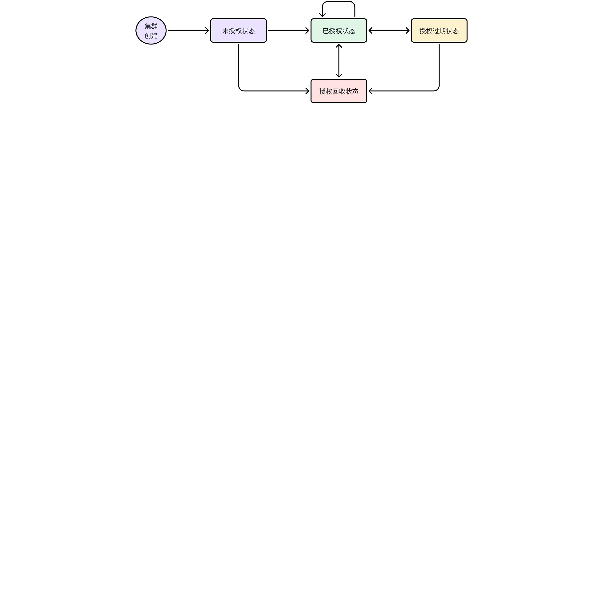

# 按功能授权及授权机制优化

## 背景

- 目前，taosd 和 taosX 存在两个独立的授权码，并且基于 clusterId 的授权机制虽然省去了原有针对集群中每台机器授权的重复性和复杂性，但是还存在复制集群的漏洞(参考 [TS-3600](https://jira.taosdata.com:18080/browse/TS-3600))。
- 为了解决上述两个问题，以及完成新增的可选功能的授权需求(参考 [TD-27463](https://jira.taosdata.com:18080/browse/TD-27463) )，在新版本中：1）采用单一授权码控制 TDengine 的基本功能和各项可选功能；2）授权码基于 clusterId 发放，但是要能够阻止用户复制集群中所有数据以使用相同的 clusterId 对多个集群进行授权。

## 变更历史

| 日期 | 版本 | 负责人 | 备注 |
| --- | --- | --- | --- |
| 2023-12-25 | 0.1 | 徐开礼 |  |
| 2023-12-27 | 0.2 | 徐开礼 |  |
| 2024-01-03 | 0.3 | 徐开礼 |  |
| 2024-01-10 | 0.4 | 徐开礼 |  |
| 2024-01-12 | 1.0 | 徐开礼 |  |
| 2024-08-23 | 1.1 | 徐开礼 | 增加 4.2.6 授权项依赖关系 |
| 2024-09-06 | 1.2 | 徐开礼 | 完善 `10. 常见错误和排查` |
| 2025-01-21 | 1.3 | 徐开礼 | 1. [TS-5708](https://jira.taosdata.com:18080/browse/TS-5708) 双副本和数据库加密功能默认授权时间由 0 天改为 10 天。补充授权码到期行为说明：4.5.1-2，4.5.2-6 1. 手工 revoke 后，返回一个校验字符串。 参照：4.6.2-4 |
| 2025-04-30 | 1.4 | 徐开礼 | 支持 TS-6191，参照 参照 4.3.1.1: 双副本且授权节点为 2，至多创建 3 个 dnode，但是要确保 vgroups 分布的节点数量不超过 2。 |
| 2025-05-08 | 1.5 | 徐开礼 | [TS-6439](https://jira.taosdata.com:18080/browse/TS-6439)，添加 sparkplugb 数据源支持(since 3.3.6.6) |
| 2025-05-29 | 1.6 | 徐开礼 | - 支持 TDasset 授权项([TS-6414](https://jira.taosdata.com:18080/browse/TS-6414),[TDgpt & TDasset 授权项控制 RS](https://taosdata.feishu.cn/wiki/Aoh8w2ygFihs7pkHE2TcWiqon0b)) - 新增存储容量、内存大小、vnode 个数等([TS-6478](https://jira.taosdata.com:18080/browse/TS-6478)) ```plaintext {wrap} 1) vnode 个数：如果 vgroup 为 3 副本，则 vnode 个数计为 3 2) 内存大小：以 dnode 为单位进行计算，如果多个 dnode 部署同一台服务器，则会重复计算 3) 存储容量：根据 show disk_info 显示的磁盘占用，1 个 DB 的磁盘占用包括 wal/data1/data2/data3/cache_rdb/table_meta/s3，数据存储大小，需要指明是哪一部分的大小 ``` 1. [4.1 可授权功能列表](https://taosdata.feishu.cn/wiki/OydKwSf1jidC04ki9V2c65NvnKe#At7BdG6uMoWKZQxRvaJcy6Z1nCS) 1. [4.2.3 taosGrant 授权工具使用方式](https://taosdata.feishu.cn/wiki/OydKwSf1jidC04ki9V2c65NvnKe#DCAjdtZUQoCs5cxGSZuchxfUntg) 1. [4.3.2.1 授权项取值及失效行为](https://taosdata.feishu.cn/wiki/OydKwSf1jidC04ki9V2c65NvnKe#UtdbdbFxgoRwJXxNCpMcXtoKntb) 1. [4.3.4.1 show grants](https://taosdata.feishu.cn/wiki/OydKwSf1jidC04ki9V2c65NvnKe#JzLGdVA78oGoQVxPa7XcIO4tn5d) 1. [4.3.4.2 show grants full](https://taosdata.feishu.cn/wiki/OydKwSf1jidC04ki9V2c65NvnKe#Qm2IdZYlgosQh7xYCI5crwW8n2g) N.B. [4.3.2 授权项生效及叠加规则](https://taosdata.feishu.cn/wiki/OydKwSf1jidC04ki9V2c65NvnKe#MAufdAv69oxpIgx0WohcP8RgnAh) |
| 2025-07-07 | 1.7 | 徐开礼 | - 修改 TDasset 为 TDengine IDMP，修改前缀/关键词 ta 为 idmp |
| 2025-12-02 | 1.8 | 徐开礼 | - taosGrant 支持 --auth-server, --auth-clients |
|  |  |  |  |

## 定义

### 3.1 机器码 (machineCode)

- 根据服务器的 CPU ID/核数，主板或 MAC 信息生成的固定字符串，用于授权时标识某一台固定的服务器。

### 3.2 授权码 (activeCode)

- 对可授权的部分或所有功能项加密生成的字符串，用于辅助完成对 TDengine 可授权功能项的控制。

### 3.3 老版本/新版本

| 分支 | 老版本 | 新版本 |
| --- | --- | --- |
| 3.1 | <= 3.1.1.22 (2024.01.10 更新，实时变化) | 待定（授权机制优化功能在 3.1 分支实现后才会确定，确定后在本文更新） |
| main | < 3.2.3.0 | >= 3.2.3.0 |

## 行为说明

### 4.0 授权状态与授权流程

- 授权是针对整个集群的行为，后续的授权检查过程也是针对整个集群。
- 集群的授权状态(state) 包括：未授权状态(ungranted)/已授权状态(granted)/授权过期状态(expired)/授权回收状态(revoked)。各个状态的转换和触发方式如下：



| 源状态 | 目标状态 | 状态转换操作 | 触发方式 |
| --- | --- | --- | --- |
| 已授权状态 | 设置授权码 | 手动 |
| 授权回收状态 | 识别硬件变更 | 自动识别 |
| 授权过期状态 | 基础功能的授权时间过期 | 自动识别 |
| 回收授权码 | 手动 |
| 硬件信息变更 | 自动识别 |
| 已授权状态 | 叠加授权码（可与设置授权码的操作方法相同） | 手动 |
| 授权回收状态 | 识别硬件变更 | 自动识别 |
| 已授权状态 | 设置授权码 | 手动 |
| 授权回收状态 | 已授权状态 | 设置授权码 | 手动 |

- 安装完 TDengine 后，如果未设置授权码，集群处于未授权状态，授权项取默认值(参考 4.3.2.1)。
- 如果要设置授权码，按如下步骤操作：
```cpp {wrap}
step 1）确定授权项和具体的数值
step 2）获取集群的 clusterId 和 机器码(可选，参考 4.2.2) 
step 3）通过 taosGrant 授权工具生成授权码(参考 4.2)
step 4）激活授权码(参考 4.3.1)
step 5）查看授权项(参考 4.3.4)
```

### 4.1 可授权功能列表

1. 基础功能 （包括集群测点数、集群 DNODE 数量、集群 CPU 核数。必选，以下其它功能皆为可选）
2. **维保服务**
3. 多级存储 
4. 数据订阅
5. 流计算
6. 审计日志
7. 数据备份与恢复
8. 数据同步（数据同步是指从本集群将数据同步到另一集群）
9. ~~**csv 文件数据导入**~~
10. **视图功能**
11. 对象存储(S3)
12. 双活
13. 双副本
14. 数据加密
15. TDgpt(since TD 3.3.6.0)
16. vnode 个数（since 3.3.6.?）
17. 存储容量（since 3.3.6.?）
18. 数据挂载(since 3.3.7.0)
19. 数据源导入 (TD 3.0->TD 3.0)
20. 数据源导入 (TD 2.6->TD 3.0)
21. 数据源导入 - Pi
22. 数据源导入 - OPC UA
23. 数据源导入 - OPC DA
24. 数据源导入 - Kafka 
25. 数据源导入 - MQTT
26. 数据源导入 - InfluxDB
27. 数据源导入 - OpenTSDB
28. 数据源导入 - avevaHistorian
29. 数据源导入 - MySQL
30. 数据源导入 - Postgres
31. 数据源导入 - Oracle
32. 数据源导入 - MSSQL
33. 数据源导入 - MongoDB
34. 数据源导入 - CSV
35. 数据源导入 - SparkplugB（since 3.3.6.6）
36. TDeninge IDMP - 基础功能(包括过期时间，时序数据的属性总数， 非时序数据的属性总数，元素总数，服务器数量，计算机核数，总的用户数)（since 3.3.6.?）
<callout emoji="bulb" background-color="light-orange" border-color="light-orange">
1) 如果要针对 TDeninge IDMP 授权，必须先有 TDeninge IDMP 基础功能，否则，不允许授予 TDeninge IDMP 可选授权项授权。
2) 进行 TDeninge IDMP 基础功能授权时，可以没有 TDengine 基础功能授权。
</callout>

1. TDeninge IDMP - 版本控制（since 3.3.6.?）
2. TDeninge IDMP - 时序数据预测（since 3.3.6.?）
3. TDeninge IDMP - 时序数据检测（since 3.3.6.?）
4. TDeninge IDMP - 数据质量（since 3.3.6.?）
5. TDeninge IDMP - AI chat/生成（since 3.3.6.?）
- 以上功能均可单独或组合进行授权。但对于任意一个集群来说，必须先有基础功能的授权，才能对其它功能进行授权。可选功能可以和基础功能一起授权，也可以在基础功能已经授权的基础上进行授权。如果基础功能的授权到期时间为 A ，则任意可选功能的授权到期时间必须 <=A ，即可选功能不能在基础功能授权已经失效的情况下继续工作。
- [数据同步功能依赖数据订阅功能，如果授权了数据同步功能则自动授权数据订阅功能](https://jira.taosdata.com:18080/browse/TS-5301)。具体参照：[4.2.6](https://taosdata.feishu.cn/wiki/OydKwSf1jidC04ki9V2c65NvnKe#A9E9d7Vbjofm4Ixgon7cwI8bnwf)

### 4.2 生成授权码

- 授权码通过 taosGrant 工具生成，只有涛思数据的交付团队拥有生成权限。

#### 4.2.1 授权码的种类

- **授权码分为 2 类：**`**普通授权码**`**和 **`**特殊授权码**`
**普通授权码，生成时包含 clusterId，但是不包含 machine code，****适用于大多数场景下的授权使用。**
**特殊授权码，生成时包含 clusterId 和 machine code，适用于 dnode 所在的服务器(具体为 CPU 和 CPU 核数，主板或MAC) 变更场景下的使用。**
- 另外，普通授权码和特殊授权码均满足如下需求：
```bash {wrap}
1）普通授权码和特殊授权码，都可以包含上次授权码的摘要信息。
2）授权码包含 encode / decode 的版本号，便于以后扩展解析、加密方法。
3）授权码包含生成时间、激活时限，以应对“必须在发放日期的 3 天之内使用，超过 3 天后失效”的需求，“激活时限”默认值为 3 天
4）授权码支持不检查硬件变更的选项，作为超融合需求的后门。使用此类授权码的集群可以随意复制，不会自动进入回收状态（可手动进入） 
5）授权码的字符串内容只包含大小写字母和数字，不包含其他字符（涉及 base64 算法改造）
6）授权码的字符串长度不固定，随授权项数目不同而变化，完整授权的授权码很长，叠加授权则很短
7）授权码的字符串内容不宜过长，通常不超过 1000 字节
```

#### 4.2.2 获取 clusterId 和 machineCode 列表

- **新增命令**** **`**show cluster machines**`**，用于获取生成授权码需要的信息。其中，第一部分( 以 ; 分隔)为 clusterId，第二部分为 machineCode 列表。machine_code 仅在生成 **`**特殊授权码**`** 时需要（参照 4.2.3.1，通过 --machine|-m 参数指定），clusterId 在生成 **`**普通授权码**`** 和 **`**特殊授权码**`** 时都需要。**
```cpp
taos> show cluster machines\G;
*************************** 1.row ***************************
     id: 1170328946539336423
machine: JGQ8Y+huRyiz4lHnR9gHngYx,JGQ8Y+huRyiz4lHnR9gHngYx,JGQ8Y+huRyiz4lHnR9gHngYx
```

#### 4.2.3 taosGrant 授权工具使用方式

- taosGrant 满足如下需求：
```bash {wrap}
1）taosGrant 只能在固定的几台服务器上运行，如需在其他服务器上运行需要重新编译。
2）服务器由交付组统一提供，包括平时测试时使用 taosGrant。
```

- 所有需要设置的授权项，必须通过对应的命令行参数显式指定。
```cpp {wrap}
1）通过 taosGrant 生成授权码时，如果某个授权项未指定，则该授权项在授权码中表示未赋值/或未授权。
2) 未指定的授权项，在 show grants 显示时，均显示默认值。
```

##### 4.2.3.1 命令行

- taosGrant 命令行参数及取值说明(实际参数如有变化请参考 taosGrant --help|-h 输出的帮助信息)

| 命令行参数 | 可选 功能 | 授权信息 | 取值范围 un 是 unlimited 的简写 | 单位 | 备注 |
| --- | --- | --- | --- | --- | --- |
| --help|-h | N/A | N/A |  | N/A | Print Help |
| --key|-k | N/A | N/A |  | N/A | clusterId |
| --active|-a activeCode | N/A | N/A | N/A | N/A | 授权码(用于解析) |
| --sign | N/A | N/A | N/A | N/A | 用于对通过 -a 输入的授权码生成唯一序列号(签名)。 |
| --machine|-m machineCode[, machineCode] ... | N/A | N/A | 单个机器码是长度为 24 的字符串 | N/A | dnode 机器码列表。 使用场景：1）当集群处于 revoked 状态时，必须使用 特殊授权码。在生成特殊授权码时，必须通过 --machine 包含 show cluster machines 返回的机器码列表，才允许继续授权，否则授权过程会失败。2）如果集群不处于 revoked 状态，生成授权码时，也建议通过 --machine 包含 show cluster machines 返回的机器码列表，这样，如果集群当前的机器码列表不一致，则授权码不会生效。这样，可以防止同一个授权码在不同的集群中使用。 |
| --historical-active |-ha activeCode | N/A | N/A | 只能指定一个历史授权码 | N/A | 历史授权码 使用场景：用于生成包含历史授权码信息的授权码，通过该选项指定历史授权码。如果集群中不包含该历史授权码，则授权过程会失败。) |
| --auth-server option | N/A | N/A | [0 no, 1 yes], default:0 | N/A | 是否为 [独立授权服务](https://taosdata.feishu.cn/wiki/Jw8IwVcVgiTilakmgcJcSHORn7e) 使用的授权码。独立授权服务 authServer 使用的授权码，在生成时必须显式指定： --auth-server 1 |
| --check-uptime option | N/A | N/A | [0 not check, 1 check], default:1 | N/A | 在授权过期时间判断时，是否检查集群的累计启动时间 |
| --check-machine option | N/A | N/A | [0 not check, 1 check], default:1 | N/A | whether to check machine codes。 使用场景：1）用于指定在集群运行过程中，是否定期检查集群中保存的机器码：1.1）如果集群中保存的机器码数量大于授权码中指定的 dnode 数量，集群会变为 revoked; 1.2）如果数量相同，则检查集群保存的机器码与当前集群服务器的机器码是否一致，不一致则集群变为 revoked；1.3）如果小于，则集群不会变成 revoked 状态; 2）在云服务环境，因为服务器授权码有可能发生变化，一般将该选项设置为 0；如果一定要设置为 1，可通过 --basic 将集群中授权的 dnode 数量设置的比实际服务器数量多一些(具体数量不好确定，与云服务器的环境有关)。 |
| --skip-old option | N/A | N/A | [0 not skip, 1 skip], default:0 | N/A | skip old active code if its parsing fails 使用场景：正常情况下，在进行授权操作时，如果授权项未在新授权码中指定，则会合并旧授权码中对应的授权项，合并生成一个新的授权码，并保存在集群中。异常情况下，集群中保存的旧授权码有可能解析失败。此时，如果新授权码生成时包含 --skip-old 1，则旧授权码解析失败时会跳过，直接应用新的授权码；否则，不包含 -- skip-old，则解析无法为集群继续授权。在正常情况下，一般不需要使用该选项。 |
| --decode-machine machineCode | N/A | N/A |  | N/A | input the machine code to decode |
| --valid-days days | N/A | N/A | [1,255], default:3 | N/A | valid days of the active code |
|  |  |  |  |  |  |
| --output-file|-o fileName | N/A | N/A | N/A | N/A | 输出文件名 - 绝对名称或相对名称(必须包含文件名，不支持只指定目录) 说明：输出内容为 JSON 格式 |
| --output-overwrite|-oo option | N/A | N/A | [0 not overwrite, 1 overwrite], default:0 |  | whether to overwrite output file specified by --output-file |
| --config-file|-c fileName | N/A | N/A | N/A | N/A | 配置文件名 - 绝对名称或相对名称 说明：输入内容为 JSON 格式 |
| expire: 基础功能过期时间 | [1970-01-01, 2970-01-01]，un(unlimited) | 天 |
| timeseries: 测点数 | [0,INT64_MAX]，un | 个 |
| dnode: dnode 数量 | [0,INT16_MAX]，un | 个 |
| cpu: CPU 核数 | [0,INT32_MAX]，un | 个 |
| vnode: vnode 数量 | [0, INT32_MAX], un | 个 |
| storage_size:存储容量 | [0, INT64_MAX], un | GB |
| expire: 流的过期时间 | [1970-01-01, 2970-01-01]，un | 天 | <= basic expire |
| num: 流的数量 | [0,INT16_MAX]，un | 个 |  |
| expire: **订阅功能****过期时间** | [1970-01-01, 2970-01-01]，un |  | <= basic expire |
| **num: subscription****数量** | [0,INT16_MAX]，un | 个 |  |
| expire: **视图功能过期时间** | [1970-01-01, 2970-01-01]，un | 天 | **<= basic expire** |
| **num: 视图数量** | [0,INT16_MAX]，un | 个 |  |
| --audit expire | 是 | 审计日志过期时间 | [1970-01-01, 2970-01-01]，un | 天 | <= basic expire |
| ~~**--csv expire**~~ | ~~**是**~~ | ~~**csv 文件导入**~~ | ~~**[1970-01-01, 2970-01-01]，un**~~ | ~~**天**~~ | ~~**<= basic expire**~~ |
| **--service expire** | **是** | **维保服务过期时间** | **[1970-01-01, 2970-01-01]，un** | **天** | **<= basic expire** |
| --backup_restore|-br expire | 是 | 数据备份与恢复过期时间 | [1970-01-01, 2970-01-01]，un | 天 | <= basic expire |
| --storage | 是 | 多级存储过期时间 | [1970-01-01, 2970-01-01]，un | 天 | <= basic expire |
| expire: TDgpt 过期时间 | [1970-01-01, 2970-01-01]，un | 天 | <= basic expire |
| anode: anode 数量 | [0,INT16_MAX]，un | 个 |  |
| --mount expire,num | 是 | expire: 过期时间 num: 挂载次数 | [1970-01-01, 2970-01-01]，un [0,INT64_MAX]，un | 天 次 | <= basic expire |
| name: 数据源名称(说明：非显示名称) | 长度：不超过 31 个字符，不区分大小写。 取值：OPC_DA/OPC_UA/Pi/Kafka/InfluxDB/MQTT/avevaHistorian/OpenTSDB/TD2.6/TD3.0/MySQL/Postgres/Oracle/MSSQL/MongoDB/CSV/SparkplugB/ORC/KingHist/Pulsar/pSpace 及新增数据源 | N/A |  |
| expire: 数据源过期时间 | [0, INT32_MAX], un | 天 | <= basic expire |
| num: 数据源连接数量 | [0, INT32_MAX], un | 个 |  |
| speed: 数据限速 | [0, INT32_MAX], un | MB |  |
| expire: TDeninge IDMP 基础功能过期时间 | [0, INT32_MAX], un | 天 | 与 basic expire 无关联 |
| tsAttributeNum: 时序数据属性总数 | [0, INT64_MAX],un | 个 |  |
| nonTsAttributeNum: 非时序数据属性总数 | [0, INT64_MAX],un | 个 |  |
| elementNum：元素总数 | [0, INT64_MAX], un | 个 |  |
| serverNum：服务器数量 | [0, INT32_MAX], un | 台 |  |
| cpuCoreNum：CPU 核数 | [0, INT32_MAX], un | 个 |  |
| userNum：总的用户数 | [0, INT32_MAX], un | 个 |  |
| --idmp_version_ctrl | 是 | TDeninge IDMP - 版本控制过期时间 | [0, INT32_MAX], un | 天 | <= idmp_basic expire |
| --idmp_data_forecast |  | TDeninge IDMP - 时序数据预测过期时间 | [0, INT32_MAX], un | 天 | <= idmp_basic expire |
| --idmp_data_detect |  | TDeninge IDMP - 时序数据检测过期时间 | [0, INT32_MAX], un | 天 | <= idmp_basic expire |
| --idmp_data_quality |  | TDeninge IDMP - 数据质量过期时间 | [0, INT32_MAX], un | 天 | <= idmp_basic expire |
| --idmp_ai_chat_gen |  | TDeninge IDMP - AI chat/生成过期时间 | [0, INT32_MAX], un | 天 | <= idmp_basic expire |

##### 4.2.3.2 配置文件

- 支持通过配置文件输入。e.g. taosGrant -c cfg/taosGrant.cfg.vendorA.20231231 
- 每个配置项的定义，与命令行参数的参数对应。例如，"basic" 的定义，请参考命令行参数 --basic。
```json {wrap}
{
        "key": "123456789",
        "machine": "JGQ8Y+huRyiz4lHnR9gHngYx,JGQ8Y+huRyiz4lHnR9gHngYx,MKQ8M+h9Ryiz4XsnR9gHngAn",
        "historical-active": "UadLQmF2sQq24gO1KjOnHYBCJNG5bLmAUadLQmF2sQq24gO1KjOnHYBCJNG5bLm",
        "output-file": "taosGrant.output",
        "auth-clients": "9",
        "auth-server": "0",
        "check-uptime": "1",
        "check-machine": "1",
        "skip-old": "0",
        "valid-days": "3",
        "show": "1",
        "official": "1",
        "distribute": "2023-12-30 10:01:00",
        "basic": "2024-12-31,un,10,un,un,un",
        "stream": "2024-12-31,8",
        "subscription": "2024-12-31,8",
        "service": "2024-12-31",
        "storage": "2024-12-31",
        "audit": "2024-12-31",
        "csv": "2024-12-31",
        "view": "2024-12-31,8",
        "backup-restore": "2024-12-31",
        "object-storage": "2024-12-31",
        "active-active": "2024-12-31",
        "dual-replica": "2024-12-31",
        "db-encryption": "2024-12-31",
        "data-sync": "2024-12-31",
        "tdgpt": "2024-12-31,un",
        "mount": "2024-12-31,un",
        "data-in": [
                "OPC_DA,2024-12-31,10,4096",
                "OPC_UA,2024-12-31,10,4096",
                "Pi,2024-12-31,10,4096",
                "Kafka,2024-12-31,10,4096",
                "influxDB,2024-12-31,10,4096",
                "MQTT,2024-12-31,10,4096",
                "avevaHistorian,2024-12-31,10,4096",
                "OpenTSDB,2024-12-31,10,4096",
                "TD2.6,2024-12-31,10,4096",
                "TD3.0,2024-12-31,10,4096",
                "MySQL,2024-12-31,10,4096",
                "PostGres,2024-12-31,10,4096",
                "Oracle,2024-12-31,10,4096",
                "MsSQL,2024-12-31,10,4096",
                "MongoDB,2024-12-31,10,4096",
                "CSV,2024-12-31,un,4096",
                "SparkplugB,2024-12-31,un,4096",
                "ORC,2024-12-31,un,4096",
                "KingHist,2024-12-31,un,4096",
                "Pulsar,2024-12-31,un,4096",
                "pSpace,2024-12-31,un,4096"
        ],
        "TDengine IDMP": {
                "idmp_basic": "2024-12-31,un,un,30000,100,1024,10",
                "idmp_version_ctrl": "2024-12-31",
                "idmp_data_forecast": "2024-12-31",
                "idmp_data_detect": "2024-12-31",
                "idmp_data_quality": "2024-12-31",
                "idmp_ai_chat_gen": "2024-12-31"
        }
}
```

##### 4.2.3.3 示例

- 如果同时指定了 `命令行参数`和`配置文件`，优先取 `命令行参数`，命令行中未指定的项，取 `配置文件` 中的值。示例：
```bash {wrap}
taosGrant --key 987654321 --data_in avevaHistorian,2023-10-01,100,1024 -c taosGrant.cfg
```

- taosGrant 生成授权码时，会同时输出`解析授权码`的结果，用于校验与输入是否一致。示例如下：
```cpp
示例1: 生成授权码 - 同时指定 "基础功能" 和部分 "可选功能"
$ ./taosGrant_linux64 -k 123456789 -m JGQ8Y+huRyiz4lHnR9gHngYx,JGQ8Y+huRyiz4lHnR9gHngYx --basic 2024-12-31,un,12,un --service 2024-12-31 --storage 2024-12-31 --stream 2024-12-31,8 --subscription 2024-12-31,8 --audit 2024-12-31 --csv 2024-12-31 --view 2024-12-31,8 --data-in td2.6,2024-12-31,10,1024 --data-in td3.0,2024-12-31,10,1024 --data-in mqtt,2024-12-31,20,4096
#ServerCode 123456789
alter cluster 'activeCode' 'pPwmkfB9VRVjgTyJ14OdQvRjKq7hY36+AuJqz9uFLm6qP7MilwF3Deczt6jYFdl0HFB4WyQPpDWms295AH5xk5sHxeHauFjOHoyOOu0VQirGIj5StnQ3ZsYiPlK2dDdmxiI+UrZ0N2bGIj5StnQ3ZsYiPlK2dDdmxiI+UrZ0N2bGIj5StnQ3ZsYiPlK2dDdmxiI+UrZ0N2bGIj5StnQ3ZsYiPlK2dDdmxiI+UrZ0N2asG1n55mrCyw==';
###################################################################################
                 TDengine: official version
               distribute: 2023-12-24 11:53:57
                   expire: 2024-12-31 08:00:00
            serviceExpire: 2024-12-31 08:00:00    
               timeseries: unlimited
                    dnode: 12
                      cpu: unlimited
                    vnode: 300
              memory_size: 10240
             storage_size: 1048576
   multiTierStorageExpire: 2024-12-31 08:00:00
              auditExpire: 2024-12-31 08:00:00
               viewExpire: 2024-12-31 08:00:00
                     view: 8
             streamExpire: 2024-12-31 08:00:00
                   stream: 8
       subscriptionExpire: 2024-12-31 08:00:00
             subscription: 8
      backupRestoreExpire: undef
                   OPC_DA: {"expire":"undef"，"number":"undef", "speed":"undef"}
                   OPC_UA: {"expire":"undef"，"number":"undef", "speed":"undef"}
                       Pi: {"expire":"undef"，"number":"undef", "speed":"undef"}
                    Kafka: {"expire":"undef"，"number":"undef", "speed":"undef"}
                 InfluxDB: {"expire":"undef"，"number":"undef", "speed":"undef"}
                     MQTT: {"expire":"2024-12-31","number":"20","speed":"4096"}
           avevaHistorian: {"expire":"undef"，"number":"undef", "speed":"undef"}
                 OpenTSDB: {"expire":"undef"，"number":"undef", "speed":"undef"}
                    TD2.6: {"expire":"2024-12-31","number":"10","speed":"1024"}
                    TD3.0: {"expire":"2024-12-31","number":"10","speed":"1024"}
                    mysql: {"number":"unlimited", "speed":"unlimited", "expire":"2024-12-31"}
                 postgres: {"number":"unlimited", "speed":"unlimited", "expire":"2024-12-31"}
                   oracle: {"number":"unlimited", "speed":"unlimited", "expire":"2024-12-31"}
                    mssql: {"number":"unlimited", "speed":"unlimited", "expire":"2024-12-31"}
                  mongodb: {"number":"unlimited", "speed":"unlimited", "expire":"2024-12-31"}
                      csv: {"number":"unlimited", "speed":"unlimited", "expire":"2024-12-31"}
               sparkplugb: {"number":"unlimited", "speed":"unlimited", "expire":"2024-12-31"}
                idmp_expire: 2024-12-31 08:00:00
             idmp_attribute: unlimited
               idmp_element: unlimited
                idmp_server: unlimited
                   idmp_cpu: unlimited
                  idmp_user: unlimited
       idmp_version_control: 2024-12-31 08:00:00
         idmp_data_forecast: 2024-12-31 08:00:00
           idmp_data_detect: 2024-12-31 08:00:00
          idmp_data_quality: 2024-12-31 08:00:00
      idmp_ai_chat_generate: 2024-12-31 08:00:00
```

```cpp {wrap}
示例2: 生成授权码 - 只指定 "基础功能"
$ ./taosGrant_linux64 -k 123456789 -m JGQ8Y+huRyiz4lHnR9gHngYx,JGQ8Y+huRyiz4lHnR9gHngYx --basic 2024-12-31,un,12,un
#ServerCode 123456789
alter cluster 'activeCode' 'i5G0LX7nCn5jgTyJ14OdQso5sQINkCway97mk4FKksC/SD602UqOK9FeyW/4LXchHFB4WyQPpDUcUHhbJA+kNRxQeFskD6Q1PPyZy/5FQPbGIj5StnQ3ZsYiPlK2dDdmxiI+UrZ0N2bGIj5StnQ3ZsYiPlK2dDdmxiI+UrZ0N2bGIj5StnQ3ZsYiPlK2dDdmxiI+UrZ0N2bGIj5StnQ3ZsYiPlK2dDdmxiI+UrZ0N2ZHXBVytqzp/A==';
###################################################################################
                 TDengine: official version
               distribute: 2023-12-24 11:41:32
                   expire: 2024-12-31 08:00:00
            serviceExpire: undef
               timeseries: unlimited
                    dnode: 12
                      cpu: unlimited
   multiTierStorageExpire: undef
              auditExpire: undef
                csvExpire: undef
               viewExpire: undef
                     view: undef
             streamExpire: undef
                   stream: undef
       subscriptionExpire: undef
             subscription: undef
      backupRestoreExpire: undef
                   OPC_DA: {"expire":"undef"，"number":"undef", "speed":"undef"}
                   OPC_UA: {"expire":"undef"，"number":"undef", "speed":"undef"}
                       Pi: {"expire":"undef"，"number":"undef", "speed":"undef"}
                    Kafka: {"expire":"undef"，"number":"undef", "speed":"undef"}
                 InfluxDB: {"expire":"undef"，"number":"undef", "speed":"undef"}
                     MQTT: {"expire":"undef"，"number":"undef", "speed":"undef"}
           avevaHistorian: {"expire":"undef"，"number":"undef", "speed":"undef"}
                 OpenTSDB: {"expire":"undef"，"number":"undef", "speed":"undef"}
                    TD2.6: {"expire":"undef"，"number":"undef", "speed":"undef"}
                    TD3.0: {"expire":"undef"，"number":"undef", "speed":"undef"}
```

```cpp {wrap}
示例3: 生成授权码 - 只指定部分 "可选功能"
$ ./taosGrant_linux64 -k 123456789 -m JGQ8Y+huRyiz4lHnR9gHngYx --subscription 2024-06-30,8 --data-in kafka,2024-06-30,10,1024
#ServerCode 123456789
alter cluster 'activeCode' 'ksyVuaJk6xXaZf9yqdfTWR9HppsLPcUfUjOv0U4Se3S/SD602UqOK9FeyW/4LXchHFB4WyQPpDVCKA3vmQz57RxQeFskD6Q1WxlN1YfoZzHGIj5StnQ3ZsYiPlK2dDdmxiI+UrZ0N2bGIj5StnQ3ZsYiPlK2dDdmxiI+UrZ0N2bGIj5StnQ3ZsYiPlK2dDdmxiI+UrZ0N2bGIj5StnQ3ZsYiPlK2dDdmxiI+UrZ0N2aToLydT13XPw==';
###################################################################################
                 TDengine: official version
               distribute: 2023-12-24 11:47:11
                   expire: undef
            serviceExpire: undef
               timeseries: undef
                    dnode: undef
                      cpu: undef
   multiTierStorageExpire: undef
              auditExpire: undef
                csvExpire: undef
               viewExpire: undef
                     view: undef
             streamExpire: undef
                   stream: undef
              topicExpire: 2024-06-30 08:00:00
                    topic: 8
      backupRestoreExpire: undef
                   OPC_DA: {"expire":"undef"，"number":"undef", "speed":"undef"}
                   OPC_UA: {"expire":"undef"，"number":"undef", "speed":"undef"}
                       Pi: {"expire":"undef"，"number":"undef", "speed":"undef"}
                    Kafka: {"expire":"2024-06-30","number":"10","speed":"1024"}
                 InfluxDB: {"expire":"undef"，"number":"undef", "speed":"undef"}
                     MQTT: {"expire":"undef"，"number":"undef", "speed":"undef"}
           avevaHistorian: {"expire":"undef"，"number":"undef", "speed":"undef"}
                 OpenTSDB: {"expire":"undef"，"number":"undef", "speed":"undef"}
                    TD2.6: {"expire":"undef"，"number":"undef", "speed":"undef"}
                    TD3.0: {"expire":"undef"，"number":"undef", "speed":"undef"}
```

```cpp {wrap}
示例4: 生成授权码 - "基础功能" 参数不匹配时，会给出提示。
./taosGrant_linux64 -k 123456789 -m JGQ8Y+huRyiz4lHnR9gHngYx,JGQ8Y+huRyiz4lHnR9gHngYx --basic 2024-12-31,un,12 --storage 2024-12-31 --stream 2024-12-31,8 --subscription 2024-12-31,8 --audit 2024-12-31 --data-in td2.6,2024-12-31,10,1024 --data-in td3.0,2024-12-31,10,1024 --data-in mqtt,2024-12-31,20,100
failed to parse param:--basic 2024-12-31,un,12 since invalid param num:3, should be: expireDay(e.g. 2023-12-30),timeseriesNum,dnodeNum,cpuCoreNum
```

```cpp {wrap}
示例5: 生成授权码 - "可选功能" 参数不匹配时，会给出提示。
./taosGrant_linux64 -k 4153373684402528706 -m JGQ8Y+huRyiz4lHnR9gHngYx,JGQ8Y+huRyiz4lHnR9gHngYx --basic 2024-12-31,un,12,un --storage 2024-12-31,10 --stream 2024-12-31,8 --subscription 2024-12-31,8
failed to parse param:--storage 2024-12-31,10 since invalid param num:2, should be: expireDay(e.g. 2023-12-30)
```

```bash {wrap}
示例6: 生成授权码 - "可选功能过期时间" 大于 "基础功能过期时间" 时，会给出提示。
./taosGrant_linux64 -k 4153373684402528706 -m JGQ8Y+huRyiz4lHnR9gHngYx,JGQ8Y+huRyiz4lHnR9gHngYx --basic 2024-12-31,un,12,un --storage 2025-12-31,10
failed to generate activeCode since storageExpire 2025-12-31 larger than basicExpire 2024-12-31
```

- taosGrant 工具支持解析授权码。示例如下：
```cpp
示例1: 解析授权码 - 解析成功
$ ./taosGrant_linux64 -k 1234567890 -a RC0YyRTse4YXG/Pzn4dvFYyFvizRJETQXIGEHlsDXxyJsw8vdSGNVeczt6jYFdl0HFB4WyQPpDUcUHhbJA+kNZeg4J+egNHiWxlN1YfoZzHGIj5StnQ3ZsYiPlK2dDdmxiI+UrZ0N2bGI
j5StnQ3ZsYiPlK2dDdmxiI+UrZ0N2bGIj5StnQ3ZsYiPlK2dDdmxiI+UrZ0N2bGIj5StnQ3ZsYiPlK2dDdmxiI+UrZ0N2aw0SaT5VvClg==
                 TDengine: official version
               distribute: 2023-12-25 14:27:57
                   expire: 2024-12-31 08:00:00
            serviceExpire: undef
               timeseries: unlimited
                    dnode: 10
                      cpu: 1024
   multiTierStorageExpire: 2024-12-31 08:00:00
              auditExpire: undef
                csvExpire: undef
               viewExpire: undef
                     view: undef
             streamExpire: undef
                   stream: undef
          subscriptionExpire: undef
                subscription: undef
      backupRestoreExpire: undef
                   OPC_DA: {"expire":"undef"，"number":"undef", "speed":"undef"}
                   OPC_UA: {"expire":"undef"，"number":"undef", "speed":"undef"}
                       Pi: {"expire":"undef"，"number":"undef", "speed":"undef"}
                    Kafka: {"expire":"undef"，"number":"undef", "speed":"undef"}
                 InfluxDB: {"expire":"undef"，"number":"undef", "speed":"undef"}
                     MQTT: {"expire":"undef"，"number":"undef", "speed":"undef"}
           avevaHistorian: {"expire":"2024-12-31","number":"10","speed":"1024"}
                 OpenTSDB: {"expire":"undef"，"number":"undef", "speed":"undef"}
                    TD2.6: {"expire":"undef"，"number":"undef", "speed":"undef"}
                    TD3.0: {"expire":"undef"，"number":"undef", "speed":"undef"}
```

```cpp
示例2: 解析授权码 - 解析失败
./taosGrant_linux64 -k 123456789 -a RC0YyRTse4YXG/Pzn4dvFYyFvizRJETQXIGEHlsDXxyJsw8vdSGNVeczt6jYFdl0HFB4WyQPpDUcUHhbJA+kNZeg4J+egNHiWxlN1YfoZzHGIj5StnQ3ZsYiPlK2dDdmxiI+UrZ0N2bGIj5StnQ3ZsYiPlK2dDdmxiI+UrZ0N2bGIj5StnQ3ZsYiPlK2dDdmxiI+UrZ0N2bGIj5StnQ3ZsYiPlK2dDdmxiI+UrZ0N2aw0SaT5VvClg==
failed to parse uniq active code
```

#### 4.2.4 授权码发放时间

- 授权码中包含了其自身的发放时间，~~每当激活一个授权码时，会~~~~在集群中~~~~自动更新~~~~“最大授权码发放时间”。后续发放的授权码，发放时间必须~~~~大于等于~~~~最大授权码发放时间~~~~才能生效，否则会被拒绝~~~~。~~

#### 4.2.5 兼容性

- Windows 版本、Linux 版本、Arm 版本按同样逻辑实现。
- 机器码首选 cpuId 和核数，次选主板序列号，网卡 mac。如果不能获取机器码，taosd 不能启动，报错：`failed to start dnode since Unable to get machine code`，需要对该平台进行适配。
- 标识机器码中，要标识其生成时采用了哪些硬件信息，例如，只采用了 CPU，主板信息，网卡信息等，便于后续升级兼容。

#### 4.2.6 获取授权工具

- 仅涛思交付团队可以使用 taosGrant 授权工具生成授权码。
- taosGrant 授权工具只能在指定的服务器上运行。如果要获取 taosGrant，需要提供 taosGrant 运行所在服务器的机器码。
- 服务器机器码获取步骤：
     1）安装最新企业版 taosd；
     2）执行 taosd -k。示例如下：
```sql {wrap}
root@f0d1d27be7b8 /tools$ taosd -k
machine code(3): A2uKO0ZAKzAQT5cDB3PMVOGv
```

### 4.3 激活和查看授权码

#### 4.3.1 激活授权码

- 通过命令行设置：alter cluster 'activeCode' '${activeCode}';
```cpp
// 示例：设置成功
taos> alter cluster 'activeCode' 'vtTGbKRtXyEr/OUU9SIzt/RjKq7hY36++jPZWx78cUsmyI9Q5adKdhY5c8cP3/5LDqy97T1mzcYcUHhbJA+kNawUyec/MAMWKgcqAeIKDq4dnribfbdOKsYiPlK2dDdmxiI+UrZ0N2bGIj5StnQ3ZsYiPlK2dDdmxiI+UrZ0N2bGIj5StnQ3ZsYiPlK2dDdmxiI+UrZ0N2bG
Ij5StnQ3ZsYiPlK2dDdmxiI+UrZ0N2aDYFtMUZadEQ==';
Query OK, 0 row(s) affected (0.007470s)
```

##### 4.3.1.1 激活时授权检查

- 当集群初始化后，集群中 dnode 的 machineCode 也会被自动保存。在激活授权码时，不需要再额外获取 machineCode 并保存。
- `普通授权码` 被激活时，如果存在 dnode machineCode 不一致，则激活失败;
-  `特殊授权码` 被激活时，如果存在 dnode machineCode 不一致，则会检查集群中 dnode 实际的 machineCode 与 `特殊授权码` 中的 machineCode 是否匹配。如果匹配，则重新保存 dnode 节点的 machineCode 以消除 machineCode 不一致的状态，并进行后续的授权动作; 如果不匹配，则激活失败。
- 如果授权码中包含了上一个授权码的摘要信息，也要检查集群中保存的历史授权码的摘要信息中，是否包含授权码中的摘要信息。如果包含，激活成功，不包含激活失败，报错: `The historial active code does not match`
<callout emoji="bulb" background-color="light-orange" border-color="light-orange">
- 云服务版，或者激活码中指定不检查 machineCode 一致性，不进行 machineCode 一致性检查。但是，要进行历史授权码摘要信息的检查。
</callout>

- 授权码在被激活后不可在本集群内被重复使用。如果集群中已经包含该授权码(匹配前30位是否一致，因为授权码中包含了发放时间，基本可以保证前30位不会重复)，则激活失败。报错：`The active code can't be activated repeatedly`.
- 在激活授权码时，有可能存在集群中的某个授权项的数量已经超出授权码中的上限。例如，集群的 dnode 数量为 5，而授权码中的 dnode 数量为 3，此时，应该返回激活失败。因此，添加规则如下：1) 如果基础功能中的测点数/dnode 数量/cpu 核数(不包括基础功能过期时间) 的 "集群中的当前数值" 超过 "授权码中的指定数值"，则授权失败，并给出对应的错误提示; 2) 如果可选功能的“集群中的当前数值”超过"授权码中的指定数值"，则授权失败，并给出对应的错误提示。
```cpp {wrap}
// 示例：激活授权码时，集群中实际的 dnode 数量，已经超出授权码中指定的 dnode 数量
taos> alter cluster 'activeCode' 'vtTGbKRtXyXr/OUU9SIzt/RjKq7hY36++jPZWx78cUsmyI9Q5adKdhY5c8cP3/5LDqy97T1mzcYcUHhbJA+kNawUyec/MAMWKgcqAeIKDq4dnribfbdOKsYiPlK2dDdmxiI+UrZ0N2bGIj5StnQ3Zs
YiPlK2dDdmxiI+UrZ0N2bGIj5StnQ3ZsYiPlK2dDdmxiI+UrZ0N2bGIj5StnQ3ZsYiPlK2dDdXxiI+UrZ0N2aDYFtMUZadEX==';
DB error: Number of dnodes has reached the licensed upper limit (0.005208s)
```

- 激活码必须在发放日期的`激活时限`使用，超过则激活失败，报错：`Invalid distribution time to parse active code`
- 为支持 TS-6191，自 TDengine 3.3.6.6 版本开始，如果集群曾经进行过双副本授权(无论是否过期)且授权节点数量 为 2，则根据以下规则进行检查：
```sql {wrap}
1）执行授权操作时，如果授权码中包含双副本且授权节点数量为 2，先执行以下检查：
1.1) 如果集群中已经存在的 dnode 数量 <= 2，通过检查，执行后续步骤。
1.2) 如果集群中已经存在的 dnode 数量 = 3，则检查集群中 vgroups 分布的 dnode 节点数量是否超过授权节点数量 2，超过则报错：DB error: Number of dnodes has reached the licensed upper limit，授权失败；不超过则通过检查，执行后续步骤。
1.3）如果集群中已经存在的 dnode 数量 > 3，报错 DB error: Number of dnodes has reached the licensed upper limit，授权失败。
2）创建 dnode 时, 如果集群授权码中包含双副本且授权节点数量为 2，则允许创建第 3 个 dnode，但是，不允许创建多于 3 个。
3）在集群将 vgroup 分配到 dnode 时，如果集群授权码中包含双副本且授权节点数量为 2。 如果 vgroups 分布的 dnode 节点 <= 2，则后续分配的 dnode 数量不能超过 2； 如果 vgroups 分布的 dnode 节点已经超过 2，在相同的硬件和软件配置下，优先选取已分配 vgroup 较多的 dnode 进行分配。
4）在创建 datatbase 时，如果指定了 dnodes，也要遵循规则 3）。
```

##### 4.3.1.2 授权码保存

- 授权状态、授权码的历次变更都会保存在集群中
```bash {wrap}
1）授权状态变更最大数量限制为 30 个
2）授权码变更最大数量限制为 10 个，授权码仅记录前 30 个字符
```

#### 4.3.2 授权项生效及叠加规则

- 集群处于未授权状态，授权项必须包含基础授权项，否则会被拒绝。
- 集群处于已授权状态，授权项可以仅包含可选授权项，允许叠加多个授权项。
- 集群处于过期状态，授权项必须包含基础授权项，否则会被拒绝。
- 集群处于回收状态，授权项必须包含基础授权项，否则会被拒绝。
- 任意一个授权码中都可以包含零个或多个可选功能的授权。
- 激活一个授权码时，集群只更新该授权码中所包含的功能项的到期时间和所涉及的数量，授权码中未涉及的功能项不受影响，即不被改变。
- 可选功能项的到期时间必须小于或等于基础功能的到期时间，否则授权码会被拒绝，即不能在基础功能不可用的情况下使用任意可选功能。

##### 4.3.2.1 授权项取值及失效行为

- 不同授权状态下的产品行为通过授权项取值来描述，其中未授权状态、授权过期状态、授权回收状态下各授权项都有固定取值，已授权状态下各授权项取值来自于授权码，允许叠加多个授权码。在下表中，有如下简称
```json
CT(Create Time)：集群创建时间、集群从老版本升级至新版本的时间，取最大值
ET(Expire Time)：集群进入授权过期状态的时间
IET(Item Expire Time)：各授权项进入授权过期的时间
RT(Revoke Time)：集群进入授权回收状态的时间
LV(Last value）：集群上次处于已授权状态时各授权项的取值，如果集群从未进入已授权状态，那么使用未授权状态的取值
```


| 授权项 | 授权子项 | 必选 | 未授权状态取值(仅适用于非云服务企业版，云服务版均为不限制） | 授权过期状态取值 | 授权回收状态取值 | 授权叠加方法 | 授权失效的行为 |
| --- | --- | --- | --- | --- | --- | --- | --- |
| 过期时间 | 必选 | CT+10d | ET | RT+7d | 本次授权取值 | - 写入可用（SQL、Schemaless） - 查询不可用，报错：License expired - 可选功能不可用（包括 DataIn） |
| 测点数量 | 必选 | 1,000,000 | LV | LV | 本次授权取值 | 不能新建子表/普通表/增加列(系统库表除外)，可以创建超级表并增加超级表的列。 |
| 服务器数量 | 必选 | 8 | LV | LV | 本次授权取值 | 不能新建 dnode |
| 计算机核数 | 必选 | 256 | LV | LV | 本次授权取值 | 不能新建 dnode |
| vnode 数量 | 可选 | 192 | LV | LV | 本次授权取值 | 1）create db 报错：Number of vnodes has reached the licensed upper limit 2）其他涉及新建 vgroup 的操作(例如，split vgroup/alter replica) 暂未限制 |
| 存储容量 | 可选 | 1048576(GB) | LV | LV | 本次授权取值 | 不允许查询，报错：Storage capacity has reached the licensed upper limit。 |
| 维保服务 | 过期时间 | 可选 | CT | LV | LV | 本次授权取值 | 在 shell 和 explorer 明显处显示 |
| 多级存储 | 过期时间 | 可选 | CT+10d | MIN（IET, ET） | MIN（IET, RT+7d） | 本次授权取值 | 如果已使用多级存储功能 - 写入可用（SQL、Schemaless） - 查询不可用，报错：License expired for multi-tier storage function - 可选功能的写入可用（DataIn） |
| 过期时间 | 可选 | CT+10d | MIN（IET, ET） | MIN（IET, RT+7d） | 本次授权取值 | 不能创建 topic，已经存在的订阅不能消费(指消费不到数据) |
| 订阅数量 | 可选 | 8 | LV | LV | 本次授权取值 | 不能创建 topic，已经存在的订阅可以消费 |
| 过期时间 | 可选 | CT+10d | MIN（IET, ET） | MIN（IET, RT+7d） | 本次授权取值 | 不能建立新的流（立即生效），所有现存的流自动进入 paused 状态，已经计算过的结果不受影响仍然可以查询，但流不再计算新数据。 重新授权后，需要手动调用通过 resume 命令来恢复流计算 |
| 流的数量 | 可选 | 8 | LV | LV | 本次授权取值 |  |
| 数据备份与恢复 | 过期时间 | 可选 | CT+10d | MIN（IET, ET） | MIN（IET, RT+7d） | 本次授权取值 | 不能再生成新的备份和新的恢复，但正在进行的备份和恢复不受影响，由 taosX 控制 |
| ~~数据实时复制~~ | ~~过期时间~~ | ~~可选~~ | ~~CT+10d~~ | ~~MIN（IET, ET）~~ | ~~MIN（IET, RT+7d）~~ | ~~本次授权取值~~ | ~~不能再建立新的数据复制与同步任务（立即生效），已经存在的任务会进入 suspended 状态~~ |
| 数据审计 | 过期时间 | 可选 | CT+10d | MIN（IET, ET） | MIN（IET, RT+7d） | 本次授权取值 | 可以新增审计记录，不能查询审计库中的表。 |
| 过期时间 | 可选 | CT+10d | MIN（IET, ET） | MIN（IET, RT+7d） | 本次授权取值 | 不能创建视图，已存在的不能查看 |
| 视图数量 | 可选 | 8 | LV | LV | 本次授权取值 |  |
| 复合主键 | 过期时间 | 可选 | CT+10d | MIN（IET, ET） | MIN（IET, RT+7d） | 本次授权取值 | 待定 |
| CSV 导入 | 过期时间 | 可选 | CT+10d | MIN（IET, ET） | MIN（IET, RT+7d） | 本次授权取值 | 不能通过 csv 导入 |
| 双副本 | 过期时间 | 可选 | CT [TS-5708](https://jira.taosdata.com:18080/browse/TS-5708) 前 CT+10d [TS-5708](https://jira.taosdata.com:18080/browse/TS-5708) 后 | MIN（IET, ET） | MIN（IET, RT+7d） | 本次授权取值 | 不能创建新的双副本数据库 |
| 数据库加密 | 过期时间 | 可选 | CT [TS-5708](https://jira.taosdata.com:18080/browse/TS-5708) 前 CT+10d [TS-5708](https://jira.taosdata.com:18080/browse/TS-5708) 后 | MIN（IET, ET） | MIN（IET, RT+7d） | 本次授权取值 | 不能创建新的加密数据库 |
| 过期时间 | 必选 | CT+10d | ET | RT+7d | 本次授权取值 | 不能调用 gpt 相关函数，报错：License expired for TDgpt function |
| Anode 数量 | 必选 | 1 | LV | LV | 本次授权取值 | 不能新建 anode 报错：Number of anodes has reached the licensed upper limit |
| 过期时间 | 可选 | CT+10d | MIN（IET, ET） | MIN（IET, RT+7d） | 本次授权取值 | 不能再建立新的数据复制与同步任务（立即生效），已经存在的任务会进入 suspended 状态，由 taosX 控制 |
| 连接数量 | 可选 | 1 | LV | LV | 本次授权取值 |  |
| 最大速度 | 可选 | 1000 MB | LV | LV | 本次授权取值 |  |
| 过期时间 | 可选 | CT+10d | MIN（IET, ET） | MIN（IET, RT+7d） | 本次授权取值 |  |
| 连接数量 | 可选 | 1 | LV | LV | 本次授权取值 |  |
| 最大速度 | 可选 | 1000 MB | LV | LV | 本次授权取值 |  |
| 过期时间 | 可选 | CT+10d | MIN（IET, ET） | MIN（IET, RT+7d） | 本次授权取值 |  |
| 连接数量 | 可选 | 1 | LV | LV | 本次授权取值 |  |
| 最大速度 | 可选 | 10 MB | LV | LV | 本次授权取值 |  |
| 过期时间 | 可选 | CT+10d | MIN（IET, ET） | MIN（IET, RT+7d） | 本次授权取值 |  |
| 连接数量 | 可选 | 1 | LV | LV | 本次授权取值 |  |
| 最大速度 | 可选 | 10 MB | LV | LV | 本次授权取值 |  |
| 过期时间 | 可选 | CT+10d | MIN（IET, ET） | MIN（IET, RT+7d） | 本次授权取值 |  |
| 连接数量 | 可选 | 1 | LV | LV | 本次授权取值 |  |
| 最大速度 | 可选 | 10 MB | LV | LV | 本次授权取值 |  |
| 过期时间 | 可选 | CT+10d | MIN（IET, ET） | MIN（IET, RT+7d） | 本次授权取值 |  |
| 连接数量 | 可选 | 1 | LV | LV | 本次授权取值 |  |
| 最大速度 | 可选 | 10 MB | LV | LV | 本次授权取值 |  |
| 过期时间 | 可选 | CT+10d | MIN（IET, ET） | MIN（IET, RT+7d） | 本次授权取值 |  |
| 连接数量 | 可选 | 1 | LV | LV | 本次授权取值 |  |
| 最大速度 | 可选 | 10 MB | LV | LV | 本次授权取值 |  |
| 过期时间 | 可选 | CT+10d | MIN（IET, ET） | MIN（IET, RT+7d） | 本次授权取值 |  |
| 连接数量 | 可选 | 1 | LV | LV | 本次授权取值 |  |
| 最大速度 | 可选 | 10 MB | LV | LV | 本次授权取值 |  |
| 过期时间 | 可选 | CT+10d | MIN（IET, ET） | MIN（IET, RT+7d） | 本次授权取值 |  |
| 连接数量 | 可选 | 1 | LV | LV | 本次授权取值 |  |
| 最大速度 | 可选 | 10 MB | LV | LV | 本次授权取值 |  |
| 过期时间 | 可选 | CT+10d | MIN（IET, ET） | MIN（IET, RT+7d） | 本次授权取值 |  |
| 连接数量 | 可选 | 1 | LV | LV | 本次授权取值 |  |
| 最大速度 | 可选 | 10 MB | LV | LV | 本次授权取值 |  |
| 时间类型 | 可选 | CT+10d | MIN（IET, ET） | MIN（IET, RT+7d） | 本次授权取值 |  |
| 数值类型 | 可选 | taosd 未升级时不限制，待下次 发版时设置 | LV | LV | 本次授权取值 |  |
| 过期时间 | 必选 | CT+10d | ET | RT+7d | 本次授权取值 | 不能使用基础功能 |
| 时序数据的属性总数 | 必选 | 1000 | LV | LV | 本次授权取值 | 不能新建属性 |
| 非时序数据的属性总数 | 必选 | 1000 | LV | LV | 本次授权取值 | 不能新建属性 |
| 元素总数 | 必选 | 1000 | LV | LV | 本次授权取值 | 不能新建元素 |
| 服务器数量 | 必选 | 1 | LV | LV | 本次授权取值 | 不能新增节点 |
| 计算机核数 | 必选 | 256 | LV | LV | 本次授权取值 | 不能新增节点 |
| 总的用户数 | 必选 | 1 | LV | LV | 本次授权取值 | 不能新增用户 |
| TDeninge IDMP - 版本控制 | 过期时间 | 可选 | CT+10d | ET | RT+7d | 本次授权取值 | 待定 |
| TDeninge IDMP - 时序数据预测 | 过期时间 | 可选 | CT+10d | ET | RT+7d | 本次授权取值 | 待定 |
| TDeninge IDMP - 时序数据检测 | 过期时间 | 可选 | CT+10d | ET | RT+7d | 本次授权取值 | 待定 |
| TDeninge IDMP - 数据质量 | 过期时间 | 可选 | CT+10d | ET | RT+7d | 本次授权取值 | 待定 |
| TDeninge IDMP - AI chat/生成 | 过期时间 | 可选 | CT+10d | ET | RT+7d | 本次授权取值 | 待定 |

##### 4.3.2.2 授权项依赖关系

###### 4.3.2.2.1 数据同步与数据订阅

- [数据同步功能依赖数据订阅功能，如果授权了数据同步功能则自动授权数据订阅功能](https://jira.taosdata.com:18080/browse/TS-5301)。具体规则如下：
```plaintext {wrap}
1）同时授权了数据订阅和数据同步，且数据同步未过期，如果数据订阅过期时间早于数据同步过期时间，将数据订阅过期时间与数据同步过期时间保持一致，其他情况互不干扰。
2）只授权了数据同步，且数据同步未过期，自动授权数据订阅（数据订阅过期时间与数据同步保持一致，其他授权项都使用默认值）
3）只授权了数据订阅，行为不受影响。
```

- 以上依赖关系只在最终 show grants full 输出时，会进行调整；在最初 taosGrant 工具生成授权码，以及中间过程多次授权引发的多个授权码 merge 时，均保持授权码的原始状态。

#### 4.3.3 查看授权信息

##### 4.3.3.1 show grants logs

- 通过以下命令查看历史授权信息，包括时间、原因、源状态、结果状态、授权码。
```cpp
taos> show grants logs\G;
*************************** 1.row ***************************
       state: 2024-01-31 13:31:29,init,init,ungranted;2024-01-31 13:33:31,alter,ungranted,granted;2024-01-31 13:34:46,alter,granted,revoked
              // 状态转换时间/转换原因/源状态/结果状态，保存最近 30 个
      active: 2024-01-31 13:33:31,2AEH8CWBgzka78qZGqbWWE51a7dC2;2024-01-31 13:35:31,3AEH8CWBgzka78qZGqbWWE51a7dC3
              // 授权码的激活时间/前30位，保存最近 10 个
     machine: 2024-01-31 13:31:31,1,JGQ8Y+huRyiz4lHnR9gHngY0,3;2024-01-31 13:31:31,2,JGQ8Y+huRyiz4lHnR9gHngY1,3;2024-01-31 13:31:31,3,JGQ8Y+huRyiz4lHnR9gHngY2,5
             // 添加时间/dnodeId/机器码/机器码类型(0x01 CPU, 0x02 Mainboard, 0x04 MAC)
 active_info: checkUpTime:1,checkMachineCode:1,checkHistoricalActive:0,skipOldActiveIfParseFail:0
             // 当前激活的授权码：是否检查集群运行时间，是否检查集群的机器码，是否检查上一次授权码，是否跳过解析失败的历史授权码
 revoke_info: 4tBwZk2cNWgpYmqAgJu5mu
             // 集群处于 revoked 状态的标识
Query OK, 1 row(s) in set (0.031613s)
```

##### 4.3.3.2 show dnodes

- 通过 show dnodes 命令查看机器码
```cpp {wrap}
taos> show dnodes\G;
*************************** 1.row ***************************
            id: 1
      endpoint: u3-31:6030
        vnodes: 0
support_vnodes: 24
        status: ready
   create_time: 2024-01-17 16:22:21.985
   reboot_time: 2024-01-17 16:22:21.973
          note: 
   active_code: 
 c_active_code:
       machine: JGQ8Y+huRyiz4lHnR9gHngY0
```

#### 4.3.4 查看授权项

- 过期时间显示为用户可读格式
- 如果集群未设置授权码，则授权项取默认值(参考 4.3.2.1)。

##### 4.3.4.1 show grants

- show grants 命令，输出 TDengine 的基础授权信息。
- 为保持兼容性，show grants 仍然只输出一行的输出格式，但是只展示 `基础授权项和维保时间`，`可选功能及 DataIn 数据源`不展示。
- select * from information_schema.ins_grants 输出与 show grants 相同。
```cpp
taos> show grants\G;
*************************** 1.row ***************************
                  version: official
              expire_time: 2023-12-31 00:00:00 // 基础功能过期时间
             service_time: 2023-12-31 00:00:00 // 维保服务过期时间
                  expired: false
                    state: granted             // 已授权状态
               timeseries: 0/99999999
                   dnodes: 1/unlimited
                cpu_cores: 12/unlimited
                   vnodes: 12/unlimited
             storage_size: 1024/unlimited
```

##### 4.3.4.2 show grants full

- 新增 show grants full 命令，等同于 select * from information_schema.ins_grants_full，展示可选功能及 DataIn 数据源的完整信息。
<callout emoji="bulb" background-color="light-orange" border-color="light-orange">
taosd 老版本(支持授权机制优化后的版本)，在解析授权码时，针对新增的 "授权项" 或 "Data in" 时，name 列输出授权码中指定的 "授权项名称"，display_name 列输出空字符串 ""，待 taosd 升级后，display_name 列再展示实际的显示名称。
</callout>

```bash

## 显示可选功能及 DataIn 数据源授权项

taos> show grants full;
        grant_name |  display_name        |     expire          |     limits            |
====================================================================================================
           service |      Service Time    | 2025-05-29 15:49:33 |                       |
        timeseries |        Timeseries    | 2025-06-08 15:49:35 |   9/unlimited         |
            dnodes |            Dnodes    | 2025-06-08 15:49:35 |   1/unlimited         |
         cpu_cores |         CPU Cores    | 2025-06-08 15:49:35 |  12/unlimited         |
            vnodes |            Vnodes    | 2025-06-08 15:49:35 |  12/unlimited         |
      storage_size |      Storage Size    | 2025-06-08 15:49:35 |1024/unlimited         |
            stream |            Stream    | 2024-12-31 00:00:00 |     unlimited         | // 流计算: 过期时间，数量限制
      subscription |      Subscription    | 2024-12-31 00:00:00 |     unlimited         | // 数据订阅: 过期时间，数量限制
             audit |             Audit    | 2024-12-31 00:00:00 |                       | // 审计功能: 过期时间
              view |              View    | 2024-12-31 00:00:00 |     unlimited         | // 视图功能: 过期时间，数量限制
           storage | Multi-Tier Storage   | 2024-12-31 00:00:00 |                       | // 多级存储: 过期时间
    backup_restore | Data Backup & Restore| 2024-12-31 00:00:00 |                       | // 数据备份与恢复功能: 过期时间
             tdgpt |             TDgpt    | 2024-12-31 00:00:00 |          2/10         | // TDgpt: 过期时间，anode 数量限制   
             mount |             Mount    | 2024-12-31 00:00:00 |          1/10         | // 数据挂载: 过期时间，数量限制   
  <futureGrantName>|                      | 2024-12-31 00:00:00 |                       | // 新增未识别的授权项
            opc_da |            OPC_DA    | 2023-12-10 08:00:00 |{"number":1,"speed":-1,"expire":"19701","expireTime":"2023-12-10 08:00:00"} |
            opc_ua |            OPC_UA    | 2023-12-10 08:00:00 |{"number":1,"speed":-1,"expire":"19701","expireTime":"2023-12-10 08:00:00"} |
                pi |                PI    | 2023-12-10 08:00:00 |{"number":1,"speed":-1,"expire":"19701","expireTime":"2023-12-10 08:00:00"} |
             kafka |             Kafka    | unlimited           |{"number":365243, speed:10, expire:"-1", expireTime:"unlimited"}            |
          influxdb |          Influxdb    | 2023-12-10 08:00:00 |{"number":1,"speed":-1,"expire":"19701","expireTime":"2023-12-10 08:00:00"} |
              mqtt |              MQTT    | 2023-12-10 08:00:00 |{"number":1,"speed":-1,"expire":"19701","expireTime":"2023-12-10 08:00:00"} |
    avevahistorian |    avevaHistorian    | 2023-12-10 08:00:00 |{"number":1,"speed":-1,"expire":"19701","expireTime":"2023-12-10 08:00:00"} |
          opentsdb |          OpenTSDB    | 2023-12-10 08:00:00 |{"number":1,"speed":-1,"expire":"19701","expireTime":"2023-12-10 08:00:00"} |
             td2.6 |       TDengine2.6    | 2023-12-10 08:00:00 |{"number":1,"speed":-1,"expire":"19701","expireTime":"2023-12-10 08:00:00"} |
             td3.0 |       TDengine3.0    | 2023-12-10 08:00:00 |{"number":1,"speed":-1,"expire":"19701","expireTime":"2023-12-10 08:00:00"} |
 <futureDataInName>|                      | 2023-12-10 08:00:00 |{"number":1,"speed":-1,"expire":"19701","expireTime":"2023-12-10 08:00:00"} |
idmp_ts_attr         | TDeninge IDMP Time-Series Attributes| 2024-12-31 00:00:00 |    unlimited         | // TDeninge IDMP 时序数据属性: 过期时间，数量限制
idmp_nts_attr        | TDeninge IDMP Non-Time-Series Attributes|2024-12-31 00:00:00|  unlimited         | // TDeninge IDMP 非时序数据属性: 过期时间，数量限制
idmp_element         | TDeninge IDMP Elements             | 2024-12-31 00:00:00 |     unlimited         | // TDeninge IDMP 元素总数: 过期时间，数量限制
idmp_server          | TDeninge IDMP Servers              | 2024-12-31 00:00:00 |     unlimited         | // TDeninge IDMP 服务器数量: 过期时间，数量限制
idmp_cpu_core        | TDeninge IDMP CPU Cores            | 2024-12-31 00:00:00 |     unlimited         | // TDeninge IDMP 计算机核数: 过期时间，数量限制
idmp_user            | TDeninge IDMP Users                | 2024-12-31 00:00:00 |     unlimited         | // TDeninge IDMP 总的用户数: 过期时间，数量限制
idmp_version_ctrl    | TDeninge IDMP Version Control      | 2024-12-31 00:00:00 |                       | // TDeninge IDMP 版本控制: 过期时间
idmp_data_forecast   | TDeninge IDMP Forecasting          | 2024-12-31 00:00:00 |                       | // TDeninge IDMP 时序数据预测: 过期时间
idmp_data_detect     | TDeninge IDMP Anomaly Detection    | 2024-12-31 00:00:00 |                       | // TDeninge IDMP 时序数据检测: 过期时间
idmp_data_quality    | TDeninge IDMP Data Quality         | 2024-12-31 00:00:00 |                       | // TDeninge IDMP 数据质量: 过期时间
idmp_ai_chat_gen     | TDeninge IDMP AI Chat/Generate     |2024-12-31 00:00:00  |                       | // TDeninge IDMP AI chat/生成: 过期时间

## 查询指定的授权项

taos> select grant_name,expire from information_schema.ins_grants_full where grant_name='backup_restore';
    grant_name     |     expire            |
============================================
    backup_restore |  2024-12-31 00:00:00  |
Query OK, 1 row(s) in set (0.001701s)

## 查询指定的数据源

taos> select grant_name,display_name,limits from information_schema.ins_grants_full where grant_name='avevaHistorian';
      grant_name  | display_name   |     limits           |
===========================================================
   avevaHistorian | avevahistorian | {"number":1,"speed":-1,"expire":"19701","expireTime":"2023-12-10 08:00:00"} |
Query OK, 1 row(s) in set (0.001701s)

## 查询 TDeninge IDMP 的授权项

taos> select * from information_schema.ins_grants_full where grant_name like 'idmp_%';
      grant_name   | display_name           |   expire            |   limits              |
===========================================================================================
idmp_ts_attr         | TDeninge IDMP Time-Series Attributes  | 2024-12-31 00:00:00 |    unlimited         |
idmp_nts_attr        | TDeninge IDMP Non-Time-Series Attributes| 2024-12-31 00:00:00|   unlimited         |
idmp_element         | TDeninge IDMP Elements               | 2024-12-31 00:00:00 |     unlimited         |
idmp_server          | TDeninge IDMP Servers                | 2024-12-31 00:00:00 |     unlimited         |
idmp_cpu_core        | TDeninge IDMP CPU Cores              | 2024-12-31 00:00:00 |     unlimited         |
idmp_user            | TDeninge IDMP Users                  | 2024-12-31 00:00:00 |     unlimited         |
idmp_version_ctrl    | TDeninge IDMP Version Control        | 2024-12-31 00:00:00 |     unlimited         |
idmp_data_forecast   | TDeninge IDMP Forecasting            | 2024-12-31 00:00:00 |     unlimited         |
idmp_data_detect     | TDeninge IDMP Anomaly Detection      | 2024-12-31 00:00:00 |     unlimited         |
idmp_data_quality    | TDeninge IDMP Data Quality           | 2024-12-31 00:00:00 |     unlimited         |
idmp_ai_chat_gen     | TDeninge IDMP AI Chat/Generate       | 2024-12-31 00:00:00 |     unlimited         |

Query OK, 10 row(s) in set (0.001701s)
```

### 4.4 运行时授权检查

- 在集群运行时，授权模块通过定时任务每 1 分钟检查一次授权是否到期；并且还会检查集群中服务器实际的 machineCode 列表 与 集群中保存的 machineCode 列表是否一致。
```cpp {wrap}
每次检查时：1）如果授权项到期或者超出数量限制，会显示为过期或者限制使用；2）如果 machineCode 列表不一致则授权失败，此时，授权项取默认值(参考 4.3.2.1)；3）增加 cpu 核数检查，防止升级时集群中 dnode 的 CPU 总核数超出授权限制。(不再检查，因为升级 CPU 会触发集群进入 revoked 状态)
检查周期目前为 1 分钟，不支持配置。
```

### 4.5 授权码到期

#### 4.5.1 基础功能到期

1. 集群只能写入不能查询，其它可选功能皆不可用。可选功能的详细行为见下一节。
2. 双副本和数据库加密：不能创建新的双副本及加密数据库；已创建的数据库只能写入，不能查询。

#### 4.5.2 可选功能到期

如果基础功能未到期，则基础功能仍然可用，但可选功能不可用
1. 多级存储：在多级存储授权到期后，其行为与基础功能过期保持一致：不限制配置加载及写入，只限制查询。授权模块定期任务中进行检查，只要配置了多级存储，则置为过期状态; 未配置多级存储，不受影响。以上逻辑对查询透明，查询使用统一的逻辑进行检验。具体地说，如果配置了多级存储，只要多级存储授权到期，则限制查询（行为与基础功能授权过期一致）。
2. 流计算：在流计算授权到期之后，不能建立新的流（立即生效），所有现存的流自动进入 suspended 状态，已经计算过的结果不受影响仍然可以查询，但流不再计算新数据。流进入 suspended 状态可能会有延时（最长 24 小时）。
3. 数据订阅：在数据订阅授权到期之后，不能再建新的** ****订阅****（立即生效），所有现存的订阅失****效**。
4. 数据备份与恢复：在授权到期后，不能再生成新的备份和新的恢复，但正在进行的备份和恢复不受影响。
5. ~~数据复制与同步：在相应的任务类型授权到期后，不能再建立新的数据复制与同步任务（立即生效），已经存在的任务会进入 suspended 状态（有延时，最长~~~~ ~~~~24~~~~ ~~~~小时）。~~
6. 双副本和数据库加密：不能创建新的双副本及加密数据库；已创建的数据库可以写入，也可以查询。

### 4.6 硬件变更与 revoked 状态

#### 4.6.1 硬件变更与机器码保存

```cpp {wrap}
1) 集群创建并生成 clusterId 时记录首个 dnode 的机器码
2) 当有新 dnode 加入集群时会保存机器码到历史列表中，保存数量与授权数目相同(如果机器码相同，只保存一份)
3) 删除 dnode 不会删除历史列表中的已保存值
4) 当新增 dnode 导致保存数目超过限制时，会被识别为硬件变更，即存在机器码不一致
5) 在定期检查任务中，如果发现某个 dnode 保存的机器码未在集群中保存，会被识别为硬件变更，即存在机器码不一致。
```

#### 4.6.2 revoked 状态

1. 引入 revoked 状态，用于进行硬件更换；在定期检查任务中，会检查集群中的机器码是否一致。如果不一致，`自动`置集群状态(参照 4.0)为 `revoked`，该状态下的行为如下：
```bash {wrap}
1）过期时间剩余 7 天，其他授权项与原授权码保持一致(参照 4.3.2.1)； 
2) 可以通过带机器码的特殊授权码，重新激活集群，使集群退出 revoked 状态(激活时，集群会清空机器码历史列表，并重新保存 dnode 的机器码); 使用普通授权码，报错：Illegal operation, the license is being used by an unlicensed cluster
```

<callout emoji="bulb" background-color="light-orange" border-color="light-orange">
1）如果当前生效的授权码指定"不需要检查不一致状态"，则不会自动进入 revoked 状态(可手工进入)。
2）云服务版，行为同 1)，不进行机器码不一致检查，不会自动进入 revoked 状态(可手工进入)。
</callout>

1. 硬件更换完成后，通过 `特殊授权码` 使集群退出 revoked 状态。
2. 除支持在机器码不一致时自动进入 revoked 状态，也支持通过命令手工回收授权码，使集群进入 revoked 状态。执行成功返回 Query OK，执行失败后返回错误提示信息。
```sql {wrap}
alter cluster 'activeCode' 'revoked'; 
```

1. 为了支持需求 [TS-5929](https://jira.taosdata.com:18080/browse/TS-5929)（预计完成时间为 2025.04.30），手工执行 revoke 命令成功后，通过 show grants logs(参照：4.3.3.1 ) 返回一个 `校验串`，用于确认 `某一个集群回收了某一个授权码` 的行为。另外，taosGrant 授权工具支持生成授权码的同时也返回相同的 `校验串`，并且支持通过 --sign(参照：4.2.3) 对授权码生成 `校验串`。
```plaintext {wrap}
alter cluster 'activeCode' 'revoked'; 
```

## 性能

- 该需求不涉及性能问题，但是：
```cpp {wrap}
1）执行 alter cluster 'activeCode' 命令是通过 mnode write/read 线程完成，不能存在同步网络请求，应该快速返回(包括正常返回及给出错误提示)，不应该产生卡顿。
2）每分钟的定期检查任务，也是通过 mnode 线程完成，不能存在同步的网络请求等阻塞任务，网络发送请求均通过异步回调的方式完成。
```

## 兼容性

### 6.1 产品需求描述

- 老版本升级至新版本时，自动进入 `未授权状态`，各授权项取`未授权状态默认值`(参照 4.3.2.1)。**无论用户在老版本中是否已经使用非必选功能，均需进行授权操作**，因为各授权项的默认值已经发生变化，交付人员必须清晰了解该集群之前各授权项状态。
- 新版本升级至新版本，所有授权项保持不变，不需要做任何授权操作。
- 授权码中各授权项以名称(非显示名称)标识，新增taosX 授权项和新增复合主键功能时不需要升级 taosd，但是需要升级 taosGrant。
-  原有的通过命令行设置授权码的方式不再支持：
```cpp
不再支持通过 alter dnode {dnodeId} 'activeCode/cActiveCode' 针对某一个 dnode 设置。
不再支持通过 alter all dnodes 'activeCode/cActiveCode' 针对所有 dnode 设置。
```

### 6.2 机器码

- 老版本升级时， 会针对 dnode 节点存储其对应的 machineCode，该行为对用户不可见。
<callout emoji="bulb" background-color="light-orange" border-color="light-orange">
- 参照：4.2.5，如果获取不到 machineCode，则升级会失败。目前，已部署的集群，未遇到无法获取 machineCode 的情况。
</callout>

### 6.3 taosGrant 工具与 TDengine 对应关系表

|  | taosGrant 3.0.5.0 | taosGrant 3.1.0.0 - Support distribution time | taosGrant 3.1.1.7 - Support undefined c_app items | taosGrant 3.1.1.27 | taosGant 3.2.3.0 - Support uniq active code | taosGrant 3.3.0.1 |
| --- | --- | --- | --- | --- | --- | --- |
| TDengine/connectors 3.0.0.0-3.0.7.8 | Y | N(not compatible) | N(not compatible) | N(not compatible) | N(not compatible) | N(not compatible) |
| TDengine/connectors 3.1.0.0-3.1.1.6 | Y (without distribution time) | Y | N(not compatible) | N(not compatible) | N(not compatible) | N(not compatible) |
| TDengine/connectors 3.1.1.7 -3.1.1.26 | Y (without distribution time) | Y | Y | N | N(not compatible) | N(not compatible) |
| TDengine/connectors 3.1.1.27+ | N | N | N | Y | N(not compatible) | N(not compatible) |
| TDengine 3.2.3.0 + | N(not compatible) | N(not compatible) | N(not compatible) | N(not compatible) | Y(TDengine 3.3.0.3 excluded) | Y |

## 运维

- 无

## 使用场景

### 8.1 新建集群

在本授权机制发布后的版本上新建的集群，其授权机制比较简单，只涉及两种细分场景：一次性授权所有功能，或者分多次授权。
1. 一次性授权：交付团队在生成授权的时候在获取必要信息的基础上生成授权码，包含用户所需的所有功能（其中必须包含基础功能授权）
2. 多次授权：第一次授权时必须包含基础功能，随后补增的授权中只包含当次新增的功能的授权。

### 8.2 旧集群升级

- 老版本升级至新版本时，自动进入未授权状态，各授权项取未授权状态默认值。无论用户是否已经使用可选功能，均需重新进行授权操作，因为各授权项的默认值已经发生变化，交付人员必须清晰了解该集群之前各授权项状态。
- 在升级后的集群上如果要激活其它可选功能，需要生成新的授权码包含所需功能并激活。

### 8.3 增加节点

- 如果集群中节点数量未达上限且集群总CPU核数未达上限，用户可直接 add dnode；否则，报错："Number of dnodes has reached licensed upper limit" 或 "Number of CPU cores has reached licensed upper limit"。

### 8.4 创建 dnode

- 创建 dnode 时，需要将目标 dnode 的 machineCode 持久化存储。dnode 的 machineCode 由 status 消息携带，dnode 在第一次收到一个 dnode 的 status 消息时保存，获取 machineCode 的过程不存在阻塞操作。

### 8.5 集群扩容

- 如果节点数量已经达到上限，则需要生成新的授权码修改节点数量上限，然后再 add dnode。

### 8.6 更换服务器(包括滚动升级/一次性全部升级)

- 方法 1：直接更换。更换完成后：1）如果集群处于 revoked 状态，则重新发放特殊授权码激活; 2) 否则，不需要激活。
```bash {wrap}
step 1) 通过 show grants/show grants full 查看集群当前的授权信息，并记录备用。
step 2）更换硬件。如果更换涉及 dnode CPU/主板(或网卡) 且集群中保存的机器码列表已经达到授权数目，更换并重启集群后，等待不超过 1 分钟，通过 show grants(参照 4.3.4) 命令查看，其状态会处于 revoked (参照 3.3)；否则，集群会处于 ungranted/granted/expired 状态的一种。
step 3）硬件全部更换完成后，启动集群，等待 1 分钟，然后通过 show grants 命令，查看 state 是否为 revoked。如果是，则发放 "特殊授权码" 激活集群(参照 4.3.1)，并通过 show grants/show grants full 检查各授权项是否符合预期；如果不是，也检查各授权项是否符合预期。
```

- 方法 2: 无论是否涉及 dnode CPU/主板(或网卡)，均统一手工执行命令使集群处于 revoked 状态。更换完成并重启集群后，均重新发放特殊授权码激活集群。
```bash {wrap}
step 1) 通过 show grants/show grants full 查看集群当前的授权信息，并记录备用。
step 2）手工执行命令 alter cluster 'activeCode' 'revoked'; (参照 4.6)，使集群处于 revoked 状态(参照 3.3)；
step 3）硬件全部更换完成后，启动集群，发放 "特殊授权码" 激活集群(参照 4.3.1)，并通过 show grants/show grants full 检查各授权项是否符合预期。
```

## 约束和限制

- 确保集群的服务器时间和 taosGrant 工具所在的服务器时间，均经过 NTP 授时，与网络时间保持一致。

## 常见错误和排查

- 激活授权码时，授权码长度错误(小于 30 或者 达到 1000 个字符)
```cpp
taos> alter cluster 'activeCode' 'abc';

DB error: Invalid configuration value (0.000577s)
```

- 激活授权码时，授权码解析错误
```cpp
taos> alter cluster 'activeCode' 'vtTGbKRtXyEr/OUU9SIzt/RjKq7hY36++jPZWx78cUsmyI9Q5adKdhY5c8cP3/5LDqy97T1mzcYcUHhbJA+kNawUyec/MAMWKgcqAeIKDq4dnribfbdOKsYiPlK2dDdmxiI+UrZ0N2bGIj5StnQ3ZsYiPlK2dDdmxiI+UrZ
0N2bGIj5StnQ3ZsYiPlK2dDdmxiI+UrZ0N2bGIj5StnQ3ZsYiPlK2dDdmxiI+UrZ0N2aDYFtMUZadEX==';

DB error: Invalid active code (0.001356s)
```

- 激活授权码时，集群中实际的测点数已经超过授权码中指定的测点数
```cpp
taos> alter cluster 'activeCode' 'vtTGbKRtXyEr/OUU9SIzt/RjKq7hY36++jPZWx78cUsmyI9Q5adKdhY5c8cP3/5LDqy97T1mzcYcUHhbJA+kNawUyec/MAMWKgcqAeIKDq4dnr
ibfbdOKsYiPlK2dDdmxiI+UrZ0N2bGIj5StnQ3ZsYiPlK2dDdmxiI+UrZ0N2bGIj5StnQ3ZsYiPlK2dDdmxiI+UrZ0N2bGIj5StnQ3ZsYiPlK2dDdmxiI+UrZ0N2aDYFtMUZadEX==';

DB error: Number of time series has reached the licensed upper limit (0.001472s)
```

- 激活授权码时，集群中 dnode 数量已经超过授权码中指定的 dnode 数量
```cpp
DB error: Number of dnodes has reached the licensed upper limit (0.001472s)
```

- 激活授权码时，集群中 cpu 核数已经超过授权码中指定的 cpu 核数
```cpp
DB error: Number of CPU cores has reached the licensed upper limit (0.001472s)
```

- 授权码激活时，集群服务器的当前时间已经超过授权码激活的有效期(通过 --valid-days 指定，不指定默认值为 3 天)
```sql {wrap}
taos> alter cluster 'activeCode' '54ciQu5gSoBKhz3YZTnkV7CgGxRZGq69KXswBY9PqAX5jHYMiksRNF6dUkJ8Lfk9HbW9rhf3188CM';

DB error: Invalid distribution time to parse active code (0.000888s)
```

- 首次激活授权码时，未指定基础授权项
```cpp
taos> alter cluster 'activeCode' 'vtTGbKRtXyEr/OUU9SIzt/RjKq7hY36++jPZWx78cUsmyI9Q5adKdhY5c8cP3/5LDqy97T1mzcYcUHhbJA+kNawUyec/MAMWKgcqAeIKDq4dnr
ibfbdOKsYiPlK2dDdmxiI+UrZ0N2bGIj5StnQ3ZsYiPlK2dDdmxiI+UrZ0N2bGIj5StnQ3ZsYiPlK2dDdmxiI+UrZ0N2bGIj5StnQ3ZsYiPlK2dDdmxiI+UrZ0N2aDYFtMUZadEX==';

DB error: Lack of basic functions in active code (0.001475s)
```

- 授权码中，基础授权项已经过期
```sql {wrap}
taos> alter cluster 'activeCode' '59SgMugmZvLEk6gUNXiz2G1jZrSgUPFXuYoDpVHuSHCpcREX1G5JojkAsGnXoshtr4cHVnuZS7KSu';  

DB error: License expired for basic functions (3.340398s)
```

- 授权码生成时，-m 指定的机器码与集群当前 show cluster machines; 输出的机器码不一致
```sql {wrap}
taos> alter cluster 'activeCode' '4Frpsj9iSzb2mWdPzFwkoYKXRk8GdVGrW6jFyZftixconHDTjhS5uVBy9vZzR6LaZwvqokgibtmyX';                                       
DB error: Cluster machines mismatch with active code (1.266811s) 
```

- 授权码中，`基础授权项过期时间`小于`可选授权项过期时间`
```sql {wrap}
taos> alter cluster 'activeCode' '25BJnEqKGthfQFr8o8aKMw5wjq1Y51RYepS5ME2jbeuPfQAhJxgTzdLW8YCKjDR28s4ugjXTxxmVP'; 

DB error: Expiration time of optional grant item is too large (0.001579s)
```

- 集群处于 revoked 状态，授权码必须包含机器码(授权码生成时，通过 -m 指定集群 show cluster machines; 输出的 machine 字段内容)，且必须包含基础授权项
```sql {wrap}
taos> alter cluster 'activeCode' '5VEYWhwFdm5igV6Dvz276hF67RiaBRQjTLUS3gxcaMJBYarCHZhGY9i9xRcjdSy61ZBE7RLhEbLXF'; 

DB error: Illegal operation, the license is being used by an unlicensed cluster (0.000956s)
taos> alter cluster 'activeCode' '2DNHNLd9Z9PaXzALnsyadvQUfprGo8stfsTw85gG82iQZ5uWtWAsoFiywxymz64SJ4eTBidANNGHC'; 

DB error: Lack of basic functions in active code (0.001207s)
```

## 参考文档

[需求说明：License 独立控制](https://taosdata.feishu.cn/wiki/SqccwbvkkibacFkvXi9c3TYOn6b) 
[独立控制可选产品功能的 license](https://taosdata.feishu.cn/docx/KpH8dHqz4oJKrkxQny2co4tjnHL) 
[[3.1.0.0][grant] Enterprise License](https://taosdata.feishu.cn/wiki/QiPPwa0Lfi8UKDkWMgpc9Tp0ndf) 
[TDgpt & TDasset 授权项控制 RS](https://taosdata.feishu.cn/wiki/Aoh8w2ygFihs7pkHE2TcWiqon0b)
