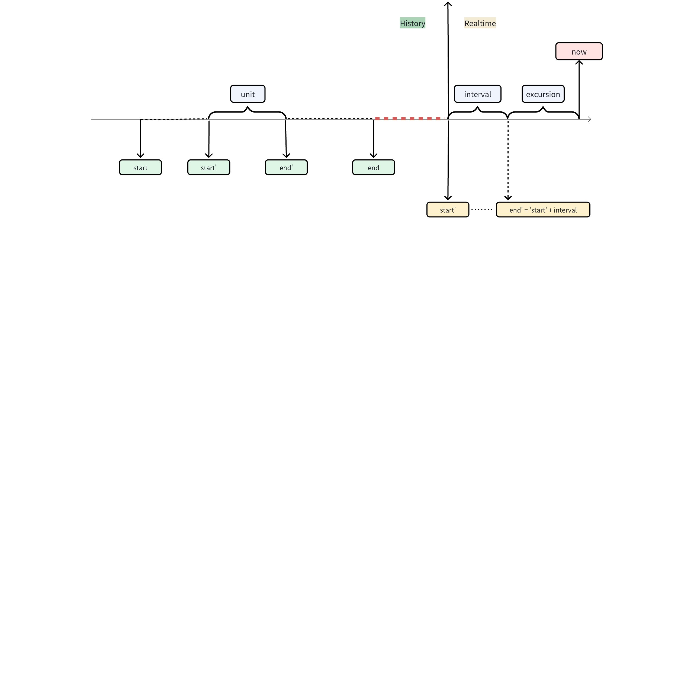
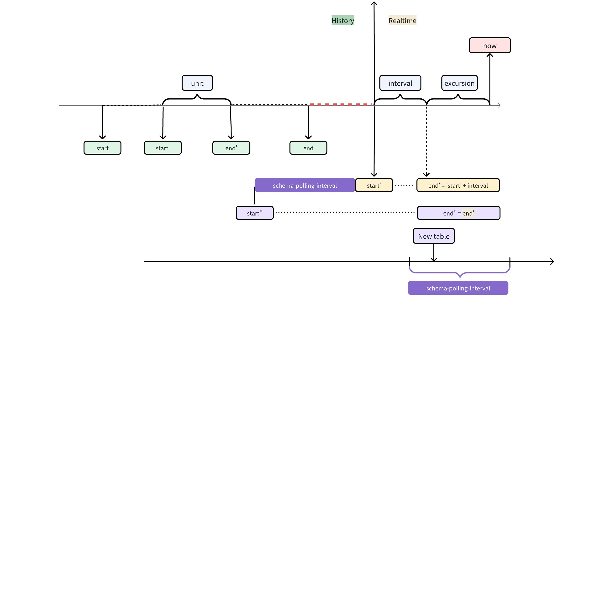

# 2.6->3.0 数据同步支持新建表自动同步

## 1. 背景

当前实现中在 2.6 到 3.0 数据迁移或同步时，首先获取表结构并拉取所有表信息，之后根据单位查询时间（unit）依次查询后写入。这就意味着在同步开始后新建的表不会进行查询和写入。
本次优化的目标是能够自动同步源端 2.6 集群在同步进行中新建的表。
关联 Jira 见：
TS-3667

## 2. 定义

数据迁移中对部分参数的定义如下：
- 运行模式 `mode`：分别使用 `history` 表示历史数据迁移，`realtime` 表示实时数据同步，`all` 表示先进行历史数据迁移，再进行实时数据同步。
- 起止时间 `start` `end`：由 `start` `end` 构成的左闭右开区间 `[start, end)`。
  - 在 `mode=history` 是，`start` `end` 均为用户输入。`start` 默认为每个子表的最早的时间戳，`end` 默认为当前时间。
  - 在 `mode=realtime` 时，`start` 为当前时间，`end` 为永久。
  - 在 `mode=all` 时，以当前时间为界，`[start, now)` 作为 `history` 任务截止时间，`[now, )` 为 `realtime` 任务的起止时间。
- 轮询间隔 `interval`：实时数据同步轮询的时间间隔。
- 乱序偏移时间 `excursion`：查询时间偏移量，以允许一定时间范围的乱序或延迟写入。
- 单位查询时间 `unit`：历史数据迁移时，在 `[start, end)` 的总查询要求下，根据单位查询时间切割为多次查询，每个查询的起止时间都是左闭右开区间 `[start', end') where end' <= start' + unit` 。在实时数据同步时，此参数不适用，单位查询时间与 `interval` 相同。
- 指定超级表 `stables`：仅同步指定超级表及其子表。
- 指定子表或普通表 `tables`：仅同步指定子表或普通表。
其中，`start`、`end`、`unit`、`excursion`、`interval` 与单次查询的起止时间 `start'`、`end'` 之间的关系如下所示：

其他可用参数，可参考 [taosX Data Migration User Manual](https://taosdata.feishu.cn/wiki/wikcnlXBGv4UKBOGld94f6leHre) 。

## 3. 变更历史

| 日期 | 版本 | 撰写人 |
| --- | --- | --- |
| 2024-01-04 | 0.1 | @霍琳贺 |

## 4. 行为说明

任务同步开始后，以初始查询到的所有表为基准，建立当前表的查询任务列表，依次推送到执行队列中。同时建立轮询任务，每次通过查询获得是否存在新建的表，如有，则将新建的表查询任务列表推送到执行队列（新建的表查询任务始终在队尾），新建表的查询任务起止时间与已存在的表查询任务时间一致。

### 4.1 数据源参数

添加数据源参数 `schema-polling-interval` ，表示新表轮询任务的时间间隔，默认为 `1m`。

### 4.2 适用情况说明

- 在 history 迁移过程中新建的表，将使用当前任务截止时间作为新建表的截止时间： `[start, end)` 。
- 在 `realtime` 同步过程中新建的表，将使用最近一次查询起始时间 `start' - schema-polling-interval`  作为新建表的查询起始时间 `start''`，最近一次查询结束时间 `end'` 作为结束时间 `end''`，保证在新表轮询间隔大于同步轮询间隔时，允许数据丢失的时间精度与其他表一致（即在新表轮询时间内的数据不丢失），在第一次查询完毕后，每次查询起始时间与其他表一致。
- 当指定数据库时，新增的超级表、子表和普通表均会同步。当 schema=none 时，没有数据的子表也不会自动建表。
- 当指定超级表时，仅增加指定超级表下的新增子表。
- 当指定子表或普通表时，新增的表不进入队列。

### 4.3 限制

- 数据迁移时新表中的历史数据在一个正在执行的查询任务的起止时间内的，可以正常导入，其风险与现有表一致：当一个时间段任务在查询时，写入该时间段甚至时间更早的数据无法被同步。
- 数据同步时，新表中超出查询范围的历史数据无法被同步。

## 5. 性能

- 对是否存在新表的定时轮询任务是独立运行的，一般情况下其对性能的影响可以忽略。
- 新表查询任务可能耗费 CPU 时长和内存较多，当数据迁移任务的 CPU 资源占用率较高时，可能会影响正常数据的迁移性能。此时，建议使用较大的 `schema-polling-interval` 时长降低可能的影响。
- 对于表数量极大的场景，会显著增加内存占用。

## 6. 兼容性

无影响。

## 7. 运维

无。

## 8. 使用场景

### 8.1 数据迁移时有新表导入历史数据

此时，新表中的历史数据在当前任务的起止时间内的，可以正常导入。

### 8.2 数据同步时有新表数据写入

此时，新建的表在下次新表轮询时间后进入到执行队列，新建表的数据正常同步到目标数据库。

## 9. 约束和限制

新增的表与已有的表有相同的同步一致性限制：
- 在查询时，写入了查询时间段之前的数据无法被写入。
- 在查询时，写入了查询时间段之内的数据，无法保证数据完整性。
- 同步时写入不在查询时间范围内的数据，无法被同步。

## 10. 常见错误和排查

无。
