# AVEVA Historian Source

## 1. 背景

Wonderware Historian（现在称为AVEVA Historian，由原Wonderware公司开发，随后该公司成为AVEVA的一部分）是一个实时数据库系统，用于收集、存储、分析和可视化来自生产过程的数据。
**武汉水务**项目需要从 AVEVA Historian 数据库迁移数据到 TDengine。
整理需求后，总结 taosX Historian 特有的需求如下：
- 支持 **数据迁移 **和 **数据同步 **2种任务模式（数据迁移和数据同步的定义在 “4.2 数据迁移”和“4.3 数据同步” 中描述）；
- 支持从 **Runtime.dbo.History **和 **Runtime.dbo.Live** 2张数据视图中获取数据（数据视图的定义在“3. 定义”中描述）；
- 对于数据迁移来说，迁移的是，从指定的 beginDateTime 开始，到指定的 endDateTime 结束，Runtime.dbo.History 视图中的数据；
- 对于数据同步来说，同步的是，从指定的 beginDateTime 开始，到 未来 的 Runtime.dbo.History视图中的数据；或者，从任务启动时间开始，到未来的 Runtime.dbo.Live 视图中的数据；
- 数据迁移是按指定的时间窗口一批一批迁移的，迁移完一个窗口的数据，再迁移下一个窗口的数据。用户可以指定时间窗口的大小；
- 数据同步任务按照指定的查询间隔，以轮询的方式进行，用户可以指定查询间隔；
和 taosX 中的其他数据源相同的需求包括：
- 支持连通性检查；
- 支持高级选项；
- 支持 transformer，AVEVA Historian 的数据模型与从CSV或关系型数据库导入数据没有本质的区别。使用 taosX 统一的 transformer。
需求相关的JIRA如下所示：

TS-4227


TD-27740


TD-27909


TS-4375


TS-4377


TS-4388


TS-4355


## 2. 变更历史

| **日期** | **版本** | **撰写人** |
| --- | --- | --- |
| 2023-12-21 | 1.0 | @杨志宇 |


## 3. 定义

- **AVEVA Historian 的数据视图**
在AVEVA Historian数据库中，存在 Runtime.dbo.History 和 Runtime.dbo.Live 等多个的数据视图。
**Runtime.dbo.History**：这个视图用于查询历史数据。当数据点的值发生变化时，新的值可以从Runtime.dbo.History 中查询出来。这些数据随着时间的推移而被累积，因此可以用于趋势分析、报告、数据挖掘等。
**Runtime.dbo.Live**：与 Runtime.dbo.History 不同，Runtime.dbo.Live 视图用于查询当前的实时数据。也就是说，这个视图中的数据代表了最近的数据点值，反映了系统的实时状态。这些数据通常用于实时监控和控制应用程序，而不是用于长期的数据分析。

- **Duration 格式**
**Duration** 表示 一个时间区间，通常作为某个参数的类型。例如：taosX Historian 的配置参数 timeWindow，taosX historian 的数据迁移任务通过 timeWindow 来划分查询的时间窗口。timeWindow 的类型是 duration，通过一个字符串表示。例如：timeWindow = 1d，表示 timeWindow 是 1 天。 
Duration 可以用来配置 taosX 中所有时间范围的类型，应该使用统一的 UI 设计。Duration 的好处是，不需要固定时间的单位，可以配置在大范围的时间区间，在命令行模式下指定配置参数很方便。例如，指定taosX Historian的timeWindow参数和retrieveInterval参数，可以写成：`timeWindow=1d&retrieveInterval=10s`，而如果都使用相同的单位（秒），需要写成：`timeWindow=86400&retrieveInterval=10`。
**Duration** 由`[value][unit]`这样的一个或多个字符对组成。例如：“15 days 20 seconds 100 milliseconds”。value和unit之间的空格可以不加。
Duration 的 unit 可以是：nanoseconds/ microseconds/ milliseconds/ seconds/ minutes/ hours/ days。unit 也接受缩写，只要意思不含糊，任意开头部分都可以接受。例如：“10d1h5m”是可以的。unit 不区分大小写。
`"nsecs"`, `"usecs"`, `"μsecs"`, `"msecs"`, `"secs"`, `"mins"`, `"hrs"`这几个unit 缩写也是可以接受的。

## 4. 行为说明

### 4.1 概述

taosX Historian Source （以下简称，taosX Historian ）是 taosX 接入 AVEVA Historian 数据的一种数据源。taosX Historian 包含的功能有：
1. 支持连通性检查；
2. 支持“数据迁移”和“数据同步”两种模式；
3. 支持通过配置 transformer 将数据映射到 TDengine 的数据表；
4. 支持断点续传

### 4.2 数据迁移

**数据迁移 **是指 将 AVEVA istorian 中的某个时间范围（从 beginDateTime 开始，到 endDateTime 结束）的数据查询出来，按照用户配置的 transformer 规则进行转换，写入到 TDengine 中。数据迁移任务完成后，进入“Completed”状态，任务结束。
对于数据迁移来说，只可以查询 Runtime.dbo.History 表，对应的 SQL 如下：
```sql
select * from Runtime.dbo.History 
Where TagName in (...) / where TagName like 'xxx'
and DateTime >= t1
and DateTime < t2
and wwRetrievalMode = 'FULL'
```

1. 使用 select * 查询返回所有列，Runtime.dbo.History 的结果集共有 33 个列，详细见：[AVEVA™ Historian 2020.R2.SP1 Research Report](https://taosdata.feishu.cn/wiki/TjYfwPHo0iUr5JkWr3Ic3lhpndc) 的 4.4 节。用户可以通过 transformer 中的mapping 来选择映射哪些列到 TDengine 的列上；
2. AVEVA Historian 中，查询 History 表必须指定 TagName 的范围，查询条件使用 `TagName = 'xxx'` 或者 TagName`TagName in (...)` 或者 `TagName like / not like 'xxx'`；同时，tagName in 这个列表内的 TagName 值也不能太多，否则会影响查询性能。
3. 用 DateTime 指定查询的时间窗口，合适的时间窗口可以保证查询的性能
4. 最后，要指定 wwRetrieveMode 为 Full 模式，保证全部数据都获取到。wwRetrieveMode不需要用户指定，都使用 Full。关于 AVEVA Historian 的 RetrieveMode ，参考：[AVEVA™ Historian 2020.R2.SP1 Research Report](https://taosdata.feishu.cn/wiki/TjYfwPHo0iUr5JkWr3Ic3lhpndc) 的“ 5.1.1. Full Retrieve”一节。
根据上面的分析，数据迁移需要的配置项应该包括：
1. tags：用来指定需要迁移的 TagName 列表。tags 的形式可以是 tagName组成的字符串，以逗号分割；也可以是包含通配符*的表达式。例如：当 `tags = *`时，表示所有非‘Sys’开头的 Tag；当 `tags = HD*` 的时候，表示所有以 HD 开头的 Tag。
2. tagListSize：用来指定划分 TagName 列表，每组 Tag 的个数。
3. beginDateTime ：任务的开始时间；
4. endDateTime：任务的结束时间；
5. timeWindow：用来划分每次查询的时间窗口大小；

### 4.3 数据同步

**数据同步** 是指 将 AVEVA Historian 中的实时数据查询出来，按照用户配置的 transformer 规则进行转换，写入到 TDengine 中。 根据选择的 AVEVA Historian 数据视图，数据同步分为2种方式：
1. 当数据视图为 Runtime.dbo.Live 时，数据同步的是，从任务启动时间开始，到未来的 Runtime.dbo.Live 视图中的数据。
2. 当数据视图为 Runtime.dbo.History 时，数据同步的是，从指定的 beginDateTime 开始，到 未来 的 Runtime.dbo.History视图中的数据；
数据同步任务按照指定的查询间隔，以轮询的方式进行。数据同步任务会持续运行，除了任务异常或手动中止，任务不会结束。

#### 4.3.1 同步 Runtime.dbo.Live

在AVEVA History 的 Runtime.dbo.Live 中，不存在历史数据。对于 Live 表的查询，SQL 是：
```sql
select * from Runtime.dbo.Live 
[where TagName in (...) / where TagName like 'xxx']
```

Where 过滤条件也是可选的，可以不指定TagName的范围
返回的结果集中，DateTime 就是查询时刻的时间，切每个 Tag 只会有 1 条记录。
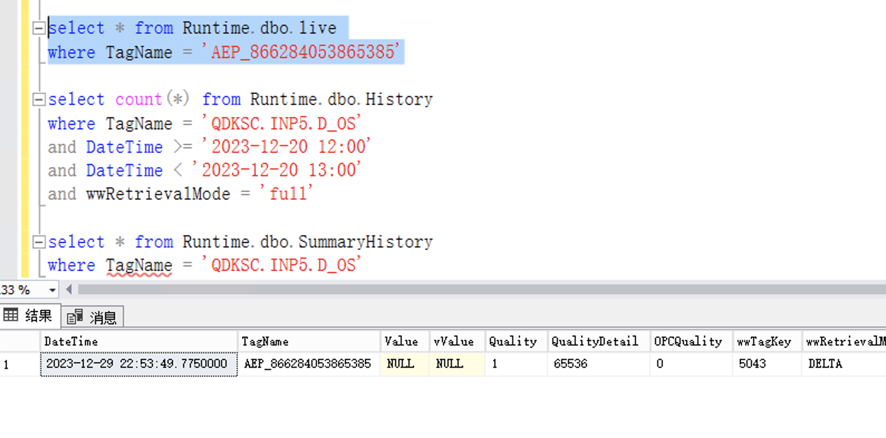

根据上面的分析，同步 Runtime.dbo.Live 表的数据，需要的配置参数包括：
1. tags：可以指定需要同步TagName 列表；
2. retrieveInterval：执行查询的频率。
**！！！注意：**
现实情况应该是，每个Tag 对应一个设备；每种设备对应一个数据上报的频率。通过查询 Live 表同步数据，存在的问题是：
- 当 retrieveInterval 大于 数据上报频率 时，不会丢失数据，但会有重复数据；
- retrieveInterval 小于 数据上报频率 时，会丢失数据。
- retrieveInterval 等于 数据上报频率时，Live 表获得的时间戳，和真实数据的时间戳之间，还不一定完全一致。

#### 4.3.2 同步 Runtime.dbo.History

同步 Runtime.dbo.History 数据时，任务可以分为 2 部分，一个是从 beginDateTime 到 now 的数据迁移任务，另一个是 从 now 开始的，轮询同步任务。对于轮询同步 Runtime.dbo.History，对应的 SQL 是：
```sql
select * from Runtime.dbo.History
where TagName in (...) / where TagName like 'xxx'
and DateTime >= t1
and DateTime < t2
and wwRetrieveMode = 'FULL';
```

Runtime.dbo.History 中的数据可能存在延迟。例如：
有数据分别在 1s, 2s, 4s, 5s, 8s 产生，但因为延迟，在执行查询 `DateTime >= 0s and DateTime < 10s`时，只有1s, 2s, 4s 可以查询到，在执行下一个查询窗口 `DateTime >= 10s and DateTime < 20s` 时，5s, 8s 的数据才完成写入，那么，就会产生同步数据的丢失。
为了解决上面的问题，可以引入 tolerance 参数。tolerance 参数为允许数据延迟到达的最大时长。例如，在已知数据上报的延迟一定在10s以内的情况下。同步数据的时间窗口变为：
```sql
DateTime >= last_window_end and DateTime < now - tolerance
```

例如：当 retrieveInterval = 1 min，tolerance = 10s 的情况下，同步 Runtime.dbo.History 的 SQL 变为：
```sql {wrap}
!-- 在时间为 now + 1 min + 10s时，执行
select * from Runtime.dbo.History where TagName in (...) and DateTime >= {now} and DateTime < {now + 1min} and wwRetrieveMode = 'FULL';

!-- 在时间为 now + 2min + 10s 时，执行
select * from Runtime.dbo.History where TagName in (...) and DateTime >= {now + 1min} and DateTime < {now + 2min} and wwRetrieveMode = 'FULL';

!-- 依次类推
```

通过以上分析，同步 Runtime.dbo.History 时，配置参数包括：
1. tags：指定需要同步TagName 列表；
2. tagListSize：用来指定划分 TagName 列表，每组 Tag 的个数。
3. beginDateTime：指定任务开始时间；
4. timeWindow：指定迁移部分的时间窗口大小；
5. retrieveInterval：指定同步部分的查询的窗口大小；
6. tolerance：可以指定容忍数据延迟到达的时间上限

### 4.4 配置参数

#### 4.4.1 连接配置

| **参数** | **描述** | **必填** | **默认值** |
| --- | --- | --- | --- |
| host | AVEVA Historian的SQL Server的地址或域名 | 是 |  |
| port | AVEVA Historian的SQL Server的端口 | 否 | 1433 |

#### 4.4.2 认证

| **参数** | **描述** | **必填** | **默认值** |
| --- | --- | --- | --- |
| username | AVEVA Historian的SQL Server的用户名 | 是 |  |
| password | AVEVA Historian的SQL Server的密码 | 是 |  |

#### 4.4.3 采集

| **参数** | 描述 | **必填** | **默认值** | **范围** |
| --- | --- | --- | --- | --- |
| mode | migrate 或者 synchronize | 是 | 无 | migrate/ synchronize |
| table | historian 中数据源视图名，Runtime.dbo.History 或者 Runtime.dbo.Live。 | 是 | 无 | Runtime.dbo.History / Runtime.dbo.Live |
| tags | Historian 中数据源视图的 TagName 列表，以逗号分隔。或者填“*”，表示同步除了Sys开头外的全部tag | 否 | * |  |
| tagListSize | 当 `table` 为 `Runtime.dbo.History` 且 `tags` 中的 TagName 超过 `tagListSize` 时，tags 被按照每组 tagListSize 个进行划分。 使用 `tagListSize` 划分 TagName 是为了提高数据迁移/同步时的查询效率。`tagListSize` 默认值为 10。 例如，tags = * 时有6000个TagName，tagListSize 为 10，则需要查询 600 次，每次查询 10 个 TagName 的数据。 | 否 | 10 | 1 ～ 10000 |
| beginDateTime | 任务的开始时间，rfc3339格式的日期时间 | 否 | 无 |  |
| endDateTime | 任务的结束时间，rfc3339格式的日期时间 | 否 | 无 |  |
| timeWindow | 数据迁移时，单次查询的时间窗口大小，duration 格式 | 否 | 1d |  |
| retrieveInterval | 数据同步时，轮询间隔，duration 格式 | 否 | 10s |  |
| tolerance | 数据同步时，容忍乱序数据延迟到达的时间上限 | 否 | 0ms |  |

说明：
1. timeWindow、retrieveInteval、tolerance都是填一个符合duration格式的字符串，duration格式看“3. 定义”中的描述。

#### 4.4.4 数据映射

对于 AVEVA Historian 的数据，在 Table 已经选定时，可以通过在 数据库中执行 SQL 来获取到表的数据结构：
```sql
!-- 获取 History 表的 schema
describe Runtime.dbo.History

!-- 获取 Live 表的 schema
describe Runtime.dbo.Live
```

这样，schema 是通过查询数据库获得的，不是在代码中固定写死的。
taosX 使用 Transformer 来做数据映射，parse 这部分使用查询数据库获取schema和 样例数据，其他的 filter、mapping 部分与其他数据源的配置完全一致。
 
#### 4.4.5 高级选项

taosX historian 的高级选项配置与[数据源统一参数 Advanced Options](https://taosdata.feishu.cn/wiki/M7DtwijKMinpPIkVxX0cYAE9n2K) 中的设计保持一致。需要单独说明的是：
1. 支持 read_concurrency 参数，write_concurrency 和 read_concurency 相等，不可设置。
2. batch_size 的默认值为10000，最大值为100_000，其它规则相同。

### 4.5 UI

#### 4.5.1 连接配置和认证

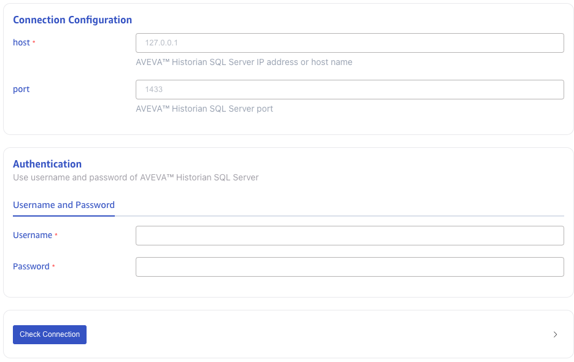

#### 4.5.2 采集配置

##### 4.5.2.1 migrate

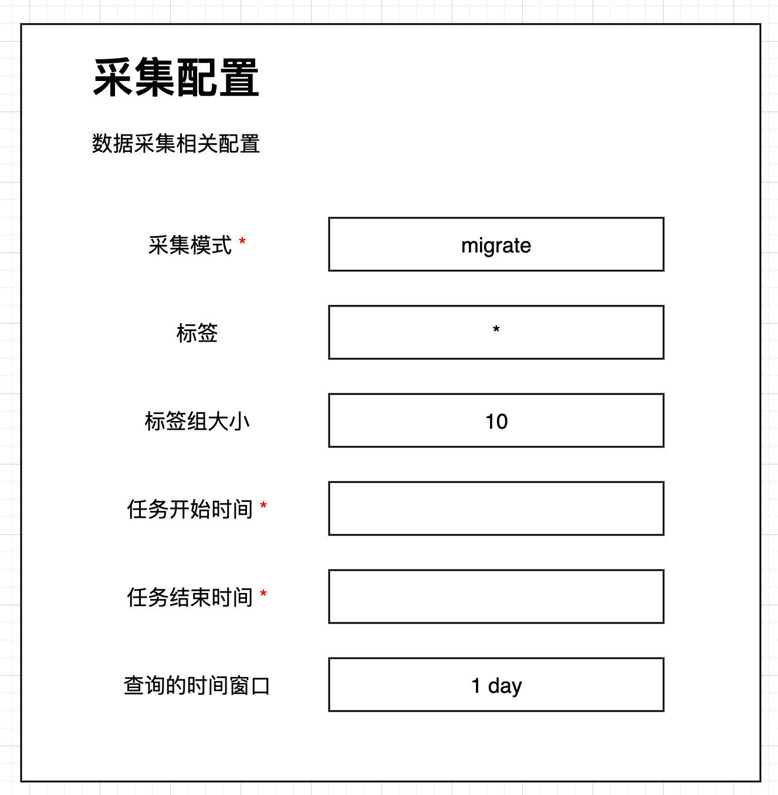

##### 4.5.2.2 Sync Live

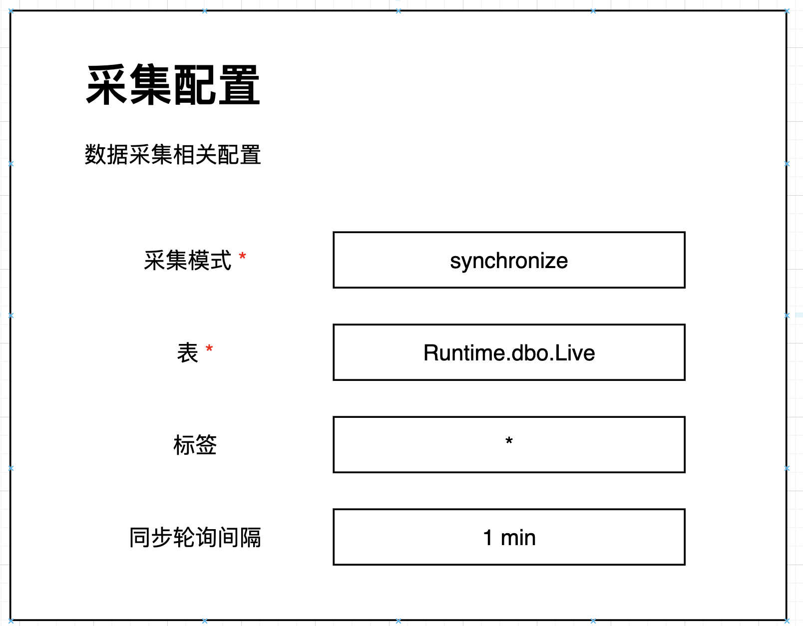

##### 4.5.2.3 Sync History

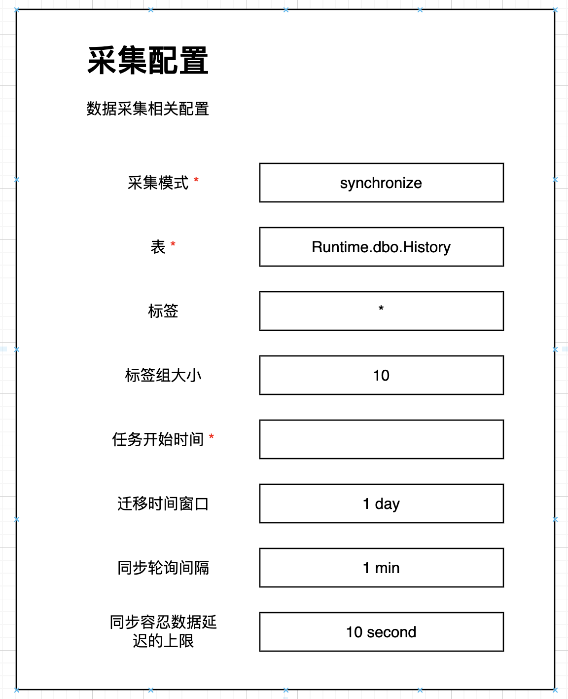


#### 4.5.3 数据映射

数据映射的UI
1. 没有Message Body 这部分，Message Body 是通过查询数据库获取到 Schema和样例数据；
2. Parse 和 Extract or Split 这部分也不需要；
3. 存在 Filter 部分，可以对数据进行过滤；
4. 存在 Mapping 部分，与TDengine 的模型进行映射。
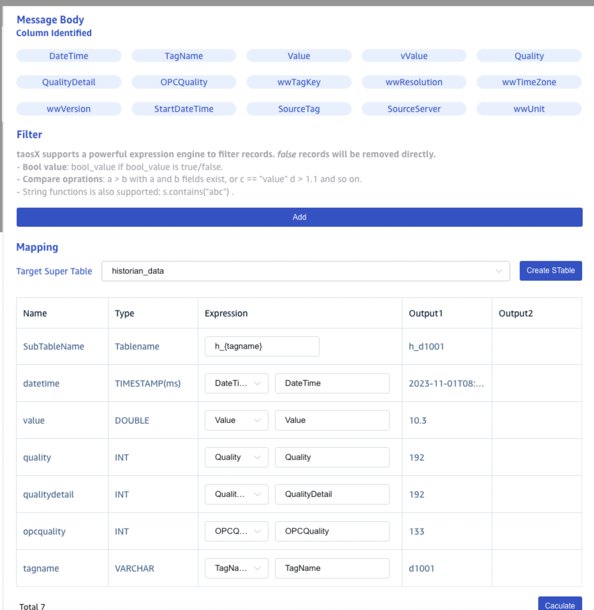


#### 4.5.4 高级选项

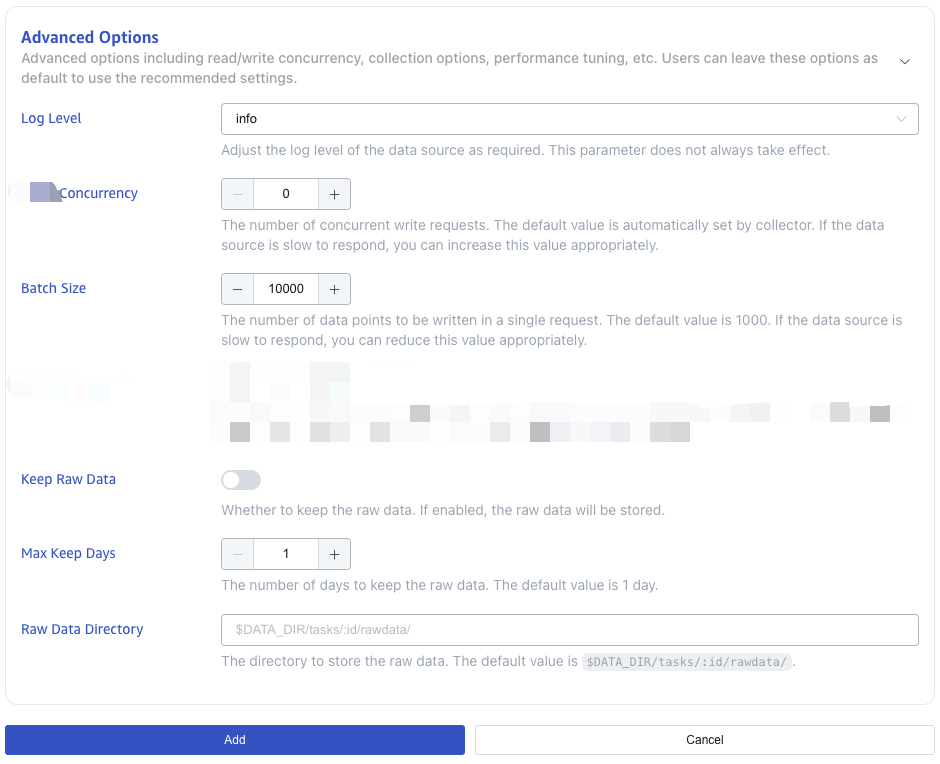

按照[数据源统一参数 Advanced Options](https://taosdata.feishu.cn/wiki/M7DtwijKMinpPIkVxX0cYAE9n2K) 的设计，avevaHistorian 支持的高级选项包括：
- read_concurrency：读并发，avevaHistorian 的 write_concurrency 和 read_concurrency 是相等的；
- batch_size：批大小；
- keep_raw_data：是否保存原始数据；
- keep_raw_data_days：原始数据保留的天数；
- keep_raw_data_dir：原始数据保留的文件路径

## 5. 性能

与[数据源统一参数 Advanced Options](https://taosdata.feishu.cn/wiki/M7DtwijKMinpPIkVxX0cYAE9n2K) 中的设计保持一致，通过调整 read_concurreny 和 batch_size 来影响性能。通常情况下，historian source 的性能瓶颈在 SQL Server的查询上。

## 6. 兼容性

Historian 在 taosX-1.5.0 中第一次正式发布，不存在兼容性问题。

## 7. 运维

无

## 8. 使用场景

### 8.1 数据迁移

武汉水务项目，需要将AVEVA Historian 中的历史数据迁移到 TDengine 中。历史数据从 Runtime.dbo.History 中查询：
1. 导出约 6000 个点位
2. 导出时间范围：2022.1~2023.10
3. 导出到 TDengine 中的 history 超级表，history 的建表语句：
```sql
create table (
    `datetime` timestamp, 
    `value` double,
    `vValue` varchar(256),
    `quality` tinyint,
    `qualitydetail` int,
    `wwtagkey` int,
    `wwresolution` int,
    `startdatetime` timestamp,
    `sourcetag` varchar(512),
    `sourceserver` varchar(512)
) tags (
    `tagname` varchar(4000)
)
```


### 8.2 数据同步

武汉水务项目，数据同步包括几种不同的场景，分别是：
1. 将 Runtime.dbo.Live 中的数据，同步到 TDengine 中的超级表 live 中；
2. 将 Runtime.dbo.History 中的数据，同步到 TDengine 的超级表 history 中；
3. 将 Runtime.dbo.History 中以HD开头的所有点位数据，同步到 TDengine 的 live 表中。

## 9. 约束和限制

1. taosX Historian 仅支持 TDengine 3.2.3.0 之后的版本；
2. taosX Historian 目前仅适配 historian 2020 RS SP1 版本。

## 10. 常见错误和排查

1. 必填信息缺失时，前端页面报错，提示用户输入。例如，没有选择目标数据库，有如下提示：
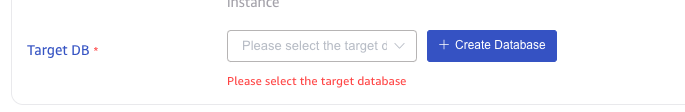

1. 数据源连通性检查如果失败，前端会提示错误原因，请根据错误原因再进行进一步的排查。例如：认证信息失败，有如下提示：
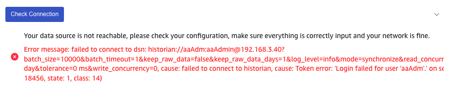

1. 提交任务时，如果创建失败，前端提示创建任务失败和错误原因。例如：创建任务报错，有如下提示：
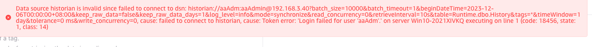

1. 任务执行过程中，出现的异常信息在日志信息中可以查看。例如：任务执行报错，有如下提示：
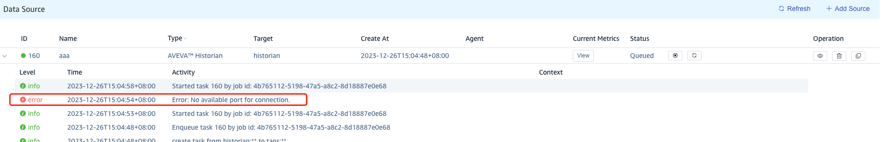
