# OPC 点位过滤和下载机制优化

## 1. 背景

### 1.1 opc技术背景

#### 1.1.1 Opc ua 

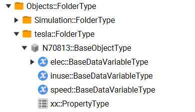

OPC-UA 以树状结构或图状结构来组织点位，组织结构中节点类型有：FolderType, Object, Variable。
中间节点使用 FolderType 和 Object 类型，叶子节点使用 Variable。Variable 叶子结点对应真正的数据点位。
每个节点由 NodeId 唯一标识，形如:ns=7;i=1019，由 namespace 和 id 组成。每个节点都有 name。
opc server 对外提供 Browser 服务，可以获取某一个指定 NodeId 的节点，也可以获取指定节点的 child 节点。

#### 1.1.2 opc da

Opc da 的服务节点通过 com 技术暴露在 win 注册表中，链接方式绑定了 window 平台的技术端口。
taosX 如果部署在 linux 平台，则无法通过网络服务直接连接 opc da 服务，需要使用 agent 代理来连接 opc da 服务。

### 1.2 explorer实现现状和问题分析

为了能将 opc ua 中数据点位的数据同步到TDengine，我们将数据点位信息配置到 taosX 同步任务中。为了方便 explorer 用户编辑数据点位信息，提供了批量下载功能。

#### 1.2.1 目前实现方案

从根节点开始，广度优先遍历所有节点，将 variable 节点的 nodeId 信息整理到csv文件中下载。
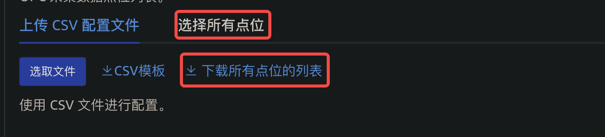


#### 1.2.2 存在的问题

1. 下载了过多不用的系统点位
以 Procsys Simulation Server 为例，其系统自带点位很多(2k+)。
1. 下载时间耗时长
当点位数量达到1万以上时，一次下载时间过长。原因是要逐个遍历树节点，获取所有数据点位。
造成的后果是，在云服务上，由于网关设置超时时长，造成无法成功下载。

#### 1.2.3 相关jira

TD-27415


TD-27965


TD-26712

https://jira.taosdata.com:18080/browse/TD-27944
https://jira.taosdata.com:18080/browse/TS-4368

### 1.3 新增优化需求

详见评论中[OPC 连接器新需求和BUG](https://taosdata.feishu.cn/docx/TEFydbWMqorPrDxzfJycP2vfndg) 的要求，经评估将文档中2~4部分纳入1.5.0版本范围。
主要包含两部分优化需求：
1. CSV模板的优化，统一格式，优化字段描述。
2. 修正之前实现的一个逻辑错误，区分安全策略(传输层)和用户认证(应用层)的配置设计。

### 1.4 目标

本文的目标是提供点位过滤功能以让用户在对点位配置情况较熟悉的情况下可以通过配置更优的过滤条件来提高获取点位的速度。同时在用户选择下载点位时解决网关超时的问题。

## 2. 变更历史

| **日期** | **版本** | **撰写人** | 备注 |
| --- | --- | --- | --- |
| 2024-01-03 | 0.1 | 周营昭 | 初稿 |
| 2024-01-03 | 0.2 | 周营昭 | 增加4.3，去掉一部分功能 |
| 2024-01-04 | 0.3 | 周营昭 | 和洪奎沟通后，4.3 方案修改为可视化选择点位 |
| 2024-01-08 | 0.4 | 周营昭 | 1. 整合需求[OPC 连接器新需求和BUG](https://taosdata.feishu.cn/docx/TEFydbWMqorPrDxzfJycP2vfndg) 1. 分成OPC UA和OPC DA两个分别的优化策略 |
| 2024-01-09 | 0.5 | 周营昭 | 下午4点二次评审后修改： 1. 选择数据点位，只记录查询条件，点位列表不可删除，详见4.1.4 1. 修改“选择数据点位”兼容性说明，详见6.1 1. 增加选择点位场景，老版本配置和1.5.0版本兼容场景，详见8.3 |
| 2024-01-10 | 1.0 | 周营昭 | CSV模板中增加数据转换规则，对val和ts做数据转换。 详见4.1.3 |

## 3. 定义

无。

## 4. 行为说明

### 4.1 OPC-UA行为说明

#### 4.1.1 安全策略配置

安全策略配置仅适用 tcp endpoint。
安全模式和安全策略是传输层使用的策略，不是应用层用户认证的内容，需要调整其配置位置，调整后如下图所示。
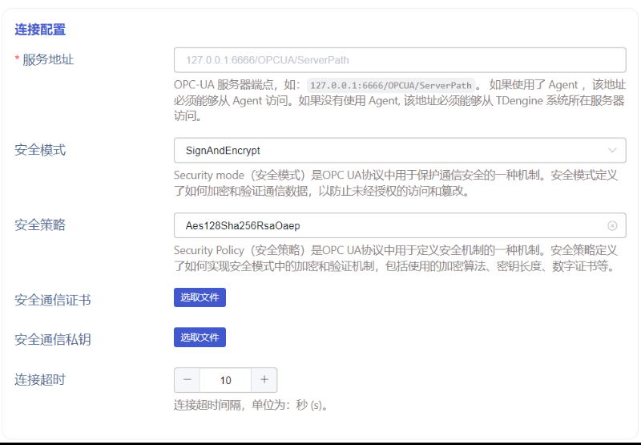

当安全模式选择为None时，安全策略disable,不可选择，安全通信证书和安全通信私钥不可见；
当安全模式选择为 Sign 或者 SignAndSecret 时，

安全策略可选项有：
1. Basic128Rsa15
2. Basic256
3. Basic256Sha256
4. Aes128Sha256RsaOaep (新增）
5. Aes256Sha256RsaPss (新增）
<callout emoji="exclamation" background-color="light-orange" border-color="light-orange">
检查联通性时，如果选择了服务端不支持的安全模式和安全策略，需要能够明确提示出来。
</callout>

**用户认证**中的“证书访问”，只留证书相关内容，修改后如下图所示：


<callout emoji="bulb" background-color="light-orange" border-color="light-orange">
双证书说明：
1. 连接配置中的证书用于加密通信消息和签名；
2. 用户认证中的证书，用于身份认证。
两个证书可以是一样的，也可以用不同的证书。
</callout>


#### 4.1.2 点位过滤

下载信息点位时，explorer 用户可以给出过滤条件：
1. 根节点：用户可以给出起始扫描的根节点 NodeId ，输入格式为 `ns=7;i=1082`。默认是 Objects Root Folder `i=85`。
2. 命名空间：下拉多选namespace，选择多个使用逗号分割，比如`3,5,7`。为空则获取除ns=0外其他所有的namespace。
3. 点位名称正则：点位 name 符合正则匹配的数据点位才加入结果集。

三个过滤条件都是可选的，给出以上三个条件后，我们会从指定根节点起，往下遍历子节点；
如果子节点 NodeClass 为 Variable，namespace 在给定的 namespace_index 范围内，并且 regex_for_name 正则表达式检查name匹配通过，则加入结果集；
否则如果 ReferenceType 为 HierachicalReferences 及其子类型，则继续遍历该节点的子节点。

草图示例：
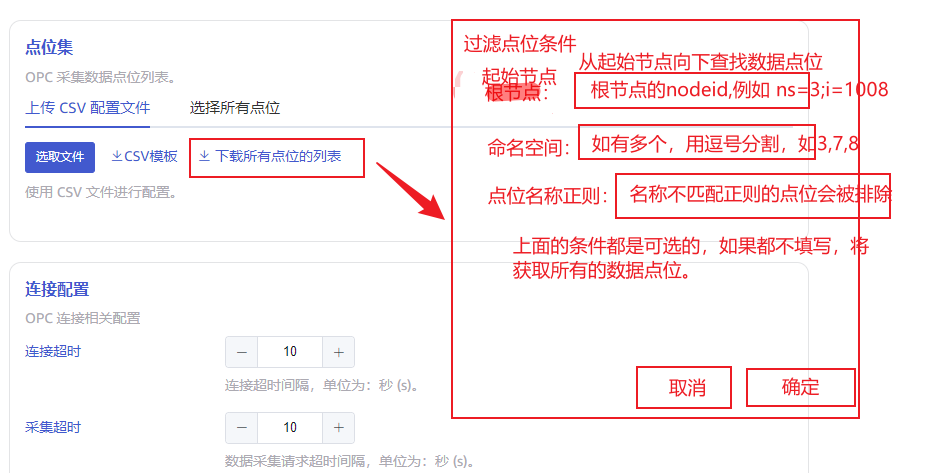

`CSV模板` 修改为 `CSV空模板`。
`下载所有点位的列表`修改为`下载数据点位模板`。

**接口响应定义**：
```json
{
    ticket: "abc222"
}
```

提交下载任务后，后台返回 ticket 作为当前下载任务的跟踪标识。
下载方式采用异步下载，详见"异步下载"。

#### 4.1.3 点位模板文件说明

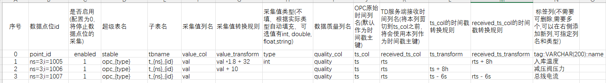

如图，点位文件模板和下载点位文件统一为图例中格式，列按照逻辑关系调整了顺序，总体分为三个部分：数据点位信息、表信息、表字段信息。
1. 序号：按照顺序递增，没有任何业务意义
2. 数据点位Id： OPC UA 数据点位的 NodeId
3. 是否启用：(可选)设置为0时，将停止对应点位的数据采集
4. 超级表名称：超级表名称默认使用`opc_{type}`，例如点位数据类型为 int，则默认对应的超级表表名位 opc_int; 也可以单独配置超级表表名，比如直接不带参数将表名固定为 meter_current_chaoyao。
5. 子表名称：子表名称使用`t_{ns}_{id}`
6. 采集值列名：指定采集值列名，会根据数据点位的数据类型来设置此列的数据类型
7. 采集值转换规则：（可选）设置采集值转换规则，比如将摄氏度转为华氏度，则可以使用转换规则`val * 1.8 + 32`。其中val为“采集列列名”配置的。
8. 采集值类型：(可选)指定该列的数据类型
9. 数据质量列名：（可选）指定数据质量存储列名，类型固定为int
10. OPC 原始时间列名：存储 OPC 数据生成时间的时间戳字段列名，默认作为主键；
11. TD 服务端接收时间列名：存储同步到TDengine数据库的时间，移到 OPC 原始时间列名之前，将作为时间戳主键；
12. ts_col 时间戳转换规则：(可选) 可以加减duration来矫正时间戳，比如 ts + 8h，ts - 300s。单位支持时h分m秒s.
13. recieved_ts_col 时间戳的转换规则：(可选）可以加减`毫秒数`来矫正时间戳，比如 ts + 3600*8，。
14. 标签列：可以删除的，如果有多个，则可以追加列。
下载数据点位模板文件中，没有标签列。

#### 4.1.4 选择数据点位

分成两步操作，首先过滤数据点位，第二步配置表名对应规则。两个步骤在同一个 tab 下，上下两个 panel 区域表达。
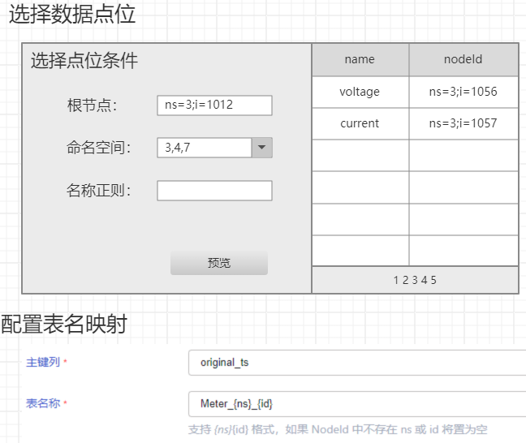


##### 4.1.4.1 选择数据点位交互细节

选择数据点位采用左右布局，左侧是过滤条件输入表单，右侧是过滤出的数据点位预览列表。
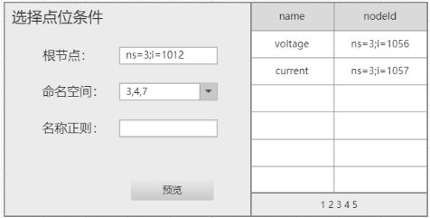

**新增编辑**
通过"新增数据源"进入编辑页面。


1. 初始化，左侧过滤条件为空，右侧点位列表为空；
2. 输入过滤条件，点击`预览`查询出符合条件的点位列表，显示在右侧列表中；预览需要异步获取点位列表数据，以免超时。
3. 保存 task 时，后端持久化记录输入的过滤条件；
4. task启动时，taosX 服务根据过滤条件查询数据点位，根据表名映射规则生成对应子表，然后开始同步点位数据。
**修改编辑**
对已有的 data in 配置，点击编辑。


1. 初始化，左侧过滤条件加载原有配置，右侧列表为空；
2. 修改过滤条件，点击`预览`查询出符合条件的点位列表，显示在右侧列表中；预览需要异步获取点位列表数据，以免超时。
3. 保存 task 时，后端持久化记录输入的过滤条件。
4. task重新启动时，taosX 服务根据过滤条件，重新查询数据点位，根据表名映射规则检查是否有对应子表，如果没有则创建子表，然后开始同步点位数据。

##### 4.1.4.2 配置映射规则


现行版本表名称前缀为`Meter`，需要修改为 t ，形如`t_{ns}_{id}`，更具有通用意义。

##### 4.1.4.3 **数据结构定义**

提交数据的json格式定义
```json
{
    nodeList: [{
        "name": "voltage",
        "nodeId": "ns=3;i=1089"
    }, {
        "name": "current",
        "nodeId": "ns=3;s=gn001"
    },...],
    deleteItem: ["ns=3;s=gn001", "ns=3;i=1089"]
}
```


修改时，返回的json格式
```json
[{
    "name": "voltage",
    "nodeId": "ns=3;i=1089"
}, {
    "name": "current",
    "nodeId": "ns=3;s=gn001"
},...]
```


### 4.2 OPC-DA行为说明

#### 4.2.1 点位过滤

下载信息点位时，explorer 用户可以给出过滤条件：
1. 根节点：用户可以给出起始扫描的根目录，输入格式为 root.parentGroup.childGroup，默认是 root。
2. 点位名称正则：点位 TagName 符合正则匹配的数据点位才加入结果集。
两个过滤条件都是可选的，过滤条件和 opc ua 不同，具体交互细节同opc-ua。

#### 4.2.2 点位模板文件说明

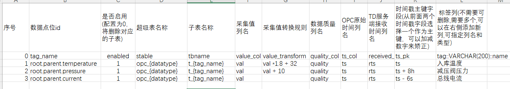

如图，点位文件模板和下载点位文件统一为图例中格式，列按照逻辑关系调整了顺序，总体分为三个部分：数据点位信息、表信息、表字段信息。
1. 序号：按照顺序递增，没有任何业务意义
2. 数据点位 tag_name： 数据点位的名称
3. 是否启用：设置为0时，如果点位有对应的子表，将删除子表；设置为1时，如果没有子表，将创建子表
4. 超级表名称：超级表名称默认使用opc`_{datatype}`，例如点位数据类型为int，则默认对应的超级表表名opc_int; 也可以单独配置超级表表名，比如直接不带参数将表名固定为 meter_current_chaoyao。
5. 子表名称：子表名称使用`t_{TagName}`，也可以直接使用固定表名。
6. 采集值列名：指定采集值列名，会根据数据点位的数据类型来设置此列的数据类型
7. 采集值转换规则：指定表达式，比如将摄氏度转成华氏度存储，则可以配置规则为 `val * 1.8 + 32`，其中val是第7点配置的列名。
8. 数据质量列名：指定数据质量列名，类型固定为int
9. OPC 原始时间列名：存储 OPC 数据生成时间的时间戳字段列名；
10. TD 服务端接收时间列名：存储同步到TDengine数据库的时间；
11. 时间戳主键列：从前面两列中配置一下主键列，可以添加矫正参数。
12. 标签列：可以删除，如果有多个，则可以追加列。

#### 4.2.3 选择数据点位

交互同 opc ua。
查询条件有：
1. 根节点
2. 点位名称正则

### 4.3 异步下载

为了避免网关超时的问题，explorer使用异步下载的方式。
提交下载请求后，前端出一个模拟进度条，提示正在生成数据点位文件。
然后轮询后端，是否准备好 csv 文件，如果后端准备好 csv 文件，则给出下载链接，前端快速结束掉滚动条，开始下载文件。
**请求接口**
轮询时带着参数 ticket 请求下载任务进度，后端将 ticket 对应的进度状况返回。
```plaintext
url?ticket=abc222
```

**返回结果**
```json
{
    ready: true/false,
    url: "http://download.com/csv"
}
```

1. ready: 是否准备好 csv 文件
2. url: 文件下载地址，如果 ready 是 true, url为下载地址，否则为null。

## 5. 性能

### 5.1 全量下载性能

全量下载性能采用多线程并发进行 BFS 遍历时有可能会有提升，具体要看开发出原型后的测试效果。


### 5.2 使用过滤条件后的性能

指定根节点缩小搜索的子树范围，随着搜索中间节点的数量减少，性能有同比的提升。而使用节点名称模式匹配或者命名空间匹配的方式不会有性能提升（可能还略有下降）。

## 6. 兼容性

### 6.1 选择数据点位

旧版本配置的“选择所有点位” task，相当于版本 1.5.0 中没有输入任何过滤条件的“选择数据点位”，完全兼容。

### 6.2 csv点位文件

Opc da 的配置文件，point_id 在新版本模板中修改为 tag_name 和 group 两个字段，需要做兼容性处理，使代码可以兼容老版本模板。

### 6.3 证书说明

之前的证书实现本来就存在问题，无法有效运行。不存在兼容性问题。

## 7. 运维

无。

## 8. 使用场景

### 8.1 OPC 数据点位下载场景

#### 8.1.1 namespace 场景

opc 用户使用 namespace 来组织自己的某一类设备状态数据。
那么可以输入 namespace 过滤条件来获取自己想要的信息点位。

#### 8.1.2 name 前缀

opc 用户使用某一个前缀来作为自己某一类设备信息点位的标识，比如我们公司可以使用 TD 作为我们所有电脑开机状态的采集点位。
那么就可以使用正则表达式`^TD.*`作为正则条件，来查询所有 name 以 TD 开头的信息点位。

#### 8.1.3 统一目录组织

opc 用户将自己的设备都组织在某一个特定 FolderType 节点下，那就指定 FolderType 节点的 nodeId 为起始根节点，来检索这个节点下所有的信息点位。

#### 8.1.4 复合场景

以上场景的组合使用。

### 8.2 OPC UA 安全连接

#### 8.2.1 用户认证

**正向场景**
1. 使用匿名方式接入 OPC UA 服务；
2. 使用用户密码接入 OPC UA 服务；
3. 使用证书接入 OPC UA服务。

**异常场景**
1. Opc ua 服务中配置关闭匿名认证方式，explorer中尝试使用匿名认证登录opc ua服务，前端应该提示“opc服务不支持匿名认证”。
2. Opc ua服务中开启用户名密码认证，输入错误的用户名密码，前端提示“opc用户名密码”错误；
3. Opc ua服务中关闭用户名密码认证，输入正确的用户名密码，前端提示“opc服务不支持用户名密码认证”。

#### 8.2.2 传输层安全策略 

使用安全策略None，尝试抓取报文，看报文的明码数据；
使用安全策略Sign，尝试抓取报文，看报文中的明码数据和签名数据；
使用安全策略Sign&Encrypt, 尝试抓取报文，看报文中的加密数据。

**异常场景**
Opc ua 服务中配置不支持安全策略None，explorer中尝试使用None模式接入opc ua服务，前端应该提示“不支持安全策略None”。

### 8.3 选择数据点位

#### 8.3.1 原“选择所有点位”执行中 task

执行中的 opc data in task 不受任何影响，依然按照 task 启动时加载到的数据点位列表正常执行。

#### 8.3.2 原“选择所有点位” task 重新启动

原“选择所有点位” task 重新启动，按照所有过滤条件为空重新查询数据点位。

#### 8.3.3 原“选择所有点位” task 修改过滤条件后重新启动

原“选择所有点位” task 修改过滤条件后重新启动，按照新的过滤条件查询数据点位列表并执行同步任务。

### 8.4 使用 sign/signAndEncrypt 连接 opc ua server

1. 使用 openssl 工具生成 V3 版本证书，并自签名；
   - 从/etc/pki/tls/目录下复制 openssl.cnf 到当前工作目录， 并添加以下内容
  ```bash
  [v3_server]  
  basicConstraints = CA:FALSE  
  keyUsage = nonRepudiation, digitalSignature, keyEncipherment, dataEncipherment, keyCertSign
  extendedKeyUsage = serverAuth  
  subjectAltName = @alt_names  
   
  [alt_names]  
  URI.1 = com:taosdata:opc  
  ```

   - 生成秘钥
  ```bash
  openssl genpkey -algorithm RSA -out private_key.pem -pkeyopt rsa_keygen_bits:2048
  ```

   - 创建证书签名请求
  ```bash
  openssl req -new -key private_key.pem -out certificate.csr -config openssl.cnf -extensions v3_server
  ```

   - 自签名证书
  ```bash
  openssl x509 -req -days 365 -in certificate.csr -signkey private_key.pem -out certificate.crt -extfile openssl.cnf -extensions v3_server
  ```

最终 certificate.crt 和 private_key.pem 是要用的证书和密钥文件。


1. 连接配置中，选择安全模式，并上传证书；
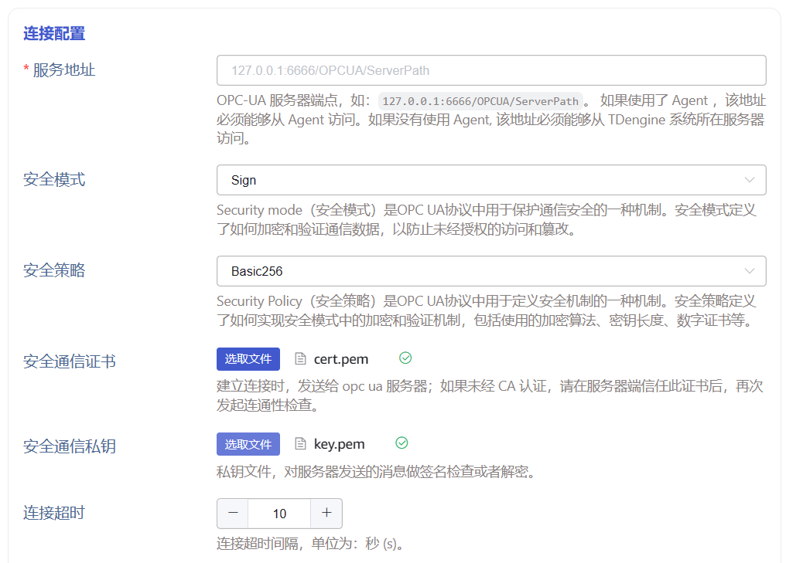

1. 如果是首次使用这个证书做连通性检查，在 opc ua server 上能看到未受信任的证书，右键点击后信任这个证书。
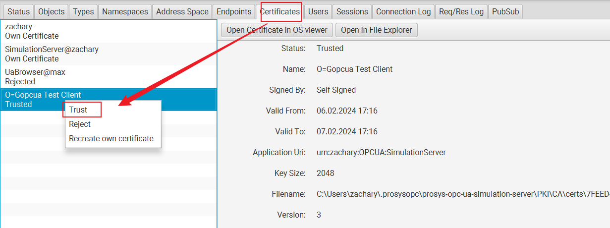

1. 再次做连通性检查，即可通过。

### 8.5 使用证书做用户认证

1. 用同样的证书做用户认证
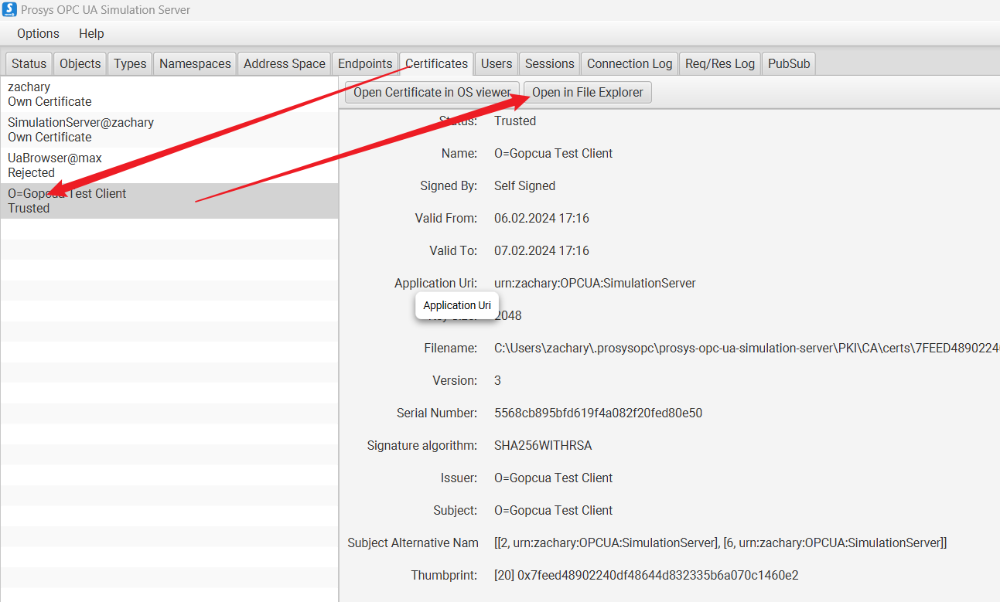

1. 将 PKI 已经信任的证书放到对应 USERS_PKI 路径下
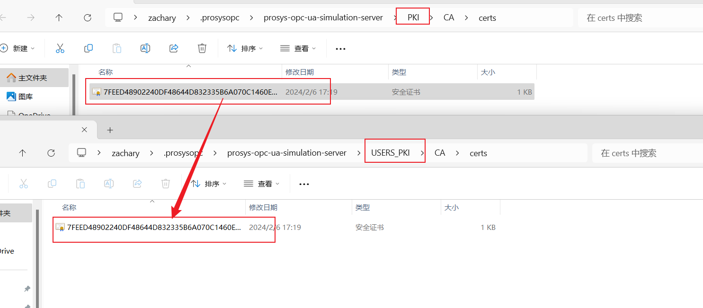

并保证，同样的证书不要出现在 rejected 目录下：
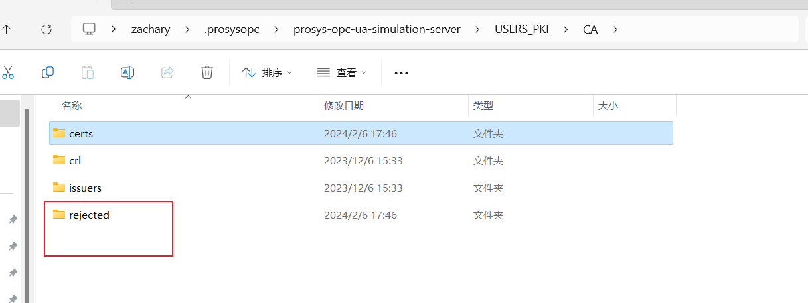


## 9. 约束和限制

1. 所有 NodeClass='Variable' 的为叶子节点，是我们要获取的采集点信息；即使理论上下面可以挂其他数据点位，我们不再进一步遍历尝试；
<callout emoji="exclamation" background-color="light-orange" border-color="light-orange">
如果现实场景中有这种配置，我们的方案会漏掉一些数据点位；但是为了性能考虑，还是坚持这样的选择。
</callout>

1. 所有 ReferenceType 为 HierachicalReferences 及其子类型的，需要遍历子节点。
2. Opc ua 配置 不支持 https endpoint，仅支持 tcp endpoint。


## 10. 常见错误和排查

1. 需要验证多种类型的数据点位，比如id类型为string类型的数据点位，nodeid 形如ns=3;s=abc。
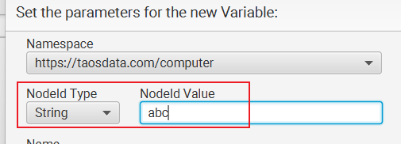

1. Opc da中，不同分组下，是否能存在相同tagname的数据点位，如果可以，就存在子表冲突的可能。

## 11. 参考文档

[OPC 连接器新需求和BUG](https://taosdata.feishu.cn/docx/TEFydbWMqorPrDxzfJycP2vfndg) 。
OPC连接器接口：[OPC 功能](https://taosdata.feishu.cn/wiki/XFW0wHeN0iTYonkYV2YcyRJMnWf) 。
