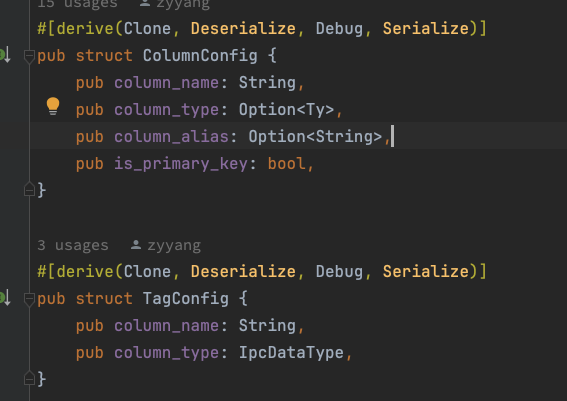
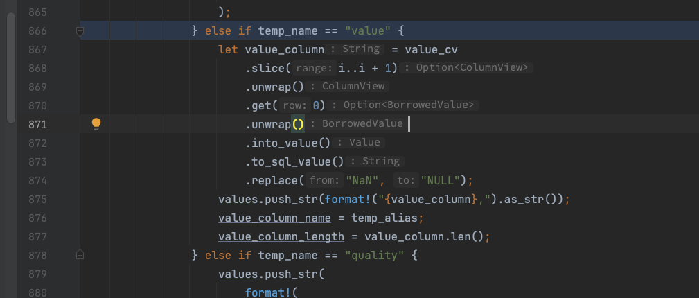
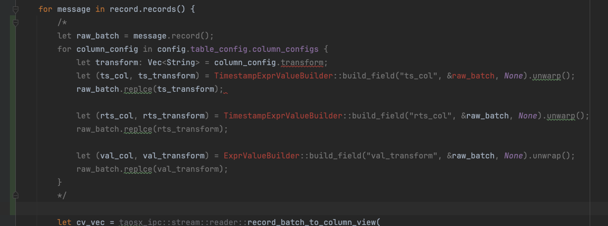

# OPC 模版优化

## 1. !!! 这是文档仅供开会讨论使用

## 2. 背景

在[OPC 点位过滤和下载机制优化](https://taosdata.feishu.cn/wiki/DgGlw6mxyiXsXYkBzezcfaGInXc) 的 4.1.3 和 4.2.2 这 2 节中，对 OPC 的点位模版做了新的设计，这些变动包括：
1. 增加了 value_transform， 用来对 value 值做表达式计算；
2. 增加了 ts_transform 列，用来对 opc 的 ts_col 列做时间戳计算，例如：ts + 5h；
3. 增加了 received_ts_transform3 列，用来对 opc 的 receive_col 列做时间戳计算，例如：rts - 10m；
4. OPC DA 的 point_id 一列，名称变为 tag_name；
其中，变动 1～3 是对 opc 上报的数据进行 transform 操作。

TD-28370


## 3. 行为说明

### 3.1 csv点位模版解析为transformer

OPC UA 的点位模版，本质上描述了 OPC UA 点位到 TDengine 数据模型的映射关系。以[OPC 点位过滤和下载机制优化](https://taosdata.feishu.cn/wiki/DgGlw6mxyiXsXYkBzezcfaGInXc) 的 3.1.4 节中模版为例，映射为 transformer 后，如下所示：
```json {wrap}
[
    {
        "parser": {
            "parse": {
                "id": { "as": "varchar(100)" },
                "name": { "as": "varchar(100)" },
                "ts": { "as": "timestamp(ms)" },
                "received": { "as": "timestamp(ms)" },
                "value": { "alias": "value" },
                "status": { "as": "int" }
            },
            "mutate": [
                {
                    "extract": {
                        "regex": "ns=(?P<ns>\d+);[isgb]=(?P<id>.+)",
                        "select": "[\"ns::i32\", \"id:nchar(100)\"]",
                        "keep": true
                    }
                },{
                    "map": [{
                        "id": {},
                        "point_id": { "format": "${id}" },
                        "point_name": { "format": "${name}"},
                        ""
                    }]
                }
            ],
            "model": {
                "name": "t_{ns}_{id}",
                "using": "opc_{type}",
                "tags": [ "","name", "unit" ],
                "columns": [ "ts", "rts", "quality", "value_col" ],
                "where": "enabled=1"
            },
        }
    }
    //...
]
```

csv文件中的每一行，对应一个


### 3.2 ColumnConfig里添加transform








### 3.3 实现 TimestampExprValueBuilder

TimestampExprValueBuilder支持表达式计算
```rust
ts - 1ms
ts - 100us
ts - 10000ns
ts + 1s
ts + 1second
ts + 1m
ts + 1min
ts + 1minute
ts + 1h
ts + 1hour
ts + 08:00:00
ts + 11:22:33.456
ts - 10:00:00
```

示例：
```rust
let builder: TimestampExprValueBuilder = serde_json::from_str(r#"{ "expr": "ts + 1h"}"#).unwrap();

let batch = RecordBatch::try_from_iter([(
    "ts",
    Arc::new(TimestampMillisecondArray::from_value(1700000000000, 3)) as ArrayRef,
)])
.unwrap();

let (field, value) = builder.build_field("ts_transform", &batch, None).unwrap();

assert_eq!(field.name(), "ts_transform");
assert_eq!(*field.data_type(), DataType::TimestampMillisecond);
assert_eq!(value.len(), 3);
let arr = value.as_any().downcast_ref::<TimestampMillisecondArray>().unwrap();
assert_eq!(arr.value(0), 1700003600000);
assert_eq!(arr.value(1), 1700003600000);
assert_eq!(arr.value(2), 1700003600000);
```


```rust
[taosx-core/src/plugins/runners/opc/config/csv/mod.rs:12:9] opc_table_config = OpcTableConfig {
    id_code_map: {
        "ns=3;i=1005": PointConfig {
            code: "t_3_1005",
            stable: Some(
                "opc_{type}",
            ),
            tag_values: Some(
                {
                    "name": "入库温度",
                },
            ),
            value_type: Some(
                Int32,
            ),
        },
        "ns=3;i=1006": PointConfig {
            code: "t_3_1006",
            stable: Some(
                "opc_{type}",
            ),
            tag_values: Some(
                {
                    "name": "减压阀压力",
                },
            ),
            value_type: None,
        },
        "ns=3;i=1007": PointConfig {
            code: "t_3_1007",
            stable: Some(
                "opc_{type}",
            ),
            tag_values: Some(
                {
                    "name": "总线电流",
                },
            ),
            value_type: None,
        },
    },
    table_config: TableConfig {
        stable_prefix: None,
        column_configs: [
            ColumnConfig {
                column_name: "value",
                column_type: None,
                column_alias: Some(
                    "val",
                ),
                is_primary_key: false,
            },
            ColumnConfig {
                column_name: "quality",
                column_type: Some(
                    Int,
                ),
                column_alias: Some(
                    "quality",
                ),
                is_primary_key: false,
            },
            ColumnConfig {
                column_name: "original_ts",
                column_type: Some(
                    Timestamp,
                ),
                column_alias: Some(
                    "ts",
                ),
                is_primary_key: true,
            },
            ColumnConfig {
                column_name: "received_ts",
                column_type: Some(
                    Timestamp,
                ),
                column_alias: Some(
                    "rts",
                ),
                is_primary_key: false,
            },
        ],
        tag_configs: Some(
            [
                TagConfig {
                    column_name: "name",
                    column_type: VarChar(
                        200,
                    ),
                },
            ],
        ),
    },
}
[taosx-core/src/plugins/runners/opc/config/csv/mod.rs:13:9] opc_node_config = [
    "ns=3;i=1005::t_3_1005",
    "ns=3;i=1006::t_3_1006",
    "ns=3;i=1007::t_3_1007",
]
[taosx-core/src/plugins/runners/opc/config/csv/mod.rs:14:9] table_to_drop = []
```
