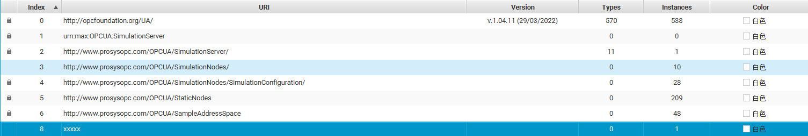

# 连接器实现

## 1. opc-ua 获取全部 namespace

完成此需求需要两步
1. 连接 opc-ua server 检查是否可连接
2. 获取 opc-ua server 全部 namespace

根据文档描述 https://reference.opcfoundation.org/Core/Part3/v104/docs/8.2.2
Namespace 组织为 array

### 1.1 实现

通过检查连接一起返回当检查类型为 opcua 时且连接正常时返回属性增加 namespaces []string
样例：


请求配置文件
```go
opc_type = "opcua"
debug = false

[connect.ua]
endpoint = "opc.tcp://max:53530/OPCUA/SimulationServer"
connect_timeout = 10
request_timeout = 10
security_policy = "None"
security_mode = "None"
auth_method = "Anonymous"
```

返回
```go
{
    "valid": true,
    "support": true,
    "data_source": "opc",
    "namespaces": [
        "http://opcfoundation.org/UA/",
        "urn:max:OPCUA:SimulationServer",
        "http://www.prosysopc.com/OPCUA/SimulationServer/",
        "http://www.prosysopc.com/OPCUA/SimulationNodes/",
        "http://www.prosysopc.com/OPCUA/SimulationNodes/SimulationConfiguration/",
        "http://www.prosysopc.com/OPCUA/StaticNodes",
        "http://www.prosysopc.com/OPCUA/SampleAddressSpace",
        "",
        "xxxxx"
    ]
}
```

处理规则
当 valid 或 support 不为 true 时不返回 namespaces
namespace index 为数组下标
