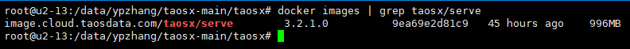
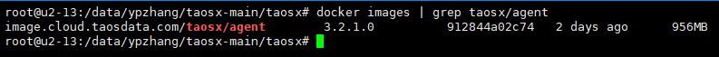
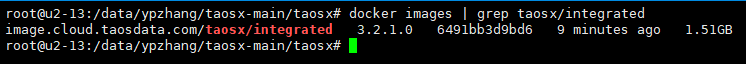
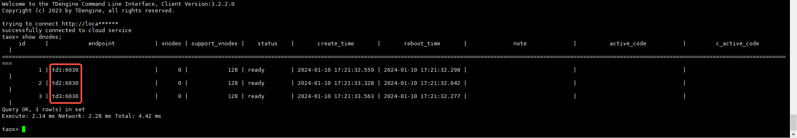

# The dockerization for taosX

## 1. 背景

对于想要测试我们数据导入功能的用户来说，如果可以使用 docker 运行 taosx 或者完整的 TDengine & taosx & explorer，那么快速开始测试将会容易得多。
原始需求 
TS-3921

## 2. 变更历史

| 日期 | 版本 | 撰写人 |
| --- | --- | --- |
| 2023-12-21 | 0.1 | @张元湃 |
| 2023-12-25 | 0.2 | @张元湃 |
| 2023-12-27 | 0.3 | @张元湃 |
| 2024-01-04 | 0.4 | @张元湃 |
| 2024-01-10 | 0.5 | @张元湃 |

## 3. 定义

1. taosx serve：指 taosx 服务模式启动的进程，通常它已经内置各连接器，它是 explorer 与 taosx agent 正常运行的基础
2. taosx agent：指 taosx-agent 进程，通常它已经内置各连接器，运行它之前需要先在 explorer 中创建 agent 并得到 endpoint 与 token 两项配置
3. explorer：指 taos-explorer 进程，它是 TDengine 的可视化操作页面，其中的 Data In 部分需要 taosx serve 进程提供基础服务
4. 连接器：指数据采集部分在独立于 taosx 进程之外运行的进程，包括 MQTT/PI/OPC/OpenTSDB/InfluxDB
5. 外部 agent：这是在特定场景下对 agent 进程的别称，当使用 taosx serve 容器或 taosx integrated 容器时，如果需要使用宿主机或其他服务器上的 agent 与它进行连接，为区别于 docker 容器，我们称它为“外部 agent”
6. 外部 explorer：这是在特定场景下对 explorer 进程的别称，当使用 taosx serve 容器时，如果使用宿主机或其他服务器上的 explorer 与它进行连接，为区别于 docker 容器，我们称它为“外部 explorer”

## 4. 行为说明

### 4.1 构建 docker 镜像

#### 4.1.1 base 镜像

taosx 镜像基于 ubuntu:22.04 构建，它包含了操作系统的核心组件和一些基本的工具，除 taosx 及 TDengine 之外，我们仍需要自行安装一些依赖，Dockerfile 中的使用示例如下：
```dockerfile
FROM ubuntu:22.04
ADD https://github.com/krallin/tini/releases/download/v0.19.0/tini /tini
RUN chmod +x /tini \
  && apt update \
  && apt install -y wget curl jq sqlite3 openjdk-18-jre ca-certificates \
  && apt-get clean \
  && rm -rf /var/lib/apt/lists/ \
  && rm -rf /var/cache/apt/
```

#### 4.1.2 taosx serve 版镜像

##### 4.1.2.1 概述

taosx serve 版镜像仅包含 taosx 独立运行所需必要组件：taosx、连接器与 TDengine-enterprise-client，它需要支持与外部的 explorer 及 taosx agent 联合使用。

##### 4.1.2.2 Makefile.toml

<quote-container>
此文件中包含了构建 docker 镜像的命令及构建前的准备工作的一系列操作命令，它可以简化工作人员每次构建镜像时的操作步骤，但前提是系统中必须已安装了 cargo make 工具，如果需要了解细节或修改其中的步骤，请查看 taosx/Makefile.toml 文件。
</quote-container>


```toml
[tasks.build-docker]
run_task = [
  { name = "build-docker-serve-source", condition = { env = { "mode" = "serve", "type" = "source"} } },
  { name = "build-docker-serve-bin", condition = { env = { "mode" = "serve", "type" = "bin"} } }
]

[tasks.build-docker-serve-source]
script = """
set -e
commit=$(git rev-parse HEAD | cut -c 1-8)
echo TDengine version in cloud image is "${VER_NUMBER}"
mkdir -p ./docker/serve/release/plugins/
rsync -u root@192.168.1.213:/nas/TDengine3/v${VER_NUMBER}/enterprise/TDengine-enterprise-client-${VER_NUMBER}-Linux-x64.tar.gz .
tar vxf TDengine-enterprise-client-${VER_NUMBER}-Linux-x64.tar.gz
cp -r ./TDengine-enterprise-client-${VER_NUMBER} ./docker/serve/release/TDengine-enterprise-client
cp ./target/release/taosx ./docker/serve/release/taosx
cp ./plugins/influxdb/target/taosx-influxdb.jar ./docker/serve/release/plugins/taosx-influxdb.jar
cp ./plugins/opentsdb/target/taosx-opentsdb.jar ./docker/serve/release/plugins/taosx-opentsdb.jar
cp ./plugins/opc/taosx-opc ./docker/serve/release/plugins/taosx-opc
cp ./plugins/mqtt/dist/taosx-mqtt ./docker/serve/release/plugins/taosx-mqtt
docker build -t image.cloud.taosdata.com/taosx/serve:${VER_NUMBER}-$commit ./docker/serve/
rm -rf ./docker/serve/release
rm -rf ./TDengine-enterprise-client-${VER_NUMBER}
"""
dependencies = ["taosx", "plugins"]

[tasks.build-docker-serve-bin]
script = """
set -e
echo TDengine version in cloud image is "${VER_NUMBER}"
mkdir -p ./docker/serve/release/plugins/
rsync -u root@192.168.1.213:/nas/TDengine3/v${VER_NUMBER}/enterprise/TDengine-enterprise-client-${VER_NUMBER}-Linux-x64.tar.gz .
rsync -u root@192.168.1.213:/nas/TDengine3/v${VER_NUMBER}/enterprise/TDengine-enterprise-${VER_NUMBER}-Linux-x64.tar.gz .
tar vxf TDengine-enterprise-client-${VER_NUMBER}-Linux-x64.tar.gz
cp -r ./TDengine-enterprise-client-${VER_NUMBER} ./docker/serve/release/TDengine-enterprise-client
tar vxf TDengine-enterprise-${VER_NUMBER}-Linux-x64.tar.gz
cp ./TDengine-enterprise-${VER_NUMBER}/taosx/bin/taosx ./docker/serve/release/taosx
cp ./TDengine-enterprise-${VER_NUMBER}/taosx/plugins/influxdb/taosx-influxdb.jar ./docker/serve/release/plugins/taosx-influxdb.jar
cp ./TDengine-enterprise-${VER_NUMBER}/taosx/plugins/opentsdb/taosx-opentsdb.jar ./docker/serve/release/plugins/taosx-opentsdb.jar
cp ./TDengine-enterprise-${VER_NUMBER}/taosx/plugins/opc/taosx-opc ./docker/serve/release/plugins/taosx-opc
cp ./TDengine-enterprise-${VER_NUMBER}/taosx/plugins/mqtt/taosx-mqtt ./docker/serve/release/plugins/taosx-mqtt
docker build -t image.cloud.taosdata.com/taosx/serve:${VER_NUMBER} ./docker/serve/
rm -rf ./docker/serve/release
rm -rf ./TDengine-enterprise-client-${VER_NUMBER}
rm -rf ./TDengine-enterprise-${VER_NUMBER}
"""
```

##### 4.1.2.3 Dockerfile

```dockerfile
FROM ubuntu:22.04

ADD https://github.com/krallin/tini/releases/download/v0.19.0/tini /tini

COPY ./release/TDengine-enterprise-client /root/TDengine-enterprise-client
COPY ./release/taosx /usr/bin/taosx
COPY ./release/plugins/taosx-influxdb.jar /taosx/plugins/influxdb/taosx-influxdb.jar
COPY ./release/plugins/taosx-opentsdb.jar /taosx/plugins/opentsdb/taosx-opentsdb.jar
COPY ./release/plugins/taosx-opc /taosx/plugins/opc/taosx-opc
COPY ./release/plugins/taosx-mqtt /taosx/plugins/mqtt/taosx-mqtt

RUN chmod +x /tini \
  && apt update \
  && apt install -y wget curl jq sqlite3 openjdk-18-jre ca-certificates \
  && apt-get clean \
  && rm -rf /var/lib/apt/lists/ \
  && rm -rf /var/cache/apt/ \
  && cd /root/TDengine-enterprise-client \
  && /bin/bash install_client.sh \
  && rm -rf ../TDengine-enterprise-client

ENV TAOSX_PLUGINS_HOME=/taosx/plugins/
ENV TAOSX_DATA_DIR=/data/taosx/
ENV TAOSX_LOGS_HOME=/data/taosx/log/
ENV TAOSX_CONFIG=/data/taosx/config/taosx.toml

VOLUME /data/taosx/

EXPOSE 6050
EXPOSE 6055

ENTRYPOINT ["/tini", "--"]
CMD /usr/bin/taosx serve -c ${TAOSX_CONFIG}
```

##### 4.1.2.4 使用 taosx 源码创建

```shell

## 5. 拉取最新 taosx 代码

git clone https://github.com/taosdata/taosx.git

## 6. 进入 taosx 目录

cd taosx

## 7. 如果需要更改源码分支或版本，可以执行以下语句

## 8. git checkout -b 3.0 origin/3.0

## 9. git checkout ver-3.1.1.12

## 10. 生成镜像文件，其中 VER_NUMBER=3.2.1.0 是在 nas 中已存在的 TDengine 安装包版本号

VER_NUMBER=3.2.1.0 mode=serve type=source cargo make build-docker
```

##### 10.0.0.1 使用 TDengine Enterprise 安装包创建

```shell

## 11. 拉取最新 taosx 代码

git clone https://github.com/taosdata/taosx.git

## 12. 进入 taosx 目录

cd taosx

## 13. 如果需要更改源码分支或版本，可以执行以下语句

## 14. git checkout -b 3.0 origin/3.0

## 15. git checkout ver-3.1.1.12

## 16. 生成镜像文件，其中 VER_NUMBER=3.2.1.0 是在 nas 中已存在的 TDengine 安装包版本号

VER_NUMBER=3.2.1.0 mode=serve type=bin cargo make build-docker
```

##### 16.0.0.1 输出结果

执行完成后，使用命令 `docker images |grep taosx/serve` 查看已构建的 taosx serve 镜像：


##### 16.0.0.2 使用方法

参考 [4.2.1](https://taosdata.feishu.cn/docx/WB2mdlrclo5h8SxXcsXcjKzmn1c#SjdJdOOvcooVprxiXkGck5p0n3b) 中的详细介绍。

#### 16.0.1 taosx agent 版镜像

##### 16.0.1.1 概述

taosx agent 版镜像仅包含 taosx agent 独立运行所需必要组件：taosx agent、连接器，它需要支持与外部的 taosx 联合使用。

##### 16.0.1.2 Makefile.toml

```toml
[tasks.build-docker]
run_task = [
  { name = "build-docker-agent-source", condition = { env = { "mode" = "agent", "type" = "source"} } },
  { name = "build-docker-agent-bin", condition = { env = { "mode" = "agent", "type" = "bin"} } }
]

[tasks.build-docker-agent-source]
script = """
set -e
commit=$(git rev-parse HEAD | cut -c 1-8)
echo TDengine version in cloud image is "${VER_NUMBER}"
mkdir -p ./docker/agent/release/plugins/
cp ./target/release/taosx-agent ./docker/agent/release/taosx-agent
cp ./plugins/influxdb/target/taosx-influxdb.jar ./docker/agent/release/plugins/taosx-influxdb.jar
cp ./plugins/opentsdb/target/taosx-opentsdb.jar ./docker/agent/release/plugins/taosx-opentsdb.jar
cp ./plugins/opc/taosx-opc ./docker/agent/release/plugins/taosx-opc
cp ./plugins/mqtt/dist/taosx-mqtt ./docker/agent/release/plugins/taosx-mqtt
docker build -t image.cloud.taosdata.com/taosx/agent:${VER_NUMBER}-$commit ./docker/agent/
rm -rf ./docker/agent/release
"""
dependencies = ["taosx-agent", "plugins"]

[tasks.build-docker-agent-bin]
script = """
set -e
echo TDengine version in cloud image is "${VER_NUMBER}"
mkdir -p ./docker/agent/release/plugins/
rsync -u root@192.168.1.213:/nas/TDengine3/v${VER_NUMBER}/enterprise/TDengine-enterprise-${VER_NUMBER}-Linux-x64.tar.gz .
tar vxf TDengine-enterprise-${VER_NUMBER}-Linux-x64.tar.gz
cp ./TDengine-enterprise-${VER_NUMBER}/taosx/bin/taosx-agent ./docker/agent/release/taosx-agent
cp ./TDengine-enterprise-${VER_NUMBER}/taosx/plugins/influxdb/taosx-influxdb.jar ./docker/agent/release/plugins/taosx-influxdb.jar
cp ./TDengine-enterprise-${VER_NUMBER}/taosx/plugins/opentsdb/taosx-opentsdb.jar ./docker/agent/release/plugins/taosx-opentsdb.jar
cp ./TDengine-enterprise-${VER_NUMBER}/taosx/plugins/opc/taosx-opc ./docker/agent/release/plugins/taosx-opc
cp ./TDengine-enterprise-${VER_NUMBER}/taosx/plugins/mqtt/taosx-mqtt ./docker/agent/release/plugins/taosx-mqtt
docker build -t image.cloud.taosdata.com/taosx/agent:${VER_NUMBER} ./docker/agent/
rm -rf ./docker/agent/release
rm -rf ./TDengine-enterprise-${VER_NUMBER}
"""
```

##### 16.0.1.3 Dockerfile

```dockerfile
FROM ubuntu:22.04

ADD https://github.com/krallin/tini/releases/download/v0.19.0/tini /tini

COPY ./release/taosx-agent /usr/bin/taosx-agent
COPY ./release/plugins/taosx-influxdb.jar /taosx/plugins/influxdb/taosx-influxdb.jar
COPY ./release/plugins/taosx-opentsdb.jar /taosx/plugins/opentsdb/taosx-opentsdb.jar
COPY ./release/plugins/taosx-opc /taosx/plugins/opc/taosx-opc
COPY ./release/plugins/taosx-mqtt /taosx/plugins/mqtt/taosx-mqtt

RUN chmod +x /tini \
  && apt update \
  && apt install -y wget curl jq sqlite3 openjdk-18-jre ca-certificates \
  && apt-get clean \
  && rm -rf /var/lib/apt/lists/ \
  && rm -rf /var/cache/apt/

ENV TAOSX_AGENT_PLUGINS_HOME=/taosx/plugins/
ENV TAOSX_AGENT_DATA_DIR=/data/taosx/
ENV TAOSX_AGENT_LOGS_HOME=/data/taosx/log/
ENV TAOSX_AGENT_CONFIG=/data/taosx/config/agent.toml

VOLUME /data/taosx/

ENTRYPOINT ["/tini", "--"]
CMD /usr/bin/taosx-agent -c ${TAOSX_AGENT_CONFIG}
```

##### 16.0.1.4 使用 taosx 源码创建

```shell

## 17. 拉取最新 taosx 代码

git clone https://github.com/taosdata/taosx.git

## 18. 进入 taosx 目录

cd taosx

## 19. 如果需要更改源码分支或版本，可以执行以下语句

## 20. git checkout -b 3.0 origin/3.0

## 21. git checkout ver-3.1.1.12

## 22. 生成镜像文件，其中 VER_NUMBER=3.2.1.0 是在 nas 中已存在的 TDengine 安装包版本号

VER_NUMBER=3.2.1.0 mode=agent type=source cargo make build-docker
```

##### 22.0.0.1 使用 TDengine Enterprise 安装包创建

```shell

## 23. 拉取最新 taosx 代码

git clone https://github.com/taosdata/taosx.git

## 24. 进入 taosx 目录

cd taosx

## 25. 如果需要更改源码分支或版本，可以执行以下语句

## 26. git checkout -b 3.0 origin/3.0

## 27. git checkout ver-3.1.1.12

## 28. 生成镜像文件，其中 VER_NUMBER=3.2.1.0 是在 nas 中已存在的 TDengine 安装包版本号

VER_NUMBER=3.2.1.0 mode=agent type=bin cargo make build-docker
```

##### 28.0.0.1 输出结果

执行完成后，使用以下命令查看系统中是否已存在 taosx agent 镜像：


##### 28.0.0.2 使用方法

参考 [4.2.2](https://taosdata.feishu.cn/docx/WB2mdlrclo5h8SxXcsXcjKzmn1c#AY7sd4IQfoCfrvxafTGciBwSnOh) 中的详细介绍。

#### 28.0.1 taosx integrated 版镜像

##### 28.0.1.1 概述

taosx integrated 版镜像包含 taosx 完整运行所需的所有组件：taosx、连接器、explorer 与 TDengine-enterprise（至少包含 taosd、taosc、taosadapter），它可以让用户“开箱即用”，不需要额外安装任何 TDengine 的其他产品。 

##### 28.0.1.2 Makefile.toml

```toml
[tasks.build-docker]
run_task = [
  { name = "build-docker-integrated-bin", condition = { env = { "mode" = "integrated"} } },
  { name = "build-docker-integrated-bin" }
]

[tasks.build-docker-integrated-bin]
script = """
set -e
echo TDengine version in cloud image is "${VER_NUMBER}"
mkdir -p ./docker/integrated/release/plugins/
rsync -u root@192.168.1.213:/nas/TDengine3/v${VER_NUMBER}/enterprise/TDengine-enterprise-${VER_NUMBER}-Linux-x64.tar.gz .
tar vxf TDengine-enterprise-${VER_NUMBER}-Linux-x64.tar.gz
cp -r ./TDengine-enterprise-${VER_NUMBER} ./docker/integrated/release/TDengine-enterprise
rm -rf ./docker/integrated/release/TDengine-enterprise/taosx/
cp ./TDengine-enterprise-${VER_NUMBER}/taosx/bin/taosx ./docker/integrated/release/taosx
cp ./TDengine-enterprise-${VER_NUMBER}/taosx/bin/taos-explorer ./docker/integrated/release/taos-explorer
cp ./TDengine-enterprise-${VER_NUMBER}/taosx/plugins/influxdb/taosx-influxdb.jar ./docker/integrated/release/plugins/taosx-influxdb.jar
cp ./TDengine-enterprise-${VER_NUMBER}/taosx/plugins/opentsdb/taosx-opentsdb.jar ./docker/integrated/release/plugins/taosx-opentsdb.jar
cp ./TDengine-enterprise-${VER_NUMBER}/taosx/plugins/opc/taosx-opc ./docker/integrated/release/plugins/taosx-opc
cp ./TDengine-enterprise-${VER_NUMBER}/taosx/plugins/mqtt/taosx-mqtt ./docker/integrated/release/plugins/taosx-mqtt
docker build -t image.cloud.taosdata.com/taosx/integrated:${VER_NUMBER} ./docker/integrated/
rm -rf ./docker/integrated/release
rm -rf ./TDengine-enterprise-${VER_NUMBER}
"""
```

##### 28.0.1.3 Dockerfile

```dockerfile
FROM ubuntu:22.04

ADD https://github.com/krallin/tini/releases/download/v0.19.0/tini /tini

COPY ./release/TDengine-enterprise /root/TDengine-enterprise
COPY ./release/taosx /usr/bin/taosx
COPY ./release/taos-explorer /usr/bin/taos-explorer
COPY ./release/plugins/taosx-influxdb.jar /taosx/plugins/influxdb/taosx-influxdb.jar
COPY ./release/plugins/taosx-opentsdb.jar /taosx/plugins/opentsdb/taosx-opentsdb.jar
COPY ./release/plugins/taosx-opc /taosx/plugins/opc/taosx-opc
COPY ./release/plugins/taosx-mqtt /taosx/plugins/mqtt/taosx-mqtt
COPY ./startup.sh /root/startup.sh

RUN chmod +x /tini \
  && chmod +x /root/startup.sh \
  && apt update \
  && apt install -y wget curl jq sqlite3 openjdk-18-jre ca-certificates \
  && apt-get install -y locales tzdata netcat \
  && locale-gen en_US.UTF-8 \
  && apt-get clean \
  && rm -rf /var/lib/apt/lists/ \
  && rm -rf /var/cache/apt/ \
  && cd /root/TDengine-enterprise \
  && /bin/bash install.sh -e no \
  && rm -rf ../TDengine-enterprise

ENV LD_LIBRARY_PATH="$LD_LIBRARY_PATH:/usr/lib"
ENV LC_CTYPE=en_US.UTF-8
ENV LANG=en_US.UTF-8
ENV LC_ALL=en_US.UTF-8

ENV TAOSX_PLUGINS_HOME=/taosx/plugins/
ENV TAOSX_DATA_DIR=/data/taosx/
ENV TAOSX_LOGS_HOME=/data/taosx/log/
ENV TAOSX_CONFIG=/data/taosx/config/taosx.toml
ENV EXPLORER_CONFIG_FILE=/data/taosx/config/explorer.toml

VOLUME [ "/etc/taos", "/var/lib/taos", "/var/log/taos", "/corefile", "/data/taosx/" ]

EXPOSE 6030
EXPOSE 6041
EXPOSE 6050
EXPOSE 6055
EXPOSE 6060

ENTRYPOINT ["/tini", "--"]
CMD /usr/bin/sh /root/startup.sh
```

其中引用了一个文件 startup.sh，内容如下：
```shell
#!/bin/sh
set -e

## 29. for TZ awareness

if [ "$TZ" != "" ]; then
    ln -sf /usr/share/zoneinfo/$TZ /etc/localtime
    echo $TZ >/etc/timezone
fi

## 30. to get mnodeEpSet from data dir

DATA_DIR=$(taosd -C|grep -E 'dataDir.*(\S+)' -o |head -n1|sed 's/dataDir *//')
DATA_DIR=${DATA_DIR:-/var/lib/taos}

FQDN=$(taosd -C|grep -E 'fqdn.*(\S+)' -o |head -n1|sed 's/fqdn *//')

## 31. ensure the fqdn is resolved as localhost

grep "$FQDN" /etc/hosts >/dev/null || echo "127.0.0.1 $FQDN" >>/etc/hosts
FIRSET_EP=$(taosd -C|grep -E 'firstEp.*(\S+)' -o |head -n1|sed 's/firstEp *//')

## 32. parse first ep host and port

FIRST_EP_HOST=${FIRSET_EP%:*}
FIRST_EP_PORT=${FIRSET_EP#*:}

## 33. in case of custom server port

SERVER_PORT=$(taosd -C|grep -E 'serverPort.*(\S+)' -o |head -n1|sed 's/serverPort *//')
SERVER_PORT=${SERVER_PORT:-6030}

set +e
ulimit -c unlimited

## 34. set core files pattern, maybe failed

sysctl -w kernel.core_pattern=/corefile/core-$FQDN-%e-%p >/dev/null >&1
set -e

## 35. startup taosadapter

taosd &

## 36. wait for 6030 port ready

for _ in $(seq 1 20); do
    nc -z localhost 6030 && break
    sleep 0.5
done

## 37. startup taosadapter

which taosadapter >/dev/null && taosadapter &

## 38. wait for 6041 port ready

for _ in $(seq 1 20); do
    nc -z localhost 6041 && break
    sleep 0.5
done

## 39. if has mnode ep set or the host is first ep or not for cluster, just start.

if [ -f "$DATA_DIR/dnode/mnodeEpSet.json" ] || [ "$TAOS_FQDN" = "$FIRST_EP_HOST" ]; then
    $@

## 40. others will first wait the first ep ready.

else
    if [ "$TAOS_FIRST_EP" = "" ]; then
        echo "run TDengine with single node."
        $@
    fi
    while true; do
        es=$(taos -h $FIRST_EP_HOST -P $FIRST_EP_PORT --check)
        echo "Try to connect to first ep with return: ${es}"
        if [ "${es%%:*}" -eq 2 ]; then
            echo "execute to create dnode after connected to first ep"
            ENDPOINT=$FQDN:$SERVER_PORT
            taos -h $FIRST_EP_HOST -P $FIRST_EP_PORT -s "create dnode \"$ENDPOINT\";"
            DNODETmp=$(taos -h $FIRST_EP_HOST -P $FIRST_EP_PORT -s "set max_binary_display_width 2000;show dnodes;" | grep -E "$ENDPOINT" | awk '{split($0,a,"|");print a[1]}')
            DNODEID=$(echo "$DNODETmp" | sed -e 's/^[[:space:]]*//')
            if [ "$DNODEID" != "" ]; then
                taos -h $FIRST_EP_HOST -P $FIRST_EP_PORT -s "create mnode on dnode $DNODEID;"
                echo "Created the mnode for dnode $DNODEID"
                break
            fi
        fi
        sleep 1s
    done
    $@
fi

## 41. startup taosx

/usr/bin/taosx serve -c $TAOSX_CONFIG &

## 42. wait for 6050 port ready

for _ in $(seq 1 20); do
    nc -z localhost 6050 && break
    sleep 0.5
done

## 43. startup explorer

/usr/bin/taos-explorer -C $EXPLORER_CONFIG_FILE &

## 44. wait for 6060 port ready

for _ in $(seq 1 20); do
    nc -z localhost 6060 && break
    sleep 0.5
done

## 45. never exit

while true; do
  sleep 1000s
done
```

##### 45.0.0.1 使用 TDengine Enterprise 安装包创建

```shell

## 46. 拉取最新 taosx 代码

git clone https://github.com/taosdata/taosx.git

## 47. 进入 taosx 目录

cd taosx

## 48. 如果需要更改源码分支或版本，可以执行以下语句

## 49. git checkout -b 3.0 origin/3.0

## 50. git checkout ver-3.1.1.12

## 51. 生成镜像文件，其中 VER_NUMBER=3.2.1.0 是在 nas 中已存在的 TDengine 安装包版本号

VER_NUMBER=3.2.1.0 mode=integrated cargo make build-docker
```

##### 51.0.0.1 输出结果

执行完成后，使用命令 `docker images |grep taosx/integrated` 查看系统中是否已存在 taosx integrated 镜像：


##### 51.0.0.2 使用方法

参考 [4.2.3](https://taosdata.feishu.cn/docx/WB2mdlrclo5h8SxXcsXcjKzmn1c#QTSNdLRkKolkvaxWRricdGwGn3c) 中的详细介绍。

### 51.1 运行 docker 容器

#### 51.1.1 taosx serve 版

##### 51.1.1.1 目录与端口

镜像文件支持以下目录映射：
- `/data/taosx/`：容器内部 taosx 的数据目录，它用于存储 taosx 的配置、日志及运行时产生的数据等，建议将此目录映射到宿主机中，否则容器重建后历史数据会丢失，`docker run` 方式运行可以添加命令行参数 `-v ``/``root/docker/taosx:/data/taosx/`，`docker-compose` 方式可修改 YAML 文件中的 `volumes:` 配置以添加映射。
  <quote-container>
  taosx 数据目录结构如下：
  - /data/taosx/ --数据根目录
  - /data/taosx/log/* --日志文件根目录
  - /data/taosx/config/taosx.toml --taosx serve 的配置文件
  </quote-container>

支持以下端口映射：
- `6050`：容器内部 taosx 的服务端口，用于向外提供接口服务，需要将此端口映射到宿主机中，参数例如 -p 16050:6050
- `6055`：容器内部 taosx 的服务端口，用于与 agent 建立连接，如果使用 agent，则需要将此端口映射到宿主机中，如果不使用 agent 则可忽略
<quote-container>
与外部的 explorer 及 taosx agent 联合使用时，explorer 及 agent 需配置宿主机对应的映射端口，在 explorer 的配置中，cluster 需要配置可被容器内 taosx 有效访问的地址
</quote-container>

##### 51.1.1.2 运行命令

创建容器前需要检查映射端口是否未被占用、映射目录是否存在，检查没问题后可以执行创建，示例命令如下：
```shell
docker run -d -p 16050:6050 -p 16055:6055 \
 -v /root/docker/taosx/:/data/taosx/ \
 image.cloud.taosdata.com/taosx/serve:3.2.1.0
```

这条命令会将容器内部的 6050 端口映射到宿主机的 16050 端口、6055 端口映射到宿主机的 16055 端口、/data/taosx/ 目录映射到宿主机的 /root/docker/taosx/ 目录。

##### 51.1.1.3 容器内主要应用/进程

1. taosc：TDengine 客户端，用于使用原生连接的方式访问 TDengine 数据库
2. taosx：taosx 服务模式启动的进程

#### 51.1.2 taosx agent 版

##### 51.1.2.1 目录与端口

镜像文件支持以下目录映射：
- /data/taosx/ --容器内部 taosx-agent 的数据目录，它用于存储 taosx-agent 的配置、日志及运行时产生的数据等，由于配置文件需要在宿主机修改，所以需要将此目录映射到宿主机中，参数例如 -v /root/docker/taosx:/data/taosx/
<quote-container>
taosx 数据目录结构如下：
/data/taosx/ --数据根目录
/data/taosx/log/* --日志文件根目录
/data/taosx/config/agent.toml --taosx-agent 的配置文件
</quote-container>

##### 51.1.2.2 运行命令

创建容器前需要先编辑 agent.toml 文件并放置在将要映射的目录下（例如 /root/docker/taosx/config/agent.toml），此文件中包含 agent 运行所必须的 endpoint 与 token 两个参数的配置（explorer 中获得），完成后可以执行创建，示例命令如下：
```shell
docker run -d \
 -v /root/docker/taosx/:/data/taosx/ \
 image.cloud.taosdata.com/taosx/agent:3.2.1.0
```

这条命令会将容器内部的 /data/taosx/ 目录映射到宿主机的 /root/docker/taosx/ 目录。

##### 51.1.2.3 容器内主要应用/进程

1. taosx-agent：taosx 的代理 

#### 51.1.3 taosx integrated 版

##### 51.1.3.1 目录与端口

镜像文件支持以下目录映射：
- /etc/taos --容器内部 TDengine 的配置文件所在目录，如果需要对 TDengine 进行个性化配置或组件集群等，则需要将此目录映射到宿主机中，参数例如 -v /root/docker/tdengine/etc/taos:/etc/taos
- /var/lib/taos --容器内部 TDengine 的数据目录，它用于存储 TDengine 数据库中的数据，建议将此目录映射到宿主机中，否则容器重建后历史数据会丢失，参数例如 -v /root/docker/tdengine/var/lib/taos:/var/lib/taos
- /var/log/taos --容器内部 TDengine 的日志目录，它用于存储 TDengine 的日志文件，建议将此目录映射到宿主机中，否则它会使 docker 容器的临时文件过大而产生故障，参数例如 -v /root/docker/tdengine/var/log/taos:/var/log/taos
- /corefile --容器内部 TDengine 异常退出时产生的 core 数据目录，建议将此目录映射到宿主机中，以便排查问题，参数例如 -v /root/docker/tdengine/corefile:/corefile 
- /data/taosx --容器内部 taosx 与 explorer 的数据目录，它用于存储 taosx 与 explorer 的配置、日志及运行时产生的数据等，建议将此目录映射到宿主机中，否则容器重建后历史数据会丢失，参数例如 -v /root/docker/taosx:/data/taosx/
<quote-container>
taosx 数据目录结构如下：
/data/taosx/ --数据根目录
/data/taosx/log/* --日志文件根目录
/data/taosx/config/taosx.toml --taosx serve 的配置文件
/data/taosx/config/explorer.toml --explorer 的配置文件
</quote-container>

支持以下端口映射：
- 6030 --容器内部 taosd 原生连接端口，如果需要在容器外使用 taosc 访问 taosd，则需要将将此端口映射到宿主机中，如果没有这种使用场景则可忽略
- 6041 --容器内部 taosadapter WebSocket 连接端口，如果需要在容器外访问 taosadapter 端口，则需要将将此端口映射到宿主机中，如果没有这种使用场景则可忽略
- 6050 --容器内部 taosx 的服务端口，用于向外提供接口服务，如果需要在容器外访问 taosx 的接口，则需要将此端口映射到宿主机中，如果没有这种使用场景则可忽略
- 6055 --容器内部 taosx 的服务端口，用于与 agent 建立连接，如果使用 agent，则需要将此端口映射到宿主机中，如果不使用 agent 则可忽略
- 6060 --容器内部 explorer 的服务端口，用于 explorer 页面访问

##### 51.1.3.2 运行命令

创建容器前需要检查映射端口是否未被占用、映射目录是否存在，检查没问题后可以执行创建，示例命令如下：
```shell
docker run -d -p 16050:6050 -p 16055:6055 -p 16060:6060 \
 -v /root/docker/tdengine/etc/taos:/etc/taos \
 -v /root/docker/tdengine/var/lib/taos:/var/lib/taos \
 -v /root/docker/tdengine/var/log/taos:/var/log/taos \
 -v /root/docker/tdengine/corefile:/corefile \
 -v /root/docker/taosx:/data/taosx/ \
 image.cloud.taosdata.com/taosx/integrated:3.2.1.0
```

这条命令会将容器内部的 6050 端口映射到宿主机的 16050 端口、6055 端口映射到宿主机的 16055 端口、6060 端口映射到宿主机的 16060 端口，/etc/taos 目录映射到宿主机的 /root/docker/tdengine/etc/taos 目录、/var/lib/taos 目录映射到宿主机的 /root/docker/tdengine/var/lib/taos 目录、/var/log/taos 目录映射到宿主机的 /root/docker/tdengine/var/log/taos 目录、/corefile 目录映射到宿主机的 /root/docker/tdengine/corefile 目录、/data/taosx/ 目录映射到宿主机的 /root/docker/taosx/ 目录。

##### 51.1.3.3 容器内主要应用/进程

1. taosd：TDengine 数据库服务端进程
2. taosc：TDengine 客户端，用于使用原生连接的方式访问 TDengine 数据库
3. taosadapter：TDengine 服务端的一部分，它提供了 RESTful 接口等功能
4. taosx：taosx 服务模式启动的进程
5. taos-explorer：TDengine 的可视化操作页面

#### 51.1.4 taosx integrated 版搭建三节点集群

<quote-container>
三节点集群是针对 TDengine 而言的集群，taosx 本身暂时不支持集群模式。
</quote-container>

以下内容是使用 docker-compose 与 nginx 搭建 TDengine 三节点集群，各配置文件中的内容仅是在测试环境中的配置，需要按具体情况进行修改。

##### 51.1.4.1 docker-compose.yaml 配置文件

```yaml
version: "3.3"

services:
  td1:
    image: "image.cloud.taosdata.com/taosx/integrated:3.2.1.0"
    environment:
      - TAOS_FQDN=td1
      - TAOS_SUPPORT_VNODES=128
    ports:
      - "16050:6050"
      - "16055:6055"
      - "16060:6060"
    volumes:
      - "/root/docker/tdengine1/etc/taos:/etc/taos"
      - "/root/docker/tdengine1/var/lib/taos:/var/lib/taos"
      - "/root/docker/tdengine1/var/log/taos:/var/log/taos"
      - "/root/docker/tdengine1/corefile:/corefile"
      - "/root/docker/taosx1:/data/taosx"
  td2:
    image: "image.cloud.taosdata.com/taosx/integrated:3.2.1.0"
    environment:
      - TAOS_FQDN=td2
      - TAOS_FIRST_EP=td1
      - TAOS_SUPPORT_VNODES=128
    ports:
      - "26050:6050"
      - "26055:6055"
      - "26060:6060"
    volumes:
      - "/root/docker/tdengine2/etc/taos:/etc/taos"
      - "/root/docker/tdengine2/var/lib/taos:/var/lib/taos"
      - "/root/docker/tdengine2/var/log/taos:/var/log/taos"
      - "/root/docker/tdengine2/corefile:/corefile"
      - "/root/docker/taosx2:/data/taosx"
  td3:
    image: "image.cloud.taosdata.com/taosx/integrated:3.2.1.0"
    environment:
      - TAOS_FQDN=td3
      - TAOS_FIRST_EP=td1
      - TAOS_SUPPORT_VNODES=128
    ports:
      - "36050:6050"
      - "36055:6055"
      - "36060:6060"
    volumes:
      - "/root/docker/tdengine3/etc/taos:/etc/taos"
      - "/root/docker/tdengine3/var/lib/taos:/var/lib/taos"
      - "/root/docker/tdengine3/var/log/taos:/var/log/taos"
      - "/root/docker/tdengine3/corefile:/corefile"
      - "/root/docker/taosx3:/data/taosx"
  lb:
    image: nginx
    ports:
      - "16041:6041"
    depends_on:
      - td1
      - td2
      - td3
    volumes:
      - ./nginx.conf:/etc/nginx/nginx.conf
```

以上配置会创建 td1/td2/td3 三个容器，并将三个容器内部的 6050 端口分别映射到宿主机的 16050/26050/36050 端口、6055 端口分别映射到宿主机的 16055/26055/36055 端口、6060 端口分别映射到宿主机的 16060/26060/36060 端口，/etc/taos 目录分别映射到宿主机的 /root/docker/{tdengine1/tdengine2/tdengine3}/etc/taos 目录、/var/lib/taos 目录分别映射到宿主机的 /root/docker/{tdengine1/tdengine2/tdengine3}/var/lib/taos 目录、/var/log/taos 目录分别映射到宿主机的 /root/docker/{tdengine1/tdengine2/tdengine3}/var/log/taos 目录、/corefile 目录分别映射到宿主机的 /root/docker/{tdengine1/tdengine2/tdengine3}/corefile 目录、/data/taosx 目录分别映射到宿主机的 /root/docker/{taosx1/taosx2/taosx3} 目录。
同时会创建一个 nginx 容器，它将容器内部的 6041端口映射到宿主机的 16041 端口，它使用宿主机当前目录下的 nginx.conf 作为配置文件。

##### 51.1.4.2 nginx.conf 配置文件

```properties
user  nginx;
worker_processes  auto;

error_log  /var/log/nginx/error.log notice;
pid        /var/run/nginx.pid;

events {
    worker_connections  1024;
}

stream {
    server {
        listen 6041;
        proxy_pass td;
    }

    upstream td {
        server td1:6041;
        server td2:6041;
        server td3:6041;
    }
}
```

##### 51.1.4.3 启动命令

```shell

## 52. 创建工作目录

mkdir taosx-integrated-cluster && cd taosx-integrated-cluster

## 53. 编辑 docker-compose.yaml 文件，输入修改后的 4.2.4.1 中内容

vi docker-compose.yaml

## 54. 编辑 nginx.conf 文件，输入修改后的 4.2.4.2 中内容

vi nginx.conf

## 55. 启动

docker-compose up -d 或者 docker compose up -d

## 56. 查看启动结果

docker-compose ps 或者 docker compose ps
```

##### 56.0.0.1 查看集群

如果本地已经安装了 TDengine 客户端，可以执行以下命令连接 docker 集群：
```shell
taos -E http://localhost:16041
```

在命令行中执 `show dnodes;` 查看集群信息，如下图所示：


## 57. 性能

在 192.168.2.13 服务器上进行测试，服务器配置为 4 核 CPU、 16G 内存，性能如下：
- 创建 taosx serve image：
  - 使用源码：12m34s（taosx 编译时间较长）
  - 使用安装包：21s
- 创建 taosx agent image：
  - 使用源码：9m11s（taosx-agent 编译时间较长）
  - 使用安装包：23s
- 创建 taosx integrated：
  - 使用安装包：19s

## 58. 兼容性

1. taosx serve 与 taosx agent 的兼容性：
当 taosx serve 容器与外部 agent 联合使用时，或者使用 taosx agent 容器时，应该考虑 taosx serve 与 taosx agent 的兼容性，通常它们独立运行且不存在兼容性问题，但为了避免潜在问题，联合使用时应尽量使用相同版本。
1. taosx 与 taosd/taosc/taosadapter 的兼容性：
通常 taosx 与 taosd/taosc/taosadapter 不存在兼容性问题，但使用前应询问相关技术人员进行确定。
1. taosc 与 taosd 的兼容性：
通常 taosc 与 taosd 必须使用相同版本，所以制作镜像前应注意此问题，或者询问相关技术人员进行确定。

## 59. 运维

### 59.1 安装包地址与 docker 仓库地址

1. TDengine Enterprise 安装包的下载地址
root@192.168.1.213:/nas/TDengine3/
1. 公司内部 docker 仓库：
[192.168.1.40:5000](http://192.168.1.40:5000)

### 59.2 发布规则

#### 59.2.1 integrated 镜像

TDengine Enterprise 发版时，由应用测试组制作 taosx integrated 镜像并上传至公司内部 docker 仓库。

#### 59.2.2 taosx serve & taosx agent 镜像

##### 59.2.2.1 使用 TDengine 安装包

TDengine Enterprise 发版时，由应用测试组制作 taosx serve & taosx agent 镜像并上传至公司内部 docker 仓库。

##### 59.2.2.2 使用 taosx 源码

当 taosx 有较大功能变更或 bug 修复，而 TDengine 没有新版本发布计划时，此时有必要使用 taosx 源码发布版本提供给有需要的客户或测试人员，可由开发负责人或应用测试组制作镜像。

### 59.3 使用说明

- 公司内部：
1. 修改 docker 镜像源地址：配置文件通常在 /etc/docker 目录下
2. 查询 taosx 的 docker 镜像：docker search taosx
3. 选取指定版本进行拉取：docker pull image.cloud.taosdata.com/taosx/[name]:[tag]
4. 创建容器：可参考 [4.2](https://taosdata.feishu.cn/docx/WB2mdlrclo5h8SxXcsXcjKzmn1c#AktadXnCHosmQqxyHpfchuxTnsf) 中的详细介绍
- 公司外部
1. 如果镜像已上传到公共仓库，则可以按照上述步骤进行拉取使用
2. 如果没有上传公共仓库，则需要由交付人员到处镜像文件，然后由客户 docker load 导入后使用

## 60. 使用场景

1. taosx serve 镜像与外部 explorer 联合使用
2. taosx serve 镜像与外部 explorer、外部 taosx agent 镜像联合使用
3. taosx integrated 镜像与外部 taosx agent 镜像联合使用

## 61. 约束和限制

1. taosx integrated 需要企业版授权才能长期使用，否则只能试用 30 天
2. docker 运行与普通运行存在区别：只能在配置文件中修改参数，不能使用命令行与环境变量

## 62. 常见错误和排查

### 62.1 找不到 taosx 运行日志

如果创建 docker 容器时指定了目录映射，比如已经将容器内部的 /data/taosx 映射到宿主机的 /root/docker/taosx 目录，那么可以直接在宿主机的 /root/docker/taosx/log/ 目录下查看，如果没有做映射，则需要进到容器内部查看。
日志文件默认输出到容器内部的 $TAOSX_LOGS_HOME 目录下，可以执行以下命令进行查看：
```shell

## 63. 查看容器列表

docker ps | grep taosx

## 64. 进入容器

docker exec -it [containerId] bash

## 65. 查看环境变量

env | grep TAOSX_LOGS_HOME 

## 66. 查看 taosx 日志

tail -f $TAOSX_LOGS_HOME/taosx.log
```

日志等级需要在配置文件中进行修改，配置文件默认是容器内部的 $TAOSX_CONFIG 路径，可以在配置文件中新增或修改参数 log_level 对日志等级进行修改。

### 66.1 使用外部 agent 时连接 taosx 失败

如果使用外部 agent 进行数据同步，需要先确认 taosx 容器已经将 6050 与 6055 两个端口映射到宿主机。
在 explorer 的 `数据写入/DataIn` 页面中创建 `代理/Agent`时，得到 agent 的配置 `endpoint` 与 `token` 两个参数，其中 `endpoint` 需要根据修改为容器所在服务器的地址及映射到宿主机的端口。

### 66.2 使用外部 explorer 时连接 taosx docker 失败

如果使用外部 explorer 进行数据同步，需要先确认 taosx 容器已经将 6050 与 6055 两个端口映射到宿主机。
在 explorer 的配置文件中，除 x_api 与 grpc 两个参数需要修改为 taosx 的正确服务地址外，参数 cluster 也需要格外注意，它需要配置为一个使容器内的 taosx 也能正常访问的地址。
