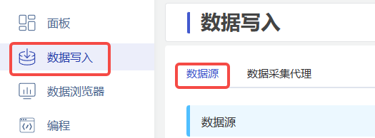
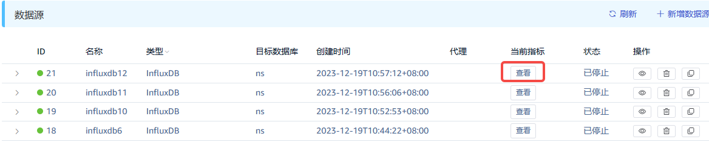
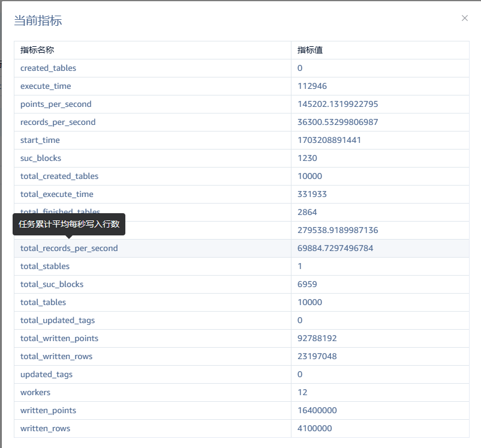
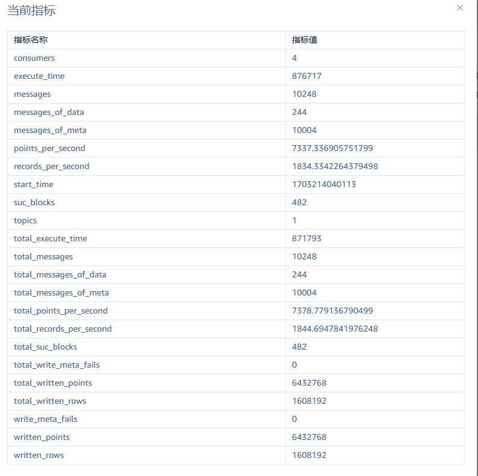
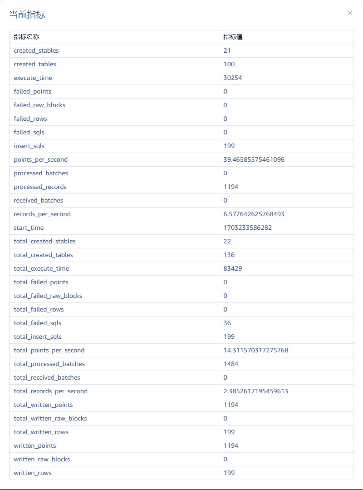

# taosX 可观测性

## 1. 背景

taosX 1.5.0 之前的版本已经实现了任务 metrics 功能，可在 Explorer 页面查看任务的 metrics。但是存在诸多问题：
- 命名混乱
  - 同一个含义的指标在不同任务叫不同的名字，比如写入总行数有时叫 written_rows 有时叫 written_record。
  - 名称含义不直观。比如同时有 metrics.ipc.record_batch 和 metrics.ipc.batch_record 两个相似的名字。
- 对于某些类型的数据源，内部有两套实现，功能重复。
- 任务重启或 taosX 重启时， 任务 metrics 的行为不统一：有的会自动重置，有的不会重置，有的连续，有的不连续
- 上一问题，也导致计算某些导出指标时出错，如 rows_per_second。
- 除了 TDengien 2.x 数据源的 metrics 实现了持久化之外，其余数据源均为实现 metrics 持久化。 taosX 重启所有 metrics 都会消失。
- Metrics 未区分累计统计和本次运行的统计。
因此，对 metrics 的内部实现做了重构，统一了命名，区分了累计统计和本次运行的统计，且对所有数据源的 metrics 实现了持久化。

TD-27537

## 2. 变更历史

| 日期 | 版本 | 撰写人 | 修改 |
| --- | --- | --- | --- |
| 2023-12-22 | 1.0 | 丁博 |  |
| 2023-01-16 | 1.1 | 丁博 | 新加 failed_batches 指标 |

## 3. 定义

1. ** metric**：又称**指标，**是一个具体的观测值或统计值，例如：任务执行中 sql 失败次数、任务开始时间
2. **counter**：只增不减的整数指标，用于个数的统计。每处理完一批数据会累加一定值。
3. **gauge**：可增可减的指标
4. ** total metrics：** 累计指标，无论任务重启多少次都不会清零，而是接着上一次任务运行统计。
5. **run metrics**：Run 指标，任务一次执行相关的 metric，任务每次重启会被重置
6. **computed metrics**：导出指标，一般只有在需要展示给用户时才会基于其它指标计算出来 
7. **system metrics**：系统指标，系统相关统计
8. ** process metrics**: 进程指标，进程相关统计
9. **static metrics**：静态指标，一旦有了初始值之后就永远不再变化，一般与任务配置或系统资源有关

## 4. 行为说明

### 4.1 范围

本文档的目的主要是优化在 Explorer 页面上展示的指标，但是文档列举的指标也适用于 taoskeeper 监控系统，且本文档列举的指标是发送给 taoskeeper 的指标的一个子集。

### 4.2 指标命名规范

1. 累计指标统一以 “total_” 开头
2. 系统指标统一以 “sys_” 开头
3. 进程指标统一以 “process_” 开头

### 4.3 指标说明

本节将所有指标分为 4 类说明：
1. 系统指标和进程指标。
2. 各类数据源通用指标。
3. TDengine 2.x 数据源独有的指标
4. TDengine 3.x 数据源独有的指标
5. 使用 IPC 传输数据的数据源通用的指标，包括： InfluxDB, OpentsDB, OPC, PI, MQTT，Historian，CSV，Kafka
与之前版本相比，绿色表示有修改，红色表示新增, 黑色表示不变。

| 分类 | 名称 | 描述 | 属性 | 其它说明 |
| --- | --- | --- | --- | --- |
| sys_cpu_cores | 系统 CPU 核数 | static |  |
| sys_total_memory | 系统总内存，单位：字节 | static |  |
| sys_used_memory | 系统已用内存, 单位：字节 | system、gauge |  |
| sys_available_memory | 系统可用内存, 单位：字节 | system、gauge |  |
| uptime | taosX 运行时长，单位：秒 | process、counter |  |
| process_cpu_percent | taosX 进程占用 CPU 百分比 | process、gauge |  |
| process_memory_percent | taosX 进程占用内存百分比 | process、gauge |  |
| process_start_time | taosX 启动时的 UTC 时间戳 | process、static |  |
| process_disk_read_bytes | taosX 进程在一个监控周期（比如10s）内从硬盘读取的字节数 | process、gauge |  |
| process_disk_written_bytes | taosX 进程在一个监控周期（比如10s）内写到硬盘的字节数 | system、gauge |  |
| total_execute_time | 任务累计运行时间，单位毫秒 | accumulative 、counter |  |
| total_written_rows | 成功写入 TDengine 的总行数（包括重复记录） | accumulative 、counter |  |
| total_written_points | 累计写入成功点数 (等于数据块包含的行数乘以数据块包含的列数) | accumulative 、counter |  |
| total_rows_per_second | 任务累计平均每秒写入行数 | computed |  |
| total_points_per_second | 任务累计平均每秒写入测点数 | computed |  |
| start_time | 任务启动时间 (每次重启任务会被重置) | static | 旧名称:metrics.time_started_timestamp |
| written_rows | 本次运行此任务成功写入 TDengine 的总行数（包括重复记录） | Run 指标、counter |  |
| written_points | 本次运行写入成功点数 (等于数据块包含的行数乘以数据块包含的列数) | Run 指标、counter |  |
| execute_time | 任务本次运行时间，单位毫秒 | Run 指标、computed、static | 1. 旧名称: metrics.time_cost 1. 任务运行中等于 now - start_time，从这个角度讲是导出指标 |
| rows_per_second | 任务本次运行平均每秒写入行数 | computed | 1. 旧名称：metrics.records_per_second 1. 等于 written_rows 除以 execute_time |
| points_per_second | 任务本次运平均每秒写入测点数 | computed | 等于 written_points 除以 execute_time |
| read_concurrency | 并发读取数据源的数据 worker 数, 也等于并发写入 TDengine 的 worker 数 | static | 旧名称： metrics.legacy.workers |
| total_stables | 需要迁移的超级表数据数量 | static | 旧名称：metrics.legacy.total_stables |
| total_updated_tags | 累计更新 tag 数 | accumulative 、counter | 旧名称：metrics.legacy.updated_tags |
| total_created_tables | 累计创建子表数 | accumulative 、counter | 旧名称： metrics.legacy.created_tables |
| total_tables | 需要迁移的子表数量 | static | 旧名称： metrics.legacy.total_tables |
| total_finished_tables | 完成数据迁移的子表数 (任务中断重启可能大于实际值) | accumulative 、counter | 旧名称： metrics.legacy.tables |
| total_success_blocks | 累计写入成功的数据块数 | accumulative 、counter | 旧名称： metrics.legacy.blocks |
| finished_tables | 本次运行完成迁移子表数 | run、counter |  |
| success_blocks | 本次写入成功的数据块数 | run、counter |  |
| created_tables | 本次运行创建子表数 | run、counter |  |
| updated_tags | 本次运行更新 tag 数 | run、counter |  |
| total_messages | 通过 TMQ 累计收到的消息总数 | accumulative 、counter |  |
| total_messages_of_meta | 通过 TMQ 累计收到的 Meta 类型的消息总数 | accumulative 、counter |  |
| total_messages_of_data | 通过 TMQ 累计收到的 Data 和 MetaData 类型的消息总数 | accumulative 、counter |  |
| total_write_raw_fails | 累计写入 raw meta 失败的次数 | accumulative 、counter |  |
| total_success_blocks | 累计写入成功的数据块数 | accumulative 、counter | 旧名称：blocks |
| topics | 通过 TMQ 订阅的主题数 | static | 旧名称：metrics.tmq.topics |
| consumers | TMQ 消费者数 | static | 旧名称：metrics.tmq.workers |
| messages | 本次运行通过 TMQ 收到的消息总数 | run、counter | 1. 旧名称：metrics.tmq.messages 1. 等于 messages_of_meta + messages_of_data |
| messages_of_meta | 本次运行通过 TMQ 收到的 Meta 类型的消息总数 | run、counter | 旧名称：metrics.tmq.messages_of_meta |
| messages_of_data | 本次运行通过 TMQ 收到的 Data 和 MetaData 类型的消息总数 | run、counter | 旧名称： metrics.tmq.messages_of_data |
| write_raw_fails | 本次运行写入 raw meta 失败的次数 | run、counter | 旧名称：metrics.tmq.write_meta_fails |
| success_blocks | 本次写入成功的数据块数 | run、counter | 旧名称： blocks |
| total_received_batches | 通过 IPC Stream 收到的数据总批数 | accumulative 、counter |  |
| total_processed_batches | 成功处理的总批数 | accumulative 、counter | 旧名称： metrics.ipc.received_batches |
| total_processed_rows | 成功处理的总行数（等于每批包含数据行数之和） | accumulative 、counter |  |
| total_failed_batches | 处理失败的总批数 |  |  |
| total_inserted_sqls | 执行的 INSERT SQL 总条数 | accumulative 、counter |  |
| total_failed_sqls | 执行失败的 INSERT SQL 总条数 | accumulative 、counter |  |
| total_created_stables | 创建的超级表总数（可能大于实际值） | accumulative 、counter |  |
| total_created_tables | 尝试创建子表总数(可能大于实际值) | accumulative 、counter |  |
| total_failed_rows | 写入失败的总行数 | accumulative 、counter |  |
| total_failed_point | 写入失败的总点数 | accumulative 、counter |  |
| total_written_blocks | 写入成功的 raw block 总数 | accumulative 、counter |  |
| total_failed_blocks | 写入失败的 raw block 总数 | accumulative 、counter |  |
| received_batches | 本次运行此任务通过 IPC Stream 收到的数据总批数 | run、counter | 旧名称： ipc.stream.record_batch |
| processed_batches | 本次运行处理成功的批数 | run、counter |  |
| failed_batches | 本次运行处理失败的批数 |  |  |
| processed_rows | 本次处理成功的总行数（等于处理成功的 batch 包含的数据行数之和） | run、counter |  |
| inserted_sqls | 本次运行此任务执行的 INSERT SQL 总条数 | run、counter |  |
| failed_sqls | 本次运行此任务执行失败的 INSERT SQL 总条数 | run、counter | 旧名称: ipc.stream.insert_sql_fails |
| created_stables | 本次运行此任务尝试创建超级表数（可能大于实际值） | run、counter | 旧名称： ipc.stream.stables_created |
| created_tables | 本次运行此任务尝试创建子表数(可能大于实际值) | run、counter | 旧名称： ipc.stream.child_table_created |
| failed_rows | 本次运行此任务写入失败的行数 | run、counter | 旧名称： ipc.stream.record_fails |
| failed_points | 本次运行此任务写入失败的点数 | run、counter | 旧名称： ipc.stream.point_fails |
| written_blocks | 本次运行此任务写人成功的 raw block 数 | run、counter | 旧名称：ipc.stream.write_raw_blocks |
| failed_blocks | 本次运行此任务写入失败的 raw block 数 | run、counter | 旧名称：write_raw_blocks_fails |

### 4.2 指标持久化策略说明

1. **每隔 10 秒保存一次 metrics，任务停止运行时也会保存一次**
2. 持久化的 metrics 保存在 taosX 数据目录下。taosX 数据目录可通过 3 种方式指定：
  - 配置文件中的配置项 data_dir 
  - 命令行参数 --data-dir，
  - 环境变量 TAOSX_DATA_DIR。
  Metrics 数据具体保存路径为 {data_dir}/tasks/{task_id}/metrics.json。  例如对于 task id 为 6 的任务
  - 在 windows 系统上默认保存路径 C:\TDengine\data\taosx\tasks\6\metrics.json
  - 在 Linux 系统上默认保存路径： /var/lib/taos/taosx/tasks/6/metrics.json
1. 保持形式为 JSON 格式的文本文件，例如：
  ```json
  {
    "task_id": 6,
    "start_time": 1703668552204,
    "total_execute_time": 20025,
    "total_written_rows": 100,
    "total_written_points": 600,
    "execute_time": 20025,
    "written_rows": 100,
    "written_points": 600,
    "total_received_batches": 0,
    "total_processed_batches": 600,
    "total_insert_sqls": 100,
    "total_failed_sqls": 0,
    "total_created_stables": 0,
    "total_created_tables": 0,
    "total_failed_rows": 0,
    "total_failed_points": 0,
    "total_written_raw_blocks": 0,
    "total_failed_raw_blocks": 0,
    "received_batches": 0,
    "processed_batches": 0,
    "processed_records": 600,
    "insert_sqls": 100,
    "failed_sqls": 0,
    "created_stables": 0,
    "created_tables": 0,
    "failed_rows": 0,
    "failed_points": 0,
    "written_raw_blocks": 0,
    "failed_raw_blocks": 0
  }
  ```

1. 任务被删除时，任务的 metrics 数据自动被删除。卸载 taosX 不会影响数据目录。
2. 持久化的指标的范围：所有累计指标和所有 Run 指标。也就是说，**无论何时调用获取 task metrics 的接口，都会获取到累计指标和任务最近一次执行的指标**。最近一次执行的指标直到下次任务执行才会被重置。导出指标不做持久化。

### 4.3 数据接口

接口和上一版本保持一致
- 获取某个任务的 metrics 的 REST 接口：GET /tasks/{id}/metrics
- 定时推送某个任务的 metrics 的 ws 接口：ws://host:port/metrics/task/{task_id}，具体用法参考技术文档：[Metrics 动态更新](https://taosdata.feishu.cn/wiki/IC52wperPiJl5UkVMltclyUQnLc) 
各类数据源返回数据示例
1. IPC 数据源任务返回数据示例
  ```json
  {
   "total": {
        "total_created_stables": 22,
        "total_created_tables": 135,
        "total_execute_time": 97303,
        "total_failed_points": 0,
        "total_failed_raw_blocks": 0,
        "total_failed_rows": 0,
        "total_failed_sqls": 36,
        "total_insert_sqls": 198,
        "total_points_per_second": 12.209284400275429,
        "total_processed_batches": 1484,
        "total_received_batches": 0,
        "total_records_per_second": 2.034880733379238,
        "total_written_points": 1188,
        "total_written_raw_blocks": 0,
        "total_written_rows": 198
    }，
    "current":{
         "created_stables": 0,
        "created_tables": 0,
        "execute_time": 13874,
        "failed_points": 0,
        "failed_raw_blocks": 0,
        "failed_rows": 0,
        "failed_sqls": 0,
        "insert_sqls": 100,
        "points_per_second": 43.246360098025086,
        "processed_batches": 0,
        "processed_records": 600,
        "received_batches": 0,
        "records_per_second": 7.20772668300418,
        "start_time": 1703488388415,
        "written_points": 600,
        "written_raw_blocks": 0,
        "written_rows": 100
    }
  }
  ```

1. TDengine 3.x 数据源任务返回数据示例
  ```json
  {
    "total": {
        "total_execute_time": 910727,
        "total_messages": 10640,
        "total_messages_of_data": 636,
        "total_messages_of_meta": 10004,
        "total_points_per_second": 18632.547404436235,
        "total_records_per_second": 4658.136851109059,
        "total_suc_blocks": 1275,
        "total_write_meta_fails": 0,
        "total_written_points": 16969164,
        "total_written_rows": 4242291
    },
    "current": {
        "consumers": 8,
        "execute_time": 90538,
        "messages": 279,
        "messages_of_data": 279,
        "messages_of_meta": 0,
        "points_per_second": 82175.57268771123,
        "records_per_second": 20543.893171927808,
        "start_time": 1703489756048,
        "suc_blocks": 1275,
        "topics": 2,
        "write_meta_fails": 0,
        "written_points": 7440012,
        "written_rows": 1860003
    }
  }
  ```

1. TDengine 2.x 数据源任务返回数据示例
  ```json
  {
    "current": {
      "created_tables": 8520,
      "execute_time": 9748,
      "points_per_second": 625867.8703323759,
      "read_concurrency": 12,
      "rows_per_second": 156466.96758309397,
      "start_time": 1705473563255,
      "success_blocks": 457,
      "updated_tags": 0,
      "written_points": 6100960,
      "written_rows": 1525240
    },
    "total": {
      "total_created_tables": 8520,
      "total_execute_time": 0,
      "total_finished_tables": 150,
      "total_stables": 1,
      "total_success_blocks": 457,
      "total_tables": 10000,
      "total_updated_tags": 0,
      "total_written_points": 6100960,
      "total_written_rows": 1525240
    }
  }
  ```

### 4.4 用户界面

前端改进：
1. 增加描述列
2. 格式化显示时间，浮点数
3. 后端分组返回，total 和 current 分开
4. 不同分组可折叠

##### 4.0.0.1 查看 metrics 入口

1. 点击导航栏“数据写入”，并选择“数据源”标签页


1. 点击“当前指标”列的“查看”按钮之后，会弹出 metrics 窗口，数据每 2 秒自动刷新一次。


（备注：截图为现状，还有很多细节需要调整）

##### 4.0.0.2 TDengine 2.x 示例



##### 4.0.0.3 TDengine 3.x 任务



##### 4.0.0.4 使用 IPC 的任务



## 5. 性能

Metrics 底层采用原子类型（如 AtomicU64）, 多线程更新 metric 值并没有锁等待， 且 metrics 持久化在独立协程中进行，频率并不高，所以性能影响可以忽略。

## 6. 兼容性

对于 TDengine 2.x 数据源，由于新的 metrics 结构和旧的不一样，升级 taosX 之后，如果任务 ID 不变，旧的 metrics 将会被清除。
对于其它数据源没有兼容性问题。
功能发布之后，如果修改 metrics 名字会有兼容性问题。因为 json 文件成功被反序列化。此时 metrics 会重新统计。

## 7. 运维

## 8. 使用场景

- 在使用 Agent 的条件下，通过比较已收到的批数和已处理的批示，判断数据在 taosX 端是否有积压。比如 received_batches =2000, process_batches=1000, 则有 1000 批未处理的数据在内存队列中。
- 通过观察写入速度的变化，调整任务参数。如果写入速度不如预期，且 CPU， 内存，磁盘 IO 等资源充足，可尝试提高任务的读并发配置。具体参数需要参考任务配置页的说明。

## 9. 约束和限制

1. 不支持重置某个任务的累计指标，如果确有需求，可以删除任务重建。
2. 任务累计执行时长在保存 metrics 时才更新，有最大 10 秒钟的误差
3. 创建超级表和子表的个数根据执行的 create table 语句中包含的表的个数统计，如果多个 worker 同时创建表且同时成功，统计值会大于实际值

## 10. 常见错误和排查

暂无
