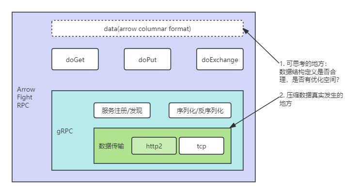
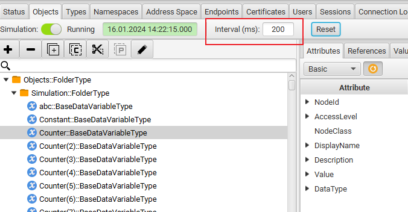
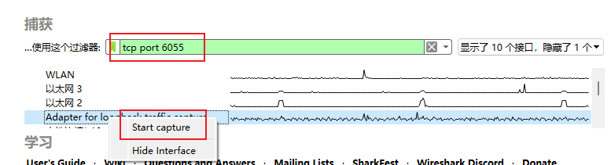
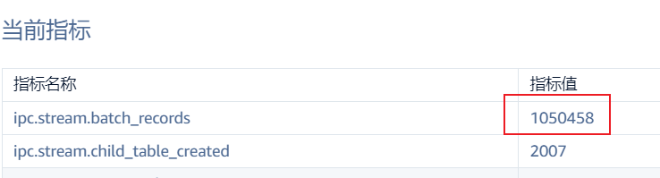
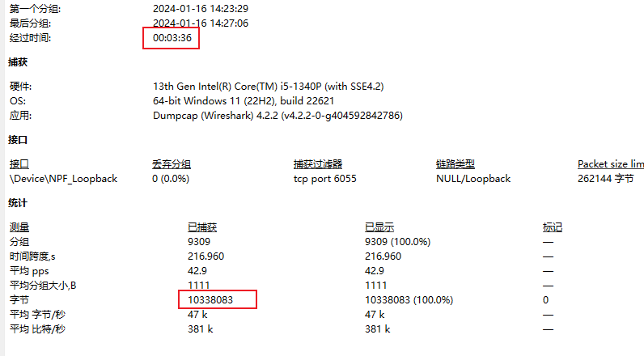
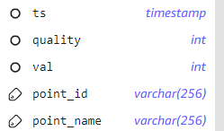

# 数据压缩

## 1. 背景

### 1.1 业务背景

当 Agent 处在边端，而 taosX 处在云端时，边云之间的网络带宽有限，为了尽可能地节省网络带宽，需要由 agent 对接收到的数据在压缩后传输给 taosX，由 taosX 解压后再进行后面的处理流程。Agent 获取数据及之前的逻辑不受影响，taosX 获取到（解压的）数据后直到数据写入的逻辑不受影响。

### 1.2 技术背景

### 1.3 Jira 列表

[Agent：添加 对源数据的压缩功能 TD-27274](https://jira.taosdata.com:18080/browse/TD-27274)
[taosX: 自适应数据解压缩 TD-27275](https://jira.taosdata.com:18080/browse/TD-27275)

## 2. 变更历史

| **日期** | **版本** | **撰写人** | 备注 |
| --- | --- | --- | --- |
| 2023-12-22 | 0.1 | 周营昭 | 初稿 |
| 2024-01-04 | 0.1 | 周营昭 | 添加技术背景 |
| 2024-01-16 | 1.0 | 周营昭 | 验证完成，添加验证方法，见4.3. |

## 3. 定义

无。

## 4. 行为说明

### 4.1 agent端配置

在配置文件 agent.toml 中，增加 1 个配置项
<callout emoji="link" background-color="light-orange" border-color="light-orange">
compression=true
</callout>

配置项 compression 表示是否开启压缩传输， true开启，false关闭；缺省false。

### 4.2 数据交互流程

agent 执行 data in task 时，从数据源获取到的数据推送给 taosX 时，如果开启了压缩，将数据压缩后推送给 taosX 服务器。
taosX 服务端自适应，如果传输的数据是压缩后的数据，自动解压缩获取数据，无需任何配置。

### 4.3 验证方法

#### 4.3.1 验证环境

**部署环境**：
操作系统：win11 环境 + 虚拟机 centOS7
taosd + taoAdapter 部署在虚拟机 centOS7;
win11 环境部署 agent + taosX;
数据源使用 OPCUA Simulation Server；
**数据模拟**：
1000个int型数据节点，200ms发送一次数据

**抓包软件**：
Wireshark 4.2.2

#### 4.3.2 验证流程

1. 开启抓包
由于是本机环境，需要对loopback traffic进行捕获，同时添加过滤器`tcp port 6055`。

1. 使用压缩模式启动agent
2. explorer 中配置datain from opc ua

配置好数据源点位后启动 data in task。
1. 当采集数据量达到100万条数据时停止 task,统计数据。

1. 使用非压缩方式开启 agent 重复1~4步骤。

#### 4.3.3 测试结果分析

| 是否开启压缩 | 数据量 | 运行时间 | 传输数据累计大小 |
| --- | --- | --- | --- |
| 开启 | 1050458 | 03:36 | 10,338,083 |
| 关闭 | 1010231 | 03:24 | 60,631,331 |

数据结构为 

压缩率为82.9%。

## 5. 性能

压缩率不能低于75%，也就是100kB的原始数据，压缩后传输数据量要小于25kB。
经验证，opc ua数据类型为double时，压缩率可达到85%， opc ua点位类型为int型，压缩率可达到83%。

## 6. 兼容性

agent 端配置为 `compression = true`,则不兼容 taosX 1.4.0 及以往版本。
agent 端配置为 `compression = false`,则兼容 taosX 1.4.0 及以往版本。

## 7. 运维

无。

## 8. 使用场景

如果整体吞吐量没有达到预期，经过分析时 Agent 和 taosX server 间网络带宽的因素影响到整体的吞吐量 QPS，那么可以开启压缩。
比如针对同样的数据源，当 agent 和 taosX 在同一个局域网环境内，每秒钟可以写入10万条数据；在云服务环境，agent 和 taosX 经过互联网相连接，每秒钟只能写入1万条数据；由于网络环境的变化大大影响 QPS，则应该开启 agent 压缩。

## 9. 约束和限制

1. 开启压缩，会增加 cpu 的压力，agent 需要对数据进行压缩，taosX 需要对数据进行解压缩。如果 agent 或 taosX 所在机器在原有的 task 执行过程中，cpu 使用率已经比较高， 例如达到90%（Threshold 待验证）以上，不建议开启压缩。
2. 压缩算法不可配置。

## 10. 常见错误和排查

无。

## 11. 参考文档

1. Apache arrow官方文档
https://arrow.apache.org/overview/
1. rust官方网络组件tonic
https://docs.rs/tonic/0.10.2/tonic/codec/enum.CompressionEncoding.html
