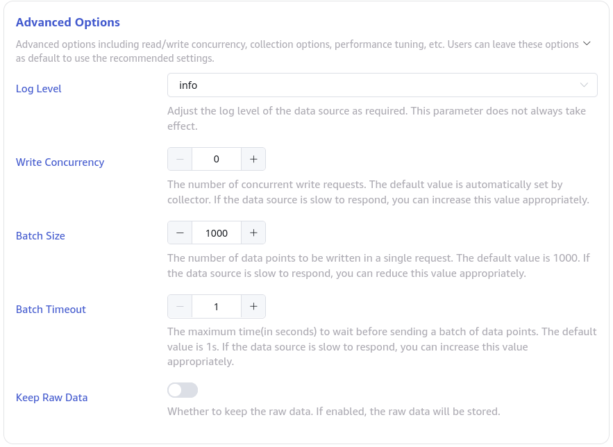
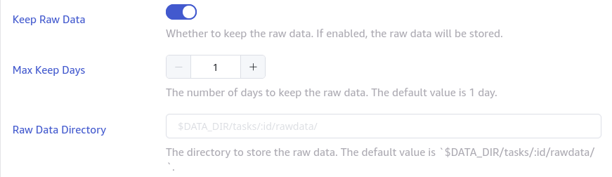

# 数据源统一参数 Advanced Options

## 1. 背景

根据 Jeff 对数据源参数的意见，现将各数据源公共参数拆分为独立 的部分，称为 Advanced Options （高级参数）。原始需求文档见 [数据源采集/性能参数统一](https://taosdata.feishu.cn/wiki/Bd4bwrsseiiSVOkQ79occ8hJn8f) 。

TD-27175

TD-27177

## 2. 定义

1. 外部数据源：这是一个内部定义，是指其数据采集部分在独立于 taosX 的进程中运行的数据源，包括 MQTT/PI/OPC/OpenTSDB/InfluxDB
2. 内部数据源：其数据采集部分是在 taosX 进程内部运行的数据源，包括 TDengine 3.x/TDengine 2.x/ Kafka / Historian / CSV 

## 3. 变更历史

| 日期 | 版本 | 撰写人 |
| --- | --- | --- |
| 2023-12-21 | 1.0 | @霍琳贺 |

## 4. 行为说明

### 4.1 统一参数说明

包括三组参数：
1. 性能相关：
   - **Read/Write Concurrency**: 读写并发数限制，读即从数据源读取，写即写入 taosx IPC Stream。
      - 默认值：0，表示 auto，自动配置并发数（1. Kafka 使用 Partitions 数量的订阅者 2. TMQ 使用 vgroups 数量的订阅者 etc.）
   - **Batch Size**: 批次大小，原则上是单次发送的最大消息数量。
      - 默认值：0，表示 auto，自动配置批次大小（TDengine query block size，Kafka polled message set size, etc...）
   - **Batch Timeout**: 单次读取最大延时，当超时结束时，只要有消息，即使不满足 Batch Size，也立即发送。
      - 默认值：1s
2. **Log Level**: 使用外部数据源，启用 5 级日志级别：error/warn/info/debug/trace，默认为 info：
  

1. **Keep Raw Data**: 是否保存原始数据，默认不保存。当保存原始数据时，配置参数如下：
   - **Raw Data Directory**: 自定义原始数据存储位置，默认存储到 `$DATA_DIR/tasks/:id/rawdata/` 目录
   - **Max Keep Days**: 数据最大保存天数，默认 1 天。
不保存原始数据时，以上两个参数不显示。

入口参数名统一为 snake_case 形式，其参数名和中英文描述如下：

| Name | Display | 中文说明 | description | default | possibles |
| --- | --- | --- | --- | --- | --- |
| log_level | Log Level | 根据需要调整数据源的日志级别，此参数不总是生效。 | Adjust the log level of the data source as required. This parameter does not always take effect. | info | error warn info debug trace |
| read_concurrency | Read Concurrency | 数据源连接数或读取线程数限制，当使用默认参数时其并发度实际由程序自主选择最恰当的值。当默认参数不满足需要或需要调整资源使用量时修改此参数。 | The number of concurrent read requests. The default value is automatically set by collector. If the data source is slow to respond, you can increase this value appropriately. | 0 InfluxDB/OpenTSDB: 50 | 0-1000 InfluxDB/OpenTSDB: 1-100 |
| write_concurrency | Write Concurrency | 写入 taosX 的最大并发数限制，当使用默认参数时其并发度实际由程序自主选择最恰当的值。当默认参数性能不足时，可增大此参数。 | The number of concurrent write requests. The default value is automatically set by collector. If the data source is slow to respond, you can increase this value appropriately. | 0 InfluxDB/OpenTSDB: 50 | 0-1000 InfluxDB/OpenTSDB: 1-500 |
| batch_size | Batch Size | 单次发送的最大消息数或行数。 | The number of data points to be written in a single request. The default value is 1000. If the data source is slow to respond, you can reduce this value appropriately. | 1000 InfluxDB/OpenTSDB: 5000 | 1-100_000 InfluxDB/OpenTSDB: 1-10_000 |
| batch_timeout | Batch Timeout | 单次读取最大延时（单位为秒），当超时结束时，只要有数据，即使不满足 Batch Size，也立即发送。 | The maximum time(in seconds) to wait before sending a batch of data points. The default value is 1s. If the data source is slow to respond, you can increase this value appropriately. | 1 | 1-60 |
| keep_raw_data | Keep Raw Data | 是否保存原始数据？ | Whether to keep the raw data. If enabled, the raw data will be stored. | false | true false |
| keep_raw_data_dir | Raw Data Directory | 自定义原始数据存储目录，默认存储到系统数据目录下。 | The directory to store the raw data. The default value is `$DATA_DIR/tasks/:id/rawdata/`. | `$DATA_DIR/tasks/:id/rawdata/` | Path in taosx server |
| keep_raw_data_days | Max Keep Days | 原始数据最大保存天数，默认 1 天。 | The number of days to keep the raw data. The default value is 1 day. | 1 | 1-365 |

### 4.2 UI 行为变更

**Advanced Options **默认为收起（collapsed），用户可点击展开。这部分应显示在数据源配置的最后部分。

展开后的样式：

支持保存原始数据的数据源（目前仅 OPC-UA/DA），Keep Raw Data 默认不展开，其展开后的样式如下：

TODO: dir relativ

### 4.3 参数适用范围 

因为各个数据源类型、存储、读取方式等差别，各个数据源在具体实现公共参数时，不需要实现全部参数，根据具体情况进行实现，见表格（ `+` 表示实现该参数，`-` 表示不实现该参数， `?` 表示未确定）：

| Name | OPC-UA/DA | MQTT | PI/PI-Backfill | OpenTSDB/InfluxDB | Kafka | Historian | CSV |
| --- | --- | --- | --- | --- | --- | --- | --- |
| **log_level** | **+** | **+** | **+** | **+** | **-** | **-** | **-** |
| **read_concurrency** | **-** | **-** | **-** | **+** | **+** | **+** | **+** |
| **write_concurrency** | **+** | **-** | **-** | **+** | **-** | **-** | **-** |
| **batch_size** | **+** | **-** | **+** | **+** | **-** | **+** | **+** |
| **batch_timeout** | **+** | **-** | **+** | **-** | **-** | **-** | **-** |
| **keep_raw_data** | **+** | - | **-** | **-** | **-** | **+** | **-** |
| **keep_raw_data_dir** | **+** | - | **-** | **-** | **-** | **+** | **-** |
| **keep_raw_data_days** | **+** | - | **-** | **-** | **-** | **+** | **-** |

说明：
- 外部数据源必须实现 log_level 参数，内部数据源不支持该参数。
- 基于订阅的数据源（MQTT、Kafka）不实现 batch_size/timeout 参数。
- 读写并发一致的（读线程和写线程 1:1，包括 OPC/Historian/CSV）仅实现一个。
- OPC， Historian 实现保存原始数据。
- 对于 Kafka 数据源：其实际并发上限为 topic 的 partition 数量，当用户自主设置的 read_concurrency 高于 partition 数量时，实际生效的并发数等于 partition 数量。
其中，外部数据源的实现文档见以下链接：
- OPC 已全部支持。
- MQTT：[MQTT Advanced Options 连接器实现](https://taosdata.feishu.cn/wiki/A1FvwNYsmilsEVkRHsSccmEQnWc) 
- PI/PI-Backfill：@任新胜
- Kafka/Historian: @杨志宇
- OpenTSDB/InfluxDB: @张元湃
- CSV: @杨志宇

## 5. 性能

调整 read_concurrency, write_concurrency, batch_size 会直接影响性能。

### 5.1 读写并发参数

当需要对默认参数进行调整以提高或限制性能时使用。一般情况，增大并发数可以提升读取效率进而提升写入性能，但建议该值最大不要超过 CPU 核数 * 2 （超过此值，可能效率有所降低）。读并发数一般大于或等于写并发数，因为在taosX 使用中，连接器与 taosX 或 Agent 的连接是本地连接，所以一般情况下写并发并不会成为瓶颈。

### 5.2 Batch Size

当测试、审计等要求调整或限制批次写入大小，或性能调整需要时，可调整 Batch Size。默认的 Batch Size 值为 1000 ，对于常规使用来说，性能和实时性基本都可满足。更大的 Batch Size 一般可得到更好的性能，但对于消息体较大的数据可能导致性能下降。

### 5.3 Batch Timeout

当数据源写入比较稀疏时，可根据实际情况增大 Timeout 以提高总体写入效率。例如：每秒产生数据 100 条数据，当 batch_timeout=1s 时，尽管 batch_size 值可能大于 100 （如 batch_size=1000），实际传输的 batch_size 仍然是 100，此时增大 batch_timeout 可以提高实际入库的 batch_size ，进而提高写入效率。
当数据即时性要求较高时，使用更小的 batch_timeout 值（当前最小为 1s）。更小的 batch_timeout 值可能导致更多的 CPU 占用，当写入性能较差时，也可能造成数据积压，从而导致内存占用提高。
在实际应用中，注意观察性能和资源占用情况，根据数据特点调整参数以达到最佳效果。

## 6. 兼容性

此特性对兼容性没有影响。

## 7. 运维

所有参数都通过图形界面进行设置，无需任何运维操作。

## 8. 使用场景

### 8.1 日志

在调试或审计需要时，可降低日志级别（默认为 info，降低日志级别一般为 debug，需要更多信息则为 trace ），进行问题排查或一致性检查。

### 8.2 保存原始数据

报错原始数据可能对以下需求有帮助：
- 接收数据检查、审计等。
- 数据不一致问题排查。
- 其他需要参考原始数据源的情况。

### 8.3 性能参数调整

#### 8.3.1 需要提高入库速度

当查看 Metrics 发现数据没有积压，但写入效率不足时，可分别进行以下调整：
1. 提高读并发数（read_concurrency）：在没有数据积压的情况，读并发数可能是影响写入效率的最重要的因素，首先提高该值并观察写入性能指标。
2. 提高写并发数（write_concurrency）：在写并发参数可用时，尝试提高写并发数以提高传输效率。
3. 选择合适的 batch_size：通常情况下，默认的 batch_size 可以满足大部分需求，但也可以按需调整。增大 batch_size 大小可以一定程度上提高消息吞吐率，并提升写入性能。但在消息列数较大（大于1000列）或字符串数据类型较多（单条消息较大）时，可以适当降低 batch_size 以提高写入频率，进而提升性能。TODO
当数据存在积压（收到的消息数和写入的消息数差距较大）时，可进行以下调整：
1. 增大 batch_size ：提高批次大小以减少写请求。
2. 提高 batch_timeout：在该参数可用时，提高该值以合并写入请求。
3. 适当降低写并发数（write_concurrency）：降低并发数，提高批次写入效率，可以一定程度上缓解数据写入压力，达到总体性能的提升。

#### 8.3.2 写入性能或资源使用约束

在需要进行写入性能或资源使用约束时，分别调整参数如下：
1. 降低读写并发数，以降低 CPU 和内存占用。
2. 降低 batch_size，可降低内存占用。
3. 增加 batch_timeout，可以降低 CPU 占用。

## 9. 约束和限制

Advanced Options 中的所有参数都不能在任务运行时动态修改。欲修改参数，需要先停止任务，修改参数后再重新启动任务。

## 10. 常见错误和排查

无。
