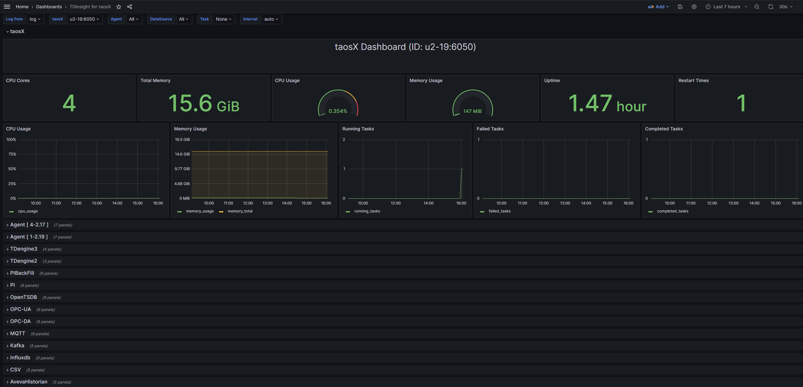
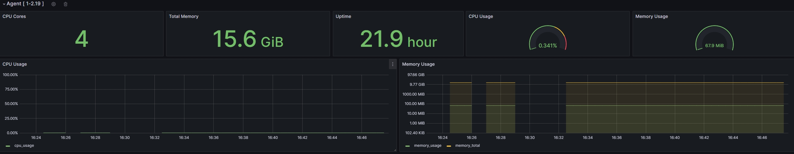
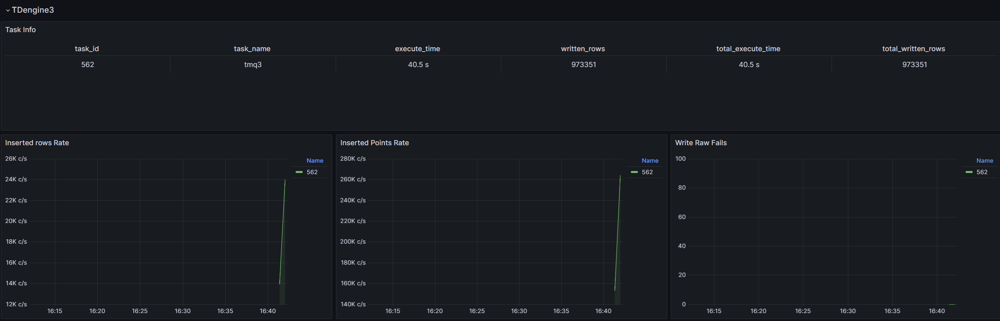
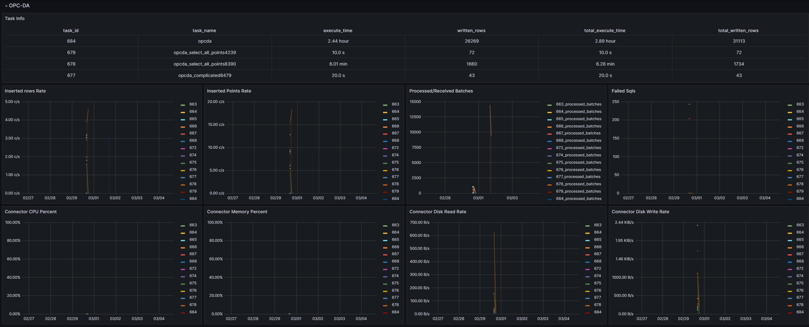
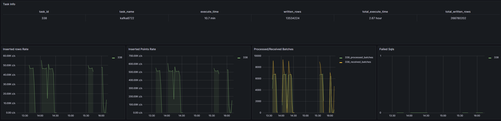

# 监控 taosX (taosX, taosKeeper, TDinsight)

## 1. 背景

taosKeeper + TDinsight 是 TDengine 官方支持的监控方案，用于监控 TDengine 数据平台的各个组件运行情况。目前对 taosd 和 taosAdapter 的监控均已实现，对 taosX 的监控尚未实现，因此需要开发此功能。类似 taosd 的监控，taosX 会定时发送监控数据到 taosKeeper，taosKeeper 将监控数据记录到指定数据库，最终用户可以通过 Grafana 插件 TDinsight 内置的 Dashboard 监控这些数据。

TD-26603

## 2. 变更历史

| 日期 | 版本 | 撰写人 | 变更 |
| --- | --- | --- | --- |
| 2023-12-26 | 0.1 | 丁博 |  |
| 2024-01-04 | 0.2 | 佘彦杰 | 添加监控图表 |
| 2024-02-22 | 1.0 | 丁博 | 修改超级表 tag，增删某些指标 |

## 3. 定义

## 4. 行为说明

### 4.1 范围

1. 只在 taosX 以 Server 模式运行时才能使用此功能
2. 可监控多个 taosX server 进程
3. 可监控多个 taosx-agent 进程
4. 可监控各连接器进程
5. 可监控各数据复制或同步任务的 metrics

### 4.2 新增配置

taosX 新增以下 3 个监控相关配置。

| toml 配置文件中的名称 | 命令行选项 | 含义 | 取值范围 | 默认值 |
| --- | --- | --- | --- | --- |
| [monitor] fqdn="xxxx" | --monitor-fqdn | taosKeeper 服务的 FQDN |  | 无 |
| [monitor] port = 6043 | --monitor-port | Taoskeeper 服务的端口 |  | 6043 |
| [monitor] interval = 10 | --monitor-interval | Taosx 发送 Metrics 数据的时间间隔，单位秒 | 1-10 | 10 |

taosx-agent 无新增配置, 会从 taosx 获取 monitor 相关的配置。taosx.toml 新增以下内容：
```toml
[monitor]

## 5. FQDN of taosKeeper service, no default value

## 6. fqdn = "localhost"

## 7. port of taosKeeper service, default 6043

## 8. port = 6043

## 9. how often to send metrics to taosKeeper, default every 30 seconds

## 10. interval = 30

```

### 10.1 taosKeeper 接口 

| 接口 | POST /general-metric |
| --- | --- |
| QID | 上报监控数据时需要生成 QID，附加在 HEADER 中：（`X-QID: 0xXXX`） |
| 参数格式 | 与 taosd 保持一致，参考 [taosd监控表结构重构以及监控框架 ](https://taosdata.feishu.cn/wiki/B1W1wfUu8iSefQktLI3cRfeHntd) 【4.4 taoskeeper协议】一节。 **建议使用 tag 名 priv_stn 来指定子表名，如果不指定一定反馈给 taoskeeper 开发，补充子表名实现规则**。 |
| 示例数据 | ```json [ { "ts": "1703226836761", "tables": [ { "name": "taosx_sys", "metric_groups": [ { "tags": [ { "name": "taosx_id", "value": "hostname:port" } ], "metrics": [ { "name": "sys_cpu_cores", "value": 8 }, // .... ] } ] }, { "name": "taosx_agent", "metric_groups": [ { "tags": [ { "name": "taosx_id", "value": "hostname:port" }, { "name": "agent_id", "value": "1" } ], "metrics": [ //... ] } ] }, { "name": "taosx_connector", "metric_groups": [ { "tags": [ { "name": "task_id", "value": "1" }, { "name": "taosx_id", "value": "hostname:port" }, { } ], "metrics": [ //.... ] } ] }, { "name": "taosx_td2_datasource", "metric_groups": [ { "tags": [ { "name": "taosx_id", "value": "hostname:port" }, { "name": "task_id", "value": "10" } ], "metrics": [ // 参考 metrics 说明文档 TDengine 2.x 数据源部分 ] } ] }, { "name": "taosx_td3_task", "metric_groups": [ { "tags": [ { "name": "taosx_id", "value": "hostname:port" }, { "name": "task_id", "value": "10" } ], "metrics": [ // 参考 metrics 说明文档 TDengine 3.x 数据源部分 ] } ] }, { "name": "taosx_mqtt_task", "metric_groups": [ { "tags": [ { "name": "taosx_id", "value": "hostname:port" }, { "name": "task_id", "value": "10" } ], "metrics": [ // 参考 metrics 说明文档 IPC 通用数据源部分 ] } ] }, // 其它数据源类似 ] } ] ``` |

### 10.2 表结构

#### 10.2.1 各表 tag 字段

| 超级表 | tags | 子表名规则 |
| --- | --- | --- |
| taosx_sys | taosx_id | sys_${taosx_id} |
| taosx_agent | taosx_id, agent_id, agent_name | agent_${taosx_id}_${agent_id} |
| taosx_connector | taosx_id, ds_name, task_id | connector_${taosx_id}_${ds_name}_${task_id} |
| taosx_task_{ds_name} | taosx_id, task_id, task_name | task_${taosx_id}_${ds_name}_${task_id} |

~~taosx_sys 表， tag 字段：~~~~taosx_id,~~
~~taosx_agent 表， tag 字段： taosx_id, agent_id,  agent_name~~
~~taosx_connector 表， tag 字段： taosx_id~~~~, ds_name, task_id~~
~~taosx_task_{ds_name}， tag 字段： taosx_id, task_id, task_name~~

#### 10.2.2 各表 metrics 字段

对于任务相关的 metrics， 更详细的参考文档是：[taosX Metrics 说明](https://taosdata.feishu.cn/wiki/I5EawNL4ViT082k5RwTcoIEMnRc)，本表的目的是说明发送给 taoskeeper 的具体数据，与任务 metrics 有重叠，但不完全相同。

| 超级表 | 字段 | 描述 |
| --- | --- | --- |
| sys_cpu_cores | 系统 CPU 核数 |
| sys_total_memory | 系统总内存，单位：字节 |
| sys_used_memory | 系统已用内存, 单位：字节 |
| sys_available_memory | 系统可用内存, 单位：字节 |
| process_net_read_bytes |  |
| process_net_written_bytes |  |
| process_uptime | taosX 运行时长，单位：秒 |
| process_id | taosX 进程 ID |
| running_tasks | taosX 当前执行任务数 |
| completed_tasks | taosX 进程在一个监控周期（比如10s）内完成的任务数 |
| failed_tasks | taosX 进程在一个监控周期（比如10s）内失败的任务数 |
| process_cpu_percent | taosX 进程占用 CPU 百分比， 单位 % |
| process_memory_percent | taosX 进程占用内存百分比， 单位 % |
| ~~process_start_time~~ | ~~taosX 启动时的 UTC 时间戳~~ |
| process_disk_read_bytes | taosX 进程在一个监控周期（比如10s）内从硬盘读取的字节数的平均值，单位 bytes/s |
| process_disk_written_bytes | taosX 进程在一个监控周期（比如10s）内写到硬盘的字节数的平均值，单位 bytres/s |
| sys_cpu_cores | 系统 CPU 核数 |
| sys_total_memory | 系统总内存，单位：字节 |
| sys_used_memory | 系统已用内存, 单位：字节 |
| sys_available_memory | 系统可用内存, 单位：字节 |
| ~~process_net_read_bytes~~ |  |
| ~~process_net_written_bytes~~ |  |
| process_uptime | agent 运行时长，单位：秒 |
| process_id |  |
| process_cpu_percent | agent 进程占用 CPU 百分比 |
| process_memory_percent | agent 进程占用内存百分比 |
| ~~process_start_time~~ | ~~agent 启动时的 UTC 时间戳~~ |
| process_uptime |  |
| process_disk_read_bytes | agent 进程在一个监控周期（比如10s）内从硬盘读取的字节数的平均值，单位 bytes/s |
| process_disk_written_bytes | agent 进程在一个监控周期（比如10s）内写到硬盘的字节数的平均值，单位 bytes/s |
| process_id |  |
| process_uptime |  |
| process_cpu_percent |  |
| process_memory_percent |  |
| process_disk_read_bytes | connector 进程在一个监控周期（比如10s）内从硬盘读取的字节数的平均值，单位 bytes/s |
| process_disk_written_bytes | connector 进程在一个监控周期（比如10s）内写到硬盘的字节数的平均值，单位 bytes/s |
| ~~process_net_read_bytes~~ |  |
| ~~process_net_written_bytes~~ |  |
| total_execute_time | 任务累计运行时间，单位毫秒 |
| total_written_rowsls | 成功写入 TDengine 的总行数（包括重复记录） |
| total_written_points | 累计写入成功点数 (等于数据块包含的行数乘以数据块包含的列数) |
| ~~total_rows_per_second~~ | 任务累计平均每秒写入行数 |
| ~~total_points_per_second~~ | 任务累计平均每秒写入测点数 |
| start_time | 任务启动时间 (每次重启任务会被重置) |
| written_rows | 本次运行此任务成功写入 TDengine 的总行数（包括重复记录） |
| written_points | 本次运行写入成功点数 (等于数据块包含的行数乘以数据块包含的列数) |
| execute_time | 任务本次运行时间，单位秒 |
| ~~rows_per_second~~ | 任务本次运行平均每秒写入行数 |
| ~~points_per_second~~ | 任务本次运平均每秒写入测点数 |
| read_concurrency | 并发读取数据源的数据 worker 数, 也等于并发写入 TDengine 的 worker 数 |
| total_stables | 需要迁移的超级表数据数量 |
| total_updated_tags | 累计更新 tag 数 |
| total_created_tables | 累计创建子表数 |
| total_tables | 需要迁移的子表数量 |
| total_finished_tables | 完成数据迁移的子表数 (任务中断重启可能大于实际值) |
| total_success_blocks | 累计写入成功的数据块数 |
| finished_tables | 本次运行完成迁移子表数 |
| success_blocks | 本次写入成功的数据块数 |
| created_tables | 本次运行创建子表数 |
| updated_tags | 本次运行更新 tag 数 |
| total_messages | 通过 TMQ 累计收到的消息总数 |
| total_messages_of_meta | 通过 TMQ 累计收到的 Meta 类型的消息总数 |
| total_messages_of_data | 通过 TMQ 累计收到的 Data 和 MetaData 类型的消息总数 |
| total_write_raw_fails | 累计写入 raw meta 失败的次数 |
| total_success_blocks | 累计写入成功的数据块数 |
| topics | 通过 TMQ 订阅的主题数 |
| consumers | TMQ 消费者数 |
| messages | 本次运行通过 TMQ 收到的消息总数 |
| messages_of_meta | 本次运行通过 TMQ 收到的 Meta 类型的消息总数 |
| messages_of_data | 本次运行通过 TMQ 收到的 Data 和 MetaData 类型的消息总数 |
| write_raw_fails | 本次运行写入 raw meta 失败的次数 |
| success_blocks | 本次写入成功的数据块数 |
| total_received_batches | 通过 IPC Stream 收到的数据总批数 |
| total_processed_batches | 已经处理的批数 |
| total_processed_rows | 已经处理的总行数（等于每批包含数据行数之和） |
| total_inserted_sqls | 执行的 INSERT SQL 总条数 |
| total_failed_sqls | 执行失败的 INSERT SQL 总条数 |
| total_created_stables | 创建的超级表总数（可能大于实际值） |
| total_created_tables | 尝试创建子表总数(可能大于实际值) |
| total_failed_rows | 写入失败的总行数 |
| total_failed_point | 写入失败的总点数 |
| total_written_blocks | 写入成功的 raw block 总数 |
| total_failed_blocks | 写入失败的 raw block 总数 |
| received_batches | 本次运行此任务通过 IPC Stream 收到的数据总批数 |
| processed_batches | 本次运行已处理批数 |
| processed_rows | 本次处理的总行数（等于包含数据的 batch 包含的数据行数之和） |
| received_records | 本次运行此任务通过 IPC Stream 收到的数据总行数 |
| inserted_sqls | 本次运行此任务执行的 INSERT SQL 总条数 |
| failed_sqls | 本次运行此任务执行失败的 INSERT SQL 总条数 |
| created_stables | 本次运行此任务尝试创建超级表数（可能大于实际值） |
| created_tables | 本次运行此任务尝试创建子表数(可能大于实际值) |
| failed_rows | 本次运行此任务写入失败的行数 |
| failed_points | 本次运行此任务写入失败的点数 |
| written_blocks | 本次运行此任务写人成功的 raw block 数 |
| failed_blocks | 本次运行此任务写入失败的 raw block 数 |
| mqtt_fetched_messages | 本次运行任务消息拉取总数量 |
| mqtt_received_bytes | 本次任务接收到的消息字节数 |
| mqtt_dumped_messages | 本次运行任务已 dump 的消息数 |
| mqtt_fetched_acks | 本次运行任务接收到的 ACK 总数 |
| mqtt_ack_fails | 本次运行任务启动开始 ACK 失败总次数 |
| mqtt_unprocessed_messages | 本次运行任务缓存队列中当前消息数量 |
| mqtt_sent_batches | 本次运行任务已发送的批次数量 |
| mqtt_discarded_messages | 本次运行任务丢弃的消息数量 |
| mqtt_discarded_dump_messages | 本次运行任务 dump 操作丢弃的消息数量 |
| kafka_consumers | Kafka 消费者数 |
| kafka_total_partitions | Kafka topic 总分区数 |
| kafka_consuming_partitions | 正在消费的分区数 |
| kafka_consumed_messages | 已经消费的消息数 |
| total_kafka_consumed_messages | 累计消费的消息总数 |
| kafka_sent_batches | 本次运行任务发送的批次数量 |
| kafka_received_acks | 本次运行任务接收到的 ACK 数量 |
| pulsar_total_partitions: | Pulsar topic 总分区数 |
| pulsar_consumers | Pulsar 消费者数 |
| pulsar_consumed_messages | 已经消费的消息数 |
| pulsar_send_msgs | 本次运行任务发送的消息数 |
| pulsar_msg_acks | 本次运行任务 ACK 消息数量 |
| pulsar_sent_batches | 本次运行任务发送的批次数量 |
| pulsar_received_batches | 本次运行任务接收到的批次数量 |
| csv_files | CSV 文件总数量 |
| csv_files_completed | 本次运行此任务 CSV 文件已处理完成数量 |
| csv_files_completed_rows | 本次运行此任务 CSV 文件已处理完成行数 |
| tmq2mqtt_received_messages | 本次运行任务从 TMQ 接收到的消息数量 |
| tmq2mqtt_published_messages | 本次运行任务发送到 MQTT 的消息数量 |
| persist_read_messages | 当前任务读取的持久化消息数 |
| persist_write_messages | 当前任务写入的持久化消息数 |
| persist_received_acks | 当前任务持久化组件接收到的 ACK 数 |
| persist_send_batches | 当前任务持久化组件发送的批次数 |

### 10.3 TDinsight 可视化

taosx的监控信息



agent的监控信息


TDengine2 数据源的监控信息


TDengine3 数据源的监控信息


IPC传输数据的数据源的监控信息





## 11. 性能

## 12. 兼容性

taosKeeper 需要升级至版本 3.2.3.0+。
TDinsight 插件需要升级至版本 3.5.0+。
taosX 需要升级至版本 1.5.0+ 。

## 13. 运维

需要部署以下服务：
- taosd
- taosAdapter
- taosKeeper
- Grafana + TDinsight 插件
并配置 taosX 开启监控。

## 14. 使用场景

使用场景分为三类

### 14.1 监控 taosX 各个组件（taosX, taosx-agent, connector）

比如，对于云服务，某些异常情况会导致 taosX POD 重启，通过观察 taosX 的 uptime 指标可以推断最近一次重启时间。如果观察到非人为的重启，则需要查看日志，找到重启的真正原因。

### 14.2 监控各数据源任务

比如，对于 OPC 数据源, 如果 Received Batches 大于 Process Batches，且差值越来越大，说明 taosX 端数据有积压。

### 14.3 对重要的监控指标添加报警条件

比如： 对 taosX 使用的内存做监控，如果 taosX 使用内存大于系统内存的 70% 触发报警。

## 15. 约束和限制

## 16. 常见错误和排查
