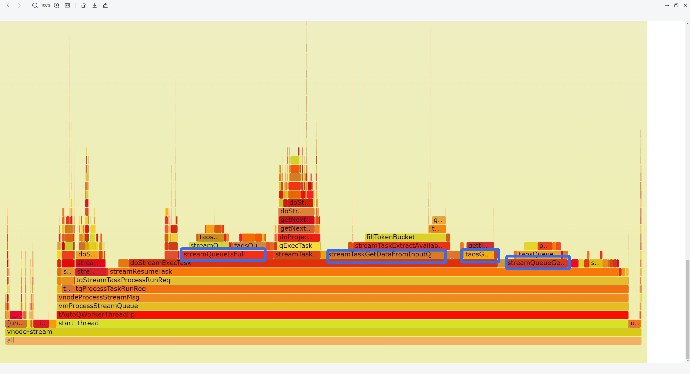

# stream count_window

## 1. 测试目标

参考[流计算：支持 count window](https://taosdata.feishu.cn/wiki/EmmUwNAk5iCzEhkXrP8cL9wPnIc) 文档，对其所支持的测试点及约束设计测试用例。

## 2. 变更历史

| Date | Version | Owner | Memo |
| --- | --- | --- | --- |
| 2024-01-18 | 0.1 | @贾靖斌 | New |
| 2024-02-26 | 0.2 | @贾靖斌 | 第 9 节jira标题统一标签修改为[stream_count_window]，为了区分后面的批处理 count_window |
| 2024-02-27 | 0.3 | @贾靖斌 | 1. 标题全中文； 1. 测试结论前移到第4个标题 |

## 3. 测试范围

本次测试会将[流计算：支持 count window](https://taosdata.feishu.cn/wiki/EmmUwNAk5iCzEhkXrP8cL9wPnIc) 文档其所涵盖的测试点和历史功能模块做尽可能多的组合测试，功能测试通过后会对重点功能组合进行大数据量稳定性测试，性能方面初步计划以其他窗口（如interval）的计算性能做一个对比，以充分保证质量及性能。
- 功能
  - 3 种 trigger_mode 的组合测试（at_once、window_close、max_delay）
  - watermark 测试
  - subtable 组合测试
  - fill 组合测试
  - existed stable 组合测试
  - custom tag 组合测试
  - disorder、update、delete 测试
  - snode 测试
  - checkpoint 测试
  - stream-tasks 状态测试
  - 重启测试
  - pause/resume 测试
  - no partition 测试
  - partition by tbname/column/tag/expression 测试
  - sliding_val 测试
  - 约束情况测试（watermark/ignore_expired=0 等情况）
- 性能
  - 在窗口数量和总数据量相同时，对比 interval 和 count_window 的计算性能
- 稳定性
  - 组合 count_window + at_once + watermark + subtable + existed_stable + custom_tag + snode + checkpoint + pause + resume + restart + partition by tbname + disorder + update + delete 进行长稳测试

## 4. 测试结论

1. 基本功能全部通过验证，所有功能性 bug 已修复；
2. 性能上和 interval 对比，资源占用相当，vgroups=10时，count_window 流的 latency 大约比 interval 高一倍，主要原因是流计算线程不足，设置 vgroups=40 后，流的 latency 降至毫秒级别，各项结果均相当；
3. 稳定性目前最高测试 100 亿数据，测试通过，遗留一个内存优化 [TD-28864](https://jira.taosdata.com:18080/browse/TD-28864)；

## 5. 已知问题和限制

目前仅参考 [流计算：支持 count window](https://taosdata.feishu.cn/wiki/EmmUwNAk5iCzEhkXrP8cL9wPnIc) 文档中的约束场景

## 6. 测试环境

- OS：Ubuntu 20.04.2 LTS
- Env：

| **硬件环境** | **IP** | 用途 | **CPU** | **内存** | **硬盘** |
| --- | --- | --- | --- | --- | --- |
| 192.168.1.53 | taosBenchmark |
| 192.168.1.55 | taosd |
| 192.168.1.56 | taosd |
| 192.168.1.57 | taosd |

## 7. 测试数据

**性能：**

| - |
| --- |
| **type** | **tinyint** | **binary(16)** | **int** | **float** |
| **count** | 1 | 1 | 1 | 2 |

| **vgroups** | **thread_count** | **batch** | **interlace_row** | **table_count** | **row_count** | **checkpoint_interval** |
| --- | --- | --- | --- | --- | --- | --- |
| 40 | 40 | 1000 | 4 | 10000 | 10000 | 360 |

**稳定性：**

| - | **tag** | **column** |
| --- | --- | --- |
| **type** | **int** | **int** |
| **count** | 1 | 2 |

| **vgroups** | **thread_count** | **batch** | **interlace_row** | **table_count** | **row_count** | **wal_retention_period** | **checkpoint_interval** |
| --- | --- | --- | --- | --- | --- | --- | --- |
| 40 | 40 | 1000 | 400 | 10000 | 1000000 | 172800 | 360 |

## 8. 测试用例

### 8.1 功能

**测试脚本：**
taostest --setup=common_insert.yaml --case=stream_computing/stream_computing_test.py --keep
| No. | 测试场景组合（1级） | 测试场景组合（n级） | 测试步骤 | 期望结果 | 实际结果 | 是否是基础场景 |
| --- | --- | --- | --- | --- | --- | --- |
| 1 | count_window + at_once | + no partition | 基础步骤：
1.写历史数据；
2.建流；
3.继续写数据；
4.校验结果； | 流和批结果相同 | pass | 是 |
| 2 |  | + partition by tbname | 建流使用 partition by tbname | 流和批结果相同 | pass | 是 |
| 3 |  | + partition by column | 建流使用 partition by column | 流和批结果相同 | pass |  |
| 4 |  | + partition by tag | 建流使用 partition by tag | 流和批结果相同 | pass |  |
| 5 |  | + partition by expression | 建流使用 partition by expression | 流和批结果相同 | pass |  |
| 6 |  | + delete | 写入过程中覆盖删除 | 流和批结果相同/不同 | pass |  |
| 7 |  | + update | 写入过程中覆盖更新 | 流和批结果相同/不同 | pass |  |
| 8 |  | + disorder | 写入过程中覆盖乱序 | 流和批结果相同/不同 | pass |  |
| 9 |  | + ignore_expired | 乱序超过watermark | 流和批结果不同 | pass |  |
| 10 |  | + ignore_expired | 乱序不超过watermark | 流和批结果相同 | pass |  |
| 11 |  | + ignore_update | 建流语句覆盖 ignore_update = 0/1 | 流和批结果相同/不同 | pass |  |
| 12 |  | + existed_stable | 建流语句覆盖已存在超级表 | 流和批结果相同 | pass |  |
| 13 |  | + custom_tag | 建流语句覆盖自定义 tag | 流和批结果相同 | pass |  |
| 14 |  | + fill_history | 建流语句覆盖 fill_history = 0/1 | 流和批结果相同 | pass | 是 |
| 15 |  | + watermark | 建流语句覆盖 watermark | at_once 模式窗口实时关闭 | pass |  |
| 16 |  | + snode | 全过程覆盖 snode | 不影响计算、无crash | pass |  |
| 17 |  | + checkpoint | 存在用例触发 checkpoint | 不影响计算、无crash | pass |  |
| 18 |  | + sliding_val | 建流语句覆盖 sliding_val | 流和批结果相同 | pass |  |
| 19 | count_window + window_close | + no partition | trigger at_once->window_close | 流比批少 endts-watermark 条 | pass | 是 |
| 20 |  | + partition by tbname | 建流使用 partition by tbname | 流比批少 endts-watermark 条 | pass | 是 |
| 21 |  | + delete | 写入过程中覆盖删除 | 流比批少 endts-watermark 条 | pass |  |
| 22 |  | + update | 写入过程中覆盖更新 | 流比批少 endts-watermark 条 | pass |  |
| 23 |  | + disorder | 写入过程中覆盖乱序 | 流比批少 endts-watermark 条 | pass |  |
| 24 |  | + ignore_expired | 乱序不超过watermark | 流比批少 endts-watermark 条 | pass |  |
| 25 |  | + watermark | 建流语句覆盖 watermark | 流比批少 endts-watermark 条 | pass |  |
| 26 |  | + snode | 全过程覆盖 snode | 流比批少 endts-watermark 条 | pass |  |
| 27 |  | + checkpoint | 存在用例触发 checkpoint | 流比批少 endts-watermark 条 | pass |  |
| 28 |  | + sliding_val | 建流语句覆盖 sliding_val | 流比批少 endts-watermark 条 | pass |  |
| 29 | count_window + max_delay | + no partition | trigger at_once->max_delay | max_delay 后流和批结果相同 | pass | 是 |
| 30 |  | + partition by tbname | 建流使用 partition by tbname | max_delay 后流和批结果相同 | pass | 是 |
| 31 |  | + delete | 写入过程中覆盖删除 | max_delay 后流和批结果相同 | pass |  |
| 32 |  | + update | 写入过程中覆盖更新 | max_delay 后流和批结果相同 | pass |  |
| 33 |  | + disorder | 写入过程中覆盖乱序 | max_delay 后流和批结果相同 | pass |  |
| 34 |  | + ignore_expired | 乱序不超过watermark | max_delay 后流和批结果相同 | pass |  |
| 35 |  | + watermark | 建流语句覆盖 watermark | max_delay 后流和批结果相同 | pass |  |
| 36 |  | + snode | 全过程覆盖 snode | max_delay 后流和批结果相同 | pass |  |
| 37 |  | + checkpoint | 存在用例触发 checkpoint | max_delay 后流和批结果相同 | pass |  |
| 38 |  | + sliding_val | 建流语句覆盖 sliding_val | max_delay 后流和批结果相同 | pass |  |
| 39 | abnormal | ignore_expired = 0 | 建流时设置 ignore_expired = 0 | 报错 | pass |  |
| 40 |  | watermark = 0 | 建流时设置 watermark = 0 | 报错 | pass |  |
| 41 |  | count_val < 2 | 建流时设置 count_val < 2 | 报错 | pass |  |
| 42 |  | source=stable 时没有 partition by tbname | 建流时如果 source=stable 不设置 partition by tbname | 报错 | pass |  |
| 43 |  | fill | 建流时设置 fill(*) | 报错 | pass |  |

### 8.2 可靠性

**测试脚本：**

> ⚠ 嵌入文件，需在飞书中查看 (token: NpI8bIj1AocTbdxzMTWcKCc4nOd)

> ⚠ 嵌入文件，需在飞书中查看 (token: K8McbUkvooQYgkxf2XccXAAynOh)

**测试策略：**
覆盖尽可能多的功能进行长期稳定性测试：
- 组合 count_window + window_close + watermark + subtable + existed_stable + custom_tag + snode + checkpoint + pause + resume + restart + partition by tbname + disorder + update + delete 进行长稳测试
**建流语句：**
CREATE STREAM IF NOT EXISTS stream_stability TRIGGER at_once WATERMARK 30000s IGNORE UPDATE 0 IGNORE EXPIRED 1 FILL_HISTORY 0 INTO stream_test.output_streamtb (ts,c1,c2,c3) TAGS(t1) SUBTABLE(concat(tbname, "suffix")) as select _wstart as wstart, min(c1),max(c2), count(c3)  from stream_test.stb partition by cast(t1 as int) t1,tbname count_window(10000)
<callout emoji="bulb" background-color="light-orange" border-color="light-orange">
**小结：无 crash 和丢数据情况，但发现内存持续上涨和大幅波动情况，已提交优化任务**
</callout>

### 8.3 性能

**测试脚本：**
taostest --setup=Performance/1dnode_rep1_5357.yaml --case=Performance/stream_computing/stream_computing_perftest.py --keep
**测试策略：**
在窗口数量和总数据量相同时，对比 interval 和 count_window 的计算性能
**建流语句：**
create stream if not exists perf_stream trigger at_once watermark 300s ignore expired 0 ignore update 0  into perf_db1.output_streamtb   as select _wstart as wstart, min(c1),max(c2), sum(c0), avg(c0), count(c3), first(c0), last(c1), tbname, now from perf_db1.stb partition by tbname interval(10s) ;
create stream if not exists perf_stream trigger at_once watermark 300s ignore expired 1 ignore update 0  into perf_db1.output_streamtb   as select _wstart as wstart, min(c1),max(c2), sum(c0), avg(c0), count(c3), first(c0), last(c1), tbname, now from perf_db1.stb partition by tbname count_window(10000) ;

| vgroups | window | QPS(rows/s) | InsertLatency(ms) | StreamLatency(ms) | CPU(%)(avg) | CPU(%)(p95) | MEM(M) | NET(kb/s) | DISK(%) |
| --- | --- | --- | --- | --- | --- | --- | --- | --- | --- |
| Interval | 1221913 | 31 | 8253 | 1704 | 2220 | 5076 | 503144 | 10 |
| count_window | 1229639 | 30 | 186541 | 1707 | 2188 | 5019 | 507731 | 11 |
| Interval | 577070 | 68 | 200 | 2583 | 3635 | 8181 | 253649 | 6 |
| count_window | 581132 | 67 | 237 | 2693 | 3711 | 8941 | 255360 | 6 |

<callout emoji="bulb" background-color="light-orange" border-color="light-orange">
**小结：vgroups = 10 时流计算资源不足，下图红框标识的几个线程占用 cpu 资源较多，vgroups = 40时计算性能恢复正常，但 40 核（P95）基本满载**
</callout>

## 9. Jira

此feature相关的所有Jira, 标题中应包含统一的标签: stream_count_window
| [TD-28864](https://jira.taosdata.com:18080/browse/TD-28864) | [[stream_count_window] count_window 稳定性测试 rocksdb 内存优化](https://jira.taosdata.com:18080/browse/TD-28864) | NEW |
| --- | --- | --- |
| [TD-28863](https://jira.taosdata.com:18080/browse/TD-28863) | [[stream_count_window] count_window 稳定性测试 bloomfilter 内存优化](https://jira.taosdata.com:18080/browse/TD-28863) | DONE |
| [TD-28840](https://jira.taosdata.com:18080/browse/TD-28840) | [[stream_count_window] count_window 性能优化](https://jira.taosdata.com:18080/browse/TD-28840) | DONE |
| [TD-28858](https://jira.taosdata.com:18080/browse/TD-28858) | [[stream_count_window] count_window + 已存在超级表 + fill_history流批结果不符](https://jira.taosdata.com:18080/browse/TD-28858) | DONE |
| [TD-28827](https://jira.taosdata.com:18080/browse/TD-28827) | [[stream_count_window] count_window 稳定性测试，fill_history=1时stream-status卡halt](https://jira.taosdata.com:18080/browse/TD-28827) | DONE |
| [TD-28826](https://jira.taosdata.com:18080/browse/TD-28826) | [[stream_count_window] count_window 稳定性测试，结果不对](https://jira.taosdata.com:18080/browse/TD-28826) | DONE |
| [TD-28819](https://jira.taosdata.com:18080/browse/TD-28819) | [[stream_count_window] count_window + max_delay + update 流结果计算错误](https://jira.taosdata.com:18080/browse/TD-28819) | DONE |
| [TD-28813](https://jira.taosdata.com:18080/browse/TD-28813) | [[stream_count_window] count_window + max_delay 第二批写入数据后流批结果不符](https://jira.taosdata.com:18080/browse/TD-28813) | DONE |
| [TD-28811](https://jira.taosdata.com:18080/browse/TD-28811) | [[stream_count_window] count_window + window_close + partition by tbname,c1 普通表的流结果不对](https://jira.taosdata.com:18080/browse/TD-28811) | DONE |
| [TD-28788](https://jira.taosdata.com:18080/browse/TD-28788) | [[stream_count_window] count_window 稳定性测试，疑似计算卡住](https://jira.taosdata.com:18080/browse/TD-28788) | DONE |
| [TD-28760](https://jira.taosdata.com:18080/browse/TD-28760) | [[stream_count_window] count_window + sliding 普通表的流结果不对](https://jira.taosdata.com:18080/browse/TD-28760) | DONE |
| [TD-28739](https://jira.taosdata.com:18080/browse/TD-28739) | [[stream_count_window] count_window + partition by tbname, abs(c1) + delete流少一条](https://jira.taosdata.com:18080/browse/TD-28739) | DONE |
| [TD-28708](https://jira.taosdata.com:18080/browse/TD-28708) | [[stream_count_window] count_window + fill_history 部分结果计算错误](https://jira.taosdata.com:18080/browse/TD-28708) | DONE |
| [TD-28696](https://jira.taosdata.com:18080/browse/TD-28696) | [[stream_count_window] count_window delete watermark范围内的数据后，流少一条](https://jira.taosdata.com:18080/browse/TD-28696) | DONE |
| [TD-28685](https://jira.taosdata.com:18080/browse/TD-28685) | [[stream_count_window]count_window + partition by abs(column) + disorder 流批结果不一致](https://jira.taosdata.com:18080/browse/TD-28685) | DONE |
| [TD-28680](https://jira.taosdata.com:18080/browse/TD-28680) | [[stream_count_window]count_window + partition by column,tbname + disorder 流结果少一条](https://jira.taosdata.com:18080/browse/TD-28680) | DONE |
| [TD-28560](https://jira.taosdata.com:18080/browse/TD-28560) | [[stream_count_window]count_window+checkpoint 重启后继续写入，流批结果不一致](https://jira.taosdata.com:18080/browse/TD-28560) | DONE |
| [TD-28557](https://jira.taosdata.com:18080/browse/TD-28557) | [[stream_count_window]count_window+watermark+disorder 流结果不对](https://jira.taosdata.com:18080/browse/TD-28557) | DONE |

## 10. 参考文档 

- [流计算：支持 count window](https://taosdata.feishu.cn/wiki/EmmUwNAk5iCzEhkXrP8cL9wPnIc)
