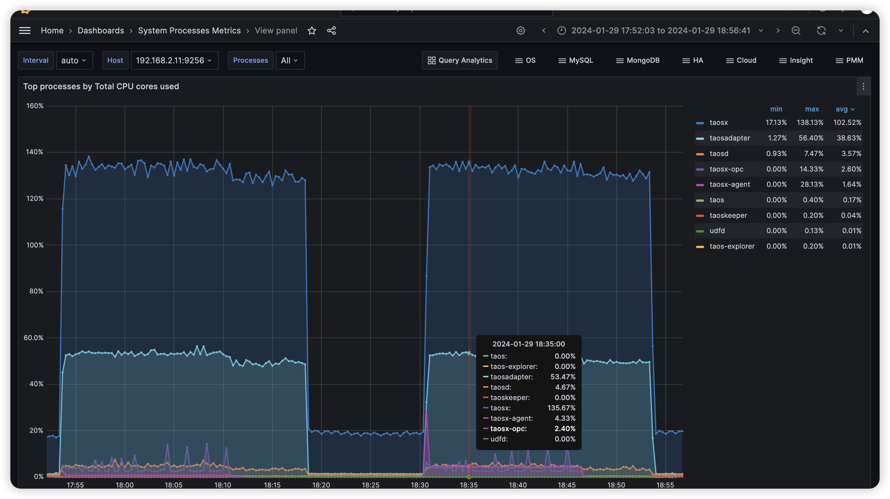
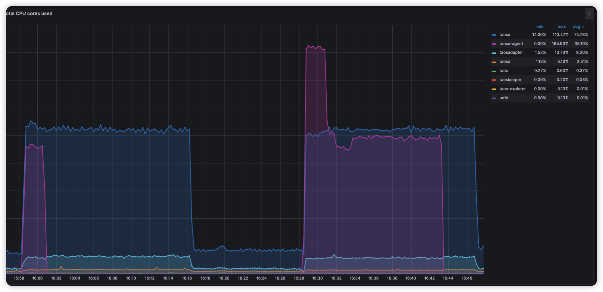

# Data Compression Test Design Spec

## 1. Objectives

- 测试开启数据压缩功能后，agent 与 taosX 之间的传输的数据能够被压缩
- 测试数据压缩比能够达到预期值 75%
- 测试开启数据压缩后，对性能的影响

## 2. Revision History

| Date | Version | Owner | Memo |
| --- | --- | --- | --- |
| 2024.01.18 | 0.1 | @王旭 | Initial Draft |
|  |  |  |  |

## 3. 测试结论

测试通过，在带宽有限的条件下，通过修改 agent 的配置文件开启数据压缩功能后，可以显著地减少在 agent 和 taosX 之间传输的数据量。
taosX 内部数据处理方式主要有 3 种 (flat, lush, point)，测试中针对每种处理方式，选取了一个典型的数据源测试它们的压缩率：
- OPC (point): 86.5%
- InfluxDB (lush): 93.7%
- Kafka (flat): 75.0%
Agent 的 CPU 占用率方面，对于 OPC 任务，其影响基本可以忽略不计；对于Kafka 任务，在任务的初始阶段，开启、不开启数据压缩，CPU 会 double, 但在任务稳定后，CPU 占用率和未开启压缩时没有显著变化。

## 4. Scope

- 数据压缩功能只适用于使用 agent 的场景
- 数据压缩功能对数据源的类型是透明的，因此不需要覆盖所有任务类型，根据 taosX 对不同类型数据源处理方式的不同，本次测试选用以下三种数据源类型：OPC, InfluxDB, Kafka.
- 测试中，需要计算不同场景下的数据压缩比，其计算公式为：(Original Size - Compressed Size) / Original Size * 100%

## 5. Limitations and Known Issues

- 目前不支持压缩算法的配置，默认采用 gzip 算法
- 当使用新版本的 agent 连接老版本的 taosX （1.4.0 及以前）时，不支持数据压缩

## 6. Environment

- Linux
- Windows

## 7. Test Data

以下为各数据源的测试数据，包括数据类型和每种数据类型的数量，以及测试中通过抓包计算出的，网络中传输的数据量大小。
| Type | Data | Original Size | Compressed Size | Compression Ratio |
| --- | --- | --- | --- | --- |
| OPC |  | 38471564 | 5199102 | 86.5% |
| InfluxDB |  | 515714851 | 32415025 | 93.7% |
| Kafka |  | 1491658726 | 373506815 | 75.0% |

### 7.1 OPC

```bash
desc stb_int;
             field              |          type          |   length    |    note    |
=====================================================================================
 ts                             | TIMESTAMP              |           8 |            |
 quality                        | INT                    |           4 |            |
 val                            | INT                    |           4 |            |
 point_id                       | VARCHAR                |         256 | TAG        |
 point_name                     | VARCHAR                |         256 | TAG        |
 name                           | INT                    |           4 | TAG        |
Query OK, 6 row(s) in set (0.001209s)

desc stb_float;
             field              |          type          |   length    |    note    |
=====================================================================================
 ts                             | TIMESTAMP              |           8 |            |
 quality                        | INT                    |           4 |            |
 val                            | FLOAT                  |           4 |            |
 point_id                       | VARCHAR                |         256 | TAG        |
 point_name                     | VARCHAR                |         256 | TAG        |
 name                           | INT                    |           4 | TAG        |
Query OK, 6 row(s) in set (0.001239s)
```

### 7.2 InfluxDB

```bash
taos> desc meters;
             field              |          type          |   length    |        note        |
=============================================================================================
 time                           | TIMESTAMP              |           8 |                    |
 intValue2                      | DOUBLE                 |           8 |                    |
 intValue3                      | DOUBLE                 |           8 |                    |
 intValue4                      | DOUBLE                 |           8 |                    |
 intValue5                      | DOUBLE                 |           8 |                    |
 intValue6                      | DOUBLE                 |           8 |                    |
 intValue7                      | DOUBLE                 |           8 |                    |
 intValue8                      | DOUBLE                 |           8 |                    |
 current4                       | DOUBLE                 |           8 |                    |
 string7                        | VARCHAR                |         256 |                    |
 current3                       | DOUBLE                 |           8 |                    |
 string8                        | VARCHAR                |         256 |                    |
 current2                       | DOUBLE                 |           8 |                    |
 string5                        | VARCHAR                |         256 |                    |
 current1                       | DOUBLE                 |           8 |                    |
 string6                        | VARCHAR                |         256 |                    |
 current8                       | DOUBLE                 |           8 |                    |
 string3                        | VARCHAR                |         256 |                    |
 current7                       | DOUBLE                 |           8 |                    |
 string4                        | VARCHAR                |         256 |                    |
 current6                       | DOUBLE                 |           8 |                    |
 string1                        | VARCHAR                |         256 |                    |
 current5                       | DOUBLE                 |           8 |                    |
 string2                        | VARCHAR                |         256 |                    |
 intValue1                      | DOUBLE                 |           8 |                    |
 groupid                        | VARCHAR                |         256 | TAG                |
 location                       | VARCHAR                |         256 | TAG                |
Query OK, 27 row(s) in set (0.001928s)
```

### 7.3 Kafka

```bash
taos> desc kafkastb;
             field              |          type          |   length    |        note        |
=============================================================================================
 ts                             | TIMESTAMP              |           8 |                    |
 col1                           | INT                    |           4 |                    |
 col2                           | INT                    |           4 |                    |
 col3                           | INT                    |           4 |                    |
 col4                           | INT                    |           4 |                    |
 col5                           | INT                    |           4 |                    |
 col6                           | INT                    |           4 |                    |
 col7                           | INT                    |           4 |                    |
 col8                           | INT                    |           4 |                    |
 col9                           | INT                    |           4 |                    |
 col10                          | INT                    |           4 |                    |
 groupid                        | INT                    |           4 | TAG                |
Query OK, 12 row(s) in set (0.001511s)
```

## 8. Test Cases

### 8.1 Functional

在提测时，开发应保证 basic 类型的用例全部通过。
| Type | Description | Expectation | Status | Memo |
| --- | --- | --- | --- | --- |
| basic | 在 agent.toml 中，无 compression 配置项 | 默认为 false, 不开启数据压缩 | Pass |  |
|  | 在 agent.toml 中，配置 compression = false | 不开启数据压缩 | Pass |  |
|  | 在 agent.toml 中，配置 compression = true | 开启压缩 | Pass |  |
| installer | Windows: 安装后，agent.toml 中应包含对 compression 配置项的说明 |  | Pass | agent.toml 中的默认配置为 compression = false |
|  | Linux: 安装后，agent.toml 中应包含对 compression 配置项的说明 |  | Pass |  |
| negative configuration | 在 agent.toml 中，配置 compression 为不为 true, false 的值，例如：compression = enabled | agent 启动失败，提示配置错误 | Pass |  |
| compression ratio | 测试 OPC 的数据压缩比 |  | Pass |  |
|  | 测试 InfluxDB 的数据压缩比 |  | Pass |  |
|  | 测试 Kafka 的数据压缩比 |  | Pass |  |

### 8.2 Usability

n/a

### 8.3 Reliability

开启压缩后，创建一个 OPC UA 任务，并执行 24 小时，预期数据同步正常，且 CPU, memory 保持稳定。

### 8.4 Performance

对于每种数据源类型，采用同样的测试数据，分别开启和不开启数据压缩时，测试数据同步的性能，进行对比。

#### 8.4.1 OPC



#### 8.4.2 InfluxDB

#### 8.4.3 Kafka

以下是 Kafka 数据源，不开启和开启数据压缩，taosX/agent 的 CPU 占用率对比：


### 8.5 Security

n/a

### 8.6 Compatibility

使用上一个大版本，进行兼容性测试。
| Agent | agent.toml | taosX | Expectation | Status | Memo |
| --- | --- | --- | --- | --- | --- |
| 1.5.0 | compression=true | 1.4.0 | agent 正常启动，但通过此 agent 创建的任务不能正常执行 | Pass | 日志中打印： Content is compressed with `gzip` which isn't supported |
| 1.5.0 | compression=false | 1.4.0 | 不开启压缩 | Pass |  |
| 1.4.0 | compression=true | 1.5.0 | agent 正常启动，不开启压缩 | Pass |  |
| 1.4.0 | compression=false | 1.5.0 | agent 正常启动，不开启压缩 | Pass |  |

### 8.7 Localization

n/a

## 9. Questions

- 在 agent.toml 中，compression 配置的取值 true, false, 是否严格区分大小写？
  - 严格区分大小写，只能为小写的 true/false, 其它值报错，无法启动。

## 10. Jira

此feature相关的所有Jira, 标题中应包含统一的标签: compression

TD-28585

## 11. Schedule

## 12. Notes

在测试中，在运行 agent 的服务器上，使用 tcpdump 抓取 agent 与 taosX 之间的数据包，命令如下：
```bash
tcpdump -i ens160 dst host 192.168.2.11 and dst port 6055 > file.pcap
```

在 tcpdump 抓取的文件中，其最后一列为 TCP payload 的 length, 例如：
```bash
14:21:00.823738 IP u2-10.37528 > 192.168.2.11.6055: Flags [P.], seq 2030396148:2030396165, ack 4205302576, win 8084, options [nop,nop,TS val 2019824353 ecr 3336835425], length 17
14:21:00.824726 IP u2-10.37528 > 192.168.2.11.6055: Flags [.], ack 18, win 8084, options [nop,nop,TS val 2019824354 ecr 3336848428], length 0
14:21:01.116215 IP u2-10.32918 > 192.168.2.11.6055: Flags [P.], seq 1919938164:1919939188, ack 1135012506, win 501, options [nop,nop,TS val 2019824645 ecr 3336847737], length 1024
14:21:01.116243 IP u2-10.32918 > 192.168.2.11.6055: Flags [P.], seq 1024:8264, ack 1, win 501, options [nop,nop,TS val 2019824645 ecr 3336847737], length 7240
14:21:01.116255 IP u2-10.32918 > 192.168.2.11.6055: Flags [P.], seq 8264:8844, ack 1, win 501, options [nop,nop,TS val 2019824645 ecr 3336847737], length 580
14:21:01.121735 IP u2-10.32918 > 192.168.2.11.6055: Flags [.], ack 54, win 501, options [nop,nop,TS val 2019824651 ecr 3336848725], length 0
14:21:02.116355 IP u2-10.32918 > 192.168.2.11.6055: Flags [P.], seq 8844:9868, ack 54, win 501, options [nop,nop,TS val 2019825645 ecr 3336848725], length 1024
14:21:02.116388 IP u2-10.32918 > 192.168.2.11.6055: Flags [P.], seq 9868:17108, ack 54, win 501, options [nop,nop,TS val 2019825645 ecr 3336848725], length 7240
14:21:02.116399 IP u2-10.32918 > 192.168.2.11.6055: Flags [P.], seq 17108:17708, ack 54, win 501, options [nop,nop,TS val 2019825645 ecr 3336848725], length 600
14:21:02.138330 IP u2-10.32918 > 192.168.2.11.6055: Flags [.], ack 107, win 501, options [nop,nop,TS val 2019825667 ecr 3336849741], length 0
```

通过 awk 可以统计抓取的 TCP 包总大小，命令如下：
```bash
awk '{ sum += $NF } END { print sum }' file.pcap
```

在 OPC 数据源的测试中，由于数据是无界的，在测试中对固定周期内的数据进行抓取，然后进行对比。例如：先开启数据压缩功能，抓取 10 分钟的数据，然后再关闭数据压缩功能，抓取 10 分钟的数据，再将压缩和未压缩的总数据量进行对比。通过 timeout 命令，可以控制 tcpdump 的执行时间，命令如下：
```bash
timeout 10m tcpdump -i ens160 dst host 192.168.2.11 and dst port 6055 > file.pcap
```

对于 Kafka/InfluxDB 数据源, 都是同步一批相同的数据，待任务完成(completed)后，统计数据量的大小。

## 13. Reference

- [数据压缩](https://taosdata.feishu.cn/wiki/ZzGKwdzfxiZMehkWiV8cgZkcnXd)
