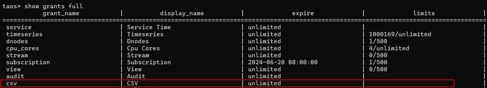

# 连接器授权测试报告

## 1. Objectives

- 验证在 Explorer 中使用一个授权码即可完成授权（老版本中 TDengine 和 连接器使用独立的授权码）
- 验证生成授权码时，配置的授权项及其过期时间和连接数可以生效

## 2. Revision History

| Date | Version | Owner | Memo |
| --- | --- | --- | --- |
| 20240222 | 0.1 | @宋正勤 | Initial draft |
| 20240224 | 0.2 | @王旭 | 补充了基本测试用例和兼容性测试用例 |

## 3. Scope

这里用于描述本需求的覆盖范围：
- 需要回归测试所有的数据源
- 需要覆盖新增的数据源类型 OpenTSDB & Aveva Historian
- 需要覆盖备份与恢复功能
- 需要进行兼容性测试，覆盖企业版  3.2.3.0 之前最新的版本

## 4. 测试结论

1. 数据源任务 (TDengine 2.6, TDengine 3.0, InfluxDB, OpenTSDB, Pi, Kafka, OPC UA, OPC DA, MQTT, Aveva Historian), 数据备份和数据同步，在授权后可以正常工作，其中，授权时指定的数量是按照连接数进行限制的，而非之前所说的任务数，速度的限制目前尚未实现；在授权到期后，对于新建的任务和历史任务，均无法成功提交，错误提示中会包含 license expired 信息；
2. 本次需求，新增了两个数据源的授权支持：OpenTSDB 和 Historian, 测试通过；其它类型的数据源，在以前的版本中，已经支持授权操作，本次测试对以前的数据源进行了回归，测试通过；
3. 数据备份和数据同步，在以前的版本中，是不需要授权的，本次需求，增加对这个两个功能的授权，测试通过；其中，数据同步没有独立的授权项，因为这个功能是通过数据订阅实现的，所以复用了 subscription 功能的授权；
4. 新版本(3.2.3.0)的 taosX/Explorer 可能会与老版本的 TDengine 配合使用，所以需要进行兼容性测试；这种场景下，Explorer 上仍需要展示两个授权码，taosX 需要兼容老的授权信息返回格式，兼容性测试通过。

## 5. Limitations and Known Issues

1. 授权时通过 taosGrant 指定的速度限制，目前 taosX 并没有实现
1. 
  TD-28808

## 6. Environment

- 3.2.3.0 版本的 TDengine 尚未发布，测试时需要使用 3.0 分支的代码编译，目前以下环境的 TDengine 是使用 3.0 分支的代码编译的：
  - 192.168.2.13
  - 192.168.2.14
  - 192.168.1.42

## 7. Test Data (Optional)

n/a

## 8. Test Cases

### 8.1 Functional

在提测时，开发应保证 basic 类型的用例全部通过。
以下测试均使用 3.2.3.0 版本的 TDengine, 和与其配套的 taosGrant
| Type | Purpose | Description | Expected Result | Result | Jira | Memo |
| --- | --- | --- | --- | --- | --- | --- |
| basic | 验证使用一个激活码即可完成激活，激活后信息的展示正常 |  | 所有数据源激活信息正确 | Pass |  |  |
| basic | 验证授权过期后，各数据源新创建的任务无法正常运行，错误提示中应包含连接器过期的信息 | 1. 在授权以后，调整系统时间到授权时间之后
1. 创建各数据源任务 | 新创建的任务无法正常运行，错误提示中应包含连接器过期的信息 | Pass |  |  |
|  | 验证授权过期后，各数据源已存在的任务无法正常运行，错误提示中应包含连接器过期的信息 | 1. 在授权以后，创建各数据源任务并保持任务运行
1. 调整系统时间到授权时间之后 |  | Pass | [TD-28807](https://jira.taosdata.com:18080/browse/TD-28807) |  |
|  | 验证可对授权进行部分更新 | 1. 生成 3 各数据源的授权
1. 更新前两个数据源的过期时间和连接数 | 只有前两个数据源的授权被更新，第三个保持不变 | Pass | [TD-28808](https://jira.taosdata.com:18080/browse/TD-28808) | [TD-28812](https://jira.taosdata.com:18080/browse/TD-28812) |
|  | 验证激活时对各连接器的连接数限制可以生效 |  |  | Pass | [TD-28809](https://jira.taosdata.com:18080/browse/TD-28809) |  |
|  | 验证对新增的数据源的支持 OpenTSDB, Historian |  |  | Pass |  |  |
|  | 验证对新增的数据源的支持 __future_datain__ | __future_datain__ 需要在 Explorer 的 license 页面过滤 |  | Pass |  |  |
|  | 修改配置文件中，csv 配置项的过期时间，验证其对 csv 数据源是否生效 |  |  | Pass | [TD-28805](https://jira.taosdata.com:18080/browse/TD-28805) | taosX 的 CSV 文件导入功能不需要授权，CSV 授权项指的是通过 taos shell 从 CSV 文件中将数据导入 TDengine 的功能 |
|  | 修改配置文件中，backup-restore 配置项的过期时间，验证其对“系统管理-备份”功能是否生效 | 1. 在授权以后，调整系统时间到授权时间之后
1. 创建backup-restore任务 | backup-restore任务应该不能创建，错误提示中包含过期的信息 | Pass |  |  |
|  | 验证安装完成以后，在没有授权的情况下，各数据源有10天的免费授权, 各数据源均能正常使用 |  |  | Pass |  |  |

### 8.2 Usability

n/a

### 8.3 Reliability

n/a

### 8.4 Performance

n/a

### 8.5 Security

n/a

### 8.6 Compatibility

以下提到的各组件，其新、老版本的定义是统一的：
新版本：企业版 3.2.3.0
老版本：企业版 3.2.2.x 及以前
| Type | Purpose | Description | Expected Result | Result | Jira | Memo |
| --- | --- | --- | --- | --- | --- | --- |
| compatibility | 验证 Explorer 的兼容性 | 将新版本的 Explorer 连接到老版本的已授权过的 TDengine, 验证其授权信息可以正常展示 |  | Pass |  |  |
| compatibility | 验证 taosX 的兼容性 | 使用老版本的 taosGrant 生成一个过期的授权，使用新版本的 taosX 无法运行数据源任务 |  | Pass |  |  |
| compatibility |  |  |  |  |  |  |


### 8.7 Localization

n/a

## 9. Questions (Optional)

这里用于记录需要讨论的问题：
- aaa
- bbb

## 10. Jira

此feature相关的所有Jira, 标题中应包含统一的标签: taosGrant

TD-28807


TD-28805


TD-28808


TD-28809


TD-28812


TD-28870


TD-28862


TD-28855


TD-28854


TD-28851


TD-28849

## 11. Schedule (Optional)

这里用于计划此 feature 测试的开始和结束时间。

## 12. Notes (Optional)

修改系统时间命令
```sql
timedatectl set-time "2024-02-23 07:58:00"
```


taosGrant激活细节：
192.168.2.13:/data/ypzhang/taosGrant_linux64.3230
cfg file:
```sql
{
        "key": "263435778534915163",
        "machine": "AwXtAKfCtlmhBIYY66i7P13v",
        "output-file": "/data/out.123",
        "show": "1",
        "official": "1",
        "distribute": "2024-02-23 10:01:00",
        "basic": "2024-12-31,un,10,un",
        "stream": "2024-12-31,8",
        "subscription": "2024-12-31,8",
        "service": "2024-12-31",
        "storage": "2024-12-31",
        "audit": "2024-12-31",
        "csv": "2024-12-31",
        "view": "2024-12-31,8",
        "backup-restore": "2024-12-31",
        "data-in": [
                "OPC_DA,2024-12-31,10,4096",
                "OPC_UA,2024-12-31,10,4096",
                "Pi,2024-12-31,10,4096",
                "Kafka,2024-12-31,10,4096",
                "influxDB,2024-12-31,10,4096",
                "MQTT,2024-12-31,10,4096",
                "avevaHistorian,2024-12-31,10,4096",
                "OpenTSDB,2024-12-31,10,4096",
                "TD2.6,2024-12-31,10,4096",
                "TD3.0,2024-12-31,10,4096"
        ]
}
```


```sql
./taosGrant_linux64.3230 -c /root/zqsong/cfg
```


```sql
taosGrant_linux64.3230 -k 263435778534915163 --data-in OPC_DA,2024-12-31,10,20 --data-in OPC_UA,2024-12-20,11,21
```

## 13. Reference (Optional)

[按功能授权及授权机制优化](https://taosdata.feishu.cn/wiki/OydKwSf1jidC04ki9V2c65NvnKe)

1. CSV连接器不需要授权
2. show grants full 显示的csv是指database engine支持的  insert into table_name file 'csv文件名';

