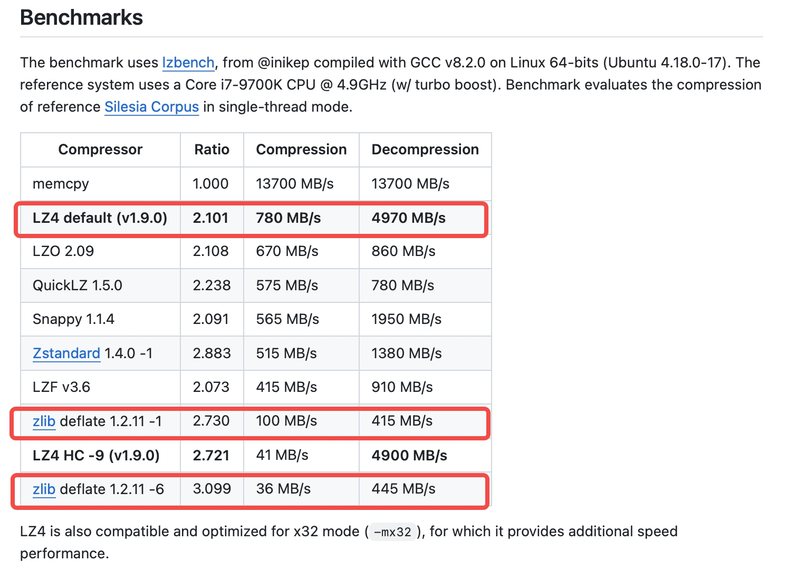

# 需求报告：支持更多压缩算法并提升压缩比

## 1. 需求来源（蔚来汽车）

### 1.1 基本情况

项目在售前阶段，下表是用户评估的拥有成本，对压缩率较敏感。TDengine 三副本占用磁盘 11.6TB，Cassandra 双副本占用磁盘12.4TB。按单副本对比，TDengine 的占用磁盘是 Cassandra 的 62.4%。

|  | 机器费用 | license费用(16个节点) | 存储费用 | 总费用 | 下降费用 | 下降百分比 | 节点数量降为8个，下降百分比 |
| --- | --- | --- | --- | --- | --- | --- | --- |
| Cassandra | 2,043,7 40.16 | - | 7,864, 320 | 9,908, 060.16 |  |  |  |
| 全 SSD 硬盘方 案(社区版) | 1,021,8 70.08 | - | 7,392, 460.8 | 8,414, 330.88 | ⬇1,49 3,729. 28 | ⬇15 .08% | ⬇15.08 % |
| 全高性能云盘 (社区版) | 1,021,8 70.08 | - | 51747 22.56 | 6,196, 592.64 | ⬇3,71 1,467. 52 | ⬇37 .45% | ⬇37.45 % |
| 全 SSD 硬盘方 案 | 1,021,8 70.08 | 150,0 00 * 16 | 7,392, 460.8 | 10,814 ,330.8 8 | ⬆906, 270.72 | ⬆9. 15% | ⬇2.96% |
| 10天 SSD + 83 天高性能云 盘 | 1,021,8 70.08 | 150,0 00 * 16 | 5,413, 188.96 | 8,835, 059.04 | ⬇1,07 3,001. 12 | ⬇10 .82% | ⬇22.94 % |
| 10天 SSD +30 天高性能云盘 + 53 天 cos 标 准存储 | 1,021,8 70.08 | 150,0 00 * 16 | 3,458, 399.76 | 6,880, 269.84 | ⬇3,02 7,790. 32 | ⬇30 .56% | ⬇42.67 % |

### 1.2 原始数据

汽车 CAN 总线数据，每条记录包含多个信号（大于 4096 个），每个信号由一个或者多个比特位组成。用户将记录拆分为 319 个长整型字段，这些字段包含大量空值。获取到了三辆车的真实数据，每辆车有 5000 条记录，从中看到
- 第一辆车：84.6% 的空值
- 第二辆车：92.0% 的空值
- 第三辆车：73.6*%* 的空值
摘取其中的两行数据。（更多数据限于篇幅不在此文档展开）
```sql
'2023-11-26 12:31:17.073','2023-11-26 12:31:25.644','2023-11-26 12:31:25.586','2023-11-26 12:31:25.464','xxxxxxxxx_xxxxxx_xxxxx',1471617148940980000 ,NULL,5787143121949420000 ,NULL,NULL,698902367172559000 ,NULL,NULL,NULL,4454148336710050000 ,1829590656017780000 ,NULL,10403235758080 ,NULL,NULL,NULL,0 ,NULL,NULL,813 ,813 ,NULL,NULL,NULL,NULL,NULL,NULL,NULL,NULL,7310327808 ,1369094385253220000 ,NULL,NULL,NULL,NULL,1007962621989490000 ,1125901338477820 ,NULL,54254336121700300 ,128 ,NULL,NULL,NULL,934511207958711000 ,4268866142208 ,NULL,152764501465300000 ,NULL,7711147948083510000 ,221672352 ,NULL,NULL,NULL,630513570559326000 ,945770354765230000 ,NULL,-7274104826391160000 ,NULL,NULL,NULL,0 ,NULL,NULL,98956046499840 ,3616953640552640000 ,553610606 ,542273001 ,2776 ,6486645813944010000 ,NULL,3013 ,NULL,19705095205683700 ,2537147483725660000 ,2522252186914760000 ,NULL,NULL,NULL,NULL,NULL,NULL,NULL,NULL,NULL,NULL,NULL,NULL,-9222246136947930000 ,NULL,NULL,NULL,3877053921885160000 ,3877616871840670000 ,NULL,4620165417749440000 ,1125899919949820 ,NULL,NULL,NULL,NULL,NULL,NULL,NULL,NULL,NULL,NULL,NULL,NULL,NULL,NULL,NULL,NULL,NULL,NULL,NULL,-9223372035153720000 ,NULL,NULL,NULL,NULL,NULL,NULL,NULL,NULL,NULL,NULL,NULL,NULL,NULL,2449691483827000 ,NULL,NULL,NULL,NULL,NULL,NULL,NULL,NULL,NULL,NULL,NULL,NULL,25336448556816 ,0 ,NULL,NULL,NULL,NULL,378338652582903000 ,NULL,NULL,NULL,NULL,NULL,NULL,NULL,NULL,NULL,NULL,5047583053037110000 ,3 ,NULL,NULL,NULL,NULL,NULL,NULL,NULL,NULL,NULL,NULL,NULL,NULL,NULL,NULL,NULL,NULL,NULL,NULL,NULL,NULL,NULL,0 ,NULL,NULL,NULL,NULL,NULL,NULL,NULL,NULL,NULL,NULL,NULL,NULL,NULL,NULL,NULL,NULL,NULL,NULL,NULL,NULL,NULL,NULL,NULL,NULL,3617002019097940000 ,NULL,NULL,NULL,NULL,NULL,NULL,NULL,NULL,NULL,NULL,433791696896 ,NULL,1024 ,NULL,NULL,NULL,NULL,NULL,NULL,3602879701896390000 ,NULL,NULL,NULL,NULL,NULL,NULL,NULL,NULL,NULL,NULL,NULL,NULL,NULL,NULL,NULL,NULL,NULL,NULL,NULL,NULL,NULL,NULL,NULL,NULL,NULL,NULL,NULL,NULL,NULL,NULL,NULL,NULL,NULL,NULL,NULL,NULL,9009398814998530000 ,NULL,NULL,NULL,NULL,NULL,NULL,NULL,NULL,NULL,NULL,NULL,3693477824535650000 ,NULL,NULL,NULL,NULL,NULL,NULL,NULL,NULL,NULL,NULL,NULL,NULL,NULL,5764607523034230000 ,NULL,0 ,NULL,NULL,0 ,NULL,NULL,0 ,0 ,NULL,NULL,NULL,NULL,NULL,NULL,NULL,NULL,NULL,NULL,NULL,NULL,NULL,NULL,NULL,NULL,NULL,NULL,NULL
'2023-11-26 12:31:17.074','2023-11-26 12:31:25.644','2023-11-26 12:31:25.586','2023-11-26 12:31:25.464','xxxxxxxxx_xxxxxx_xxxxx',NULL,NULL,NULL,NULL,NULL,NULL,1092139548435090000 ,NULL,NULL,NULL,NULL,5628110096262840000 ,NULL,NULL,NULL,NULL,NULL,NULL,NULL,NULL,NULL,5629499534238150000 ,NULL,NULL,NULL,NULL,NULL,NULL,NULL,NULL,NULL,NULL,NULL,NULL,NULL,NULL,NULL,NULL,NULL,NULL,NULL,NULL,3718934385324270000 ,NULL,NULL,NULL,NULL,NULL,NULL,NULL,NULL,NULL,NULL,NULL,NULL,NULL,NULL,NULL,NULL,NULL,NULL,NULL,NULL,NULL,NULL,NULL,NULL,NULL,NULL,NULL,NULL,NULL,NULL,NULL,NULL,NULL,NULL,NULL,NULL,NULL,NULL,NULL,NULL,NULL,NULL,NULL,NULL,NULL,NULL,NULL,NULL,NULL,NULL,NULL,NULL,NULL,NULL,NULL,NULL,NULL,NULL,NULL,NULL,NULL,NULL,NULL,NULL,NULL,NULL,NULL,NULL,NULL,NULL,NULL,NULL,NULL,NULL,NULL,NULL,NULL,NULL,NULL,NULL,NULL,NULL,NULL,NULL,NULL,NULL,NULL,NULL,NULL,NULL,NULL,NULL,NULL,NULL,NULL,NULL,NULL,NULL,NULL,NULL,NULL,NULL,NULL,NULL,NULL,NULL,NULL,NULL,NULL,NULL,NULL,NULL,NULL,NULL,NULL,NULL,NULL,NULL,NULL,NULL,NULL,NULL,NULL,NULL,NULL,NULL,NULL,NULL,NULL,NULL,NULL,NULL,NULL,NULL,NULL,NULL,NULL,NULL,NULL,NULL,NULL,NULL,NULL,NULL,NULL,NULL,NULL,NULL,NULL,NULL,NULL,NULL,NULL,NULL,NULL,NULL,NULL,NULL,NULL,NULL,NULL,NULL,NULL,NULL,NULL,NULL,NULL,NULL,NULL,NULL,NULL,NULL,NULL,NULL,NULL,NULL,NULL,NULL,NULL,NULL,NULL,NULL,NULL,3602879701896390000 ,NULL,NULL,NULL,NULL,NULL,NULL,NULL,NULL,NULL,NULL,NULL,NULL,NULL,NULL,NULL,NULL,NULL,NULL,NULL,NULL,NULL,NULL,NULL,NULL,NULL,NULL,NULL,NULL,NULL,NULL,NULL,NULL,NULL,NULL,NULL,NULL,0 ,NULL,NULL,NULL,NULL,NULL,NULL,NULL,NULL,NULL,NULL,NULL,NULL,NULL,NULL,NULL,NULL,NULL,NULL,NULL,NULL,NULL,NULL,NULL,NULL,NULL,NULL,NULL,NULL,NULL,NULL,NULL,NULL,NULL,NULL,NULL,NULL,NULL,NULL,NULL,NULL,NULL,NULL,NULL,NULL,NULL,NULL,NULL,NULL,NULL,NULL,NULL,NULL,NULL,NULL,NULL
```

### 1.3 数据模型

通过如下 SQL 语句创建超级表，从 CSV 文件导入数据，再查看压缩比
```sql
create database db;
use db;

CREATE STABLE can
(
t1 timestamp,
t2 timestamp,
t3 timestamp,
t4 timestamp,
type binary(50),
c_1 bigint,
c_2 bigint,
c_3 bigint,
c_4 bigint,
c_5 bigint,
c_6 bigint,
c_7 bigint,
……
c_317 bigint,
c_318 bigint,
c_319 bigint
)
TAGS(
id binary(32),
v1 binary(32), 
v2 binary(32)
);

create table t1 using can tags('aaaaaaaaaaaaaaaaaaaaaaaaaaaaaaaa','xxxxxxx','xxxxxxxxxxx');
create table t2 using can tags('bbbbbbbbbbbbbbbbbbbbbbbbbbbbbbbb','xxxxxxx','xxxxxxxxxxx');
create table t3 using can tags('cccccccccccccccccccccccccccccccc',NULL,'xxx_xxxxxx');

insert into t1 file "/root/wl/data_new_1.csv";
insert into t2 file "/root/wl/data_new_2.csv";
insert into t3 file "/root/wl/data_new_3.csv";

flush database db;

show table distributed can \G;
show table distributed t1 \G;
show table distributed t2 \G;
show table distributed t3 \G;
```

### 1.4 默认 lz4 算法的压缩比

在 TDengine 中，NULL 值也进行存储，占用 2 个比特位。

|  | 每个 Block 中记录数目 | 压缩比 |
| --- | --- | --- |
| 第一辆车 | 2500 | 3.48% |
| 第二辆车 | 2500 | 2.72% |
| 第三辆车 | 2500 | 3.82% |
| 三辆车合在一起 | 2500 | 3.34% |

### 1.5 使用 zlib 1.2.11 - 9 代替 lz4 压缩

修改引擎中的 tcompression.c 代码，使用 zlib 1.2.11 版本代替 lz4 压缩算法，其中zlib 采用了最佳压缩比策略。可以看到压缩比从 3.34% 降低到 1.55%，提升了 115%。由于只是做了验证，没有测试对写入和查询的性能影响。

|  | 每个 Block 中记录数目 | 压缩比 |
| --- | --- | --- |
| 第一辆车 | 2500 | 1.47% |
| 第二辆车 | 2500 | 1.19% |
| 第三辆车 | 2500 | 2.00% |
| 三辆车合在一起 | 2500 | 1.55% |

### 1.6 小结

在 https://github.com/lz4/lz4 仓库的帮助文档中，看到 zlib 的压缩比明显高于 lz4，但压缩吞吐量较低。


<quote-container>
在蔚来汽车案例中，现有两个数据库的压缩比如下，还可通过 compact 提高：
数据库 1 ：每个 Block 中平均记录数目 1769，压缩比 4.44%
数据库 2：每个 Block 中平均记录数目 752，压缩比 5.82%
</quote-container>

## 2. 其他调研

在 https://github.com/inikep/lzbench 仓库中，给出了不同压缩算法的对比报告，转成了在线文档以利于排序查阅 （见 [压缩算法排序](https://taosdata.feishu.cn/wiki/H8nvwl3OoiRtXekuVsxc9iPmnG9) ）。

| **Compressor name** | **Compress.** | **Decompress.** | **Compr. size** | **Ratio** |
| --- | --- | --- | --- | --- |
| lzlib 1.11 -9 | 1.82 MB/s | 76 MB/s | 48296889 | 22.79 |
| fastlzma2 1.0.1 -10 | 3.99 MB/s | 105 MB/s | 48666065 | 22.96 |
| lzma 19.00 -9 | 2.66 MB/s | 107 MB/s | 48707450 | 22.98 |
| xz 5.2.4 -9 | 2.62 MB/s | 88 MB/s | 48745306 | 23 |
| fastlzma2 1.0.1 -8 | 5.18 MB/s | 103 MB/s | 49126740 | 23.18 |
| zlib 1.2.11 -9 | 14 MB/s | 404 MB/s | 67644548 | 31.92 |
| brieflz 1.2.0 -1 | 197 MB/s | 431 MB/s | 81138803 | 38.28 |
| density 0.14.2 -3 | 432 MB/s | 529 MB/s | 87649866 | 41.35 |
| quicklz 1.5.0 -1 | 550 MB/s | 715 MB/s | 94720562 | 44.69 |
| lz4 1.9.2 | 737 MB/s | 4448 MB/s | 100880800 | 47.6 |

## 3. 需求

- 提供多种压缩算法，可按压缩比高、中、低的策略，先实现三种算法
- 明确压缩算法的配置级别，例如全局、库、超级表、字段，之前 TSZ 压缩是全局配置，其配置策略也可同时修改
- 明确压缩算法的发布版本：社区版 or 企业版
- 可以考虑在 compact 过程中指定压缩算法，保证实时写入的性能

## 4. 附录

[压缩算法排序](https://taosdata.feishu.cn/wiki/H8nvwl3OoiRtXekuVsxc9iPmnG9) 
[压缩比结果](https://taosdata.feishu.cn/wiki/CYc3w2WmjintrNkuss3cSWI3nte)
