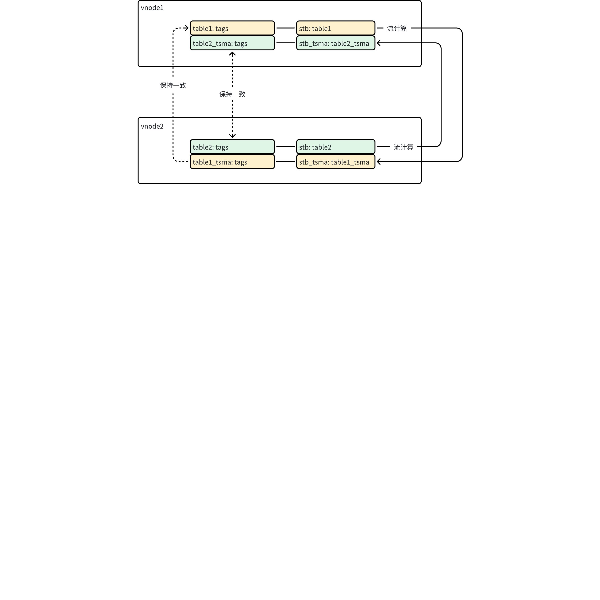

# 需求说明：TSMA

## 1. 引言

### 1.1 术语与缩写名词

| 名词 | 描述 |
| --- | --- |
| TSMA | Time-range Small Materialized Aggregates 根据用户指定的 interval 窗口和函数来进行预聚合计算，同时结果保存在临时表中，可以大大提升窗口查询的速度，适用于高频使用 interval 查询或 interval 查询性能无法满足的场景 |
| 计算进度 | - 方法一：正在计算的 WAL 版本号与最新版本号的差异 - 方法二：正在计算的 WAL 时间与当前系统时间的差异 |

### 1.2 相关文档资料

TSMA 已经完成基础编码，还编写了非常详细的 Function Spec 文档。本文对该功能再做一次分析，提出了几个实用化需求。这些需求如果不被满足，那 TSMA 发布的必要 性大大降低。

| 文档 | 链接 |
| --- | --- |
| Function Spec | [TSMA 功能](https://taosdata.feishu.cn/wiki/WpVfwsKjeilOtckp3U2cIaz0nef) |

### 1.3 优先级要求

预期在二月底的 3.2.3.0 版本正式发布。

### 1.4 版本要求

在社区版支持。

## 2. 需求目标

TSMA 在不明显影响写入、查询性能的前提下，以可接受的数据查询延迟，提高时间窗口查询的性能。通过对现有技术方案进行分析，发现这几个核心诉求未被满足。

| 需求目标 | 重要程度 | 现状 |
| --- | --- | --- |
| 可接受的数据查询延迟 | 重要 | 1. 查询无法获得 TSMA 的计算进度与延迟，对于具体时间窗口，不知道是否该取 TSMA 结果子表的数据 1. 如果计算实时性不高、延迟过大，从用户角度看就是查询结果错误。 |
| 不明显影响写入和查询性能 | 重要 | 1. TSMA 结果子表中只有很少的记录，且经过多次更新，很长时间存储在 stt 文件中，落盘后对应较小的 block 1. TSMA 创建后，轻易产生 5 倍以上的子表数目、时间线数目，膨胀明显 |
| 标签不重复存储且原子性修改 | 中等 | 1. 每个 TSMA 结果子表都对应一个原始数据子表，两者标签信息完全相同 1. 由于它们分布在不同 vnode 中，标签修改动作也难以同时完成 |

## 3. 功能需求

### 3.1 标签需求

采用下图可以清晰看到原始数据表和 TSMA 结果表的标签数据分布。
- 超级表 stb 包含了两个子表，分别为 table1 和 table2
- table1 和 table2 通过流计算分别创建 TSMA 结果子表 table1_tsma 和 table2_tsma，属于超级表 stb_tsma
- table1 和 table1_tsma 分布在 vnode1 和 vnode2 中
- table1 和 table1_tsma 的标签应保持一致，包括标签 schema 定义和标签取值，用以支持 group by tags 查询
但是，仅在流计算为 table1 创建表 table1_tsma 的这一时刻，标签才保持一致
- table1:tags 和 table1_tsma:tags 完全相同，冗余存储，显著降低 tdb 的标签查询性能
- 超级表 stb 标签列的增加、减少、修改，不会同步至 stb_tsma
- table1 标签值的变化，不会同步至 table1_tsma

| 需求编号 | **需求描述** | 研发确认 |
| --- | --- | --- |
| R101 | 超级表的标签操作，包括添加标签、删除标签、修改标签名、修改标签列宽度，需要实时与 TSMA 超级表同步 | 禁止添加/删除标签和修改标签值 |
| R102 | 删除超级表时，对应的 TSMA 超级表也被删除、TSMA 子表也被删除 | 先删除 TSMA 再删除超级表 |
| R103 | 子表的标签取值修改，与对应的 TSMA 子表实时同步，确保 GROUP BY TAG 操作结果一致 | 同 R101 |
| R104 | 删除子表（包括 TTL）时，对应的 TSMA 子表也被删除 | 接受 |
| R105 | 对数据做 compact 时，已经被删除的 TSMA 子表的数据应能从物理上删除 | 接受 |

简单思路：TSMA 结果子表通过类似 Prefix 的方式与原始数据子表创建在同一个 vnode 中，且共享一套标签数据。

### 3.2 查询延迟需求

考虑这样一个场景，用户刚刚创建 TSMA，计算当然不可能在一分钟之内完成，查询立刻使用 TSMA 是不会获得正确数据的，但等待多长时间再使用 TSMA 合适。即便停止写入数据，经过数小时观察流计算已经完成，再次写入数据后，如果产生大量的更新、删除操作，仍然会导致流计算结果再次延迟，此时查询该不该使用 TSMA。流计算延迟的不确定性导致 TSMA 查询延迟也产生了不确定性，即便 TSMA 功能发布，敢用的用户也不多。
考虑计算延迟仅为 1 条 WAL 的情况，如果该 WAL 对应的是历史数据导入、数据更新、数据删除，也会导致任意时间段的数据发生变化。所以，诸如历史查询取 TSMA、较近数据读原始数据，这类执行计划并不有效。

| 需求编号 | **需求描述** | 研发确认 |
| --- | --- | --- |
| R201 | 如果 TSMA 结果输出的延时小于或等于用户可接受阈值（可配置），则查询通过 TSMA 进行；否则通过原始数据进行。 | 接受 |
| R202 | 支持通过 SQL 语句查看 TSMA 的计算状态、计算进度，计算进度以时间延迟表示，查看粒度可为 vgroup | 接受 |

简单思路：在 TSMA 结果表与原始数据表在同一个 vnode 前提下，流计算的计算进度通过时间而不是 WAL 版本号差值计算，客户端识别每个 vnode 的计算进度，据此生成执行计划。

## 4. 性能需求

对于 N 个数据列的超级表，使用默认参数创建 1 个 TSMA，就会增加 4*N 个时间线，子表的数目也增加 1 倍。
- vnode 中的子表、时间线数目越多，性能下降越严重，这是之前多表低频优化要缓解的问题
- TSMA 计算过程中，每个 duration 开始的前几条记录，一旦触发落盘，肯定都在 stt 文件中，且随着流计算的进行，这些记录不断被更新
  - stt 合并量显著增加，可能导致写入性能急剧下降
  - 如常规查询读取 stt 中的原始数据，其性能也会受影响
- TSMA 结果表的数据
  - 1h 的计算窗口，如果 duration 是 1d，那么大量的数据在 stt 文件中
  - 1h 的计算窗口，如果 duration 是 7d，数据文件中每个数据块也只有 168 条记录

| 需求编号 | **需求描述** | 研发确认 |
| --- | --- | --- |
| P101 | 减少不必要的 TSMA 时间线创建，使用 `FUNCTION(max(c1), max(c2), min(c3))` 代替 `~~FUNCTION(avg, count, min, max) COLUMN(c1, c2, c3, c4)~~` | 接受 |
| P102 | 使用 TSMA 后，包括流计算本身产生的 CPU 消耗、可估算的 vnode 内存需求，对硬件要求不应过高（至少不能超过 1 倍），写入、查询性能的下降不应该超过 10% | 接受 |

简单思路：由于 TSMA 结果表在一个 duration 的行列数目是固定的，完全可以不使用 stt、head、data 的存储引擎，重新设计一套独立的文件结构

## 5. 其他需求

| 需求编号 | **需求描述** | 研发确认 |
| --- | --- | --- |
| S101 | 有 TSMA 情况下，需要支持 redistribute、alter replica、split、compact 语法 | 接受，但 split vgroup暂时不支持 |
| S102 | 支持通过 SQL 语句校验 TSMA 计算结果的正确性 | 接受 |
| S103 | 在企业版流计算授权失效的情况下，TSMA 计算暂停 | 接受 |
