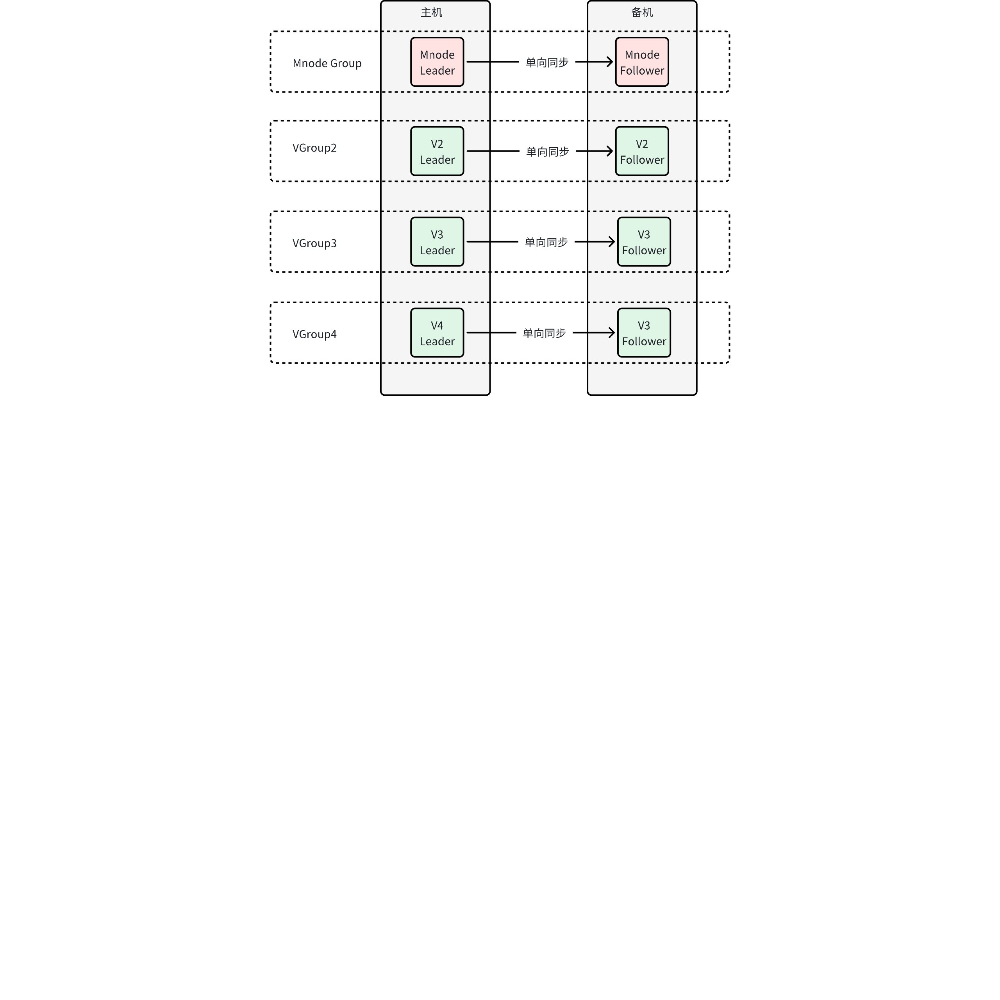

# 需求说明：双副本

## 1. 引言

### 1.1 术语与缩写名词

| 名词 | 描述 |
| --- | --- |
| Arbitrator | 仲裁者 |
| Assigned Leader | 被强制设置为 Leader 的 Vnode，无论其他副本 Vnode 是否存活，均可一直响应用户请求 |

### 1.2 相关文档资料

| 文档日期 | 链接 | 编写人 |
| --- | --- | --- |
| 2023-03-21 | [基于 Arbitrator 的双副本方案](https://taosdata.feishu.cn/wiki/wikcnP61NoQJMbmpJlWIowcDIye) | Wade |
| 2023-03-27 | [TDengine 双活方案 （Obsolete)](https://taosdata.feishu.cn/wiki/wikcng194mzAvLMY2TnRWTXxwpq) | Wade |
| 2023-07-17 | [双副本产品方案选择](https://taosdata.feishu.cn/wiki/DlMVwTUojiYyCNk0M2ScoftwnJg) | Wade |
| 2023-07-27 | [Arbitrator 的双副本设计](https://taosdata.feishu.cn/wiki/OOCDwaac1iCpibk0bBzct5Oan7f) | 陈东明 |
| 2023-09-11 | [Arbitrator 双副本用户手册](https://taosdata.feishu.cn/wiki/KDUsw1VyuiqALxkFJyqcg2D5nkf) | 陈东明 |
| 2023-09-19 | [Arbitrator 模块设计](https://taosdata.feishu.cn/wiki/NX1UwfTeciCtOgkBhI7c8FWMnae) | 陈东明 |
| 2023-10-20 | [基于数据复制和Load Balancer的双活方案](https://taosdata.feishu.cn/wiki/TNhXwPuxJiJQK4kr6gUcZqGSnrc) | Wade |
| 2023-10-26 | [基于 RAFT 协议和 Arbitrator 的双副本解决方案](https://taosdata.feishu.cn/wiki/FPFswxBdsi4zw1kzzECcvuDsnQb) | Wade |
| 2023-10-30 | [双副本方案对比](https://taosdata.feishu.cn/wiki/G7Odw6I8riOz3UkVcyvceEflnvb) | Wade |
| 2023-11-27 | [Raft-Arbitrator 协议设计-方案三](https://taosdata.feishu.cn/wiki/SSjbwBGYvi7mE6kwVUBcKrSYnQf) | 李顺纲 |
| 2023-12-25 | Function Spec [TDengine 双副本](https://taosdata.feishu.cn/wiki/CTSLwLgcLitcGlkAh21cnY1ln0g) | 李顺纲 |
| 2024-02-23 | Function Spec [TDengine 双活 ](https://taosdata.feishu.cn/wiki/E9NmwBfIbiTA5bkq8kScFX0yn8c) | Wade |

### 1.3 优先级要求

预期在四月底的 3.2.4.0 版本正式发布

### 1.4 版本要求

仅在企业版支持

## 2. 需求目标

讨论需求时，要区分主备、双活、双副本的边界范围，更需要确认客户环境所能提供的服务器数目。经过与李广、侯江燚、李珲、肖波的有效沟通，他们作为需求方，要求优先开发客户环境仅有两个节点的场景，且两个节点可以自动切换，不能丢失数据。

| 场景 | 硬件 | 重要性 | 术语解释 | 必要性及客户 |
| --- | --- | --- | --- | --- |
| 双活 | 仅有两个节点 | 优先开发 | 两个独立部署的系统，两者之间存在双向的数据同步 | 1. 工控领域的实时库通常部署两台服务器，按主备模式运行 1. 有至少 10 家用户提出过此类需求，有大约 3 个客户在等待部署 |
| 主备 | 仅有两个节点 | 不再开发 | 主机提供服务、备机不提供服务，主备切换由人工干预 | 1. 必要性与主备方案相同 1. 无法自动切换，运维成本高，需求方不接受 |
| 双副本 | 三个以上节点 | 次优先级 | 集群包含多台服务器，仅仅只是数据副本数目为 2，双副本之间选主不在副本内部决定 | 1. 很多数据存储系统支持双副本，例如 Cassendra 1. 目的是降低 TDengine 的总拥有成本 |

## 3. 功能需求

### 3.1 双活

方案参照 [基于数据复制和Load Balancer的双活方案](https://taosdata.feishu.cn/wiki/TNhXwPuxJiJQK4kr6gUcZqGSnrc)。核心流程如下图，taosX 从 taosd 消费未打过标记的 WAL记录，向另一个 taosd 写入数据时给 WAL 记录打上特殊标记。
<source-synced align="1">

  

</source-synced>

| 需求编号 | **需求描述** | 研发确认 |
| --- | --- | --- |
| R101 | taosX 提供双活运行模式 1. 避免数据复制形成回环 1. 在本地磁盘自动保存同步位置 1. 支持自动重连和永不停止 1. 支持进程守护 | Jeff 确认 |
| R102 | 客户端驱动提供双活运行模式，包括 taos restful driver 和 taosc driver 1. 可设置两个 IP 地址（机器 A、B），访问失败时在两个 IP 地址间重试 1. 重试失败后返回错误 1. 重试成功后更新上次成功的 IP 地址 1. 优先开发 JDBC Restful 连接器 | Jeff 确认 |
| R103 | 由于双向数据同步不能复制已经落盘到 TSDB 文件中的数据，需要优化 WAL 文件保存策略 1. 占用的总磁盘空间可配置（之前的配置项是 WAL 保存时长） 1. WAL 文件需要进行压缩（压缩最近 3 个之外的所有 WAL 文件） | Jeff 确认：此需求优先级较低，本期不开发 |
| R104 | Explorer 能监控本节点部署的 taosX，包括 1. 每个 taosX 的运行状态 1. 每个 taosX 累计同步的数据量 1. 每个 taosX 最近一次数据同步的系统时间、WAL 记录产生时间 | Jeff 确认：不需要监控其他节点的 taosX 服务 |

### 3.2 双副本

双副本 database 需要额外的仲裁服务才能工作。用户可在任意节点上部署 1 到 3 个 Mnode，其中的 Mnode Leader 拉起仲裁服务，如有需要持久化存储的数据，也保存在 Mnode 中。方案关键点：
1. 双副本选主不由 Raft 组内决定，由仲裁服务决定
2. 双副本 Vnode Leader 在 Vnode Follower 离线或者未达成同步时，不需要 Vnode Follower 确认即可写入数据
<source-synced align="1">

  

</source-synced>

| 需求编号 | **需求描述** | 研发确认 |
| --- | --- | --- |
| R201 | 双副本集群的部署方案无任何限制 1. 集群允许有任意数量的节点 1. 集群允许有任意数量的 Mnode 1. 集群内部 database 的副本数目不做任何限制 1. ~~集群内部 database 的副本数目可以随时修改~~ | 与顺纲沟通，因副本数变更并非主要功能且耗时可能较久，暂不开发，仅支持 1-2 的变更。其他需求都满足 |
| R202 | 仲裁服务由 Mnode Leader 所在节点提供，跟随 Leader 迁移，数据持久化在 Mnode 中 1. 仲裁服务仅对双副本 database 起作用 1. 仲裁服务为单个 VGroup 提供服务所需内存低于 10MB，所需 CPU 低于该 VGroup 其他 Vnode 的 10% | 满足 |

### 3.3 主备

TDengine 在集群有且仅有两个节点的情况下，支持以主备模式运行，并通过手动方式切换主备机（参照 PostgreSQL [主备部署流程](https://cloud.tencent.com/developer/article/2013763)）。

由于手动切换，主备模式会有一定时间的停服，在连续切主、且主备数据未同步完成时会丢失数据。应仅在物理机故障时手动切主，taosd 软件自身故障不应切主。
1. 双副本选主不由 Raft 组内决定，由人工设定
2. 双副本 Vnode Leader 在 Vnode Follower 离线或者未达成同步时，不需要 Vnode Follower 确认即可写入数据
3. 存在 Vnode Leader 情况下，如果 Vnode Follower 的版本号更高，需要进行冲突消解，当 WAL 由于已落盘至 TSDB 等原因无法回滚时，可自动清空所有 Vnode Follower 数据重建

| 需求编号 | **需求描述** | 研发确认 |
| --- | --- | --- |
| R301 | 进入主备模式的前提 1. 集群有且仅有两个节点 1. Mnode 为双副本 1. 无 database 或者所有 database 均为双副本 |  |
| R302 | 支持通过 SQL 设定主备机角色 1. 主机上各虚拟节点（Mnode、Vnode）的角色被设定为 Assigned Leader 1. 备机各虚拟节点角色被设定为 Follower 1. 主备机无论经过多少次重启，各虚拟节点的角色始终不变，直到人工更改主备机 |  |
| R303 | 主备切换由人工干预 1. 备机停止运行并再次启动后，会从主机恢复大量数据，为了简化实现，主机可保存 WAL 文件，但 WAL 文件必须进行压缩，且占用的最大磁盘空间可配置 1. 原备机被人工干预才能转为新主机，如果原主机因为停机等原因没收到命令，再次启动后会与新主机通信，并自动转为新备机 1. 原主机转为新备机时，如果存在无法消解的冲突，以新主机数据为标准，清空原主机数据 |  |
