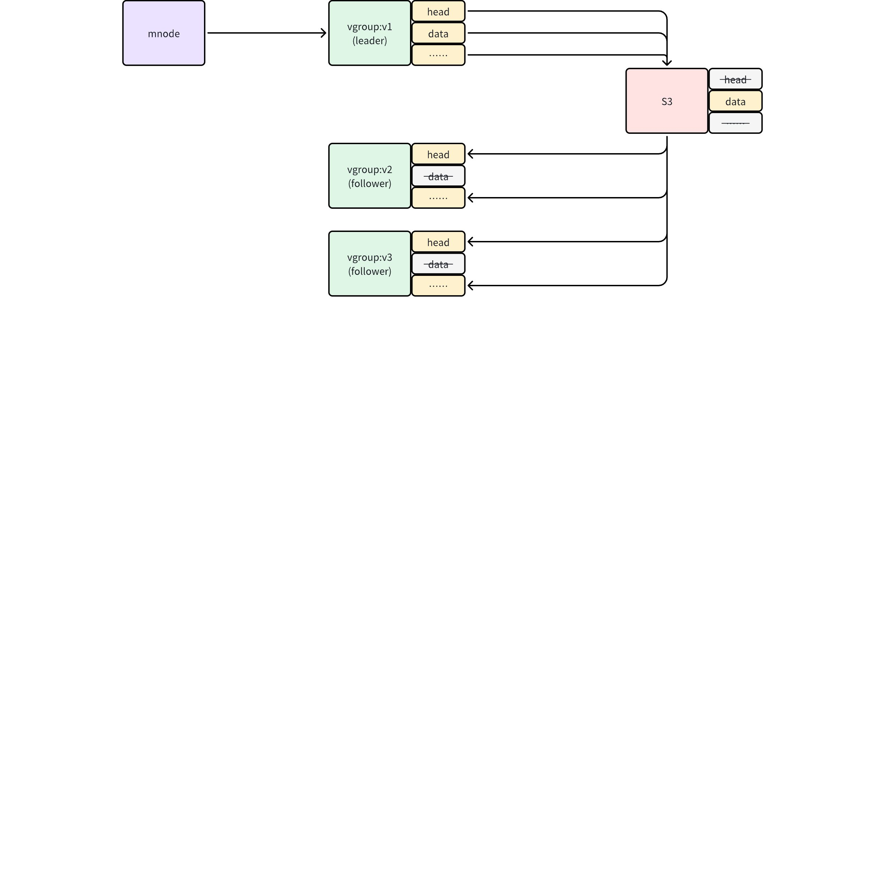
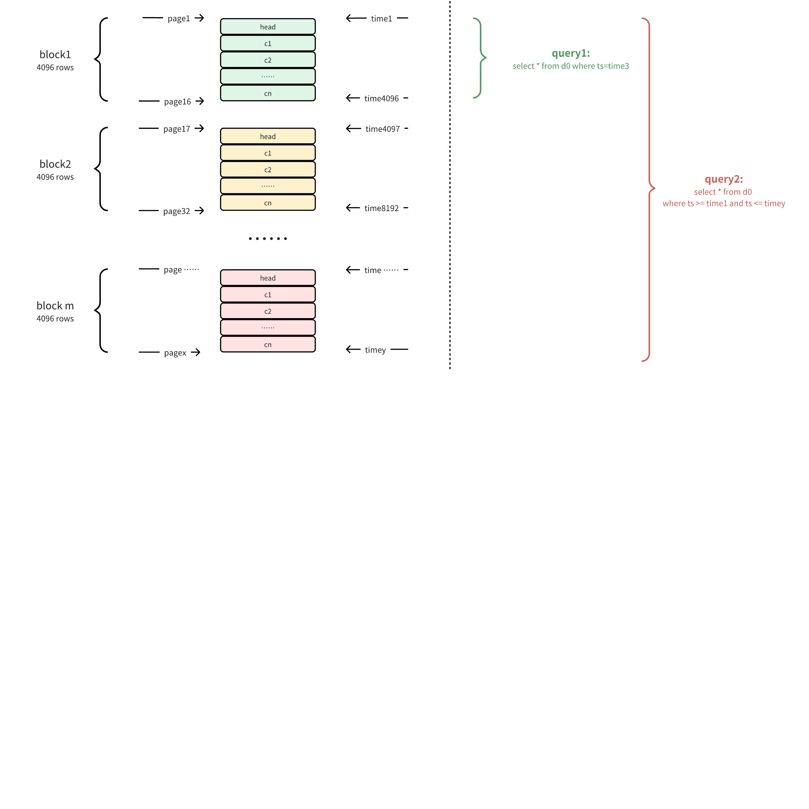

# 需求说明：支持 S3

## 1. 引言

### 1.1 术语与缩写名词

| 名词 | 描述 |
| --- | --- |
| S3 | 可扩展、高可用的分布式存储，存储大量的非结构化数据对象 |
| COS | 腾讯云推出的类 S3 对象存储系统 |
| MinIO | 开源对象存储服务，兼容 S3 云存储服务接口，非常轻量 |
| S3 HTTPS | Amazon CLI 和 SDK 默认使用安全 HTTPS 连接，COS 和 MinIO 也都支持 HTTPS |
| Endpoint | 用户所在地域的 S3 服务地址 |
| Bucket | 桶，类似于 S3 的顶级目录，对象存储在桶中 |
| AccessKey | 访问 S3 的安全密钥，支持更新 |

### 1.2 相关文档资料

| 文档 | 连接 |
| --- | --- |
| [对象存储（腾讯云）](https://taosdata.feishu.cn/wiki/U6mkw54ExiG3ZqkFa60c8424nqe) |
| [S3 对象存储 - 功能规格](https://taosdata.feishu.cn/wiki/JCJkwMhybimdRikjImHcMJtDngc) |
| [S3 对象存储用户手册](https://taosdata.feishu.cn/wiki/OjmwwCmqdiENPckuo4icjb5fnzc) |
| [S3 性能优化 - block cache](https://taosdata.feishu.cn/wiki/QviUwUU1QinlTvk1kCNcGYNmnUg) |
| [s3 block cache 流程简述](https://taosdata.feishu.cn/wiki/QtxAwGDc0i33x4kAr5mcHuhknlh) |
| [s3 配置参数](https://taosdata.feishu.cn/wiki/JEu4wqy6IiAo8qkXCEacG0bhnhe) |
| [Resumable upload](https://taosdata.feishu.cn/docx/KF95dlKl3oVvHfx7Cwycb7D9nxb) |
| [支持 S3 对象存储测试报告](https://taosdata.feishu.cn/wiki/VIlVwWkn1iGndKkWs1PctQJOnzd) |
| [S3 性能测试报告（本地）](https://taosdata.feishu.cn/wiki/XsMrweGXAiAic6k7sH8c58utnfg) |
| [S3 性能测试报告(腾讯云)](https://taosdata.feishu.cn/wiki/NBY1wRKq3iHZjDkZI5lcFMNMn31) |
| [S3-2 性能测试报告(腾讯云) ](https://taosdata.feishu.cn/wiki/XoE4wRAEWicJKJkIzFRciGWsnOf) |
| [[Test Report] S3 优化改进版测试报告](https://taosdata.feishu.cn/wiki/T7bpwsYraiswg4kqO7Xc2lidnEg) |
| [[Test Report] - TD27119 S3 断点续传](https://taosdata.feishu.cn/wiki/NZ6gw7tExiryXYkToFXcLTIanVc) |

### 1.3 优先级要求

需求来自蔚来汽车，用户非常关注数据存储成本，考虑从压缩比提升、支持 S3 两个角度解决问题。压缩比提升功能已经完成调研，列入了 2024 下半年开发计划。支持 S3 功能则在 2023 下半年就已开发且在年底正式发布，本文对已发布功能再做一次技术分析，提出更加贴近用户的需求，这些需求是否实现及优先级待定。
是否能在二月底的 3.2.3.0 版本发布，需要再次确认。

### 1.4 版本要求

仅在企业版支持。

## 2. 需求目标

在与用户交流的基础上，参考历次设计文档、用户手册、测试报告，对关键用户需求进行重要性排序。

| 需求目标 | 重要程度 | 现状 |
| --- | --- | --- |
| 显著降低存储成本 | 重要 | 多副本分别存储一份 S3 数据，成本和上传速度 3x，且需要多个 Bucket |
| 单表小数据量的投影查询响应时间在 1 秒以内 | 重要 | 难以在下载次数、单次下载量间达到平衡，只有少表高频且在 batch 写入模式下，查询性能才可接受 |
| 支持新建数据表的历史数据导入 | 中等 | 不支持数据补录、更新，没有错误码但数据实际丢失 如采取下载 S3 文件到本地的方式可支持补录，但手工操作步骤繁复 |
| 运维简单、减少手工操作、支持扩容 | 中等 | 缺少运维手段，新增/更换 S3、compact 等无法实现 ，不支持 split |

## 3. 功能需求

### 3.1 存储需求

S3 及大多数类 S3 的对象存储系统能够维护数据的多个副本，提供自动的异步数据备份功能。例如 Amazon S3 平均每年对象损失率预计为 0.000000001%，即存储 10,000,000 个对象，则预期平均每 10,000 年发生一次对象丢失。鉴于 S3 存储的数据安全性很高，vgroup 中的各个 vnode 副本应该共享同一套 S3 数据集，意味着用户成本再次降低至三分之一。
尽管各 vnode 副本存储的数据在逻辑上是相同的，但没有机制保证这些数据在物理上（文件内容）是相同的，所以各 vnode 共享一套 S3 数据集有一定难度。仍然建议实现这个特性，这里抛砖引玉提出一个解决思路。

1. 输入待迁移的 vgroup 和时间范围，按规则计算出文件组
2. 禁止 vgroup 该时间范围的数据写入，允许数据读取
3. 清空 vgroup 该时间范围的内存数据，以类似 flush database 的逻辑写到文件组中
4. vnode leader 对文件组进行 compact 操作（依据配置，成为可选步骤）
5. vnode leader 上传文件组中的所有文件至 S3
6. vnode follower 从 S3 下载文件组中除 data 之外的其他文件，包括 head、stt 等到本地，删除本地 data 文件
7. 从 S3 上删除文件组中除 data 之外的其他文件
8. 放开 vgroup 该时间范围的数据写入
迁移过程所需总时间很长，如以 4MB/S 的速度上传，仅 1GB 的数据文件就需要 256 秒，故迁移过程必须支持断点续传，尽可能复用之前完成过的步骤。

| 需求编号 | **需求描述** | 研发确认 |
| --- | --- | --- |
| R101 | vgroup 的各 vnode 副本应该共享同一套 S3 数据集 | 第三期开发，方案待定 <quote-container> 仍按照每个 vnode 对应一个 S3 URL 冗余存储方式处理 </quote-container> |
| R102 | vgroup 迁移过程中，可以禁止该 vgroup 正在迁移时间段的数据写入，但是必需明确拒绝并给出错误码 | 第一期开发 <quote-container> 按冗余存储机制，写入请求和文件修改请求在一个队列中，当前行为是排队，不会出现错误 </quote-container> |
| R103 | vgroup 迁移过程中，要一直允许数据读取 | 第一期开发 <quote-container> 实现数据写入之后，此需求自然被满足 </quote-container> |
| R104 | vgroup 迁移过程中，禁止 split、redistribute、compact、trim、alter replica 等 vgroup 操作 | 第一期开发 <quote-container> 上传请求由 Mnode 协调，并通过事务方式处理，即可避免多个操作同时进行 </quote-container> |
| R105 | vgroup 迁移过程如意外中断，可以再次启动，可继续之前的迁移进度，不会重复进行 flush、compact、上传、下载这样的耗时动作。中断时需要 vgroup 维持特定状态，不会在 taosd 重启后接收数据写入。 - 如因 taosd 重启而中断，重启后可继续迁移 - 如因 S3 断连而中断，间隔一段时间（如一分钟）后重试，重试过程不应长期占用 CPU - 如手动停止迁移，应能自动清理本地和 S3 上的垃圾文件 | 第一期开发 <quote-container> 按冗余存储机制，断点续传功能已经实现，不需要大量改造 </quote-container> |
| R106 | 各时间段的文件，第一次上传之前需要进行 compact，后续的数据上传不再 compact，直到手工执行 compact 命令 | 第一期开发 |
| R107 | 控制上传带宽，避免由于文件上传将下载带宽全部占用，进而阻塞查询 | 第二期开发 |

### 3.2 写入需求

源自江燚的需求，即便 data 文件已经迁移至 S3 中，仍然要支持新建数据表的历史数据导入。在之前的实现中，一个 data 文件对应 S3 中的一个对象，如果要修改 data 文件，必须把 data 文件下载到本地，修改后再上传至 S3。这有两个问题：
- 当 data 文件较大时，下载和上传时间很长
- 整个过程需要手工完成，导致此功能几乎不可使用
在上传 data 文件时，将其拆分为多个大小为 N 的对象，最后一个对象的大小通常不足 N ，用以完成修改操作（N 可取为 128MB）；当 data 文件上传到 S3 之后，有数据写入、删除、更新时，在本地生成 data 文件；tsdb 能够把 S3 和本地的 data 文件在逻辑上当作一个统一的文件处理，数据查询既可以读取本地的 data 文件，也可以读取 S3 上的数据；当再次产生数据迁移动作时，下载 S3 上最后一个大小不足 N 的对象，与本地 data 文件合并，之后重新上传至 S3。

| 需求编号 | **需求描述** | 研发确认 |
| --- | --- | --- |
| R201 | 数据迁移至 S3 后，仍然能够进行数据写入、更新、删除操作，信息记录在本地 data 文件 | 第一期开发 |
| R202 | 数据迁移至 S3 后，能够再次触发迁移，支持本地 data 文件与 S3 上的数据合并 <quote-container> - 迁移过程与 3.1 节相同，但不需要 compact 步骤 - 如何再次触发迁移在 3.4 节中说明 </quote-container> | 第一期开发 |
| R203 | 支持类似 show table distribute 的 SQL 语句，用以查看数据压缩比和总大小 - 可以查看 data 文件在 1/2/3 级的分布、压缩比、大小 - 可以查看 data 文件在本地与 S3 上的分布、压缩比、大小 - 允许以 vgroup、数据库名、时间范围作为参数 | 第二期开发 |

### 3.3 查询需求

在 data 文件上传到 S3 时，支持自动完成 compact 操作，使得同一个数据表的所有数据块在 data 文件中按顺序排列。参考下图，在 data 文件中，表 d0 有 n 个 block，每个 block 包含 4096 条记录，block1 包含时间戳在 [t1, t4096] 范围的记录，以此类推。按照已经实现的 pageCache 缓存策略，分析如下两个查询
- query1: where ts=time3，只查询一条记录，需要读取 [page1, page16] 到本地，只产生一次 S3 数据读取，且没有读取多余的数据
- query2: where ts>=time1 and ts<= timey，查询表的所有记录，需要读取 [page1, pagex] 到本地，产生 m 次 S3 数据读取；但如在查询前能够预先获得待读取的范围，可只进行一次 S3 读取

读取数据到本地之后，存放在 LRU 缓存中。当前 LRU 缓存是基于 vnode 分配和管理的，由于数据表查询是随机进行的，需修改成全局分配，提高内存利用率（例如可全局分配 1GB 内存）。LRU 的锁机制如不能适应全局操作，需要进行修改，甚至可用简单的固定大小内存池代替。在之前的测试结果可以看到，每次与 S3 交互的固定耗时约为 20 毫秒，下载速度为 30-40MB/S，因此默认缓存要超过 40MB。

| 需求编号 | **需求描述** | 研发确认 |
| --- | --- | --- |
| R301 | 读取数据之前精确计算待读取的页范围，并传递到 tsdb 读取函数中，做到 - 对于单个数据表，只读取一次数据 - 对于单个数据表，只在最前、最后两个位置，冗余读取不超过一个 tsdbPageSize 的数据 | 第二期开发 |
| R302 | 修改 S3 数据缓存机制为全局分配，调整配置项 <quote-container> - 和明磊有过沟通，如果确实在原理上有问题，可不实现 </quote-container> | 第二期开发 |

### 3.4 运维需求

在过往文档中看到如下说明，判断出功能真正上线后，交付人员的工作量会很大，对用户也有特别的运维要求。
<quote-container>
- 测试报告 提到
  - 需要等待 24 小时后，会有二级存储的 4 个 data 文件迁移到 S3 服务器
- 功能规格 提到
  - 为避免数据丢失，需要在 data 文件上传之前，flush database 或写入下一个时间段足够的数据，保证当前时间段的数据均已落盘
  - 如果要补写历史数据或进行 compact 操作，需要手动将文件下载到本地之后进行
  - 数据写入，数据文件上传到 S3 后，写入对应文件相关的数据会在 TSDB 落盘的过程中忽略（相当于过期数据），如果存在 stt 文件则不会触发 merge 流程
  - 由于上传功能生效时间较长，配置完成后可以检查下是否正确，也可以在配置前使用 s3cmd, s3fs 等三方工具验证参数是否可用
  - 所有配置均为 dnode 级别，每个 dnode 都需要配置，如果没有配置或配置错误，对应 dnode 的 S3 功能不会生效，数据将存储在多级存储配置的目录
</quote-container>

| 需求编号 | **需求描述** | 研发确认 |
| --- | --- | --- |
| R401 | 支持启停“自动上传”，可指定如下参数 1. 上传动作的触发周期 1. 上传文件的大小阈值 1. 上传至 S3 数据的产生时间 1. 最高上传速度（第二期） | 第一期开发 |
| R402 | 支持通过 SQL 语句手动上传指定的数据库，可指定时间范围 不通过 trim database 语句提供多级存储迁移至 S3 的语义 | 第一期开发 |
| R403 | 支持通过 SQL 语句手动下载指定的数据库，能够指定时间范围 - S3 上的数据与本地 data 文件自动合并 - S3 上的冗余数据将被删除 | 第一期开发 |
| R404 | 支持通过 SQL 语句中断正在进行的“手动上传、手动下载”过程 | 第一期开发 |
| R405 | 提供检查 S3 配置是否正确的 SQL 命令 | 第一期开发 |
| R406 | 同时支持 http 和 https 两种协议 | 已经具备 |
| R407 | 在特定 SQL 语句查询能看到如下信息，用以支持性能分析和优化 - 从 S3 下载数据的次数、每次下载的数据量 - 读取 tsdbPage 的数目，来源统计（包括本地、缓存、S3） | 第二期开发 |
| R408 | 支持 alter replica、redsitribute | 第一期开发 |
| R409 |  | 第二期开发 |
| R410 | 支持 compact 功能（不论上传前、后） | 第一期开发 |
| R411 | ~~支持 S3 Budget 迁移功能~~ |  |

实现以上功能后，可以完成如下操作
1. 未配置 S3 的集群，新增 S3 配置
   - 停止自动上传
   - 检查 S3 配置
   - 启动自动上传
2. S3 数据的 compcat
   - 停止自动上传
   - 下载数据
   - 上传数据（设置自动 compcat）
   - 启动自动上传
3. 不再使用 S3
   - 停止自动上传
   - 下载数据
4. 分裂在 S3 上有数据的 vgroup
   - 停止自动上传
   - 下载数据
   - split  vgroup
   - 上传数据
   - 启动自动上传
5. 用户更新 S3 服务地址
   - 停止自动上传
   - 下载数据
   - 更新 S3 配置
   - 检查 S3 配置
   - 上传数据
   - 启动自动上传
对于 split、compact、迁移 S3 这样的动作，仍需要下载一个时间段、特定 vgroup 的数据到本地磁盘。如果今后对这些动作还有性能方面的要求，再实现不缓存在本地磁盘的方式。

## 4. 性能需求

在功能需求中已涉及

## 5. 其他需求

### 5.1 测试要求

| 需求编号 | **需求描述** | 研发确认 |
| --- | --- | --- |
| S201 | 增加多表、interlace写入场景的测试，例如单 vnode 10,000 个子表，每表 10,000 条记录 |  |
| S202 | 增加数据补录、删除、修改的测试场景 |  |
