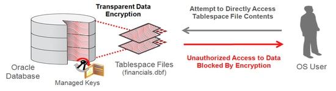
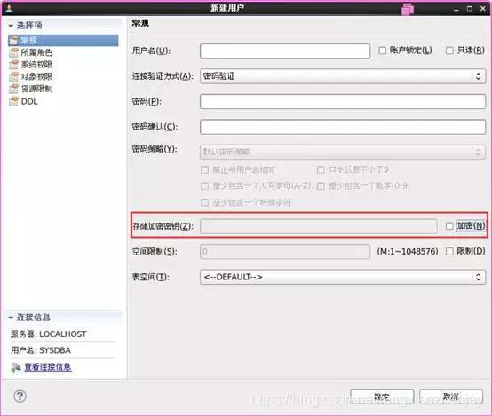
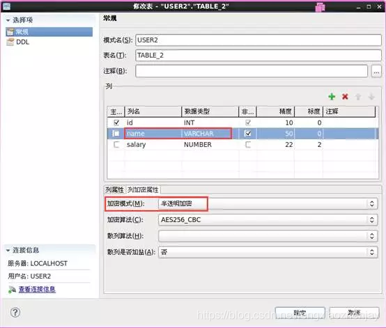
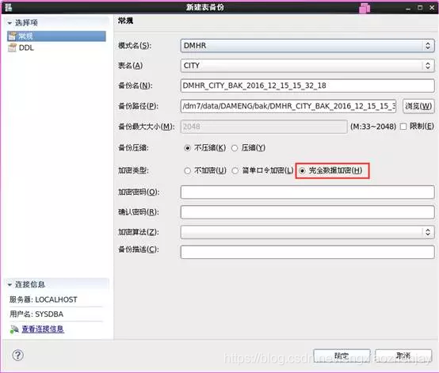

# 简单调研-数据库加密

## 1. 需求来源

如下为部分项目的要求

| 需求来源 | **需求描述** |
| --- | --- |
| 安徽继远软件有限公司数据库技术要求 | **安全 I、II 区关系数据库** 1. 支持基于国产软硬件环境的同态加密功能，支持 OPE、EQ 加密算法； 1. 可加密指定表、指定列及多列加密；支持加密表的增、删、改、查操作； 1. 支持加密列的自身排序及常量值比较； 1. 提供国家级实验室的证明材料。 **安全 I、II 区实时数据库** 1. 无加密要求 |
| 红河烟叶复烤有限公司打叶复烤易地技术改造项目复烤生产运行系统集成招标文件 | **参考品牌：**南大通用 、人大金仓、天津神舟等同档次产品 **技术参数：** 1. 支持访问控制、加密认证、数据库审计、动态数据脱敏等安全特性，提供全方位端到端的数据安全保护 1. 保证数据在处理和传输全过程的安全性，不仅要对关键的信息进行加密保存，同时支持对重要数据在传送和存储过程中进行加密保护 |
| 某视频安全网关 | 支持国密加密算法，其中包括 SM2/SM3/SM4 等加密算法，保证安全加密的同事，也保证产品的自主可信、可控 |
| 国家外汇中心招标要求 | 支持针对某字段做 SM 加密 |
| 中煤陕西榆林能源化工有限公司化工分公司智能化巡检系统扩建项目 | 平台系统具备数据本地、数据加密和防篡改的功能 |
| 北京铁牛科技 | 支持传输加密，可采用 open SSL，可配置。部分用户需要加密。 |
| 中核控制-核动力院项目 | 数据加密存储 |
| 中车研究院-边云协同服务支持 | 传输时的数据加密 |
| 美智光电 | 数据安全隐私非常重要，是内部需要审核的一个环节，希望可以提供数据库加密的服务 |

## 2. 相关产品

从上一节可以看到，大多数公司需要数据库加密，但不会提出明确的数据库加密要求。因此，对市面上主流数据库的加密功能进行调研，形成如下表格。

| 数据库 | 加密对象 | 加密算法 | 密钥管理 | 作用级别 |
| --- | --- | --- | --- | --- |
| Oracle | 1. 数据文件 1. Redo/Undo文件 1. SGA 缓冲区数据 | 1. AES128 1. AES192 1. AES256 1. 3DES168 | 两级密钥结构 1. 主密钥：外部（Wallet） 1. 数据加密密钥：系统库 | 1. 表空间 1. 列 |
| SQL Server | 1. 数据文件 1. 日志文件 | 1. AES128 1. AES192 1. AES256 1. 3DES | 三级密钥结构 1. 服务主密钥：外部 1. 数据库主密钥：系统库 1. 数据加密密钥：用户库 | 1. 库 |
| PostgreSQl | 1. 数据文件 | 1. AES |  | 1. 集群 |
| MySQL | 1. 表空间 1. Double Write 文件 1. Redo/Undo文件 | 1. AES 1. 3DES | 两级密钥结构 1. 主密钥：外部 1. 表空间密钥：文件头 | 1. 表空间 1. 库 1. 表 |
| 阿里云 RDS | 1. 表空间 1. Double Write 文件 1. Redo/Undo文件 | 1. AES_256_CBC 1. AES_128_ECB | 密钥管理服务（KMS） | 1. 表空间 1. 库 1. 表 |
| 翰高数据库 | 1. 数据文件 1. WAL 日志 1. Init 文件 1. Fsm 文件 1. …… | 1. aes-128 1. aes-192 1. aes-256 1. sm4 1. Blowfish 1. Des 1. 3des 1. cast5 | 1. LDAP服务器 1. 本地 1. 专用加密服务器 | 1. 表空间 1. 库 1. 表 1. 列 |
| 达梦数据库 | 1. 数据文件 1. 日志文件 1. 数据文件中的磁盘块 | 约 30 种 | 本地 | 1. 表空间 1. 库 1. 表 1. 列 |

## 3. 加密功能

### 3.1 透明加密

在透明加密中，密钥生成、密钥管理和加解密过程由数据库管理系统自动完成，用户不可见。[Oracle Advanced Security](https://www.oracle.com/technetwork/cn/database/options/advanced-security/index-098149-zhs.html?ssSourceSiteId=otnen) 透明数据加密 (TDE) 通过在数据库层执行静止数据加密，阻止可能的攻击者绕过数据库直接从存储读取敏感信息。经过数据库身份验证的应用和用户可以继续透明地访问应用数据（不需要更改应用代码或配置），而尝试读取表空间文件中的敏感数据的 OS 用户以及尝试读取磁盘或备份信息的不法之徒将不允许访问明文数据。




现成的 TDE 将提供行业标准的强数据库加密、全密钥生命周期管理以及对 Oracle Database 工具和技术的一体化支持。TDE 允许对数据库列或整个应用表空间进行加密。其高速的加密操作对大多数应用的性能开销可忽略不计。双层加密密钥架构可简化密钥管理、明确分离密钥与加密数据并提供辅助密钥轮换 — 而不需要重新加密数据。可以使用 Oracle Enterprise Manager 中的 Web 控制台或者使用命令行来管理密钥库。此外，TDE 还直接集成了一些常用的 Oracle Database 工具和技术，包括 Oracle Advanced Compression、自动存储管理 (ASM)、Recovery Manager (RMAN)、Data Pump 和 GoldenGate 等。在 Oracle 集成系统中，TDE 可通过 Intel®AES-NI 和 Oracle SPARC T 系列处理器提供的硬件加密加速获得性能提升。Exadata 智能扫描进一步增强了 TDE，可以快速、并行地解密多个存储单元，此外还可通过 Exadata 混合列压缩 (EHCC) 减少所执行的加密和解密操作总数。
透明数据加密完全支持 Oracle Multitenant。当移动包含加密数据的可插拔数据库 (PDB) 时，该 PDB 的 TDE 主密钥将与加密数据分开传输，从而确保在传输过程中实现适当的安全隔离。插入并配置 PDB 之后，TDE 加密恢复正常运行。

### 3.2 半透明加密

以达梦数据库为例：在建表时对加密列使用半透明加密模式（MANUAL），加密口令即为创建用户时设置的半透明加密口令。用户可以调用系统函数来设置、获取会话的加密口令，当会话的加密口令与半透明加密口令一致时，才可以看到明文。因此，设置为半透明加密的用户可以看到自己插入的数据，而其他用户是看不到的。


创建用户USER1、USER2，并对这些用户授权，使其拥有对表的操作权限。以USER1身份登录数据库服务器，创建一张表T1，建立三个列，选中“部门”列设置列加密属性。分别通过USER1、 USER2用户向表T1各插入一条数据，USER1、USER2只能看到自己插入的数据，彼此的数据互为不可见密文。


### 3.3 非透明加密

以达梦数据库为例：在读写数据时调用系统加密函数直接对数据进行加解密，通过对用户提供加解密接口实现，该过程需要用户自主完成。用户在使用非透明加密时，需要提供密钥并调用加解密接口。**采用非透明加密可以保证个人私密数据不被包括DBA 在内的其他人获取**。
非透明加密通过用户调用存储加密函数来进行， DM 提供了一系列的存储加密函数，还提供了一个数据加密包 DBMS_OBFUSCATION_TOOLKIT。本节主要介绍 DM 的存储加密函数。
例如：
创建一个表并插入数据
```sql {wrap}
create table test (id int,name varchar2(20),sex char(4),ID_CARD char(18),addr VARCHAR2(100),phone char(11),passwd varchar(100));
insert into test values(10001,'曹展羽','23','4202811997********','湖北省武汉市洪山区','1311703****','czy123456');
update test set passwd=CFALGORITHMSENCRYPT(TEST.passwd, 514, 'miwen');
update test set passwd=CFALGORITHMSDECRYPT(TEST.passwd, 514, 'miwen');
```

### 3.4 备份加密

以达梦数据库为例：在创建备份的时候，如果勾选“完全数据加密”选项，备份文件就会被加密，使用文本编辑器打开备份文件，查看到的数据都为密文。

