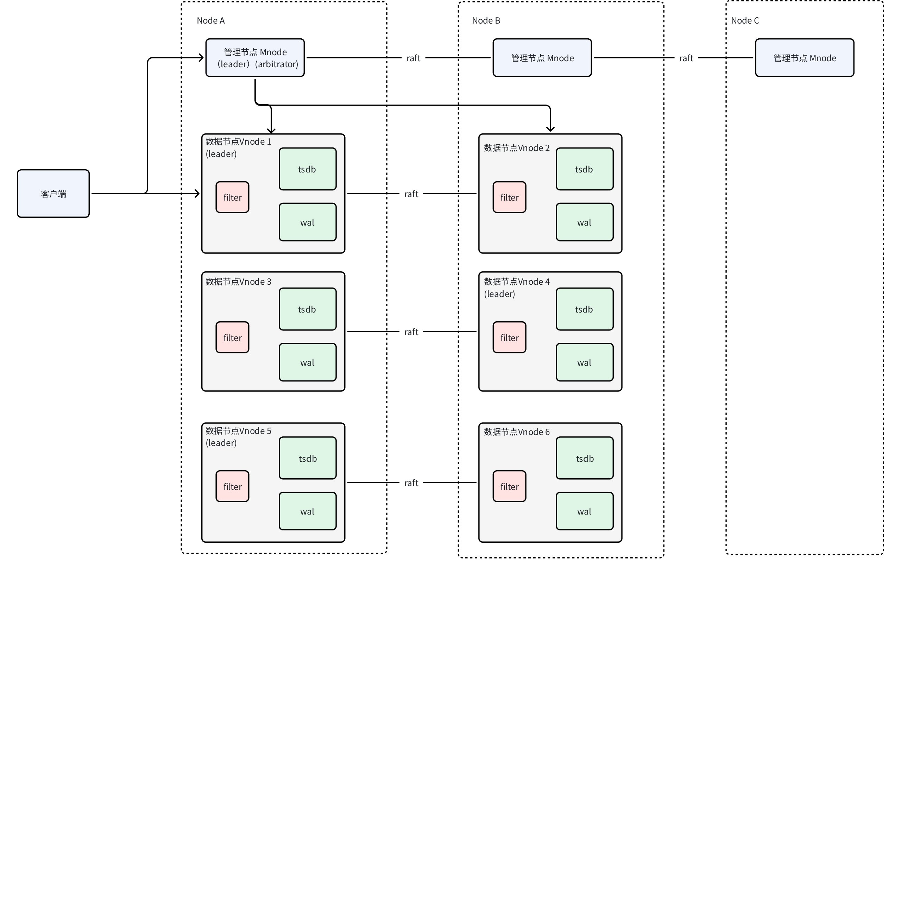

# TDengine 双副本

## 1. 背景

TD-25880

部分客户期望在保证一定可靠性、可用性条件下，尽可能压缩部署成本。为此我们提出基于 Arbitrator 的双副本方案。该方案可提供集群中 **只有单个****服务****故障且不出现****连续故障 **的容错能力。

## 2. 变更历史

| 日期 | 版本 | 负责人 | 内容 |
| --- | --- | --- | --- |
| 2024/1/9 | 0.1 | 李顺纲 | 初稿 |
| 2024/1/12 | 0.2 | 李顺纲 | 基于 Wade 的意见修改 |
| 2024/1/15 | 0.3 | 李顺纲 | 基于 Wade 的意见修改 |
| 2024/1/25 | 0.4 | 李顺纲 | 基于 Wade 的意见修改 |
| 2024/1/29 | 1.0 | 李顺纲 | 基于 Wade 的意见修改 |
| 2024/1/31 | 2.0 | 李顺纲 | Arbitrator 成为 Mnode 子功能 |

## 3. 定义

### 3.1 Arbitrator

Arbitrator 在双副本架构起到仲裁者的角色。
1. Vgroup 因某一 Vnode 故障而无法提供服务时，Arbitrator 可 根据同步情况指定同组另一 Vnode 成为 Assigned Leader。
2. 成为 Asssigned Leader 的 Vnode **无需与另一副本达成一致**，可独自对外提供服务。

### 3.2 Assigned_Leader

Vnode 的一种特殊身份。
1. 由 Arbitrator 服务指定产生。
2. 成为 Assigned Leader 的 Vnode 拥有 Leader 全部功能，且在另一 Vnode 故障情况下仍可响应用户请求。

### 3.3 达成同步

描述 Vgroup （中两个 Vnode） 的 Log 一致性。
1. 若写入请求 可在 Vgroup 上**达成一致**，根据 Raft 协议，此时双副本 Vgroup 上全部 Log 一致。我们称此时该 Vgroup **达成同步**

## 4. 行为说明

### 4.1 服务关系

<reference-synced source-block-id="Hj8WdaEgJsK7RCbESuIcUmMSnJd" source-document-id="UGxMdVBekoXFlNxy9LZcglPanke">

  

</reference-synced>

1. Arbitrator 是 Mnode 子功能模块。
2. 仅 Mnode Leader 的 Arbitrator 功能处于激活状态。
3. 一个 Arbitrator 可以同时管理所在集群中多个 Vgroup。

### 4.2 基本功能

1. 可创建关联 Arbitrator 的双副本数据库
2. 单副本数据库可以变更为双副本数据库
3. 除上条外，暂不支持 双副本与其他副本数 相互变更

### 4.3 集群部署

建议创建**不少于 3 Dnode 节点**的集群，并**设置 Mnode 为三副本**。此为已经具备的成熟功能，具体操作请参考官网文档，不再赘述。

### 4.4 创建数据库

#### 4.4.1 创建副本数为 2 的 database 

```sql
CREATE DATABASE {db_name} REPLICA 2;
```

SQL 说明：
1. 创建的 Vgroup 副本数为 2，双副本 Vgroup 会自动关联 Arbitrator

### 4.5 状态展示

#### 4.5.1 展示 Arbitrator 关联 Vgroup

```sql
SHOW ARBGROUPS;
```

```sql
            db_name             |  vgroup_id  | v1_dnode | v2_dnode | is_sync | assigned_dnode |         assigned_token         |
=================================================================================================================================
 db                             |           2 |        1 |        2 |       0 |              1 | d1#g2#1708651388354#804        |
 db                             |           3 |        1 |        3 |       1 | NULL           | NULL                               |
Query OK, 2 row(s) in set (0.019621s)
```

SQL 说明：
`isSync` 该 Vgroup 是否达成同步（Arbitrator 视角）。1 为 已达成同步，0 为 未达成同步

#### 4.5.2 展示 Vgroup

```sql
SHOW {db_name}.VGROUPS;
```

```sql
taos> show db.vgroups
  vgroup_id  |            db_name             |   tables    | v1_dnode |  v1_status  | v2_dnode |  v2_status  | v3_dnode |  v3_status  | v4_dnode |  v4_status  |  cacheload  | cacheelements | tsma |
======================================================================================================================================================================================================
           2 | db                             |           0 |        1 | assigned    |        2 | offline     | NULL     | NULL        | NULL     | NULL        |           0 |             0 |    0 |
           3 | db                             |           0 |        1 | follower    |        3 | leader      | NULL     | NULL        | NULL     | NULL        |           0 |             0 |    0 |
Query OK, 2 row(s) in set (0.028043s)
```


### 4.6 单副本变更为双副本

#### 4.6.1 首先创建单副本数据库

```sql
CREATE DATABASE {db_name} REPLICA 1;
```

#### 4.6.2 调整 database 副本数为 2

```sql
ALTER DATABASE {db_name} REPLICA 2;
```

SQL 说明：
1. 创建的 Vgroup 副本数为 2，且关联 Arbitrator
2. 单副本数据库可以变更为双副本数据库，但双副本库无法变更为单副本数据库

### 4.7 参数说明

| 参数 | 范围 | 默认值 | 功能 |
| --- | --- | --- | --- |
| arbHeartBeatIntervalSec | [1,60*24*2] | 5 | heart beat 间隔 |
| arbCheckSyncIntervalSec | [1,60*24*2] | 10 | check sync 间隔 |
| arbSetAssignedTimeoutSec | [1,60*24*2] | 50 | vnode 心跳超时时间 |

## 5. 可处理的故障场景

### 5.1 仅一个 Vnode 故障

已经达成同步后，仅一个 Vnode 服务故障的场景

| 阶段 | 描述 |
| --- | --- |
| 故障感知 | Arbitrator 感知 某一 Vnode 持续无法响应请求 |
| 故障处理 | Arbitrator 将另一 Vnode 设置为 Assigned Leader。Assigned Leader 可继续响应请求 |
| 故障恢复 | 1. 故障 Vnode 重新上线后，Assigned Leader 自动为其恢复数据 1. 在 Vgroup 达成同步后，Assigned Leader 自动切换至 Leader 身份 |

### 5.2 Arbitrator 故障

Arbitrator 故障的场景

| 阶段 | 描述 |
| --- | --- |
| 故障感知 | Arbitrator 所在 Mnode 节点发生故障 |
| 故障处理 | Mnode 触发重新选举，Arbitrator 随 Mnode Leader 一同迁移至其他节点 |
| 故障恢复 | Arbitrator 继续提供服务 |

## 6. 不可处理的故障场景

### 6.1 单 Vnode 连续故障

因故障或其他原因未达成同步，此时某一 Vnode 发生故障的场景

| 条件一 | 条件二 | 表现 |
| --- | --- | --- |
| 某一 Vnode 故障后未上线，或上线后该 Vgroup 尚未达成同步时 | 另一 Vnode 发生故障 | 无法响应读写请求 |

### 6.2 多 Vnode 故障

同组两个 Vnode 同时故障的场景

| 条件 | 表现 |
| --- | --- |
| 两个 Vnode 同时故障 | 无法响应读写请求 |

## 7. 性能

1. 双副本 写入、查询 等性能不应低于 一般三副本
2. Arbitrator 资源占用

  | 资源类型 | 说明 |
| --- | --- |
| cpu | 平均使用率不应高于一般 Vnode 的 10% |
| 内存 | 随 关联的 Vgroup 数量增长，每个 Vgroup 占用不超过 10M |
| 磁盘 | 仅保存 管理信息，空间占用一般不大于 10M |
| 网络 | 仅定期消息，网络需求低 |

## 8. 兼容性

对现有的单副本数据库和三副本数据库的创建和使用无影响。

## 9. 运维

参考 [状态展示](https://taosdata.feishu.cn/wiki/CTSLwLgcLitcGlkAh21cnY1ln0g#JUgfdzgcboQNhPxWHTXcqrKAnLd) 部分

## 10. 使用场景

请优先考虑常规三副本方案。相较常规三副本方案，双副本方案适用于**部署成本敏感****，数据可靠性、可用性要求相对不高**的场景。

### 10.1 包含低性能节点集群

尤其如 两个高性能节点 与 一个极低性能节点 组成的小型集群。建议组合 “[其他相关功能](https://taosdata.feishu.cn/wiki/CTSLwLgcLitcGlkAh21cnY1ln0g#Cz3Odq2Xmo3i6fxFHETc8tZlnSb)”** **中提及的两项功能使用，以减少 极低性能节点 可能承担的负载。

### 10.2 常规集群

与常规三副本使用无区别，但双副本可靠性、可用性相对较弱。

## 11. 约束和限制

1. 仅允许**企业版**创建 副本数为 2 的 Database
2. 暂不支持对 双副本 Database 相关 Vgroup 进行 Split 或 Redistribute

## 12. 常见错误和排查

<callout emoji="exclamation" background-color="light-orange" border-color="light-orange">
**FAQ: **
1. **通常在什么状态下 crash 一个节点可以选出 Assigned Leader？**
在 `SHOW ARBGROUPS` 列出的结果中，各组 `is_sync` 均为 1，`assigned_dnode` 为 NULL，`assigned_token` 为 NULL
1. **常见的无法选出 Assigned Leader 的场景？**
在故障节点（node2）恢复数据过程中，未故障节点（node1）发生故障。由于 node2 未完成恢复、数据不完整，不可被选为 Assigned Leader。且 node1 处于故障状态，故 Vgroup 无法对外提供服务。
</callout>

## 13. 其他相关功能

1. ~~禁止 Vnode 分配至 某 ~~~~Dnode 节点~~~~（待实现）。~~可通过设置 supportVnodes 为 0，以禁止在某 Dnode 上创建 Vnode
2. 提供 Mnode 选举权重等机制，~~消除/~~减少 某 Dnode 节点上 Mnode 成为 Leader 的可能性（待实现）

## 14. 参考文档

[基于 RAFT 协议和 Arbitrator 的双副本解决方案](https://taosdata.feishu.cn/wiki/FPFswxBdsi4zw1kzzECcvuDsnQb) 
[Raft-Arbitrator 协议设计-方案三](https://taosdata.feishu.cn/wiki/SSjbwBGYvi7mE6kwVUBcKrSYnQf) 
[需求说明：双副本](https://taosdata.feishu.cn/wiki/SZFwwRR36ib9oTkOnTccDLBxnvb) 

## 15. 状态变更示意

<grid cols="2">
  <column width="50">
    <add-ons component-id="" component-type-id="blk_631fefbbae02400430b8f9f4" record="{"data":"---\ntitle: Vgroup state diagram (follower crash)\n---\nstateDiagram-v2\n    init --\u003e leader,follower\n    leader,follower --\u003e leader,offline: follower crash\n    leader,offline --\u003e assigned,offline: arb assign\n    assigned,offline --\u003e assigned,follower: vnode restart\n    assigned,follower --\u003e leader,follower: vgroup resync\n\n","theme":"default","view":"chart"}"/>

  </column>
  <column width="50">
    <add-ons component-id="" component-type-id="blk_631fefbbae02400430b8f9f4" record="{"data":"---\ntitle: Vgroup state diagram (leader crash)\n---\nstateDiagram-v2\n    init --\u003e leader,follower\n    leader,follower --\u003e follower,offline: leader crash\n    follower,offline --\u003e candicate,offline: vnode elect\n    candicate,offline --\u003e assigned,offline: arb assign\n    assigned,offline --\u003e assigned,follower: vnode restart\n    assigned,follower --\u003e leader,follower: vgroup resync\n\n","theme":"default","view":"chart"}"/>

  </column>
</grid>
