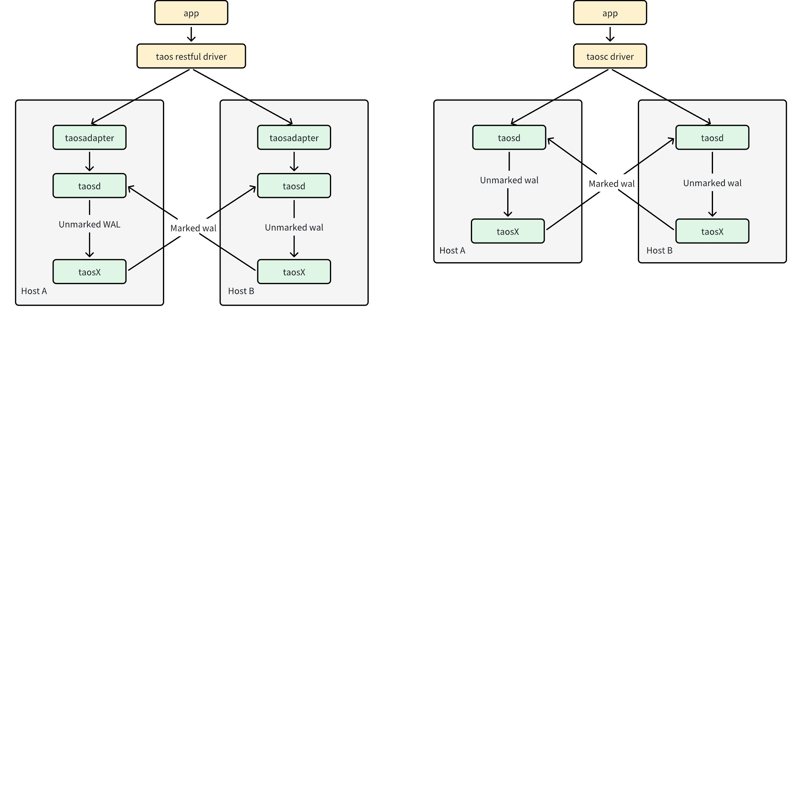
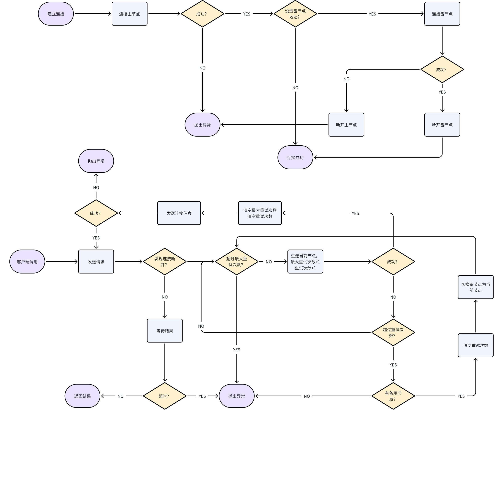
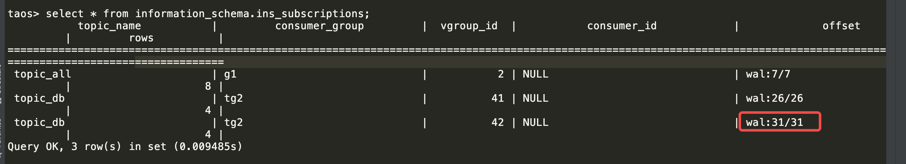

# TDengine 双活 

## 1. 背景

部分客户因为部署环境的特殊性只能部署两台服务器，同时希望实现一定的服务高可用和数据高可靠。这些客户主要来自工业控制领域，也有些来自一些特殊的领域，如中船的船上监控数据采集和存储系统。本文主要描述基于数据复制和客户端 Failover 两项关键技术的 TDengine 双活系统的产品行为。TDengine 双活既可以用于前面所述资源受限的环境，也可用于在两套 TDengine 集群（不限资源）之间的灾备场景。
需求说明：[需求说明：双副本](https://taosdata.feishu.cn/wiki/SZFwwRR36ib9oTkOnTccDLBxnvb) ，其中引用了一些历史上讨论形成的简要文档，可以作为参考。

## 2. 变更历史


| 日期 | 版本 | 负责人 | 变更内容 |
| --- | --- | --- | --- |
| 2024/2/4 | 0.1 | Wade Zhang |  |
| 2024/3/18 | 0.2 | 霍琳贺，佘彦杰 | 修改运维工具部分和客户端部分 |
|  |  |  |  |
|  |  |  |  |

## 3. 定义

1. 双活：业务系统中有且仅有两台服务器，其上分别部署一套服务，在业务层看来这两台机器和两套服务是一个完整的系统，对其中的细节业务层不需要感知。双活中的两个节点通常被称为 Master-Slave，意为”主从“或”主备“，本文档中可能会出现混用的情况。
2. Active-Standby 模式：双活系统在正常情况下由其中一套系统提供服务，另外一套系统待机。当其中一台服务器宕机或其上的软件服务宕机时，业务能够自动切换到另外一套系统，切换中会有短时影响，比如延迟增大，但对业务系统的客户端透明。
3. Active-Active 模式：双活系统中两套系统同时提供服务，业务层无感知，当其中一台宕机时与之有关的业务自动切换到另外一个节点上的业务系统，切换中一样会有短时影响。
4. Active-Standby 与 Active-Active 的优劣比较如下表，从中可以看出，Active-Active虽然在系统正常运行时可以提高系统处理能力，但因为要考虑到一个节点宕机时的系统处理能力，要么在平时就限制单机处理上限，要么在系统超载时进行限流，产生的额外价值并不高，所以本文将要描述的 TDengine 双活系统是 Active-Standby 模式。

| 比较维度 | Active-Standby | Active-Active |
| --- | --- | --- |
| 处理能力 | 单台服务器的上限 | 理论上也是单台服务器的上限，但现实中可能利用度会略高。在系统正常运行时可以提高系统处理能力，比如达到两台服务器的上限，但在发生单节点宕机时需要通过限流等其它措施来保证服务质量。 |
| 高可用能力 | 具备高可用能力 | 相同的高可用能力 |
| 数据可靠性 | 两倍冗余 | 两倍冗余 |

## 4. 行为说明

### 4.1 双活架构图 

TDengine 双活系统架构图如下，其中涉及到三个关键点：
1. 由 Client Driver 实现对双系统的 Failover，即主节点宕机时的主从切换
2. 由 taosX 从主节点到从节点实现数据复制
3. 由数据订阅的写接口在写入复制过来的数据时在 WAL 中加入特殊标记，由数据订阅的读接口在读取数据时自动过滤掉带有该特殊标记的数据，避免重复复制形成 infinite loop
<reference-synced source-block-id="V3uidCGYzspwtTbVPpYc8I7Nn8g" source-document-id="UGxMdVBekoXFlNxy9LZcglPanke">

  

</reference-synced>

### 4.2 双活系统正常运行

假定机器 A 为当前主节点，则所有业务负载都由机器 A 承载，所有客户端请求都发送到机器 A。机器 B 不直接承载任何业务，但机器 A 上的 taosX 会将数据源源不断同步到机器 B。

### 4.3 单一服务不可用

在每一台主机上均配置有三个服务：taosd, taosAdapter, taosX，任意单个服务宕机，都会被 systemd 或某种守护进程快速拉起恢复服务，这种情况下不会产生主备切换，但也有可能产生客户端请求失败导致重试的情况，但重试次数应该很少，1或2次就能够成功，远达不到主备切换的重试阈值。
所有服务都必须以 systemd 或 类 systemd 的守护进程启动，能够实现服务停止后的快速启动。

### 4.4 主节点宕机

当主节点 A 宕机时，客户端（Client Driver）会感知到写入或查询请求发送失败，多次尝试（尝试次数可配置）失败后会认为主节点不可用，此时自动切换到备节点，并在请求成功后将备节点设置为主节点，完成主备切换，此后将继续向主节点发起业务请求。
异常情况：当主节点 A 宕机时，其上的数据有可能还没有完全同步到 B 节点。假定此时 A 节点上的数据集用 A 表示，B 节点上的数据集用 B 表示，此时存在数据差集 set(A-B)。

### 4.5 宕机节点恢复

当 A 节点恢复后，其上的 taosX 会继续向 B 节点同步数据差集 set(A-B），如果没有其它异常发生这个复制过程会持续到数据集 set(A-B) 复制完成为止。
假定此时 B 节点上的数据集是 B1，则 B 节点上的 taosX 也会向 A 节点复制数据集 set(B1-B)，此时的场景与 4.2 中双活系统正常运行完全一样。
如果 B 节点在数据集 set(B1-B) 未复制完成之前就宕机，则会出现 4.2 节中所描述的”主节点宕机“完全一样的场景，只是作为主机的服务器不同而已。

### 4.6 元数据丢失

假定主节点为 A，备节点为 B，当 A 节点宕机时尚有数据差集 set(A-B）未同步完成，此时如果有元数据（建库建表，或者修改库参数和表的schema等涉及元数据变更的操作）未同步完成，则当节点 B 被切换为主节点后，可能会出现写入失败等业务异常，此业务异常只能等到节点 A 恢复并完成对 set(A-B) 的同步后才能解决。

### 4.7 连续宕机

假定主节点为 A，备节点 为 B，当 A 节点宕机时尚有数据差集 set(A-B）未同步完成，此时节点 B 切换为主节点，当节点 A 恢复后，双向都有数据差集需要恢复，即 set(A-B) 和 set(B1-B)。如果在其中的某一个或两个差集都未同步完成之前又出现了相应的数据集的源节点宕机，则数据同步仍有历史欠帐。会持续这个过程直到系统稳定下来才能真正实现数据同步。

### 4.8 SQL 命令

无

### 4.9 Client Driver

1. 暂时限定只支持 WebSocket，不支持 RESTful/Native 连接。
2. 暂只支持 Java 连接器，相关配置参数样例如下：
```java {wrap}
url = "jdbc:TAOS-RS://" + host + ":6041/?user=root&password=taosdata";
Properties properties = new Properties();
properties.setProperty(TSDBDriver.PROPERTY_KEY_BATCH_LOAD, "true");
properties.setProperty(TSDBDriver.PROPERTY_KEY_SLAVE_CLUSTER_HOST, "192.168.1.11");
properties.setProperty(TSDBDriver.PROPERTY_KEY_SLAVE_CLUSTER_PORT, "6041");
properties.setProperty(TSDBDriver.PROPERTY_KEY_ENABLE_AUTO_RECONNECT, "true");
properties.setProperty(TSDBDriver.PROPERTY_KEY_RECONNECT_INTERVAL_MS, "2000");
properties.setProperty(TSDBDriver.PROPERTY_KEY_RECONNECT_RETRY_COUNT, "3");
connection = DriverManager.getConnection(url, properties);
```


| 属性名 | 含义 |
| --- | --- |
| *PROPERTY_KEY_SLAVE_CLUSTER_HOST* | 第二节点的主机名或者 ip，默认空 |
| *PROPERTY_KEY_SLAVE_CLUSTER**_PORT* | 第二节点的端口号，默认空 |
| PROPERTY_KEY_ENABLE_AUTO_RECONNECT | 是否启用自动重连。仅在使用 Websocket 连接时生效。true: 启用，false: 不启用。默认为 false。双活场景下请设置为 true |
| *PROPERTY_KEY_RECONNECT_INTERVAL_MS* | 重连的时间间隔，单位毫秒，默认 2000 毫秒，也就是 2 秒。 最小值为 0， 立即重试 最大值不做限制 |
| *PROPERTY_KEY_RECONNECT_RETRY_COUNT* | 每节点最多重试次数，默认 3 最小值为 0，不进行重试 最大值不做限制 |

1. 见约束条件，双活两节点用户名和密码必须完全相同，客户端所用数据库两节点必须都存在。
若配置了第二节点信息，则下文流程图中提到的“最大重试次数”按下面规则计算：
最大重试次数 = 2 * *PROPERTY_KEY_RECONNECT_RETRY_COUNT*

1. 建立立连接，以及请求处理过程发现连接断开，切换备节点的逻辑，请参考下面流程图：


### 4.10 数据订阅

1. taosX 调用的写入接口 rawBlockBindData 需要在 SSubmitTbData 结构中增加数据来源标记（这个标记会写入 WAL 中，即上面说的 WAL 标记，类型为int8_t，本次值为SOURCE_TAOSX，其他写入类型为SOURCE_NULL，便于以后扩展使用）
  ```cpp
  #define  SOURCE_NULL  0
  #define  SOURCE_TAOSX 1 
  
  typedef struct {
    int32_t        flags;
    SVCreateTbReq* pCreateTbReq;
    int64_t        suid;
    int64_t        uid;
    int32_t        sver;
    union {
      SArray* aRowP;
      SArray* aCol;
    };
    int64_t       ctimeMs;
    int8_t        source;
  } SSubmitTbData;
  ```

1. taosX 写入的 meta 消息里也需要增加 WAL 标记，包括 create/alter stable, create/alter table.   Drop  stable/table 不需要加，因为删除一次后，再次删除会提前判断表是否存在，不存在就不会执行，不会形成环。
2. 数据订阅需要增加一个订阅参数（msg.consume.excluded = 1 @霍琳贺，这个参数只内部使用，不对外暴露），用于在订阅数据时，区分是否利用上面的 ，这个参数只内部使用，不对外暴露），用于在订阅数据时，区分是否利用上面的 WAL 标记，来决定是否订阅同步的数据。正常的订阅所有数据都获取，同步时订阅不获取带上面 WAL 标记的数据。
```cpp
struct tmq_conf_t {
  char           clientId[256];
  char           groupId[TSDB_CGROUP_LEN];
  int8_t         autoCommit;
  int8_t         resetOffset;
  int8_t         withTbName;
  int8_t         snapEnable;
  int8_t         replayEnable;
  int8_t         sourceExcluded;   // do not consume
  uint16_t       port;
  int32_t        autoCommitInterval;
  char*          ip;
  char*          user;
  char*          pass;
  tmq_commit_cb* commitCb;
  void*          commitCbUserParam;
};  
```

1. show subscriptions 命令结果中 offset 由之前的当前消费位置，改为当前 消费消费位置/wal最新数据位置，用来查看消费写入数据的差异@霍琳贺。如下图： 。如下图：


## 5. 性能

### 5.1 正常运行

正常运行时客户端只与主节点通信，其性能取决于主节点的系统配置、服务配置、服务能力，和是否为双活系统无关，其性能与同配置的单一节点系统完全相同。

### 5.2 主节点宕机

在宕机后主备切换完成之前，所有业务请求都会被多次重试，假定在主备切换后请求成功，其业务请求的延时会时正常情况下的几倍、几十倍甚至上百倍都有可能，取决于该业务请求自身的正常延时，多次重复请求的时间间隔以及多次请求的次数。

### 5.3 主备切换完成

主备切换完成后其性能与 5.1 节正常运行时完全一样，此时就是正常运行的状态。

## 6. 兼容性

1. 因为 WAL 中对于复制过来的数据会添加特殊标记，该标记不破坏当前 WAL 数据块结构，旧版本能够自动忽略该标记位，没有兼容性问题。
2. 数据订阅接口会透明地处理该标记位，对数据订阅的客户端或者利用 raw block 写入接口的客户端没有影响，没有兼容性问题。
3. Client Driver 可以基于配置自动 Fail Over，并通过环境变量或者进程中的全局变量设置当前主或备节点。
   - 当支持双活的高版本 Client Driver 连接低版本服务端时，因为没有配置双活节点，其行为与旧版本完全一样。
   - 当低版本 Client Driver 连接高版本服务端（非双活）时，其行为不受影响。
   - 当低版本 Client  Driver 连接双活系统时，其不具备双活能力，系统行为和只有主节点单机系统一样。
4. 双活工作的两个 TDengine 集群之间，必须是同时支持双活特性的，即要求两端 TDengine 版本均 >= 3.3.0.0 。如果其中一端不符合要求， taosx replica 运行时报错。

## 7. 运维

1. 提供运维脚本能够自动化 taosX 配置、一键启动、重启和停止所有双活组件。
- taosx replica start
  - 双活启动配置命令，机器 A/B 上的 taosd 均为存活状态，且运行该命令的机器上 taosx 服务已启动。
  - 可使用两种启动命令：
    - taosx replica start -f <source_endpoint> -t <sink_endpoint> [<database>...] 
      在当前 taosx 服务中建立从 source_endpoint 到 sink_endpoint 的同步任务。运行该命令成功后，将打印 replica ID 到控制台（后续记为 `id`）。
      其中输入参数 source_endpoint 和 sink_endpoiint 为必须，形如 `td2:6030` ，完整的运行命令如：`taosx replica start -f ``td1:6030 ``-t td2:6030` 会自动创建除 information_schema、performance_schema、log、audit 库之外的同步任务。**可以使用 **`**http://td2:6041**`** 指定该 endpoint 使用 websocket 接口（默认是原生接口）。**
      也可以指定数据库同步：`taosx replica start -f ``td1:6030 ``-t td2:6030 db1` 仅创建指定的数据库同步任务。
    - taosx replica start -i <id> [<database>...]
      **使用上面已经创建的 Replica ID (id) ****以在该同步任务中增加****其****它****数据库**。
  - 多次使用该命令，不会创建重复任务，**仅****将所指定的数据库增加到相应任务中**。
  - replica id 在一个 taosX 实例内是全局唯一的，与 source/sink 的组合无关
  - 为便于记忆，replica id 为一个随机常用单词，系统自动将 source/sink 组合对应到一个词库中取得一个唯一可用单词。
- taosx replica status [<id>...]
  当 taosx 启动时，返回当前机器上创建的双副本同步任务列表和状态。可以指定一个或多个 replica id 获取其任务列表和状态。
  ```sql
  +---------+----------+----------+----------+------+-------------+----------------+
  | replica | task | source   | sink     | database | status      | note           |
  +---------+----------+----------+----------+------+-------------+----------------+
  | a       | 2    | td1:6030 | td2:6030 | opc      | running     |                |
  | a       | 3    | td2:6030 | td2:6030 | test     | interrupted | <Error reason> |
  ```

- taosx replica stop <id> [<db>...]
  - 停止指定 Replica ID 下所有或指定数据库的双副本同步任务。
  - 使用 `taosx replica stop id1 db1` 表示停止 id1 replica 下 `db1`的同步任务。
- taosx replica restart <id> [<db>...]
  - 重启指定 Replica ID 下所有或指定数据库的双副本同步任务。
  - 使用 `taosx replica stop id1 db1` 仅重启指定数据库 `db1`的同步任务。
- taosx replica diff <id> [<db>....]
  - 当前双副本同步任务中订阅的 Offset  与最新 WAL 的差值（不代表行数）。输出示例如下：
  ```sql
  +---------+----------+----------+----------+-----------+---------+---------+------+
  | replica | database | source   | sink     | vgroup_id | current | latest  | diff |
  +---------+----------+----------+----------+-----------+---------+---------+------+
  | a       | opc      | td1:6030 | td2:6030 | 2         | 17600   | 17600   | 0    |
  | ad       | opc      | td2:6030 | td2:6030 | 3         | 17600   | 17600   | 0    |
  ```

- taosx replica remove <id> [--force]
  - 删除当前所有双副本同步任务。（这是为方便测试添加的便捷清理命令，需要先 stop；当 --force 启用时，强制停止并清除任务。）
具体使用：
1. 假定在机器 A 上运行，需要首先使用 `taosx replica start` 来配置 taosX，其输入参数是待同步的源端和目标端服务器地址 ，在完成配置后会自动启动同步服务和任务。此处假定 taosx 服务使用标准端口，同步任务使用原生连接。
2. 机器 B 上的步骤相同
3. 在完成对两台机器的服务启动后，双活系统即可提供服务
4. 在已经完成配置后，如果想要再次启动双活系统，请使用 restart 子命

## 8. 使用场景

详见背景说明，本节简要说明几种异常场景的人工处理。
1. 如果宕机恢复时间超出了 WAL 的保存时长，可能会出现丢数据的情况。此时双活系统中自带的 taosX 服务的自动数据同步无法处理。需要人工判断出哪些数据丢失，然后启动额外的 taosX 任务来复制丢失的数据。

## 9. 约束和限制

1. 应用程序不能使用订阅接口，双活参数会导致创建消费者失败。
2. 不建议应用程序使用参数绑定的写入和查询方式，如果使用应用需要自己解决连接切换后的相关对象失效问题。
3. 在双活场景下，不建议用户应用程序显示调用 use database，应该在连接参数中指定 database。
4. 双活的两端集群必须同构（即数据库的命名和所有配置参数完全相同）
5. 只支持 WebSocket 连接

## 10. 常见错误和排查

暂无

## 11. 参考文档

暂无

## 12. 最佳实践 {folded="true"}

双活系统通过数据复制来实现双系统之间的数据同步，但数据同步只能保证最终一致性无法保证实时一致性。考虑到任意时刻主节点都有可能宕机，而当宕机时可能会有数据差集尤其是元数据差集。在完成主备切换后业务层可能会发起重复的建表请求但 schema 有可能不相同，此时就不仅是行为说明中所描述的元数据丢失的情况，还可能出现元数据不一致。元数据丢失和元数据不一致在双活系统中都是无解的行为，是弱一致性的必然结果。
所以，从最佳实践上，我们建议所有的建库建表都应该在系统启动后集中完成，在后面只写入时序数据，尽量不要再有元数据操作，可以避免上述问题。或者最小化元数据操作，从而最小化出现上述问题的概率。
